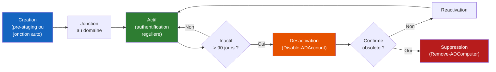

# Comptes ordinateurs

<span class="level-intermediate">Intermediaire</span> · Temps estime : 15 minutes

!!! example "Analogie"

    Un compte ordinateur dans Active Directory fonctionne comme une **plaque d'immatriculation pour une voiture de societe**. La plaque identifie de maniere unique chaque vehicule dans la flotte. Quand une voiture arrive au parking de l'entreprise (jonction au domaine), le gardien verifie la plaque dans le registre. Si la voiture n'est plus utilisee depuis longtemps, on la signale (desactivation), puis on la retire du registre (suppression) quand elle est confirmee hors service.

## Cycle de vie d'un compte ordinateur



## Jonction au domaine

Lorsqu'un ordinateur rejoint le domaine, un **compte ordinateur** est automatiquement cree dans Active Directory.

### Prerequis

- Le poste doit pouvoir resoudre le nom DNS du domaine
- Le DNS du poste doit pointer vers un DC
- Un compte avec les droits de jonction au domaine

### Joindre un poste au domaine

=== "PowerShell"

    ```powershell
    # Join domain and restart
    Add-Computer `
        -DomainName "lab.local" `
        -OUPath "OU=Postes,OU=Ordinateurs,DC=lab,DC=local" `
        -Credential (Get-Credential "LAB\Administrator") `
        -Restart

    # Join domain without specifying an OU (goes to default Computers container)
    Add-Computer -DomainName "lab.local" -Credential (Get-Credential) -Restart
    ```

=== "Interface graphique"

    1. **Parametres** > **Systeme** > **A propos** > **Renommer ce PC (avance)**
    2. Cliquer sur **Modifier**
    3. Selectionner **Domaine** et saisir `lab.local`
    4. Fournir les identifiants d'un compte autorise
    5. Redemarrer

### Retirer un poste du domaine

```powershell
# Remove from domain (returns to workgroup)
Remove-Computer -UnjoinDomainCredential (Get-Credential "LAB\Administrator") -Restart
```

## Gestion des comptes ordinateurs

```powershell
# List all computer accounts
Get-ADComputer -Filter * | Select-Object Name, Enabled, DistinguishedName

# Find a specific computer
Get-ADComputer -Identity "PC-JEAN-01" -Properties *

# Find computers in a specific OU
Get-ADComputer -Filter * -SearchBase "OU=Postes,OU=Ordinateurs,DC=lab,DC=local"

# Find disabled computer accounts
Get-ADComputer -Filter { Enabled -eq $false }

# Find computers that haven't logged in for 90 days
$inactiveDate = (Get-Date).AddDays(-90)
Get-ADComputer -Filter { LastLogonDate -lt $inactiveDate } -Properties LastLogonDate |
    Select-Object Name, LastLogonDate

# Move a computer to another OU
Move-ADObject -Identity "CN=PC-JEAN-01,OU=Postes,OU=Ordinateurs,DC=lab,DC=local" `
    -TargetPath "OU=Portables,OU=Ordinateurs,DC=lab,DC=local"

# Disable a computer account
Disable-ADAccount -Identity "PC-OLD-01$"

# Delete a computer account
Remove-ADComputer -Identity "PC-OLD-01" -Confirm:$false
```

Resultat (pour `Get-ADComputer -Filter *`) :

```text
Name        Enabled DistinguishedName
----        ------- -----------------
DC-01          True CN=DC-01,OU=Domain Controllers,DC=lab,DC=local
SRV-01         True CN=SRV-01,OU=Serveurs-Membres,OU=Serveurs,DC=lab,DC=local
PC-JEAN-01     True CN=PC-JEAN-01,OU=Postes,OU=Ordinateurs,DC=lab,DC=local
PC-MARIE-01    True CN=PC-MARIE-01,OU=Postes,OU=Ordinateurs,DC=lab,DC=local
PC-OLD-01     False CN=PC-OLD-01,OU=Postes,OU=Ordinateurs,DC=lab,DC=local
```

Resultat (pour la recherche de comptes inactifs) :

```text
Name       LastLogonDate
----       -------------
PC-OLD-01  2024-11-15 08:32:00
PC-STOCK-02 2024-10-03 14:17:00
```

!!! note "Le `$` dans le SamAccountName"

    Le SamAccountName d'un ordinateur se termine toujours par `$`.
    Ex: `PC-JEAN-01$`. C'est ainsi qu'AD distingue les comptes ordinateurs
    des comptes utilisateurs.

## Pre-staging de comptes ordinateurs

Vous pouvez pre-creer un compte ordinateur avant la jonction :

```powershell
# Pre-create a computer account in a specific OU
New-ADComputer `
    -Name "PC-NEW-01" `
    -SamAccountName "PC-NEW-01$" `
    -Path "OU=Postes,OU=Ordinateurs,DC=lab,DC=local" `
    -Enabled $true
```

Resultat :

```text
# Verify the pre-created account
PS> Get-ADComputer -Identity "PC-NEW-01" | Select-Object Name, Enabled, DistinguishedName

Name      Enabled DistinguishedName
----      ------- -----------------
PC-NEW-01    True CN=PC-NEW-01,OU=Postes,OU=Ordinateurs,DC=lab,DC=local
```

!!! tip "Avantage du pre-staging"

    En pre-creant le compte dans la bonne OU, le poste recevra immediatement
    les bonnes GPO des la jonction, sans avoir a etre deplace manuellement.

## Nettoyage des comptes inactifs

```powershell
# Find and report stale computer accounts (90+ days inactive)
$staleDate = (Get-Date).AddDays(-90)
$staleComputers = Get-ADComputer -Filter { LastLogonDate -lt $staleDate } `
    -Properties LastLogonDate, OperatingSystem |
    Select-Object Name, LastLogonDate, OperatingSystem, DistinguishedName

# Export report
$staleComputers | Export-Csv -Path "C:\Temp\stale-computers.csv" -NoTypeInformation

# Disable stale accounts (review before deleting)
$staleComputers | ForEach-Object {
    Disable-ADAccount -Identity $_.DistinguishedName
    Write-Host "Disabled: $($_.Name) - Last logon: $($_.LastLogonDate)"
}
```

Resultat :

```text
Disabled: PC-OLD-01 - Last logon: 11/15/2024 08:32:00
Disabled: PC-STOCK-02 - Last logon: 10/03/2024 14:17:00
```

## Points cles a retenir

- La jonction au domaine cree automatiquement un compte ordinateur dans AD
- Le DNS du poste doit pointer vers un DC pour la jonction
- Utilisez `redircmp` pour rediriger le conteneur par defaut vers votre OU
- Le pre-staging garantit que le poste atterrit dans la bonne OU
- Nettoyez regulierement les comptes inactifs

!!! example "Scenario pratique"

    **Contexte :** Nadia, technicienne de support, recoit un appel d'un utilisateur dont le poste `PC-COMPTA-03` affiche l'erreur « The trust relationship between this workstation and the primary domain failed » apres un long conge. Le poste n'a pas communique avec le DC depuis plus de 60 jours et le mot de passe du compte machine a expire.

    **Diagnostic :**

    ```powershell
    # On the DC, check the computer account status
    Get-ADComputer -Identity "PC-COMPTA-03" -Properties PasswordLastSet, LastLogonDate |
        Select-Object Name, Enabled, PasswordLastSet, LastLogonDate
    ```

    Resultat :

    ```text
    Name          Enabled PasswordLastSet         LastLogonDate
    ----          ------- ---------------         -------------
    PC-COMPTA-03     True 2024-12-10 09:15:00     2024-12-12 08:30:00
    ```

    Le mot de passe machine n'a pas ete renouvele depuis plus de 60 jours (le cycle normal est de 30 jours).

    **Solution :**

    ```powershell
    # Option 1: Reset the computer account from the DC
    Reset-ComputerMachinePassword -Server "DC-01" -Credential (Get-Credential "LAB\Administrator")

    # Option 2: If Option 1 fails, rejoin the domain
    # On the client, logged in as local admin:
    Remove-Computer -UnjoinDomainCredential (Get-Credential "LAB\Administrator") -Force -Restart

    # After restart, rejoin
    Add-Computer -DomainName "lab.local" `
        -OUPath "OU=Postes,OU=Ordinateurs,DC=lab,DC=local" `
        -Credential (Get-Credential "LAB\Administrator") -Restart
    ```

    Apres le redemarrage, l'utilisateur peut se reconnecter avec ses identifiants de domaine.

!!! danger "Erreurs courantes"

    1. **Laisser les postes dans le conteneur par defaut `CN=Computers`** : sans redirection via `redircmp`, les nouveaux postes atterrissent dans un conteneur qui ne supporte pas le lien direct de GPO. Les postes ne recoivent alors aucune strategie de groupe.

    2. **Ne jamais nettoyer les comptes inactifs** : des comptes ordinateurs obsoletes encombrent l'annuaire et representent un risque de securite. Un attaquant pourrait reutiliser un compte machine inactif pour s'authentifier sur le reseau.

    3. **Supprimer un compte machine au lieu de le desactiver** : la suppression est irreversible (sauf AD Recycle Bin). Desactivez d'abord, attendez la confirmation que le poste est bien hors service, puis supprimez.

    4. **Oublier le `$` dans le SamAccountName** : les comptes ordinateurs se terminent par `$` (ex: `PC-JEAN-01$`). Oublier ce suffixe dans les commandes `Disable-ADAccount` ou les scripts peut cibler un mauvais objet ou echouer silencieusement.

## Pour aller plus loin

- [Structure des OU](structure-ou.md) - ou placer les comptes ordinateurs
- [GPO - Concepts](../gpo/concepts-gpo.md) - appliquer des strategies aux ordinateurs
