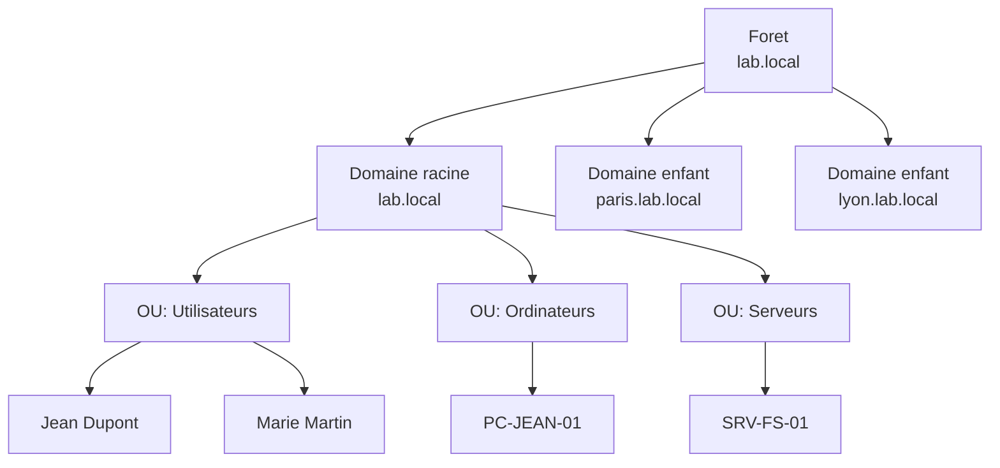
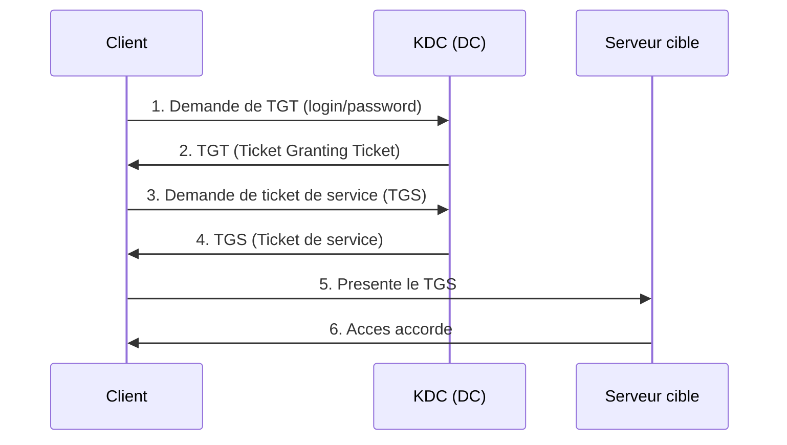

# Concepts fondamentaux d'AD DS

<span class="level-intermediate">Intermediaire</span> · Temps estime : 25 minutes

## Qu'est-ce qu'Active Directory ?

!!! example "Analogie"

    Imaginez un **annuaire telephonique d'entreprise** geant : il contient le nom, le poste, le service et le badge d'acces de chaque employe. Quand quelqu'un veut entrer dans un bureau, le gardien (le controleur de domaine) consulte cet annuaire pour verifier son identite et ses droits. Active Directory joue exactement ce role pour tout le reseau.

**Active Directory Domain Services** (AD DS) est le service d'annuaire de Microsoft. Il fournit :

- **Authentification** : verifier l'identite des utilisateurs (Kerberos)
- **Autorisation** : controler l'acces aux ressources
- **Annuaire** : base de donnees centralisee des objets (utilisateurs, ordinateurs, groupes)
- **Gestion centralisee** : strategies de groupe (GPO) pour configurer des centaines de postes

## Hierarchie logique




!!! example "Analogie"

    La hierarchie AD fonctionne comme un **groupe d'entreprises**. La foret est le groupe (ex: « Groupe Duval SA »), chaque domaine est une filiale (« Duval Paris », « Duval Lyon »), et les OU sont les departements au sein de chaque filiale (Comptabilite, IT, RH). Tous partagent la meme charte interne (le schema), mais chacun a sa propre direction locale.

### Foret (Forest)

- Le **niveau le plus haut** de la hierarchie AD
- Definit les limites de securite absolues
- Contient un ou plusieurs domaines
- Partage un schema commun et un catalogue global
- Toutes les relations d'approbation sont dans la foret

### Domaine (Domain)

- Unite administrative et de securite
- Identifie par un nom DNS (ex: `lab.local`)
- Contient les objets : utilisateurs, groupes, ordinateurs, OU
- Chaque domaine a ses propres strategies de groupe
- Frontiere de replication : les donnees du domaine se repliquent entre ses DC

### Controleur de domaine (DC)

- Serveur qui heberge une copie de la base AD (NTDS.dit)
- Gere l'authentification et les requetes LDAP
- Un domaine doit avoir au minimum **2 DC** pour la redondance
- Chaque DC possede une copie complete et en lecture/ecriture de la base

### Arbre (Tree)

- Hierarchie de domaines partageant un espace de noms contigu
- Ex: `lab.local` > `paris.lab.local` > `rnd.paris.lab.local`
- Relations d'approbation parent-enfant automatiques

## Objets Active Directory

| Type d'objet | Description | Exemple |
|--------------|-------------|---------|
| Utilisateur | Compte de connexion | Jean Dupont (jdupont) |
| Groupe | Ensemble d'utilisateurs/ordinateurs | GRP-Comptabilite |
| Ordinateur | Poste de travail ou serveur joint au domaine | PC-JEAN-01 |
| OU | Conteneur organisationnel | OU=Comptabilite |
| GPO | Strategie de groupe | POL-Password-Policy |
| Contact | Objet sans compte (reference externe) | Fournisseur XYZ |

## Protocoles fondamentaux

### LDAP (Lightweight Directory Access Protocol)

LDAP est le protocole d'acces a l'annuaire :

- Port **389** (LDAP) / **636** (LDAPS chiffre)
- Permet de rechercher, lire et modifier les objets
- Chaque objet a un **DN** (Distinguished Name) unique :

```
CN=Jean Dupont,OU=Utilisateurs,DC=lab,DC=local
```

| Composant | Signification |
|-----------|---------------|
| CN | Common Name (nom de l'objet) |
| OU | Organizational Unit |
| DC | Domain Component |

### Kerberos

!!! example "Analogie"

    Kerberos fonctionne comme un **systeme de bracelets dans un festival**. A l'entree (le KDC), vous montrez votre billet (mot de passe) et recevez un bracelet general (TGT). Ensuite, a chaque scene (serveur), vous presentez votre bracelet pour obtenir un pass specifique (ticket de service) sans jamais re-montrer votre billet original.

Kerberos est le protocole d'authentification par defaut :



- Port **88** (TCP/UDP)
- Basé sur des tickets (pas de mot de passe transmis sur le reseau)
- Tolerance maximale de **5 minutes** de decalage horaire
- Le **KDC** (Key Distribution Center) fonctionne sur chaque DC

### DNS

DNS est **indispensable** pour Active Directory :

- Les clients trouvent les DC via les enregistrements DNS SRV
- Le domaine AD utilise un nom DNS (ex: `lab.local`)
- Sans DNS fonctionnel, aucune authentification possible

!!! danger "Pas de DNS = pas d'AD"

    Active Directory est completement dependant du DNS.
    C'est pourquoi le role DNS est presque toujours installe sur les DC.

## Base de donnees AD (NTDS.dit)

La base de donnees Active Directory est stockee dans le fichier `NTDS.dit` :

- Emplacement par defaut : `C:\Windows\NTDS\ntds.dit`
- Contient tous les objets du domaine
- Utilise le moteur ESE (Extensible Storage Engine)
- Se replique entre tous les DC du domaine

```powershell
# View NTDS database location
Get-ItemProperty -Path "HKLM:\SYSTEM\CurrentControlSet\Services\NTDS\Parameters" |
    Select-Object "DSA Database file", "Database log files path"
```

Resultat :

```text
DSA Database file       Database log files path
-----------------       -----------------------
C:\Windows\NTDS\ntds.dit C:\Windows\NTDS
```

## Roles FSMO

Certaines operations ne peuvent etre effectuees que par un seul DC. Ces roles s'appellent **FSMO** (Flexible Single Master Operations) :

### Roles au niveau de la foret (1 seul dans toute la foret)

| Role | Fonction |
|------|----------|
| **Schema Master** | Modifie le schema AD (structure des objets) |
| **Domain Naming Master** | Ajoute/supprime des domaines dans la foret |

### Roles au niveau du domaine (1 par domaine)

| Role | Fonction |
|------|----------|
| **PDC Emulator** | Horloge de reference, changements de mot de passe urgents, source GPO |
| **RID Master** | Distribue les blocs de RID pour la creation d'objets |
| **Infrastructure Master** | Met a jour les references inter-domaines |

```powershell
# View FSMO role holders
netdom query fsmo

# Or via PowerShell
Get-ADDomain | Select-Object PDCEmulator, RIDMaster, InfrastructureMaster
Get-ADForest | Select-Object SchemaMaster, DomainNamingMaster
```

Resultat :

```text
Schema master               DC-01.lab.local
Domain naming master        DC-01.lab.local
PDC                         DC-01.lab.local
RID pool manager            DC-01.lab.local
Infrastructure master       DC-01.lab.local
The command completed successfully.

PDCEmulator           : DC-01.lab.local
RIDMaster             : DC-01.lab.local
InfrastructureMaster  : DC-01.lab.local

SchemaMaster          : DC-01.lab.local
DomainNamingMaster    : DC-01.lab.local
```

## Catalogue global (GC)

Le **Global Catalog** est une copie partielle en lecture seule de tous les objets de la foret :

- Contient un sous-ensemble d'attributs de chaque objet de chaque domaine
- Utilise pour les recherches inter-domaines et l'authentification
- Port **3268** (GC) / **3269** (GC SSL)
- Au moins un DC par site doit etre GC

```powershell
# Check if a DC is a Global Catalog
Get-ADDomainController -Identity "DC-01" | Select-Object Name, IsGlobalCatalog
```

Resultat :

```text
Name  IsGlobalCatalog
----  ---------------
DC-01            True
```

## Schema AD

Le **schema** definit les types d'objets et leurs attributs :

- Classe = type d'objet (User, Computer, Group...)
- Attribut = propriete d'un objet (displayName, mail, telephoneNumber...)
- Le schema est unique pour toute la foret
- Les modifications sont irreversibles

!!! warning "Ne jamais modifier le schema sans necessite"

    Les modifications du schema sont repliquees a toute la foret et
    sont irreversibles. Seules certaines applications (Exchange, SCCM)
    necessitent des extensions de schema.

## Points cles a retenir

- AD DS fournit authentification (Kerberos), annuaire (LDAP) et gestion centralisee (GPO)
- La foret est la limite de securite, le domaine est l'unite administrative
- Chaque domaine a besoin d'au moins 2 DC pour la redondance
- DNS est obligatoire pour le fonctionnement d'AD
- Les 5 roles FSMO sont repartis entre les DC

!!! example "Scenario pratique"

    **Contexte :** Sophie, administratrice systeme, constate que certains utilisateurs ne parviennent plus a s'authentifier sur le domaine `lab.local` depuis ce matin. Les postes affichent « The trust relationship between this workstation and the primary domain failed ».

    **Diagnostic :**

    ```powershell
    # Check if the DC is reachable and AD services are running
    Get-Service -Name "NTDS", "DNS", "Kerberos" -ComputerName DC-01

    # Verify Kerberos tickets on a client machine
    klist

    # Check time synchronization (Kerberos tolerance: 5 minutes)
    w32tm /query /status
    ```

    Resultat :

    ```text
    Leap Indicator: 0 (no warning)
    Stratum: 4
    Last Successful Sync Time: 2025-03-15 07:12:00
    Source: DC-01.lab.local
    ```

    Sophie decouvre que l'horloge du PDC Emulator a derive de **7 minutes** par rapport a la source NTP externe. Les tickets Kerberos sont refuses a cause du decalage.

    **Solution :**

    ```powershell
    # On the PDC Emulator (DC-01), reconfigure NTP source
    w32tm /config /manualpeerlist:"pool.ntp.org" /syncfromflags:MANUAL /reliable:YES /update

    # Force synchronization
    w32tm /resync /force

    # On affected clients, force resync
    w32tm /resync
    ```

    Apres la resynchronisation, les authentifications Kerberos reprennent normalement.

!!! danger "Erreurs courantes"

    1. **Confondre foret et domaine** : la foret est la frontiere de securite absolue, pas le domaine. Un administrateur de domaine n'a pas les droits sur les autres domaines de la foret, mais un compromis de la foret affecte tous les domaines.

    2. **Negliger le DNS** : AD est totalement dependant du DNS. Si les enregistrements SRV (`_ldap._tcp.dc._msdcs.lab.local`) sont absents ou incorrects, les clients ne trouvent pas les DC et l'authentification echoue.

    3. **Ignorer le decalage horaire** : Kerberos tolere au maximum 5 minutes de difference. Un serveur dont l'horloge derive provoque des echecs d'authentification silencieux difficiles a diagnostiquer.

    4. **Ne deployer qu'un seul DC** : un domaine avec un seul controleur est un point de defaillance unique. La perte de ce DC signifie la perte totale de l'authentification pour tous les utilisateurs.

    5. **Modifier le schema sans necessite** : les modifications du schema sont repliquees a toute la foret et sont irreversibles. Ne modifiez le schema que pour des applications validees (Exchange, SCCM).

## Pour aller plus loin

- [Installer le premier DC](installer-premier-dc.md) - deployer Active Directory
- [Structure des OU](structure-ou.md) - organiser l'annuaire
- [Sites et replication](sites-et-replication.md) - topologie multi-sites
