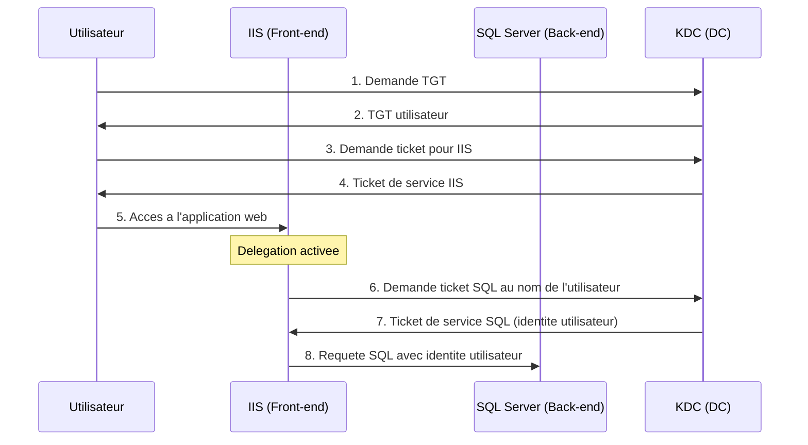

<!--
  Copyright 2026 Julien Bombled

  Licensed under the Apache License, Version 2.0 (the "License");
  you may not use this file except in compliance with the License.
  You may obtain a copy of the License at

      http://www.apache.org/licenses/LICENSE-2.0

  Unless required by applicable law or agreed to in writing, software
  distributed under the License is distributed on an "AS IS" BASIS,
  WITHOUT WARRANTIES OR CONDITIONS OF ANY KIND, either express or implied.
  See the License for the specific language governing permissions and
  limitations under the License.
-->

# Delegation Kerberos

<span class="level-advanced">Avance</span> · Temps estime : 35 minutes

!!! example "Analogie"

    Imaginez un **hotel**. Quand vous arrivez, le receptionniste (service front-end) prend votre carte d'identite. Avec la **delegation non contrainte**, il garde votre carte et peut l'utiliser pour vous inscrire a n'importe quel service de l'hotel (spa, restaurant, salle de sport) — et meme ailleurs. Avec la **delegation contrainte**, il ne peut utiliser votre carte que pour vous inscrire au restaurant et au spa (liste prealablement definie). Avec la **delegation basee sur les ressources**, c'est le restaurant lui-meme qui decide quels receptionnistes peuvent inscrire des clients en son nom.

## Pourquoi la delegation ?

Dans une architecture multi-tiers, un service intermediaire doit souvent acceder a un service backend **au nom de l'utilisateur**. Sans delegation, le service intermediaire ne peut pas transmettre l'identite de l'utilisateur.



## Les 3 types de delegation

| Type | Securite | Portee | Configuration |
|---|---|---|---|
| **Non contrainte** | Faible | Tous les services | Propriete du compte front-end |
| **Contrainte (KCD)** | Moyenne | Liste de services definie | Propriete du compte front-end |
| **Basee sur les ressources (RBKCD)** | Elevee | Decidee par le backend | Propriete du compte backend |

!!! danger "Evitez la delegation non contrainte"

    La delegation non contrainte permet au service intermediaire d'usurper l'identite de l'utilisateur aupres de **n'importe quel service**. C'est un vecteur d'attaque majeur (credential theft). Privilegiez toujours la delegation contrainte ou basee sur les ressources.

## Delegation contrainte (KCD)

La plus utilisee en entreprise. L'administrateur definit explicitement vers quels services le front-end peut deleguer.

### Configuration via PowerShell

```powershell
# Allow IIS service account to delegate to SQL Server
Set-ADUser -Identity "svc-WebApp" `
    -TrustedForDelegation $false

Set-ADUser -Identity "svc-WebApp" -Add @{
    'msDS-AllowedToDelegateTo' = @(
        'MSSQLSvc/SRV-SQL01.winopslab.local:1433',
        'MSSQLSvc/SRV-SQL01.winopslab.local'
    )
}

# Verify configuration
Get-ADUser -Identity "svc-WebApp" -Properties msDS-AllowedToDelegateTo |
    Select-Object -ExpandProperty msDS-AllowedToDelegateTo
```

### Configuration via GUI

1. Ouvrez **Active Directory Users and Computers**
2. Proprietes du compte de service > Onglet **Delegation**
3. Selectionnez **Trust this user for delegation to specified services only**
4. Choisissez **Use Kerberos only** (ou **Use any authentication protocol** pour la transition de protocole)
5. Cliquez **Add** et selectionnez le service cible

!!! info "SPN requis"

    La delegation contrainte necessite que le service cible ait un **Service Principal Name** (SPN) enregistre. Verifiez avec `setspn -L <compte>`.

## Delegation basee sur les ressources (RBKCD)

Introduite avec Windows Server 2012, c'est l'approche recommandee. Le service backend decide qui peut deleguer vers lui, sans necessiter de droits admin du domaine.

```powershell
# Get the front-end service account
$frontEnd = Get-ADUser -Identity "svc-WebApp"

# Configure the SQL Server computer to allow delegation from the front-end
Set-ADComputer -Identity "SRV-SQL01" -PrincipalsAllowedToDelegateToAccount $frontEnd

# Verify
Get-ADComputer -Identity "SRV-SQL01" `
    -Properties PrincipalsAllowedToDelegateToAccount |
    Select-Object -ExpandProperty PrincipalsAllowedToDelegateToAccount
```

### Avantages de RBKCD

- **Pas besoin de droits Domain Admin** : l'admin du serveur backend suffit
- **Multi-domaine** : fonctionne entre domaines avec approbation
- **Plus granulaire** : le proprietaire de la ressource controle l'acces

## Verification et depannage

### Verifier les SPN

```powershell
# List SPNs for a service account
setspn -L svc-WebApp

# List SPNs for a computer account
setspn -L SRV-SQL01

# Register an SPN if missing
setspn -A MSSQLSvc/SRV-SQL01.winopslab.local:1433 svc-SQLEngine
setspn -A HTTP/webapp.winopslab.local svc-WebApp
```

### Tester la delegation

```powershell
# From the IIS server, test SQL access with delegated credentials
Invoke-Sqlcmd -ServerInstance "SRV-SQL01" -Database "master" `
    -Query "SELECT SUSER_NAME() AS CurrentUser"
# Should return the end-user identity, not the service account
```

### Diagnostiquer avec klist

```powershell
# View cached Kerberos tickets on the front-end server
klist tickets

# Purge tickets to force renewal
klist purge
```

## Scenario pratique

!!! example "Application web IIS + SQL Server avec delegation RBKCD"

    **Contexte** : Votre application web (`webapp.winopslab.local`) sur `WEB-01` doit acceder a SQL Server sur `SRV-SQL01` avec l'identite de l'utilisateur connecte. Vous utilisez un gMSA pour le pool IIS.

    **Etapes** :

    1. Verifiez les SPN :

        ```powershell
        # IIS SPN
        setspn -A HTTP/webapp.winopslab.local WINOPSLAB\gmsa-WebApp$

        # SQL SPN (usually auto-registered)
        setspn -L SRV-SQL01 | Select-String "MSSQLSvc"
        ```

    2. Configurez la delegation RBKCD sur le serveur SQL :

        ```powershell
        $webAccount = Get-ADServiceAccount -Identity "gmsa-WebApp"
        Set-ADComputer -Identity "SRV-SQL01" `
            -PrincipalsAllowedToDelegateToAccount $webAccount
        ```

    3. Activez l'authentification Windows dans IIS :

        ```powershell
        Set-WebConfigurationProperty `
            -Filter "/system.webServer/security/authentication/windowsAuthentication" `
            -PSPath "IIS:\Sites\MonApp" -Name "enabled" -Value $true
        Set-WebConfigurationProperty `
            -Filter "/system.webServer/security/authentication/windowsAuthentication" `
            -PSPath "IIS:\Sites\MonApp" -Name "useKernelMode" -Value $true
        Set-WebConfigurationProperty `
            -Filter "/system.webServer/security/authentication/windowsAuthentication" `
            -PSPath "IIS:\Sites\MonApp" -Name "useAppPoolCredentials" -Value $true
        ```

    4. Testez depuis un poste client :

        ```powershell
        Invoke-WebRequest -Uri "https://webapp.winopslab.local/whoami" `
            -UseDefaultCredentials
        ```

??? success "Resultat attendu"

    L'application web affiche l'identite de l'utilisateur connecte, et les requetes SQL utilisent cette meme identite (visible dans `sys.dm_exec_sessions`).

## Erreurs courantes

!!! failure "Double hop : Access Denied sur le backend"

    **Symptome** : L'utilisateur accede au front-end mais recoit `Access Denied` quand le front-end tente d'acceder au backend.

    **Cause** : Aucune delegation configuree. Par defaut, un service ne peut pas transmettre les credentials Kerberos a un autre service (probleme du "double hop").

    **Solution** : Configurez la delegation contrainte ou RBKCD comme decrit ci-dessus.

!!! failure "SPN manquant ou duplique"

    **Symptome** : L'authentification Kerberos echoue avec `KRB_AP_ERR_MODIFIED` ou `KDC_ERR_S_PRINCIPAL_UNKNOWN`.

    **Cause** : Le SPN du service cible n'est pas enregistre, ou il est enregistre sur plusieurs comptes.

    **Solution** :

    ```powershell
    # Find duplicate SPNs
    setspn -X

    # Remove a duplicate SPN
    setspn -D MSSQLSvc/SRV-SQL01.winopslab.local:1433 wrong-account
    ```

!!! failure "NTLM utilise au lieu de Kerberos"

    **Symptome** : La delegation ne fonctionne pas et les logs montrent une authentification NTLM.

    **Cause** : Le client utilise une adresse IP au lieu du FQDN, ou le SPN ne correspond pas.

    **Solution** : Utilisez toujours le FQDN (pas l'IP). Kerberos necessite une resolution DNS vers un SPN valide.

!!! failure "Delegation non contrainte accidentellement activee"

    **Symptome** : Un audit de securite detecte des comptes avec `TrustedForDelegation = True`.

    **Cause** : L'option `Trust this computer for delegation to any service` est cochee.

    **Solution** :

    ```powershell
    # Find all accounts with unconstrained delegation
    Get-ADComputer -Filter {TrustedForDelegation -eq $true} |
        Select-Object Name
    Get-ADUser -Filter {TrustedForDelegation -eq $true} |
        Select-Object Name

    # Disable and switch to constrained delegation
    Set-ADComputer -Identity "SRV-WEB01" -TrustedForDelegation $false
    ```

## Pour aller plus loin

- :material-link: [Concepts fondamentaux AD](concepts-fondamentaux.md) -- protocole Kerberos et authentification
- :material-link: [Comptes de service gMSA](gmsa.md) -- comptes de service geres
- :material-link: [Tiering Model](../../securite/durcissement/tiering-model.md) -- modele de tiers et isolation des privileges
- :material-link: [Certificats SSL IIS](../../gestion-moderne/iis/certificats-ssl.md) -- HTTPS et authentification IIS
