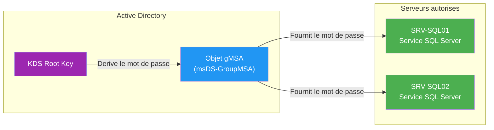

<!--
  Copyright 2026 Julien Bombled

  Licensed under the Apache License, Version 2.0 (the "License");
  you may not use this file except in compliance with the License.
  You may obtain a copy of the License at

      http://www.apache.org/licenses/LICENSE-2.0

  Unless required by applicable law or agreed to in writing, software
  distributed under the License is distributed on an "AS IS" BASIS,
  WITHOUT WARRANTIES OR CONDITIONS OF ANY KIND, either express or implied.
  See the License for the specific language governing permissions and
  limitations under the License.
-->

# Comptes de service gMSA

<span class="level-advanced">Avance</span> · Temps estime : 30 minutes

!!! example "Analogie"

    Un compte de service classique, c'est comme une **cle physique** partagee entre plusieurs employes pour ouvrir un local technique. Si la cle est perdue, il faut changer la serrure et redistribuer les copies a tout le monde. Un **gMSA**, c'est un **badge electronique** dont le code change automatiquement toutes les 30 jours, sans que personne n'ait besoin de connaitre le code ni de le mettre a jour : le systeme de badges gere tout.

## Pourquoi utiliser des gMSA ?

Les comptes de service classiques posent trois problemes majeurs :

| Probleme | Compte classique | gMSA |
|---|---|---|
| Rotation du mot de passe | Manuelle (souvent jamais faite) | Automatique (30 jours par defaut) |
| Connaissance du mot de passe | L'admin le connait | Personne ne le connait |
| Utilisation multi-serveur | Meme mot de passe partout | Mot de passe synchronise par AD |
| Risque de compromission | Eleve (mot de passe statique) | Faible (rotation + 240 caracteres) |

## Architecture



!!! info "KDS Root Key"

    La cle racine KDS (Key Distribution Service) est le secret maitre a partir duquel AD genere les mots de passe gMSA. Elle doit etre creee une seule fois par foret et necessite un delai de replication de 10 heures avant utilisation.

## Prerequis

- Niveau fonctionnel du domaine : **Windows Server 2012** ou superieur
- Module PowerShell Active Directory installe sur le poste d'administration
- Droits **Admins du domaine** pour creer la cle KDS et les comptes gMSA

## Etape 1 : Creer la cle racine KDS

```powershell
# Create the KDS root key (production: wait 10 hours for replication)
Add-KdsRootKey -EffectiveImmediately

# Lab only: skip the 10-hour wait (NEVER in production)
Add-KdsRootKey -EffectiveTime ((Get-Date).AddHours(-10))

# Verify KDS root key exists
Get-KdsRootKey
```

!!! danger "Environnement de lab uniquement"

    Le parametre `-EffectiveTime` avec une date passee contourne le delai de replication. En production, utilisez `-EffectiveImmediately` et attendez 10 heures.

## Etape 2 : Creer un groupe de serveurs autorises

Seuls les serveurs membres de ce groupe pourront recuperer le mot de passe du gMSA.

```powershell
# Create a security group for authorized servers
New-ADGroup -Name "grp-gMSA-SQLServers" `
    -GroupScope Global `
    -GroupCategory Security `
    -Path "OU=Groupes,DC=winopslab,DC=local" `
    -Description "Servers authorized to use gMSA for SQL Server"

# Add servers to the group
Add-ADGroupMember -Identity "grp-gMSA-SQLServers" `
    -Members "SRV-SQL01$", "SRV-SQL02$"
```

!!! warning "Redemarrage requis"

    Apres avoir ajoute un serveur au groupe de securite, **redemarrez-le** pour que son ticket Kerberos inclue la nouvelle appartenance de groupe.

## Etape 3 : Creer le compte gMSA

```powershell
# Create the gMSA account
New-ADServiceAccount -Name "gmsa-SQLEngine" `
    -DNSHostName "gmsa-sqlengine.winopslab.local" `
    -PrincipalsAllowedToRetrieveManagedPassword "grp-gMSA-SQLServers" `
    -KerberosEncryptionType AES128, AES256 `
    -Description "gMSA for SQL Server Database Engine"

# Verify creation
Get-ADServiceAccount -Identity "gmsa-SQLEngine" -Properties *
```

## Etape 4 : Installer et utiliser le gMSA sur les serveurs

Sur chaque serveur autorise :

```powershell
# Install the Active Directory PowerShell module
Install-WindowsFeature RSAT-AD-PowerShell

# Install the gMSA on this server
Install-ADServiceAccount -Identity "gmsa-SQLEngine"

# Test that the server can retrieve the password
Test-ADServiceAccount -Identity "gmsa-SQLEngine"
# Expected output: True
```

### Assigner le gMSA a un service Windows

```powershell
# Configure a Windows service to use the gMSA
$credential = New-Object System.Management.Automation.PSCredential(
    "WINOPSLAB\gmsa-SQLEngine$", (New-Object System.Security.SecureString)
)
Set-Service -Name "MSSQLSERVER" -Credential $credential

# Or via sc.exe (note the $ suffix and empty password)
sc.exe config "MSSQLSERVER" obj="WINOPSLAB\gmsa-SQLEngine$" password=""
```

### Assigner le gMSA a une tache planifiee

```powershell
# Create a scheduled task using gMSA
$action = New-ScheduledTaskAction -Execute "PowerShell.exe" `
    -Argument "-File C:\Scripts\backup-db.ps1"
$trigger = New-ScheduledTaskTrigger -Daily -At "02:00"
$principal = New-ScheduledTaskPrincipal -UserID "WINOPSLAB\gmsa-SQLEngine$" `
    -LogonType Password -RunLevel Highest

Register-ScheduledTask -TaskName "SQL-DailyBackup" `
    -Action $action -Trigger $trigger -Principal $principal
```

## Gestion courante

```powershell
# List all gMSA accounts in the domain
Get-ADServiceAccount -Filter * -Properties PrincipalsAllowedToRetrieveManagedPassword |
    Select-Object Name, DNSHostName, PrincipalsAllowedToRetrieveManagedPassword

# Check password last set date
Get-ADServiceAccount -Identity "gmsa-SQLEngine" -Properties PasswordLastSet |
    Select-Object Name, PasswordLastSet

# Uninstall gMSA from a server (run on the server)
Uninstall-ADServiceAccount -Identity "gmsa-SQLEngine"

# Delete a gMSA
Remove-ADServiceAccount -Identity "gmsa-SQLEngine" -Confirm:$false
```

## Scenario pratique

!!! example "Deployer un gMSA pour IIS sur 3 serveurs web"

    **Contexte** : Votre application web tourne sur 3 serveurs IIS (`WEB-01`, `WEB-02`, `WEB-03`) derriere un NLB. Le pool d'applications utilise un compte de service classique dont le mot de passe n'a pas change depuis 2 ans.

    **Etapes** :

    1. Creez le groupe de securite :

        ```powershell
        New-ADGroup -Name "grp-gMSA-WebFarm" -GroupScope Global `
            -GroupCategory Security -Path "OU=Groupes,DC=winopslab,DC=local"
        Add-ADGroupMember -Identity "grp-gMSA-WebFarm" `
            -Members "WEB-01$", "WEB-02$", "WEB-03$"
        ```

    2. Creez le gMSA :

        ```powershell
        New-ADServiceAccount -Name "gmsa-WebApp" `
            -DNSHostName "gmsa-webapp.winopslab.local" `
            -PrincipalsAllowedToRetrieveManagedPassword "grp-gMSA-WebFarm"
        ```

    3. Sur chaque serveur web (apres redemarrage) :

        ```powershell
        Install-ADServiceAccount -Identity "gmsa-WebApp"
        Test-ADServiceAccount -Identity "gmsa-WebApp"
        ```

    4. Configurez le pool IIS :

        ```powershell
        Import-Module WebAdministration
        Set-ItemProperty "IIS:\AppPools\MonApp" -Name processModel.identityType -Value 3
        Set-ItemProperty "IIS:\AppPools\MonApp" -Name processModel.userName `
            -Value "WINOPSLAB\gmsa-WebApp$"
        Set-ItemProperty "IIS:\AppPools\MonApp" -Name processModel.password -Value ""
        Restart-WebAppPool -Name "MonApp"
        ```

??? success "Resultat attendu"

    - `Test-ADServiceAccount` retourne `True` sur les 3 serveurs
    - Le pool IIS fonctionne sans mot de passe stocke
    - Le mot de passe sera change automatiquement tous les 30 jours

## Erreurs courantes

!!! failure "Test-ADServiceAccount retourne False"

    **Symptome** : `Test-ADServiceAccount -Identity "gmsa-SQLEngine"` retourne `False`.

    **Cause** : Le serveur n'est pas membre du groupe autorise, ou le serveur n'a pas ete redemarre apres l'ajout au groupe.

    **Solution** :

    ```powershell
    # Verify group membership (note the $ suffix for computer accounts)
    Get-ADGroupMember -Identity "grp-gMSA-SQLServers" |
        Select-Object Name, objectClass

    # If recently added, reboot the server to refresh the Kerberos ticket
    Restart-Computer -Force
    ```

!!! failure "Le service refuse de demarrer avec le gMSA"

    **Symptome** : Le service Windows echoue avec l'erreur `Logon failure: the user has not been granted the requested logon type`.

    **Cause** : Le gMSA n'a pas le droit `Log on as a service`.

    **Solution** : Ajoutez le gMSA a la strategie locale ou via GPO :

    ```powershell
    # Open local security policy
    secpol.msc
    # Navigate to: Local Policies > User Rights Assignment > Log on as a service
    # Add: WINOPSLAB\gmsa-SQLEngine$
    ```

!!! failure "Erreur 'Key does not exist' lors de la creation du gMSA"

    **Symptome** : `New-ADServiceAccount` echoue avec `Key does not exist`.

    **Cause** : La cle racine KDS n'a pas ete creee ou le delai de replication de 10 heures n'est pas ecoule.

    **Solution** :

    ```powershell
    # Verify KDS root key exists and is effective
    Get-KdsRootKey | Select-Object KeyId, EffectiveTime
    # EffectiveTime must be in the past
    ```

!!! failure "gMSA non reconnu par une application tierce"

    **Symptome** : L'application refuse le compte gMSA car elle ne supporte pas les comptes de service geres.

    **Cause** : Certaines applications anciennes ne supportent pas les gMSA (elles exigent un mot de passe explicite).

    **Solution** : Verifiez la compatibilite dans la documentation de l'editeur. En dernier recours, utilisez un compte de service classique avec rotation de mot de passe via LAPS ou un coffre-fort de secrets.

## Pour aller plus loin

- :material-link: [Utilisateurs et groupes](utilisateurs-et-groupes.md) -- gestion des comptes AD
- :material-link: [LAPS](../../securite/durcissement/laps.md) -- rotation automatique des mots de passe administrateur
- :material-link: [Comptes privilegies](../../securite/durcissement/comptes-privilegies.md) -- protection des comptes a privileges
- :material-link: [Taches planifiees](../../automatisation/taches-planifiees/gestion-powershell.md) -- automatisation avec PowerShell
