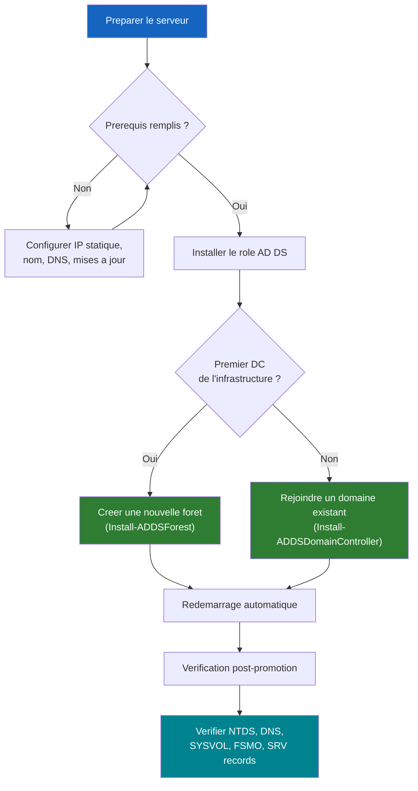

<!--
  Copyright 2026 Julien Bombled

  Licensed under the Apache License, Version 2.0 (the "License");
  you may not use this file except in compliance with the License.
  You may obtain a copy of the License at

      http://www.apache.org/licenses/LICENSE-2.0

  Unless required by applicable law or agreed to in writing, software
  distributed under the License is distributed on an "AS IS" BASIS,
  WITHOUT WARRANTIES OR CONDITIONS OF ANY KIND, either express or implied.
  See the License for the specific language governing permissions and
  limitations under the License.
-->

---
title: Installer le premier controleur de domaine
description: Deployer le premier controleur de domaine et creer une nouvelle foret Active Directory.
tags:
  - active-directory
  - adds
  - intermediaire
  - powershell
---

# Installer le premier controleur de domaine

<span class="level-intermediate">Intermediaire</span> · Temps estime : 30 minutes

## Processus d'installation



## Prerequis

!!! example "Analogie"

    Installer le premier controleur de domaine, c'est comme **fonder la mairie d'une nouvelle ville**. Avant que les habitants (utilisateurs) puissent s'installer, il faut construire le batiment (installer le role), ouvrir les registres d'etat civil (creer la base NTDS.dit), et mettre en place le bureau de poste (DNS) pour que tout le monde puisse se trouver.

Avant de promouvoir un serveur en controleur de domaine :

- [x] Serveur renomme (ex: `DC-01`)
- [x] Adresse IP statique configuree
- [x] DNS pointe vers lui-meme (il deviendra serveur DNS)
- [x] Fuseau horaire correct
- [x] Mises a jour installees

!!! warning "Choix du nom de domaine"

    Evitez les noms de domaine en `.local` dans un environnement de production
    (conflit possible avec mDNS/Bonjour). Preferez un sous-domaine de votre
    domaine public : `ad.monentreprise.com` ou `corp.monentreprise.com`.

    En lab, `lab.local` est acceptable.

## Etape 1 : Installer le role AD DS

```powershell
# Install AD DS role with management tools
Install-WindowsFeature -Name AD-Domain-Services -IncludeManagementTools
```

Resultat :

```text
Success Restart Needed Exit Code      Feature Result
------- -------------- ---------      --------------
True    No             Success        {Active Directory Domain Services, Group P...
```

!!! note "Le role DNS sera installe automatiquement"

    Lors de la promotion, si vous cochez l'option DNS Server (recommande),
    le role DNS sera installe automatiquement comme dependance.

## Etape 2 : Promouvoir en controleur de domaine

### Nouvelle foret (premier DC de l'infrastructure)

=== "PowerShell (recommande)"

    ```powershell
    # Import the ADDSDeployment module
    Import-Module ADDSDeployment

    # Promote to DC - new forest
    Install-ADDSForest `
        -DomainName "lab.local" `
        -DomainNetbiosName "LAB" `
        -ForestMode "WinThreshold" `
        -DomainMode "WinThreshold" `
        -InstallDns:$true `
        -DatabasePath "C:\Windows\NTDS" `
        -LogPath "C:\Windows\NTDS" `
        -SysvolPath "C:\Windows\SYSVOL" `
        -SafeModeAdministratorPassword (ConvertTo-SecureString "P@ssw0rd!DSRM" -AsPlainText -Force) `
        -Force:$true
    ```

    !!! danger "Mot de passe DSRM"

        Le mot de passe **SafeModeAdministratorPassword** (DSRM) est crucial.
        Il permet d'acceder au DC en mode restauration des services d'annuaire.
        Notez-le dans un endroit securise. Il ne peut pas etre recupere.

=== "Server Manager (GUI)"

    1. Ouvrir Server Manager
    2. Cliquer sur le drapeau de notification jaune
    3. Choisir **Promote this server to a domain controller**
    4. Selectionner **Add a new forest**
    5. Saisir le nom de domaine racine : `lab.local`
    6. Configurer le niveau fonctionnel de la foret et du domaine
    7. Cocher **DNS Server**
    8. Definir le mot de passe DSRM
    9. Ignorer la delegation DNS (normal pour le premier DC)
    10. Accepter le nom NetBIOS (`LAB`)
    11. Conserver les chemins par defaut
    12. Verifier les options et installer

Le serveur redemarrera automatiquement apres la promotion.

## Etape 3 : Verification post-promotion (Auto-Validation)

!!! success "Testez votre travail !"
    Copiez ce bloc de code dans une console PowerShell sur votre nouveau DC pour verifier instantanement votre installation.

```powershell
# --- Script de Validation WinOpsLab ---
$ValidationResults = [Ordered]@{}

# 1. Verification des services AD
$Services = Get-Service -Name NTDS, DNS, ADWS -ErrorAction SilentlyContinue
$ValidationResults["Services AD"] = if (($Services | Where-Object Status -ne 'Running').Count -eq 0) { "OK" } else { "ERREUR" }

# 2. Verification du Domaine
$Domain = Get-ADDomain -ErrorAction SilentlyContinue
$ValidationResults["Domaine"] = if ($Domain.Name -eq 'lab.local') { "OK ($($Domain.Name))" } else { "ERREUR" }

# 3. Verification du Role FSMO (PDC)
$PDC = (Get-ADDomain).PDCEmulator
$ValidationResults["Role PDC"] = if ($PDC -eq "$env:COMPUTERNAME.lab.local") { "OK" } else { "ATTENTION ($PDC)" }

# 4. Verification Partage SYSVOL
$Share = Get-SmbShare -Name SYSVOL -ErrorAction SilentlyContinue
$ValidationResults["SYSVOL"] = if ($Share) { "OK" } else { "MANQUANT" }

# Affichage du rapport
$ValidationResults | Format-Table -AutoSize
```

Si tout est vert, bravo ! Vous avez installe votre premier DC.

## Etape 4 : Ajouter un second controleur de domaine

Pour la redondance, ajoutez toujours un second DC :

```powershell
# On the second server (SRV-DC-02), install AD DS
Install-WindowsFeature -Name AD-Domain-Services -IncludeManagementTools

# Promote as additional DC in existing domain
Import-Module ADDSDeployment

Install-ADDSDomainController `
    -DomainName "lab.local" `
    -InstallDns:$true `
    -Credential (Get-Credential "LAB\Administrator") `
    -DatabasePath "C:\Windows\NTDS" `
    -LogPath "C:\Windows\NTDS" `
    -SysvolPath "C:\Windows\SYSVOL" `
    -SafeModeAdministratorPassword (ConvertTo-SecureString "P@ssw0rd!DSRM" -AsPlainText -Force) `
    -Force:$true
```

## Challenge "Break/Fix" : Dépannage

!!! failure "Le cas pratique"

    **Contexte :** Vous venez d'installer `DC-01` (10.0.0.10). Vous tentez de joindre une station de travail (`PC-01`) au domaine `lab.local`.
    
    **Symptôme :** La commande échoue avec l'erreur :
    > "L'Active Directory Domain Controller (AD DC) pour le domaine "lab.local" n'a pas pu etre contacte."

    **Diagnostic :**
    Sur `PC-01`, vous executez :
    ```powershell
    Resolve-DnsName -Name "lab.local"
    ```
    Resultat : *DNS name does not exist*.

    ??? tip "Solution (Cliquez pour reveler)"
        
        Le probleme est purement **DNS**.
        
        Les postes clients doivent absolument utiliser l'adresse IP du controleur de domaine (`10.0.0.10`) comme serveur DNS primaire pour resoudre les enregistrements SRV du domaine.
        
        **Correction :** Changez le serveur DNS sur la carte reseau de `PC-01` pour pointer vers `10.0.0.10`.

## Ports reseau requis

Voir le [Memento des Ports AD](../../ressources/memento-ports-ad.md) pour la liste complete.

!!! example "Scenario pratique"

    **Contexte :** Marc, administrateur systeme, tente de promouvoir un nouveau serveur `SRV-DC-01` en premier controleur de domaine pour creer la foret `lab.local`. La commande `Install-ADDSForest` echoue avec l'erreur "DNS not available or unable to reach DNS servers configured for this computer".

    **Symptomes :**

    - La promotion s'arrete avec une erreur DNS
    - L'Assistant de configuration AD DS signale que le DNS n'est pas accessible
    - La verification des prerequis (`Test-ADDSForestInstallation`) retourne des avertissements DNS

    **Diagnostic :**

    ```powershell
    # Check DNS client configuration on the future DC
    Get-DnsClientServerAddress -InterfaceAlias "Ethernet" |
        Select-Object InterfaceAlias, ServerAddresses
    ```

    Resultat :

    ```text
    InterfaceAlias  ServerAddresses
    --------------  ---------------
    Ethernet        {8.8.8.8, 8.8.4.4}
    ```

    La carte reseau pointe vers les serveurs DNS publics de Google. Lors de la promotion, Windows tente de resoudre `_ldap._tcp.lab.local` pour verifier l'existence du domaine — les serveurs DNS publics ne connaissent pas cette zone et retournent une erreur. Le DC doit pointer vers lui-meme (`127.0.0.1`) car il va devenir serveur DNS lors de la promotion.

    **Solution :**

    ```powershell
    # Point the DNS client to localhost (the server will become its own DNS)
    Set-DnsClientServerAddress -InterfaceAlias "Ethernet" `
        -ServerAddresses "127.0.0.1"

    # Verify the change
    Get-DnsClientServerAddress -InterfaceAlias "Ethernet" |
        Select-Object InterfaceAlias, ServerAddresses

    # Retry the forest promotion
    Install-ADDSForest `
        -DomainName "lab.local" `
        -DomainNetbiosName "LAB" `
        -ForestMode "WinThreshold" `
        -DomainMode "WinThreshold" `
        -InstallDns:$true `
        -SafeModeAdministratorPassword (ConvertTo-SecureString "P@ssw0rd!DSRM" -AsPlainText -Force) `
        -Force:$true
    ```

    Apres correction du DNS, la promotion aboutit correctement. Le role DNS est installe automatiquement et le serveur enregistre ses propres enregistrements SRV dans la zone `lab.local` qu'il vient de creer.

## Pour aller plus loin

- [Structure des OU](structure-ou.md) - organiser l'annuaire
- [Utilisateurs et groupes](utilisateurs-et-groupes.md) - creer les premiers objets
- [DNS integre AD](../dns/zones-integrees-ad.md) - comprendre le DNS cree automatiquement
