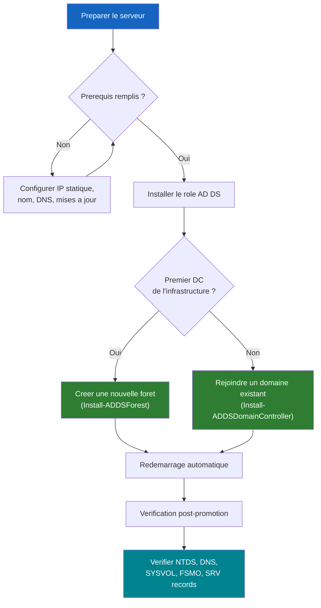

# Installer le premier controleur de domaine

<span class="level-intermediate">Intermediaire</span> · Temps estime : 30 minutes

## Processus d'installation



## Prerequis

!!! example "Analogie"

    Installer le premier controleur de domaine, c'est comme **fonder la mairie d'une nouvelle ville**. Avant que les habitants (utilisateurs) puissent s'installer, il faut construire le batiment (installer le role), ouvrir les registres d'etat civil (creer la base NTDS.dit), et mettre en place le bureau de poste (DNS) pour que tout le monde puisse se trouver.

Avant de promouvoir un serveur en controleur de domaine :

- [x] Serveur renomme (ex: `DC-01`)
- [x] Adresse IP statique configuree
- [x] DNS pointe vers lui-meme (il deviendra serveur DNS)
- [x] Fuseau horaire correct
- [x] Mises a jour installees

!!! warning "Choix du nom de domaine"

    Evitez les noms de domaine en `.local` dans un environnement de production
    (conflit possible avec mDNS/Bonjour). Preferez un sous-domaine de votre
    domaine public : `ad.monentreprise.com` ou `corp.monentreprise.com`.

    En lab, `lab.local` est acceptable.

## Etape 1 : Installer le role AD DS

```powershell
# Install AD DS role with management tools
Install-WindowsFeature -Name AD-Domain-Services -IncludeManagementTools
```

Resultat :

```text
Success Restart Needed Exit Code      Feature Result
------- -------------- ---------      --------------
True    No             Success        {Active Directory Domain Services, Group P...
```

!!! note "Le role DNS sera installe automatiquement"

    Lors de la promotion, si vous cochez l'option DNS Server (recommande),
    le role DNS sera installe automatiquement comme dependance.

## Etape 2 : Promouvoir en controleur de domaine

### Nouvelle foret (premier DC de l'infrastructure)

=== "PowerShell (recommande)"

    ```powershell
    # Import the ADDSDeployment module
    Import-Module ADDSDeployment

    # Promote to DC - new forest
    Install-ADDSForest `
        -DomainName "lab.local" `
        -DomainNetbiosName "LAB" `
        -ForestMode "WinThreshold" `
        -DomainMode "WinThreshold" `
        -InstallDns:$true `
        -DatabasePath "C:\Windows\NTDS" `
        -LogPath "C:\Windows\NTDS" `
        -SysvolPath "C:\Windows\SYSVOL" `
        -SafeModeAdministratorPassword (ConvertTo-SecureString "P@ssw0rd!DSRM" -AsPlainText -Force) `
        -Force:$true
    ```

    !!! danger "Mot de passe DSRM"

        Le mot de passe **SafeModeAdministratorPassword** (DSRM) est crucial.
        Il permet d'acceder au DC en mode restauration des services d'annuaire.
        Notez-le dans un endroit securise. Il ne peut pas etre recupere.

=== "Server Manager (GUI)"

    1. Ouvrir Server Manager
    2. Cliquer sur le drapeau de notification jaune
    3. Choisir **Promote this server to a domain controller**
    4. Selectionner **Add a new forest**
    5. Saisir le nom de domaine racine : `lab.local`
    6. Configurer le niveau fonctionnel de la foret et du domaine
    7. Cocher **DNS Server**
    8. Definir le mot de passe DSRM
    9. Ignorer la delegation DNS (normal pour le premier DC)
    10. Accepter le nom NetBIOS (`LAB`)
    11. Conserver les chemins par defaut
    12. Verifier les options et installer

Le serveur redemarrera automatiquement apres la promotion.

## Etape 3 : Verification post-promotion

```powershell
# Verify AD DS is running
Get-Service -Name "NTDS" | Select-Object Name, Status

# Verify DNS is running
Get-Service -Name "DNS" | Select-Object Name, Status

# Verify domain information
Get-ADDomain | Select-Object DNSRoot, NetBIOSName, DomainMode, PDCEmulator

# Verify forest information
Get-ADForest | Select-Object Name, ForestMode, SchemaMaster, DomainNamingMaster

# List domain controllers
Get-ADDomainController -Filter * | Select-Object Name, IPv4Address, IsGlobalCatalog

# Verify FSMO roles
netdom query fsmo

# Verify DNS zones
Get-DnsServerZone

# Verify SYSVOL share
Get-SmbShare | Where-Object Name -in "SYSVOL", "NETLOGON"

# Test DNS resolution
Resolve-DnsName -Name "lab.local" -Type SOA
Resolve-DnsName -Name "_ldap._tcp.dc._msdcs.lab.local" -Type SRV
```

Resultat :

```text
Name Status
---- ------
NTDS Running

Name Status
---- ------
DNS  Running

DNSRoot    NetBIOSName DomainMode        PDCEmulator
-------    ----------- ----------        -----------
lab.local  LAB         Windows2016Domain DC-01.lab.local

Name      ForestMode        SchemaMaster    DomainNamingMaster
----      ----------        ------------    ------------------
lab.local Windows2016Forest DC-01.lab.local DC-01.lab.local

Name  IPv4Address IsGlobalCatalog
----  ----------- ---------------
DC-01 10.0.0.10              True

Schema master               DC-01.lab.local
Domain naming master        DC-01.lab.local
PDC                         DC-01.lab.local
RID pool manager            DC-01.lab.local
Infrastructure master       DC-01.lab.local
The command completed successfully.

ZoneName                            ZoneType   IsAutoCreated  IsDsIntegrated
--------                            --------   -------------  --------------
lab.local                           Primary    False          True
_msdcs.lab.local                    Primary    False          True
0.0.10.in-addr.arpa                 Primary    False          True

Name    ScopeName Path                              Description
----    --------- ----                              -----------
SYSVOL  *         C:\Windows\SYSVOL\sysvol          Logon server share
NETLOGON *        C:\Windows\SYSVOL\sysvol\lab.local\SCRIPTS Logon server share

Name     : lab.local
Type     : SOA
TTL      : 3600
Section  : Answer
PrimaryServer : DC-01.lab.local

Name     : _ldap._tcp.dc._msdcs.lab.local
Type     : SRV
Target   : DC-01.lab.local
Port     : 389
Priority : 0
Weight   : 100
```

!!! tip "Test DNS SRV"

    La resolution de `_ldap._tcp.dc._msdcs.lab.local` en enregistrement SRV
    confirme que DNS et AD fonctionnent correctement ensemble.

## Etape 4 : Ajouter un second controleur de domaine

Pour la redondance, ajoutez toujours un second DC :

```powershell
# On the second server (SRV-DC-02), install AD DS
Install-WindowsFeature -Name AD-Domain-Services -IncludeManagementTools

# Promote as additional DC in existing domain
Import-Module ADDSDeployment

Install-ADDSDomainController `
    -DomainName "lab.local" `
    -InstallDns:$true `
    -Credential (Get-Credential "LAB\Administrator") `
    -DatabasePath "C:\Windows\NTDS" `
    -LogPath "C:\Windows\NTDS" `
    -SysvolPath "C:\Windows\SYSVOL" `
    -SafeModeAdministratorPassword (ConvertTo-SecureString "P@ssw0rd!DSRM" -AsPlainText -Force) `
    -Force:$true
```

## Ports reseau requis

Les ports suivants doivent etre ouverts entre les DC et les clients :

| Port | Protocole | Service |
|------|-----------|---------|
| 53 | TCP/UDP | DNS |
| 88 | TCP/UDP | Kerberos |
| 135 | TCP | RPC Endpoint Mapper |
| 389 | TCP/UDP | LDAP |
| 445 | TCP | SMB (SYSVOL, Netlogon) |
| 464 | TCP/UDP | Kerberos Password Change |
| 636 | TCP | LDAPS |
| 3268 | TCP | Global Catalog |
| 3269 | TCP | Global Catalog SSL |
| 49152-65535 | TCP | RPC Dynamic Ports |

## Points cles a retenir

- Le premier DC cree la foret et le domaine racine
- Le role DNS doit etre installe avec AD DS
- Le mot de passe DSRM est critique et doit etre conserve en securite
- Toujours deployer au moins 2 DC pour la redondance
- Verifier les enregistrements DNS SRV apres la promotion

!!! example "Scenario pratique"

    **Contexte :** Marc, technicien reseau, vient d'installer le role AD DS sur `DC-01` (10.0.0.10) et lance la promotion avec `Install-ADDSForest`. Apres le redemarrage, il constate que les postes clients ne parviennent pas a joindre le domaine `lab.local`. Le message d'erreur indique « The specified domain either does not exist or could not be contacted ».

    **Diagnostic :**

    ```powershell
    # On a client workstation, check DNS configuration
    Get-DnsClientServerAddress -InterfaceAlias "Ethernet" | Select-Object ServerAddresses

    # Try to resolve the domain
    Resolve-DnsName -Name "lab.local" -Type SOA
    ```

    Resultat :

    ```text
    ServerAddresses
    ---------------
    {10.0.0.1}

    Resolve-DnsName : DNS name does not exist
    ```

    Le probleme : les postes clients pointent vers le routeur (`10.0.0.1`) au lieu du DC (`10.0.0.10`) pour le DNS.

    **Solution :**

    ```powershell
    # On each client, set DNS to point to the DC
    Set-DnsClientServerAddress -InterfaceAlias "Ethernet" -ServerAddresses "10.0.0.10"

    # Verify DNS resolution works now
    Resolve-DnsName -Name "lab.local" -Type SOA
    ```

    Resultat :

    ```text
    Name       Type TTL  Section PrimaryServer
    ----       ---- ---  ------- -------------
    lab.local  SOA  3600 Answer  DC-01.lab.local
    ```

    Idealement, configurez le DHCP pour distribuer `10.0.0.10` comme serveur DNS primaire a tous les postes du reseau.

!!! danger "Erreurs courantes"

    1. **Oublier de configurer l'IP statique** : un DC avec une adresse DHCP risque de changer d'IP, rendant le DNS et l'authentification inaccessibles pour tous les clients.

    2. **DNS du serveur ne pointe pas vers lui-meme** : avant la promotion, le DNS du futur DC doit pointer vers `127.0.0.1` ou sa propre IP statique. Sinon, les enregistrements SRV ne seront pas enregistres correctement.

    3. **Perdre le mot de passe DSRM** : le mot de passe SafeModeAdministratorPassword est le seul moyen d'acceder au DC en mode restauration. Sans lui, la recuperation apres un sinistre devient extremement complexe.

    4. **Ne pas verifier les enregistrements DNS SRV** : apres la promotion, verifiez toujours que `_ldap._tcp.dc._msdcs.lab.local` est resolu. Sans ces enregistrements, les clients ne trouvent pas le DC.

    5. **Utiliser un nom de domaine en `.local` en production** : le suffixe `.local` entre en conflit avec le protocole mDNS/Bonjour. Preferez `ad.monentreprise.com` ou `corp.monentreprise.com` pour la production.

## Pour aller plus loin

- [Structure des OU](structure-ou.md) - organiser l'annuaire
- [Utilisateurs et groupes](utilisateurs-et-groupes.md) - creer les premiers objets
- [DNS integre AD](../dns/zones-integrees-ad.md) - comprendre le DNS cree automatiquement
