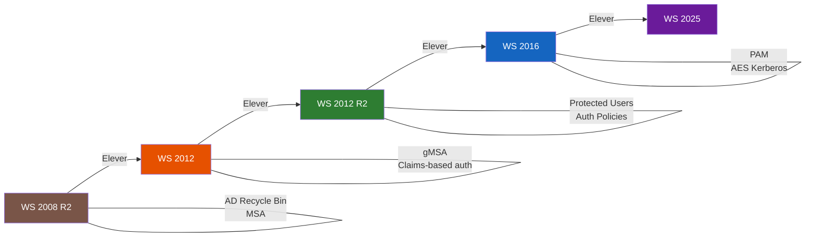

# Niveaux fonctionnels

<span class="level-intermediate">Intermediaire</span> · Temps estime : 10 minutes

## Concept

Les **niveaux fonctionnels** determinent les fonctionnalites AD disponibles. Ils dependent de la version minimale de Windows Server parmi tous les DC.

!!! warning "Elevation irreversible"

    L'elevation du niveau fonctionnel est une operation **irreversible**.
    Une fois eleve, vous ne pouvez plus ajouter de DC avec une version
    anterieure de Windows Server.

## Progression des niveaux fonctionnels



!!! warning "Sens unique"

    L'elevation est **irreversible** : chaque fleche ne va que dans un sens. Impossible de revenir a un niveau precedent.

## Niveaux disponibles

| Niveau fonctionnel | DC minimum requis | Fonctionnalites cles |
|--------------------|-------------------|----------------------|
| Windows Server 2008 R2 | WS 2008 R2 | AD Recycle Bin, Managed Service Accounts |
| Windows Server 2012 | WS 2012 | Claims-based auth, Group Managed Service Accounts |
| Windows Server 2012 R2 | WS 2012 R2 | Authentication policies, Protected Users group |
| Windows Server 2016 | WS 2016 | Privileged Access Management, AES pour Kerberos |
| Windows Server 2025 | WS 2025 | Derniere version |

!!! tip "Recommandation"

    Pour une nouvelle installation avec Windows Server 2022, utilisez le niveau
    fonctionnel **Windows Server 2016** (appele `WinThreshold` dans PowerShell).
    C'est le maximum supporte par WS 2022.

## Verifier les niveaux actuels

```powershell
# Check domain functional level
(Get-ADDomain).DomainMode

# Check forest functional level
(Get-ADForest).ForestMode

# Check all DC OS versions
Get-ADDomainController -Filter * |
    Select-Object Name, OperatingSystem, OperatingSystemVersion
```

## Elever le niveau fonctionnel

### Prerequis

1. Tous les DC du domaine doivent executer la version Windows Server correspondante
2. Verifier la sante de la replication (`repadmin /replsummary`)
3. Effectuer une sauvegarde de l'AD

### Elever le niveau du domaine

```powershell
# Raise domain functional level
Set-ADDomainMode -Identity "lab.local" -DomainMode Windows2016Domain -Confirm:$false
```

### Elever le niveau de la foret

```powershell
# Raise forest functional level (after all domains are at the target level)
Set-ADForestMode -Identity "lab.local" -ForestMode Windows2016Forest -Confirm:$false
```

## Fonctionnalites debloquees par niveau

### Windows Server 2008 R2

- **AD Recycle Bin** : restaurer des objets supprimes
- **Managed Service Accounts** (MSA) : comptes de service avec rotation automatique du mot de passe

### Windows Server 2012 R2

- **Protected Users** group : protection renforcee contre le vol de credentials
- **Authentication Policies** : restreindre ou les comptes privilegies peuvent se connecter

### Windows Server 2016

- **Privileged Access Management** (PAM) : acces privilegie temporaire
- **Chiffrement AES** obligatoire pour Kerberos

## Points cles a retenir

- Le niveau fonctionnel doit correspondre a la version la plus ancienne de DC
- L'elevation est irreversible
- Verifiez la replication et sauvegardez avant d'elever
- Les nouvelles fonctionnalites de securite (Protected Users, PAM) necessitent des niveaux eleves

## Pour aller plus loin

- [Concepts fondamentaux](concepts-fondamentaux.md) - architecture AD
- [AD Recycle Bin](../../haute-disponibilite/backup/ad-recycle-bin.md) - restauration d'objets
