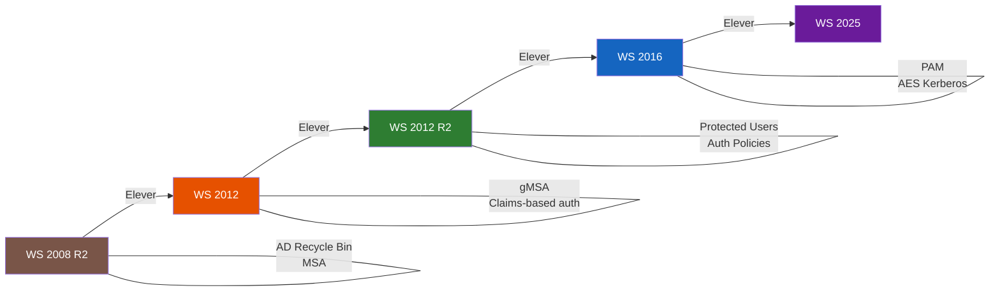

<!--
  Copyright 2026 Julien Bombled

  Licensed under the Apache License, Version 2.0 (the "License");
  you may not use this file except in compliance with the License.
  You may obtain a copy of the License at

      http://www.apache.org/licenses/LICENSE-2.0

  Unless required by applicable law or agreed to in writing, software
  distributed under the License is distributed on an "AS IS" BASIS,
  WITHOUT WARRANTIES OR CONDITIONS OF ANY KIND, either express or implied.
  See the License for the specific language governing permissions and
  limitations under the License.
-->
---
title: Niveaux fonctionnels
description: Niveaux fonctionnels de la foret et du domaine Active Directory.
tags:
  - active-directory
  - adds
  - intermediaire
---

# Niveaux fonctionnels

<span class="level-intermediate">Intermediaire</span> · Temps estime : 10 minutes

## Concept

!!! example "Analogie"

    Les niveaux fonctionnels fonctionnent comme les **regles d'un immeuble en copropriete**. Tant qu'un copropietaire (DC) possede un ancien reglement (version ancienne de Windows Server), tout l'immeuble doit suivre les anciennes regles. Pour adopter de nouvelles fonctionnalites (ascenseur connecte, interphone video), il faut d'abord que tous les copropietaires aient mis a jour leur reglement. Et une fois les nouvelles regles adoptees, impossible de revenir en arriere.

Les **niveaux fonctionnels** determinent les fonctionnalites AD disponibles. Ils dependent de la version minimale de Windows Server parmi tous les DC.

!!! warning "Elevation irreversible"

    L'elevation du niveau fonctionnel est une operation **irreversible**.
    Une fois eleve, vous ne pouvez plus ajouter de DC avec une version
    anterieure de Windows Server.

## Progression des niveaux fonctionnels



!!! warning "Sens unique"

    L'elevation est **irreversible** : chaque fleche ne va que dans un sens. Impossible de revenir a un niveau precedent.

## Niveaux disponibles

| Niveau fonctionnel | DC minimum requis | Fonctionnalites cles |
|--------------------|-------------------|----------------------|
| Windows Server 2008 R2 | WS 2008 R2 | AD Recycle Bin, Managed Service Accounts |
| Windows Server 2012 | WS 2012 | Claims-based auth, Group Managed Service Accounts |
| Windows Server 2012 R2 | WS 2012 R2 | Authentication policies, Protected Users group |
| Windows Server 2016 | WS 2016 | Privileged Access Management, AES pour Kerberos |
| Windows Server 2025 | WS 2025 | Derniere version |

!!! tip "Recommandation"

    Pour une nouvelle installation avec Windows Server 2022, utilisez le niveau
    fonctionnel **Windows Server 2016** (appele `WinThreshold` dans PowerShell).
    C'est le maximum supporte par WS 2022.

## Verifier les niveaux actuels

```powershell
# Check domain functional level
(Get-ADDomain).DomainMode

# Check forest functional level
(Get-ADForest).ForestMode

# Check all DC OS versions
Get-ADDomainController -Filter * |
    Select-Object Name, OperatingSystem, OperatingSystemVersion
```

Resultat :

```text
Windows2016Domain

Windows2016Forest

Name  OperatingSystem                OperatingSystemVersion
----  ---------------                ----------------------
DC-01 Windows Server 2022 Datacenter 10.0 (20348)
DC-02 Windows Server 2022 Standard   10.0 (20348)
```

## Elever le niveau fonctionnel

### Prerequis

1. Tous les DC du domaine doivent executer la version Windows Server correspondante
2. Verifier la sante de la replication (`repadmin /replsummary`)
3. Effectuer une sauvegarde de l'AD

### Elever le niveau du domaine

```powershell
# Raise domain functional level
Set-ADDomainMode -Identity "lab.local" -DomainMode Windows2016Domain -Confirm:$false
```

Resultat :

```text
# Verify after elevation
PS> (Get-ADDomain).DomainMode
Windows2016Domain
```

### Elever le niveau de la foret

```powershell
# Raise forest functional level (after all domains are at the target level)
Set-ADForestMode -Identity "lab.local" -ForestMode Windows2016Forest -Confirm:$false
```

Resultat :

```text
# Verify after elevation
PS> (Get-ADForest).ForestMode
Windows2016Forest
```

## Fonctionnalites debloquees par niveau

### Windows Server 2008 R2

- **AD Recycle Bin** : restaurer des objets supprimes
- **Managed Service Accounts** (MSA) : comptes de service avec rotation automatique du mot de passe

### Windows Server 2012 R2

- **Protected Users** group : protection renforcee contre le vol de credentials
- **Authentication Policies** : restreindre ou les comptes privilegies peuvent se connecter

### Windows Server 2016

- **Privileged Access Management** (PAM) : acces privilegie temporaire
- **Chiffrement AES** obligatoire pour Kerberos

## Points cles a retenir

- Le niveau fonctionnel doit correspondre a la version la plus ancienne de DC
- L'elevation est irreversible
- Verifiez la replication et sauvegardez avant d'elever
- Les nouvelles fonctionnalites de securite (Protected Users, PAM) necessitent des niveaux eleves

!!! example "Scenario pratique"

    **Contexte :** Lucas, administrateur AD, souhaite activer la fonctionnalite **AD Recycle Bin** pour pouvoir restaurer des objets supprimes accidentellement. La commande `Enable-ADOptionalFeature` echoue avec l'erreur « The forest is not at a functional level that can support this feature ».

    **Diagnostic :**

    ```powershell
    # Check current levels
    (Get-ADForest).ForestMode
    (Get-ADDomain).DomainMode

    # Check all DC versions to see if elevation is possible
    Get-ADDomainController -Filter * |
        Select-Object Name, OperatingSystem, OperatingSystemVersion
    ```

    Resultat :

    ```text
    Windows2008R2Domain

    Windows2008R2Domain

    Name  OperatingSystem                OperatingSystemVersion
    ----  ---------------                ----------------------
    DC-01 Windows Server 2022 Datacenter 10.0 (20348)
    DC-02 Windows Server 2012 R2 Standard 6.3 (9600)
    ```

    Le niveau fonctionnel est bloque a 2008 R2 car `DC-02` est un ancien serveur sous Windows Server 2012 R2. La Corbeille AD necessite au minimum le niveau 2008 R2 (qui est atteint), mais Lucas souhaite aussi les fonctionnalites du niveau 2012 R2 (Protected Users, Authentication Policies).

    **Solution :**

    ```powershell
    # Step 1: AD Recycle Bin works at 2008 R2 level - enable it directly
    Enable-ADOptionalFeature -Identity "Recycle Bin Feature" `
        -Scope ForestOrConfigurationSet -Target "lab.local" -Confirm:$false

    # Step 2: To go higher, first migrate DC-02 to WS 2022
    # After DC-02 migration, raise both levels
    Set-ADDomainMode -Identity "lab.local" -DomainMode Windows2016Domain -Confirm:$false
    Set-ADForestMode -Identity "lab.local" -ForestMode Windows2016Forest -Confirm:$false

    # Verify
    (Get-ADForest).ForestMode
    ```

    Resultat :

    ```text
    Windows2016Forest
    ```

    Lucas peut maintenant profiter de toutes les fonctionnalites jusqu'au niveau 2016 : Protected Users, Authentication Policies, PAM et chiffrement AES Kerberos.

!!! danger "Erreurs courantes"

    1. **Elever le niveau sans verifier tous les DC** : si un DC ancien est hors ligne ou oublie dans un site distant, l'elevation peut provoquer des erreurs de replication et l'isoler definitivement du domaine.

    2. **Penser que l'elevation est reversible** : une fois le niveau fonctionnel eleve, il est **impossible** de revenir en arriere. Il faut etre certain que tous les DC sont prets et qu'aucun nouveau DC d'ancienne version ne sera ajoute.

    3. **Confondre version de l'OS et niveau fonctionnel** : un DC sous Windows Server 2022 peut parfaitement fonctionner avec un niveau fonctionnel 2008 R2. Le niveau depend du DC le plus ancien, pas du plus recent.

    4. **Ne pas sauvegarder avant l'elevation** : bien que l'elevation soit generalement sans risque, une sauvegarde complete de l'AD (`System State`) est indispensable avant toute operation irreversible.

    5. **Ne pas verifier la replication avant l'elevation** : utilisez `repadmin /replsummary` pour confirmer que tous les DC repliquent correctement. Elever le niveau pendant un probleme de replication peut provoquer des incoherences.

## Pour aller plus loin

- [Concepts fondamentaux](concepts-fondamentaux.md) - architecture AD
- [AD Recycle Bin](../../haute-disponibilite/backup/ad-recycle-bin.md) - restauration d'objets

