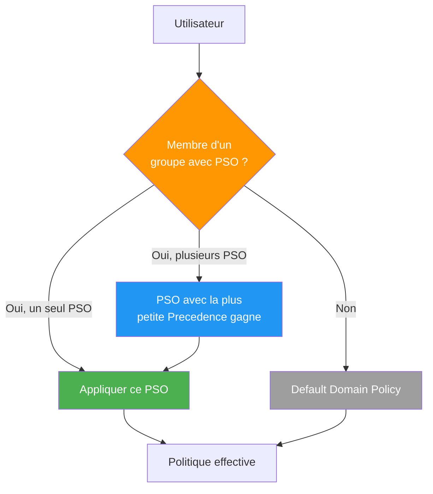

<!--
  Copyright 2026 Julien Bombled

  Licensed under the Apache License, Version 2.0 (the "License");
  you may not use this file except in compliance with the License.
  You may obtain a copy of the License at

      http://www.apache.org/licenses/LICENSE-2.0

  Unless required by applicable law or agreed to in writing, software
  distributed under the License is distributed on an "AS IS" BASIS,
  WITHOUT WARRANTIES OR CONDITIONS OF ANY KIND, either express or implied.
  See the License for the specific language governing permissions and
  limitations under the License.
-->

# Politiques de mot de passe granulaires (PSO)

<span class="level-advanced">Avance</span> · Temps estime : 25 minutes

!!! example "Analogie"

    La politique de mot de passe par defaut (GPO Default Domain Policy), c'est comme un **reglement interieur unique** pour tout l'immeuble : tout le monde a la meme serrure. Les **PSO** (Password Settings Objects), c'est comme installer des **niveaux de securite differents** par etage : le rez-de-chaussee (utilisateurs standards) a un digicode simple, les bureaux de direction (admins) ont un badge biometrique, et la salle des coffres (comptes de service) exige une cle a usage unique.

## Pourquoi des politiques granulaires ?

Par defaut, Active Directory n'autorise qu'**une seule** politique de mot de passe par domaine (celle de la Default Domain Policy). Les FGPP permettent de definir des exigences differentes :

| Population | Longueur min. | Complexite | Verrouillage | Age max. |
|---|---|---|---|---|
| Utilisateurs standards | 12 caracteres | Oui | 5 tentatives / 15 min | 90 jours |
| Administrateurs | 16 caracteres | Oui | 3 tentatives / 30 min | 60 jours |
| Comptes de service | 25 caracteres | Oui | 0 (jamais verrouille) | 365 jours |

## Fonctionnement



!!! info "Priorite (Precedence)"

    Quand un utilisateur est membre de plusieurs groupes avec des PSO differents, c'est le PSO avec la **valeur de precedence la plus basse** qui l'emporte (1 = priorite maximale).

## Prerequis

- Niveau fonctionnel du domaine : **Windows Server 2008** ou superieur
- Droits **Admins du domaine**
- Centre d'administration Active Directory (ADAC) ou PowerShell

## Methode 1 : Centre d'administration Active Directory (ADAC)

1. Ouvrez `dsac.exe` (Active Directory Administrative Center)
2. Naviguez vers **domaine** > **System** > **Password Settings Container**
3. Cliquez **New** > **Password Settings**
4. Configurez les parametres et ajoutez les groupes cibles dans **Directly Applies To**

## Methode 2 : PowerShell

### Creer un PSO pour les administrateurs

```powershell
# Create a strict PSO for administrators (precedence 10)
New-ADFineGrainedPasswordPolicy -Name "PSO-Admins" `
    -Precedence 10 `
    -MinPasswordLength 16 `
    -PasswordHistoryCount 24 `
    -ComplexityEnabled $true `
    -ReversibleEncryptionEnabled $false `
    -MaxPasswordAge "60.00:00:00" `
    -MinPasswordAge "1.00:00:00" `
    -LockoutThreshold 3 `
    -LockoutObservationWindow "00:30:00" `
    -LockoutDuration "00:30:00" `
    -Description "Strict password policy for domain administrators"
```

### Creer un PSO pour les utilisateurs standards

```powershell
# Create a standard PSO for regular users (precedence 20)
New-ADFineGrainedPasswordPolicy -Name "PSO-Users" `
    -Precedence 20 `
    -MinPasswordLength 12 `
    -PasswordHistoryCount 12 `
    -ComplexityEnabled $true `
    -ReversibleEncryptionEnabled $false `
    -MaxPasswordAge "90.00:00:00" `
    -MinPasswordAge "1.00:00:00" `
    -LockoutThreshold 5 `
    -LockoutObservationWindow "00:15:00" `
    -LockoutDuration "00:15:00" `
    -Description "Standard password policy for regular users"
```

### Creer un PSO pour les comptes de service

```powershell
# Create a PSO for service accounts (precedence 30, no lockout)
New-ADFineGrainedPasswordPolicy -Name "PSO-ServiceAccounts" `
    -Precedence 30 `
    -MinPasswordLength 25 `
    -PasswordHistoryCount 48 `
    -ComplexityEnabled $true `
    -ReversibleEncryptionEnabled $false `
    -MaxPasswordAge "365.00:00:00" `
    -MinPasswordAge "1.00:00:00" `
    -LockoutThreshold 0 `
    -Description "Long password, no lockout for service accounts"
```

### Appliquer les PSO aux groupes

```powershell
# Apply PSO to groups (not individual users)
Add-ADFineGrainedPasswordPolicySubject -Identity "PSO-Admins" `
    -Subjects "Domain Admins", "Enterprise Admins"

Add-ADFineGrainedPasswordPolicySubject -Identity "PSO-Users" `
    -Subjects "Domain Users"

Add-ADFineGrainedPasswordPolicySubject -Identity "PSO-ServiceAccounts" `
    -Subjects "grp-ServiceAccounts"
```

## Verification

```powershell
# List all PSOs in the domain
Get-ADFineGrainedPasswordPolicy -Filter * |
    Select-Object Name, Precedence, MinPasswordLength, MaxPasswordAge,
        LockoutThreshold |
    Sort-Object Precedence

# Check which PSO applies to a specific user
Get-ADUserResultantPasswordPolicy -Identity "admin.jbombled" |
    Select-Object Name, Precedence, MinPasswordLength

# List groups/users a PSO applies to
Get-ADFineGrainedPasswordPolicySubject -Identity "PSO-Admins"
```

## Scenario pratique

!!! example "Mise en conformite : 3 niveaux de securite"

    **Contexte** : L'audit de securite revele que tous les utilisateurs (y compris les admins du domaine) utilisent la meme politique de mot de passe : 8 caracteres, jamais de verrouillage. Vous devez mettre en place 3 niveaux.

    **Etapes** :

    1. Creez les 3 PSO (voir commandes ci-dessus)
    2. Creez un groupe pour les comptes de service si inexistant :

        ```powershell
        New-ADGroup -Name "grp-ServiceAccounts" -GroupScope Global `
            -GroupCategory Security -Path "OU=Groupes,DC=winopslab,DC=local"
        ```

    3. Appliquez les PSO aux groupes
    4. Verifiez la politique effective pour chaque type d'utilisateur :

        ```powershell
        # Standard user
        Get-ADUserResultantPasswordPolicy -Identity "u.standard"

        # Admin
        Get-ADUserResultantPasswordPolicy -Identity "admin.jbombled"
        ```

    5. Forcez le changement de mot de passe pour les admins :

        ```powershell
        Get-ADGroupMember "Domain Admins" |
            Set-ADUser -ChangePasswordAtLogon $true
        ```

??? success "Resultat attendu"

    - Les admins doivent changer leur mot de passe (16 car. minimum) a la prochaine connexion
    - Les utilisateurs standards gardent leur mot de passe actuel jusqu'a expiration (90 jours)
    - Les comptes de service ne sont jamais verrouilles

## Erreurs courantes

!!! failure "Le PSO ne s'applique pas a l'utilisateur"

    **Symptome** : `Get-ADUserResultantPasswordPolicy` ne retourne rien.

    **Cause** : Le PSO est applique directement a un utilisateur au lieu d'un groupe, ou l'utilisateur n'est pas membre du groupe cible.

    **Solution** : Appliquez toujours les PSO a des **groupes globaux de securite**, jamais directement a des utilisateurs.

!!! failure "Conflit de precedence entre PSO"

    **Symptome** : Un utilisateur membre de `Domain Admins` et `Domain Users` recoit la politique utilisateur standard au lieu de la politique admin.

    **Cause** : Le PSO utilisateur a une precedence plus basse (numeriquement) que le PSO admin.

    **Solution** : Verifiez les valeurs de precedence. Le PSO admin doit avoir la precedence la plus basse (ex: 10 vs 20).

!!! failure "La complexite est desactivee malgre le PSO"

    **Symptome** : Les utilisateurs peuvent creer des mots de passe sans complexite.

    **Cause** : Le parametre `ComplexityEnabled` n'a pas ete specifie lors de la creation du PSO (defaut: `$false`).

    **Solution** :

    ```powershell
    Set-ADFineGrainedPasswordPolicy -Identity "PSO-Users" -ComplexityEnabled $true
    ```

!!! failure "Impossible de creer un PSO : 'Insufficient access rights'"

    **Symptome** : La commande `New-ADFineGrainedPasswordPolicy` echoue avec une erreur d'acces.

    **Cause** : Seuls les membres de **Domain Admins** peuvent creer des PSO par defaut.

    **Solution** : Executez la commande avec un compte membre de Domain Admins, ou deleguez les droits sur le conteneur `CN=Password Settings Container,CN=System`.

## Pour aller plus loin

- :material-link: [Utilisateurs et groupes](utilisateurs-et-groupes.md) -- gestion des comptes et groupes AD
- :material-link: [Comptes privilegies](../../securite/durcissement/comptes-privilegies.md) -- protection des comptes a haut privilege
- :material-link: [Bonnes pratiques de durcissement](../../securite/durcissement/bonnes-pratiques.md) -- recommandations de securite generales
