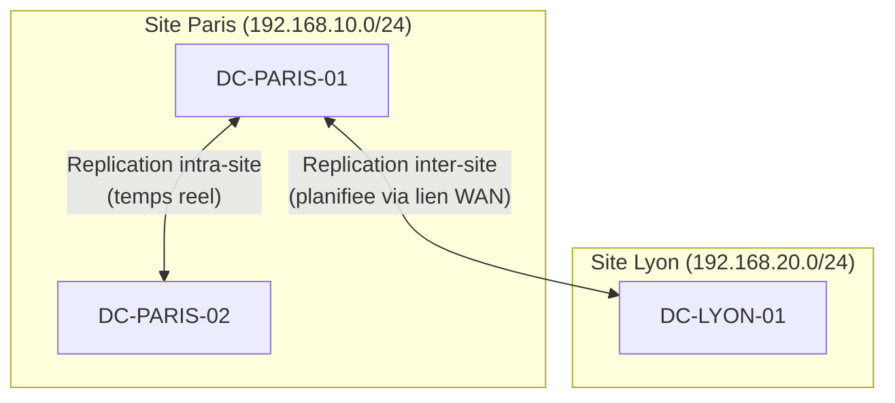

# Sites et replication

<span class="level-intermediate">Intermediaire</span> · Temps estime : 20 minutes

## Concept de site AD

!!! example "Analogie"

    Les sites AD fonctionnent comme un **reseau de bureaux de poste**. Dans une meme ville (site), le courrier interne est livre quasi instantanement (replication intra-site). Entre deux villes (sites differents), le courrier passe par un service de transport planifie (replication inter-site) : on attend le camion postal qui part a heures fixes pour optimiser les couts. Et quand un habitant poste une lettre, il va au bureau de poste de sa ville (DC le plus proche), pas a celui d'une autre ville.

Un **site Active Directory** represente un emplacement physique du reseau (bureau, datacenter, agence). Les sites permettent de :

- **Optimiser la replication** : repliquer rapidement intra-site, planifier inter-site
- **Diriger les clients** : un client s'authentifie sur le DC le plus proche
- **Controler le trafic** : limiter la bande passante utilisee entre sites



## Composants de la topologie

| Composant | Description |
|-----------|-------------|
| **Site** | Emplacement physique (un ou plusieurs sous-reseaux) |
| **Sous-reseau** | Plage IP associee a un site |
| **Site Link** | Connexion logique entre deux sites (definit le cout et la planification) |
| **Bridgehead Server** | DC qui gere la replication inter-sites |
| **KCC** | Knowledge Consistency Checker - genere automatiquement la topologie |

## Configuration des sites

### Creer un site

```powershell
# Create a new site
New-ADReplicationSite -Name "Lyon"

# Create a subnet and associate it with a site
New-ADReplicationSubnet -Name "192.168.20.0/24" -Site "Lyon"
New-ADReplicationSubnet -Name "192.168.10.0/24" -Site "Default-First-Site-Name"

# Rename the default site
Get-ADReplicationSite -Identity "Default-First-Site-Name" |
    Rename-ADObject -NewName "Paris"
```

Resultat :

```text
PS> Get-ADReplicationSite -Filter * | Select-Object Name

Name
----
Paris
Lyon

PS> Get-ADReplicationSubnet -Filter * | Select-Object Name, Site

Name              Site
----              ----
192.168.10.0/24   CN=Paris,CN=Sites,CN=Configuration,DC=lab,DC=local
192.168.20.0/24   CN=Lyon,CN=Sites,CN=Configuration,DC=lab,DC=local
```

### Configurer les liens de site

```powershell
# Create a site link between Paris and Lyon
New-ADReplicationSiteLink `
    -Name "Paris-Lyon" `
    -SitesIncluded "Paris", "Lyon" `
    -Cost 100 `
    -ReplicationFrequencyInMinutes 180

# Modify an existing site link
Set-ADReplicationSiteLink -Identity "Paris-Lyon" `
    -ReplicationFrequencyInMinutes 60 `
    -Cost 50
```

Resultat :

```text
PS> Get-ADReplicationSiteLink -Filter * | Select-Object Name, Cost, ReplicationFrequencyInMinutes, SitesIncluded

Name       Cost ReplicationFrequencyInMinutes SitesIncluded
----       ---- ---------------------------- -------------
Paris-Lyon   50                           60 {CN=Paris,CN=Sites..., CN=Lyon,CN=Sites...}
```

| Parametre | Description |
|-----------|-------------|
| **Cost** | Plus le cout est bas, plus le lien est prefere (defaut: 100) |
| **ReplicationFrequencyInMinutes** | Intervalle de replication (min: 15, defaut: 180) |
| **Schedule** | Plages horaires de replication autorisees |

### Associer un DC a un site

```powershell
# Move a DC to a specific site
Move-ADDirectoryServer -Identity "DC-LYON-01" -Site "Lyon"

# List DCs per site
Get-ADDomainController -Filter * |
    Select-Object Name, Site, IPv4Address |
    Sort-Object Site
```

Resultat :

```text
Name          Site   IPv4Address
----          ----   -----------
DC-LYON-01    Lyon   10.0.1.10
DC-01         Paris  10.0.0.10
DC-02         Paris  10.0.0.11
```

## Replication intra-site vs inter-site

| Critere | Intra-site | Inter-site |
|---------|:----------:|:----------:|
| Declenchement | Temps reel (~15 sec) | Planifie (defaut: 3h) |
| Compression | Non | Oui (economie bande passante) |
| Protocole | RPC | RPC ou SMTP (schema uniquement) |
| Notification | Oui | Non |
| Controle | Automatique (KCC) | Configurable |

## Diagnostics de replication

```powershell
# Check replication status
repadmin /replsummary

# Show replication partners
repadmin /showrepl

# Force replication between all DCs
repadmin /syncall /APed

# Force replication of a specific DC
repadmin /syncall DC-PARIS-01 /APed

# Show replication queue
repadmin /queue

# Test replication health
dcdiag /test:replications
```

Resultat (pour `repadmin /replsummary`) :

```text
Replication Summary Start Time: 2025-03-15 10:30:00

Beginning data collection for replication summary, this may take a while:
  Source DSA          largest delta    fails/total %%   error
  DC-01              02m:15s          0 /   5    0
  DC-02              03m:22s          0 /   5    0
  DC-LYON-01         45m:10s          0 /   5    0

  Destination DSA    largest delta    fails/total %%   error
  DC-01              03m:22s          0 /   5    0
  DC-02              02m:15s          0 /   5    0
  DC-LYON-01         45m:10s          0 /   5    0
```

## Points cles a retenir

- Un site = un emplacement physique avec ses sous-reseaux IP
- Les sites optimisent la replication et l'authentification des clients
- La replication intra-site est quasi instantanee, l'inter-site est planifiee
- `repadmin` et `dcdiag` sont les outils de diagnostic essentiels

!!! example "Scenario pratique"

    **Contexte :** Karim, administrateur reseau, ouvre un nouveau bureau a Lyon (sous-reseau `10.0.1.0/24`). Les 30 utilisateurs du bureau de Lyon se plaignent de lenteurs a l'ouverture de session. En analysant le trafic reseau, Karim constate que toute l'authentification passe par le lien WAN vers Paris.

    **Diagnostic :**

    ```powershell
    # Check if the Lyon subnet is associated to a site
    Get-ADReplicationSubnet -Filter * | Select-Object Name, Site

    # Check which DC clients are using
    nltest /dsgetdc:lab.local
    ```

    Resultat :

    ```text
    Name              Site
    ----              ----
    10.0.0.0/24       CN=Paris,CN=Sites,CN=Configuration,DC=lab,DC=local

    DC: \\DC-01.lab.local
    Address: \\10.0.0.10
    Dom GUID: a1b2c3d4-e5f6-7890-abcd-ef1234567890
    Dom Name: lab.local
    Forest Name: lab.local
    DC Site Name: Paris
    Our Site Name: Paris
    Flags: PDC GC DS LDAP KDC TIMESERV WRITABLE DNS_DC DNS_DOMAIN DNS_FOREST
    ```

    Le sous-reseau de Lyon n'est pas declare dans AD Sites and Services. Les clients de Lyon sont donc associes au site Paris et s'authentifient sur le DC de Paris via le WAN.

    **Solution :**

    ```powershell
    # Step 1: Create the Lyon site
    New-ADReplicationSite -Name "Lyon"

    # Step 2: Associate the subnet
    New-ADReplicationSubnet -Name "10.0.1.0/24" -Site "Lyon"

    # Step 3: Create the site link
    New-ADReplicationSiteLink -Name "Paris-Lyon" `
        -SitesIncluded "Paris", "Lyon" `
        -Cost 100 -ReplicationFrequencyInMinutes 60

    # Step 4: Deploy a DC in Lyon and move it to the correct site
    # (after installing AD DS and promoting DC-LYON-01)
    Move-ADDirectoryServer -Identity "DC-LYON-01" -Site "Lyon"

    # Step 5: Verify clients now use the local DC
    # On a Lyon client:
    nltest /dsgetdc:lab.local
    ```

    Resultat :

    ```text
    DC: \\DC-LYON-01.lab.local
    Address: \\10.0.1.10
    DC Site Name: Lyon
    Our Site Name: Lyon
    Flags: GC DS LDAP KDC TIMESERV WRITABLE DNS_DC DNS_DOMAIN DNS_FOREST
    ```

    Les utilisateurs de Lyon s'authentifient maintenant sur leur DC local. Les ouvertures de session sont instantanees.

!!! danger "Erreurs courantes"

    1. **Oublier d'associer les sous-reseaux aux sites** : sans association sous-reseau/site, les clients ne savent pas a quel site ils appartiennent et contactent un DC aleatoire, potentiellement distant via le WAN.

    2. **Laisser un seul DC dans un site distant** : si ce DC tombe en panne, tous les utilisateurs du site distant doivent s'authentifier via le WAN. Prevoyez au moins 2 DC par site critique.

    3. **Configurer un cout de lien trop bas sur une liaison WAN lente** : un cout faible indique a AD que le lien est rapide et fiable. Si la liaison WAN est lente, augmentez le cout pour eviter que la replication ne sature la bande passante.

    4. **Ne pas surveiller la replication** : des erreurs de replication silencieuses peuvent entrainer des incoherences entre les DC (mots de passe non synchronises, GPO differentes). Executez `repadmin /replsummary` regulierement.

    5. **Forcer la replication en permanence** : utiliser `repadmin /syncall /APed` de maniere repetee pendant un probleme peut aggraver la situation. Diagnostiquez d'abord la cause avec `dcdiag /test:replications` avant de forcer.

## Pour aller plus loin

- [Niveaux fonctionnels](niveaux-fonctionnels.md) - compatibilite inter-DC
- [Depannage DNS](../dns/depannage-dns.md) - resoudre les problemes DNS lies a la replication
