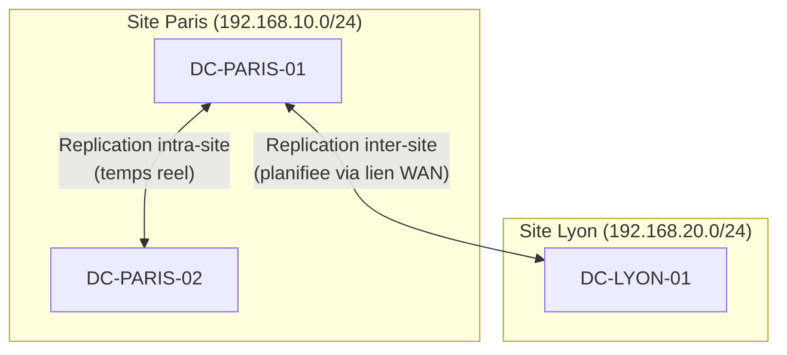

# Sites et replication

!!! info "Niveau : Intermediaire"

    Temps estime : 20 minutes

## Concept de site AD

Un **site Active Directory** represente un emplacement physique du reseau (bureau, datacenter, agence). Les sites permettent de :

- **Optimiser la replication** : repliquer rapidement intra-site, planifier inter-site
- **Diriger les clients** : un client s'authentifie sur le DC le plus proche
- **Controler le trafic** : limiter la bande passante utilisee entre sites



## Composants de la topologie

| Composant | Description |
|-----------|-------------|
| **Site** | Emplacement physique (un ou plusieurs sous-reseaux) |
| **Sous-reseau** | Plage IP associee a un site |
| **Site Link** | Connexion logique entre deux sites (definit le cout et la planification) |
| **Bridgehead Server** | DC qui gere la replication inter-sites |
| **KCC** | Knowledge Consistency Checker - genere automatiquement la topologie |

## Configuration des sites

### Creer un site

```powershell
# Create a new site
New-ADReplicationSite -Name "Lyon"

# Create a subnet and associate it with a site
New-ADReplicationSubnet -Name "192.168.20.0/24" -Site "Lyon"
New-ADReplicationSubnet -Name "192.168.10.0/24" -Site "Default-First-Site-Name"

# Rename the default site
Get-ADReplicationSite -Identity "Default-First-Site-Name" |
    Rename-ADObject -NewName "Paris"
```

### Configurer les liens de site

```powershell
# Create a site link between Paris and Lyon
New-ADReplicationSiteLink `
    -Name "Paris-Lyon" `
    -SitesIncluded "Paris", "Lyon" `
    -Cost 100 `
    -ReplicationFrequencyInMinutes 180

# Modify an existing site link
Set-ADReplicationSiteLink -Identity "Paris-Lyon" `
    -ReplicationFrequencyInMinutes 60 `
    -Cost 50
```

| Parametre | Description |
|-----------|-------------|
| **Cost** | Plus le cout est bas, plus le lien est prefere (defaut: 100) |
| **ReplicationFrequencyInMinutes** | Intervalle de replication (min: 15, defaut: 180) |
| **Schedule** | Plages horaires de replication autorisees |

### Associer un DC a un site

```powershell
# Move a DC to a specific site
Move-ADDirectoryServer -Identity "DC-LYON-01" -Site "Lyon"

# List DCs per site
Get-ADDomainController -Filter * |
    Select-Object Name, Site, IPv4Address |
    Sort-Object Site
```

## Replication intra-site vs inter-site

| Critere | Intra-site | Inter-site |
|---------|:----------:|:----------:|
| Declenchement | Temps reel (~15 sec) | Planifie (defaut: 3h) |
| Compression | Non | Oui (economie bande passante) |
| Protocole | RPC | RPC ou SMTP (schema uniquement) |
| Notification | Oui | Non |
| Controle | Automatique (KCC) | Configurable |

## Diagnostics de replication

```powershell
# Check replication status
repadmin /replsummary

# Show replication partners
repadmin /showrepl

# Force replication between all DCs
repadmin /syncall /APed

# Force replication of a specific DC
repadmin /syncall DC-PARIS-01 /APed

# Show replication queue
repadmin /queue

# Test replication health
dcdiag /test:replications
```

## Points cles a retenir

- Un site = un emplacement physique avec ses sous-reseaux IP
- Les sites optimisent la replication et l'authentification des clients
- La replication intra-site est quasi instantanee, l'inter-site est planifiee
- `repadmin` et `dcdiag` sont les outils de diagnostic essentiels

## Pour aller plus loin

- [Niveaux fonctionnels](niveaux-fonctionnels.md) - compatibilite inter-DC
- [Depannage DNS](../dns/depannage-dns.md) - resoudre les problemes DNS lies a la replication
