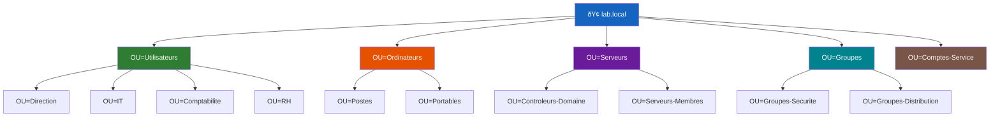

<!--
  Copyright 2026 Julien Bombled

  Licensed under the Apache License, Version 2.0 (the "License");
  you may not use this file except in compliance with the License.
  You may obtain a copy of the License at

      http://www.apache.org/licenses/LICENSE-2.0

  Unless required by applicable law or agreed to in writing, software
  distributed under the License is distributed on an "AS IS" BASIS,
  WITHOUT WARRANTIES OR CONDITIONS OF ANY KIND, either express or implied.
  See the License for the specific language governing permissions and
  limitations under the License.
-->
---
title: Structure des OU
description: Concevoir et gerer les unites d'organisation dans Active Directory.
tags:
  - active-directory
  - adds
  - intermediaire
---

# Structure des unites d'organisation (OU)

<span class="level-intermediate">Intermediaire</span> · Temps estime : 15 minutes

## Qu'est-ce qu'une OU ?

!!! example "Analogie"

    Une OU fonctionne comme les **tiroirs d'un classeur de bureau**. Le classeur est le domaine, et chaque tiroir (OU) regroupe un type de documents : un tiroir pour le personnel, un pour les equipements, un pour les contrats. Vous pouvez creer des sous-dossiers dans chaque tiroir pour affiner le rangement (sous-OU). Et surtout, vous pouvez confier la cle d'un tiroir specifique a un collegue (delegation) sans lui donner acces aux autres.

Une **OU** (Organizational Unit / Unite d'Organisation) est un conteneur dans Active Directory qui permet de :

- **Organiser** les objets (utilisateurs, ordinateurs, groupes) de maniere logique
- **Deleguer** l'administration a des equipes specifiques
- **Appliquer des GPO** a un ensemble d'objets

!!! note "OU vs Groupe"

    - Une **OU** est un conteneur pour organiser et appliquer des GPO
    - Un **groupe** est un ensemble de membres pour attribuer des permissions
    - Un utilisateur est **dans une seule OU** mais peut etre **membre de plusieurs groupes**

## Modeles de structure

### Vue d'ensemble d'une hierarchie type




### Par departement (recommande pour les PME)

```
lab.local
├── OU=Utilisateurs
│   ├── OU=Direction
│   ├── OU=Comptabilite
│   ├── OU=IT
│   ├── OU=Commercial
│   └── OU=RH
├── OU=Ordinateurs
│   ├── OU=Postes
│   ├── OU=Portables
│   └── OU=Kiosques
├── OU=Serveurs
│   ├── OU=Controleurs-Domaine
│   └── OU=Serveurs-Membres
├── OU=Groupes
│   ├── OU=Groupes-Securite
│   └── OU=Groupes-Distribution
└── OU=Comptes-Service
```

### Par site geographique (pour les grandes organisations)

```
lab.local
├── OU=Paris
│   ├── OU=Utilisateurs
│   ├── OU=Ordinateurs
│   └── OU=Groupes
├── OU=Lyon
│   ├── OU=Utilisateurs
│   ├── OU=Ordinateurs
│   └── OU=Groupes
└── OU=Global
    ├── OU=Serveurs
    ├── OU=Comptes-Service
    └── OU=Groupes-Globaux
```

## Creer des OU

=== "PowerShell"

    ```powershell
    # Create top-level OUs
    New-ADOrganizationalUnit -Name "Utilisateurs" -Path "DC=lab,DC=local" -ProtectedFromAccidentalDeletion $true
    New-ADOrganizationalUnit -Name "Ordinateurs" -Path "DC=lab,DC=local" -ProtectedFromAccidentalDeletion $true
    New-ADOrganizationalUnit -Name "Serveurs" -Path "DC=lab,DC=local" -ProtectedFromAccidentalDeletion $true
    New-ADOrganizationalUnit -Name "Groupes" -Path "DC=lab,DC=local" -ProtectedFromAccidentalDeletion $true

    # Create sub-OUs
    New-ADOrganizationalUnit -Name "IT" -Path "OU=Utilisateurs,DC=lab,DC=local"
    New-ADOrganizationalUnit -Name "Comptabilite" -Path "OU=Utilisateurs,DC=lab,DC=local"
    New-ADOrganizationalUnit -Name "Postes" -Path "OU=Ordinateurs,DC=lab,DC=local"
    New-ADOrganizationalUnit -Name "Portables" -Path "OU=Ordinateurs,DC=lab,DC=local"

    # List all OUs
    Get-ADOrganizationalUnit -Filter * | Select-Object Name, DistinguishedName
    ```

    Resultat :

    ```text
    Name                DistinguishedName
    ----                -----------------
    Domain Controllers  OU=Domain Controllers,DC=lab,DC=local
    Utilisateurs        OU=Utilisateurs,DC=lab,DC=local
    Ordinateurs         OU=Ordinateurs,DC=lab,DC=local
    Serveurs            OU=Serveurs,DC=lab,DC=local
    Groupes             OU=Groupes,DC=lab,DC=local
    IT                  OU=IT,OU=Utilisateurs,DC=lab,DC=local
    Comptabilite        OU=Comptabilite,OU=Utilisateurs,DC=lab,DC=local
    Postes              OU=Postes,OU=Ordinateurs,DC=lab,DC=local
    Portables           OU=Portables,OU=Ordinateurs,DC=lab,DC=local
    ```

=== "GUI (dsa.msc)"

    1. Ouvrir **Active Directory Users and Computers** (`dsa.msc`)
    2. Clic droit sur le domaine > **New** > **Organizational Unit**
    3. Saisir le nom de l'OU
    4. Cocher **Protect object from accidental deletion**

## Protection contre la suppression accidentelle

Par defaut, la protection est activee. Pour voir ou modifier :

```powershell
# Check protection status
Get-ADOrganizationalUnit -Filter * |
    Select-Object Name, ProtectedFromAccidentalDeletion

# To delete a protected OU, first disable protection
Set-ADOrganizationalUnit -Identity "OU=Test,DC=lab,DC=local" -ProtectedFromAccidentalDeletion $false
Remove-ADOrganizationalUnit -Identity "OU=Test,DC=lab,DC=local" -Confirm:$false
```

Resultat :

```text
Name               ProtectedFromAccidentalDeletion
----               -------------------------------
Domain Controllers                            True
Utilisateurs                                  True
Ordinateurs                                   True
Serveurs                                      True
Groupes                                       True
IT                                           False
Comptabilite                                 False
Postes                                       False
Portables                                    False
```

!!! tip "Voir les OU protegees dans la GUI"

    Dans `dsa.msc`, activez **View** > **Advanced Features** pour voir
    l'onglet **Object** avec la case de protection.

## Delegation d'administration

L'un des avantages majeurs des OU est la delegation :

```powershell
# Delegate password reset rights to the HelpDesk group on the Users OU
# This is typically done via the GUI wizard:
# Right-click on OU > Delegate Control > select group > select tasks
```

=== "GUI"

    1. Clic droit sur l'OU > **Delegate Control**
    2. Selectionner le groupe qui recevra les droits (ex: `GRP-Helpdesk`)
    3. Choisir les taches a deleguer :
        - Reset user passwords
        - Read all user information
        - Create, delete and manage user accounts

## Bonnes pratiques

!!! tip "Regles de conception"

    1. **Ne jamais utiliser les conteneurs par defaut** (`Users`, `Computers`)
       car les GPO ne peuvent pas etre liees directement a ces conteneurs
    2. **Creer des OU dediees** des le depart pour les utilisateurs, ordinateurs, groupes
    3. **Activer la protection** contre la suppression accidentelle
    4. **Rediriger les comptes par defaut** vers vos OU personnalisees :

    ```powershell
    # Redirect default computer container to your OU
    redircmp "OU=Ordinateurs,DC=lab,DC=local"

    # Redirect default user container to your OU
    redirusr "OU=Utilisateurs,DC=lab,DC=local"
    ```

## Points cles a retenir

- Les OU servent a organiser, deleguer et appliquer des GPO
- Creez vos propres OU plutot que d'utiliser les conteneurs par defaut
- Protegez les OU contre la suppression accidentelle
- Concevez la structure selon vos besoins d'administration et de GPO

!!! example "Scenario pratique"

    **Contexte :** Claire, administratrice AD chez une PME de 80 personnes, constate que toutes les GPO sont appliquees au domaine entier. Le service comptabilite se plaint que la restriction d'acces a Internet (destinee aux postes d'accueil) leur est aussi appliquee. En verifiant, Claire decouvre que tous les utilisateurs et ordinateurs sont dans les conteneurs par defaut `Users` et `Computers`.

    **Diagnostic :**

    ```powershell
    # Check where users are located
    Get-ADUser -Filter * | Group-Object { ($_.DistinguishedName -split ',',2)[1] } |
        Select-Object Count, Name
    ```

    Resultat :

    ```text
    Count Name
    ----- ----
       12 CN=Users,DC=lab,DC=local
       68 CN=Users,DC=lab,DC=local
    ```

    Tous les comptes sont dans le conteneur par defaut `CN=Users` qui ne supporte pas le lien direct de GPO.

    **Solution :**

    ```powershell
    # Step 1: Create the OU structure
    New-ADOrganizationalUnit -Name "Utilisateurs" -Path "DC=lab,DC=local" -ProtectedFromAccidentalDeletion $true
    New-ADOrganizationalUnit -Name "Comptabilite" -Path "OU=Utilisateurs,DC=lab,DC=local"
    New-ADOrganizationalUnit -Name "Accueil" -Path "OU=Utilisateurs,DC=lab,DC=local"

    # Step 2: Move accounting users to their OU
    Get-ADUser -Filter { Department -eq "Comptabilite" } | ForEach-Object {
        Move-ADObject -Identity $_.DistinguishedName -TargetPath "OU=Comptabilite,OU=Utilisateurs,DC=lab,DC=local"
    }

    # Step 3: Redirect the default container for future users
    redirusr "OU=Utilisateurs,DC=lab,DC=local"
    ```

    Claire peut maintenant lier la GPO de restriction Internet uniquement a l'OU `Accueil`, sans affecter la comptabilite.

!!! danger "Erreurs courantes"

    1. **Laisser les objets dans les conteneurs par defaut** (`CN=Users`, `CN=Computers`) : ces conteneurs ne supportent pas le lien direct de GPO, ce qui empeche un ciblage precis des strategies de groupe.

    2. **Creer une structure trop profonde** : plus de 3-4 niveaux d'imbrication rend l'administration complexe et ralentit les requetes LDAP. Gardez une hierarchie simple et lisible.

    3. **Oublier la protection contre la suppression** : sans l'option `ProtectedFromAccidentalDeletion`, un clic malheureux peut supprimer une OU et tous ses objets enfants (utilisateurs, ordinateurs, groupes).

    4. **Confondre OU et groupe de securite** : les OU servent a organiser et appliquer des GPO, les groupes servent a attribuer des permissions. Un utilisateur est dans une seule OU mais peut etre membre de plusieurs groupes.

## Pour aller plus loin

- [Utilisateurs et groupes](utilisateurs-et-groupes.md) - peupler les OU
- [GPO - Concepts](../gpo/concepts-gpo.md) - appliquer des strategies aux OU

