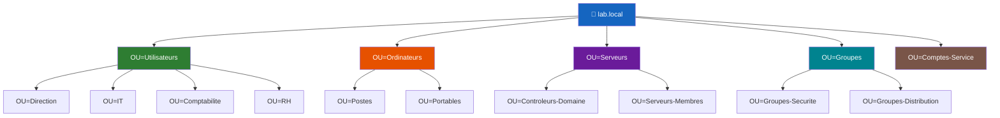

# Structure des unites d'organisation (OU)

<span class="level-intermediate">Intermediaire</span> · Temps estime : 15 minutes

## Qu'est-ce qu'une OU ?

Une **OU** (Organizational Unit / Unite d'Organisation) est un conteneur dans Active Directory qui permet de :

- **Organiser** les objets (utilisateurs, ordinateurs, groupes) de maniere logique
- **Deleguer** l'administration a des equipes specifiques
- **Appliquer des GPO** a un ensemble d'objets

!!! note "OU vs Groupe"

    - Une **OU** est un conteneur pour organiser et appliquer des GPO
    - Un **groupe** est un ensemble de membres pour attribuer des permissions
    - Un utilisateur est **dans une seule OU** mais peut etre **membre de plusieurs groupes**

## Modeles de structure

### Vue d'ensemble d'une hierarchie type



### Par departement (recommande pour les PME)

```
lab.local
├── OU=Utilisateurs
│   ├── OU=Direction
│   ├── OU=Comptabilite
│   ├── OU=IT
│   ├── OU=Commercial
│   └── OU=RH
├── OU=Ordinateurs
│   ├── OU=Postes
│   ├── OU=Portables
│   └── OU=Kiosques
├── OU=Serveurs
│   ├── OU=Controleurs-Domaine
│   └── OU=Serveurs-Membres
├── OU=Groupes
│   ├── OU=Groupes-Securite
│   └── OU=Groupes-Distribution
└── OU=Comptes-Service
```

### Par site geographique (pour les grandes organisations)

```
lab.local
├── OU=Paris
│   ├── OU=Utilisateurs
│   ├── OU=Ordinateurs
│   └── OU=Groupes
├── OU=Lyon
│   ├── OU=Utilisateurs
│   ├── OU=Ordinateurs
│   └── OU=Groupes
└── OU=Global
    ├── OU=Serveurs
    ├── OU=Comptes-Service
    └── OU=Groupes-Globaux
```

## Creer des OU

=== "PowerShell"

    ```powershell
    # Create top-level OUs
    New-ADOrganizationalUnit -Name "Utilisateurs" -Path "DC=lab,DC=local" -ProtectedFromAccidentalDeletion $true
    New-ADOrganizationalUnit -Name "Ordinateurs" -Path "DC=lab,DC=local" -ProtectedFromAccidentalDeletion $true
    New-ADOrganizationalUnit -Name "Serveurs" -Path "DC=lab,DC=local" -ProtectedFromAccidentalDeletion $true
    New-ADOrganizationalUnit -Name "Groupes" -Path "DC=lab,DC=local" -ProtectedFromAccidentalDeletion $true

    # Create sub-OUs
    New-ADOrganizationalUnit -Name "IT" -Path "OU=Utilisateurs,DC=lab,DC=local"
    New-ADOrganizationalUnit -Name "Comptabilite" -Path "OU=Utilisateurs,DC=lab,DC=local"
    New-ADOrganizationalUnit -Name "Postes" -Path "OU=Ordinateurs,DC=lab,DC=local"
    New-ADOrganizationalUnit -Name "Portables" -Path "OU=Ordinateurs,DC=lab,DC=local"

    # List all OUs
    Get-ADOrganizationalUnit -Filter * | Select-Object Name, DistinguishedName
    ```

=== "GUI (dsa.msc)"

    1. Ouvrir **Active Directory Users and Computers** (`dsa.msc`)
    2. Clic droit sur le domaine > **New** > **Organizational Unit**
    3. Saisir le nom de l'OU
    4. Cocher **Protect object from accidental deletion**

## Protection contre la suppression accidentelle

Par defaut, la protection est activee. Pour voir ou modifier :

```powershell
# Check protection status
Get-ADOrganizationalUnit -Filter * |
    Select-Object Name, ProtectedFromAccidentalDeletion

# To delete a protected OU, first disable protection
Set-ADOrganizationalUnit -Identity "OU=Test,DC=lab,DC=local" -ProtectedFromAccidentalDeletion $false
Remove-ADOrganizationalUnit -Identity "OU=Test,DC=lab,DC=local" -Confirm:$false
```

!!! tip "Voir les OU protegees dans la GUI"

    Dans `dsa.msc`, activez **View** > **Advanced Features** pour voir
    l'onglet **Object** avec la case de protection.

## Delegation d'administration

L'un des avantages majeurs des OU est la delegation :

```powershell
# Delegate password reset rights to the HelpDesk group on the Users OU
# This is typically done via the GUI wizard:
# Right-click on OU > Delegate Control > select group > select tasks
```

=== "GUI"

    1. Clic droit sur l'OU > **Delegate Control**
    2. Selectionner le groupe qui recevra les droits (ex: `GRP-Helpdesk`)
    3. Choisir les taches a deleguer :
        - Reset user passwords
        - Read all user information
        - Create, delete and manage user accounts

## Bonnes pratiques

!!! tip "Regles de conception"

    1. **Ne jamais utiliser les conteneurs par defaut** (`Users`, `Computers`)
       car les GPO ne peuvent pas etre liees directement a ces conteneurs
    2. **Creer des OU dediees** des le depart pour les utilisateurs, ordinateurs, groupes
    3. **Activer la protection** contre la suppression accidentelle
    4. **Rediriger les comptes par defaut** vers vos OU personnalisees :

    ```powershell
    # Redirect default computer container to your OU
    redircmp "OU=Ordinateurs,DC=lab,DC=local"

    # Redirect default user container to your OU
    redirusr "OU=Utilisateurs,DC=lab,DC=local"
    ```

## Points cles a retenir

- Les OU servent a organiser, deleguer et appliquer des GPO
- Creez vos propres OU plutot que d'utiliser les conteneurs par defaut
- Protegez les OU contre la suppression accidentelle
- Concevez la structure selon vos besoins d'administration et de GPO

## Pour aller plus loin

- [Utilisateurs et groupes](utilisateurs-et-groupes.md) - peupler les OU
- [GPO - Concepts](../gpo/concepts-gpo.md) - appliquer des strategies aux OU
