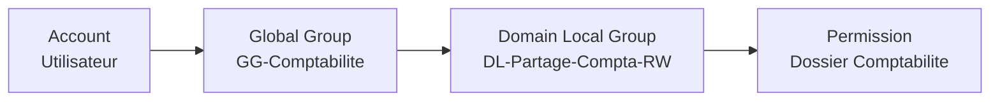

# Utilisateurs et groupes

<span class="level-intermediate">Intermediaire</span> · Temps estime : 25 minutes

## Comptes utilisateurs

### Creer un utilisateur

=== "PowerShell"

    ```powershell
    # Create a single user
    New-ADUser `
        -Name "Jean Dupont" `
        -GivenName "Jean" `
        -Surname "Dupont" `
        -SamAccountName "jdupont" `
        -UserPrincipalName "jdupont@lab.local" `
        -Path "OU=IT,OU=Utilisateurs,DC=lab,DC=local" `
        -AccountPassword (ConvertTo-SecureString "P@ssw0rd!" -AsPlainText -Force) `
        -Enabled $true `
        -ChangePasswordAtLogon $true

    # Create multiple users from a CSV file
    Import-Csv -Path "C:\Temp\users.csv" | ForEach-Object {
        New-ADUser `
            -Name "$($_.Prenom) $($_.Nom)" `
            -GivenName $_.Prenom `
            -Surname $_.Nom `
            -SamAccountName $_.Login `
            -UserPrincipalName "$($_.Login)@lab.local" `
            -Path $_.OU `
            -AccountPassword (ConvertTo-SecureString $_.Password -AsPlainText -Force) `
            -Enabled $true
    }
    ```

=== "GUI (dsa.msc)"

    1. Ouvrir `dsa.msc`
    2. Naviguer vers l'OU cible
    3. Clic droit > **New** > **User**
    4. Remplir les champs (prenom, nom, login)
    5. Definir le mot de passe et les options

### Gerer un utilisateur

```powershell
# Find a user
Get-ADUser -Identity "jdupont"
Get-ADUser -Filter "Surname -eq 'Dupont'"
Get-ADUser -Filter * -SearchBase "OU=IT,OU=Utilisateurs,DC=lab,DC=local"

# Display all properties
Get-ADUser -Identity "jdupont" -Properties *

# Modify properties
Set-ADUser -Identity "jdupont" `
    -Title "Administrateur Systeme" `
    -Department "IT" `
    -Office "Paris" `
    -EmailAddress "jdupont@lab.local"

# Disable a user account
Disable-ADAccount -Identity "jdupont"

# Unlock a locked account
Unlock-ADAccount -Identity "jdupont"

# Reset a password
Set-ADAccountPassword -Identity "jdupont" `
    -NewPassword (ConvertTo-SecureString "NewP@ss2024!" -AsPlainText -Force) `
    -Reset

# Move to another OU
Move-ADObject -Identity "CN=Jean Dupont,OU=IT,OU=Utilisateurs,DC=lab,DC=local" `
    -TargetPath "OU=Comptabilite,OU=Utilisateurs,DC=lab,DC=local"

# Delete a user
Remove-ADUser -Identity "jdupont" -Confirm:$false
```

## Groupes

### Types de groupes

| Type | Usage | Peut contenir |
|------|-------|---------------|
| **Securite** | Attribuer des permissions | Utilisateurs, ordinateurs, autres groupes |
| **Distribution** | Listes de diffusion email | Utilisateurs (pas de permissions) |

### Etendues de groupes

| Etendue | Membres possibles | Permissions sur |
|---------|-------------------|----------------|
| **Domain Local** | Tous les domaines de la foret | Ressources du domaine local |
| **Global** | Meme domaine uniquement | Tous les domaines de la foret |
| **Universal** | Tous les domaines de la foret | Tous les domaines de la foret |

### Strategie AGDLP

La methode **AGDLP** est la bonne pratique Microsoft pour attribuer les permissions :



| Lettre | Signification | Exemple |
|--------|---------------|---------|
| **A** | Account (compte utilisateur) | Jean Dupont |
| **G** | Global Group (par departement/role) | GG-Comptabilite |
| **DL** | Domain Local Group (par ressource) | DL-Partage-Compta-RW |
| **P** | Permission (sur la ressource) | Lecture/Ecriture sur \\\\SRV-FS\\Compta |

!!! tip "Pourquoi AGDLP ?"

    - Les groupes globaux representent **qui** (les personnes par role)
    - Les groupes domain local representent **quoi** (l'acces a une ressource)
    - Quand un utilisateur change de departement, on le deplace entre groupes globaux
    - Quand les permissions changent, on modifie le groupe domain local

### Gerer les groupes

```powershell
# Create a security group (Global scope)
New-ADGroup `
    -Name "GG-IT" `
    -GroupScope Global `
    -GroupCategory Security `
    -Path "OU=Groupes,DC=lab,DC=local" `
    -Description "Global group for IT department"

# Create a domain local group
New-ADGroup `
    -Name "DL-Partage-IT-RW" `
    -GroupScope DomainLocal `
    -GroupCategory Security `
    -Path "OU=Groupes,DC=lab,DC=local" `
    -Description "Read/Write access to IT share"

# Add members to a group
Add-ADGroupMember -Identity "GG-IT" -Members "jdupont", "mmartin"

# Add a global group to a domain local group (AGDLP)
Add-ADGroupMember -Identity "DL-Partage-IT-RW" -Members "GG-IT"

# List group members
Get-ADGroupMember -Identity "GG-IT" | Select-Object Name, SamAccountName

# List groups of a user
Get-ADPrincipalGroupMembership -Identity "jdupont" | Select-Object Name

# Remove a member from a group
Remove-ADGroupMember -Identity "GG-IT" -Members "jdupont" -Confirm:$false
```

### Convention de nommage des groupes

| Prefixe | Etendue | Exemple |
|---------|---------|---------|
| `GG-` | Global Group | `GG-Comptabilite` |
| `DL-` | Domain Local | `DL-Partage-Compta-RW` |
| `GU-` | Universal Group | `GU-All-Managers` |
| `GD-` | Distribution Group | `GD-Newsletter` |

Les suffixes indiquent le niveau d'acces :

| Suffixe | Permission |
|---------|-----------|
| `-RO` | Read Only (lecture seule) |
| `-RW` | Read Write (lecture/ecriture) |
| `-FC` | Full Control (controle total) |

## Groupes integres importants

| Groupe | Role |
|--------|------|
| Domain Admins | Administrateurs du domaine |
| Enterprise Admins | Administrateurs de la foret |
| Domain Users | Tous les utilisateurs du domaine |
| Domain Computers | Tous les ordinateurs du domaine |
| Schema Admins | Modification du schema AD |

!!! danger "Securite des groupes privilegies"

    Limitez au strict minimum les membres de **Domain Admins** et **Enterprise Admins**.
    Utilisez des comptes d'administration dedies, jamais les comptes utilisateurs quotidiens.

## Points cles a retenir

- Les comptes utilisateurs representent les personnes ou services
- Les groupes de securite attribuent les permissions (methode AGDLP)
- Global Groups = par role/departement, Domain Local = par ressource
- Adoptez une convention de nommage claire et coherente
- Limitez les membres des groupes privilegies

## Pour aller plus loin

- [Comptes ordinateurs](comptes-ordinateurs.md) - jonction au domaine
- [GPO - Filtrage](../gpo/filtrage-et-heritage.md) - appliquer des GPO par groupe
- [Comptes privilegies](../../securite/durcissement/comptes-privilegies.md) - securite des admins
