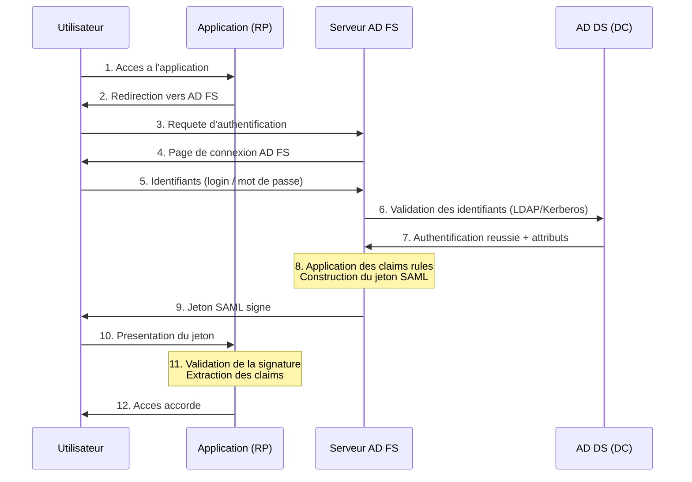
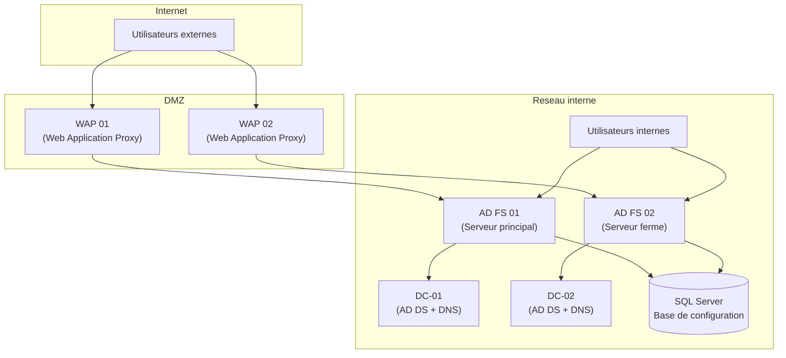
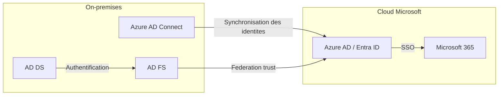

<!--
  Copyright 2026 Julien Bombled

  Licensed under the Apache License, Version 2.0 (the "License");
  you may not use this file except in compliance with the License.
  You may obtain a copy of the License at

      http://www.apache.org/licenses/LICENSE-2.0

  Unless required by applicable law or agreed to in writing, software
  distributed under the License is distributed on an "AS IS" BASIS,
  WITHOUT WARRANTIES OR CONDITIONS OF ANY KIND, either express or implied.
  See the License for the specific language governing permissions and
  limitations under the License.
-->

# Concepts et deploiement AD FS

<span class="level-advanced">Avance</span> · Temps estime : 40 minutes

La federation d'identite permet aux utilisateurs de s'authentifier aupres de services externes (applications SaaS, partenaires, cloud) en utilisant leurs identifiants Active Directory internes. **AD FS** (Active Directory Federation Services) est le role Windows Server qui rend cela possible via le protocole SAML, WS-Federation et OAuth/OpenID Connect.

---

## Pourquoi la federation d'identite ?

!!! example "Analogie"

    Imaginez un **passeport**. Votre pays d'origine (Active Directory) vous delivre un passeport (jeton de securite) qui atteste votre identite. Lorsque vous voyagez a l'etranger (application SaaS, partenaire), le pays d'accueil (Relying Party) ne vous demande pas de creer un nouveau compte citoyen : il fait confiance a votre passeport grace a un accord bilateral (federation trust). AD FS joue le role de l'autorite qui delivre et valide ces passeports numeriques.

Sans federation, chaque application externe necessite un compte local distinct. Cela engendre :

- **Multiplication des mots de passe** : les utilisateurs gèrent des dizaines de comptes
- **Risques de securite** : mots de passe faibles ou reutilises
- **Charge administrative** : provisioning et deprovisioning manuels
- **Mauvaise experience utilisateur** : connexions repetitives

La federation resout ces problemes via le **Single Sign-On (SSO)** : une seule authentification dans Active Directory donne acces a toutes les applications federees.

---

## Authentification basee sur les claims

AD FS utilise un modele d'authentification **base sur les claims** (revendications). Contrairement a l'authentification Windows integree (Kerberos/NTLM), les claims sont des assertions portables qui voyagent dans des jetons de securite.

### Vocabulaire essentiel

| Terme | Definition |
|-------|------------|
| **Claim (revendication)** | Information sur l'utilisateur (nom, email, groupe, role) transmise dans le jeton |
| **Claims Provider** | Source d'identite qui authentifie l'utilisateur (AD DS dans la plupart des cas) |
| **Relying Party (RP)** | Application ou service qui fait confiance a AD FS pour authentifier ses utilisateurs |
| **Relying Party Trust** | Configuration dans AD FS qui definit la relation de confiance avec une application |
| **Claims Provider Trust** | Configuration qui definit la relation avec une source d'identite |
| **Token (jeton)** | Document XML signe contenant les claims, emis par AD FS apres authentification |
| **Issuance Transform Rules** | Regles qui determinent quels claims sont inclus dans le jeton pour une RP donnee |

### Types de claims courants

| Type de claim | URI | Exemple |
|---------------|-----|---------|
| UPN | `http://schemas.xmlsoap.org/ws/2005/05/identity/claims/upn` | `jdupont@lab.local` |
| E-mail | `http://schemas.xmlsoap.org/ws/2005/05/identity/claims/emailaddress` | `jean.dupont@lab.local` |
| Name | `http://schemas.xmlsoap.org/ws/2005/05/identity/claims/name` | `Jean Dupont` |
| Role / Group | `http://schemas.microsoft.com/ws/2008/06/identity/claims/role` | `GRP-AppUsers` |
| Name ID | `http://schemas.xmlsoap.org/ws/2005/05/identity/claims/nameidentifier` | `jdupont` |

---

## Flux d'authentification AD FS

Le diagramme suivant illustre le flux complet d'une authentification federee initiee par une application (SP-Initiated SSO) :



**Points cles du flux :**

- L'utilisateur ne transmet **jamais** son mot de passe a l'application externe
- Le jeton est **signe numeriquement** par AD FS, ce qui garantit son integrite
- L'application verifie la signature avec le **certificat public** d'AD FS
- Les claims sont **personnalisables** : AD FS peut transformer les attributs AD en claims adaptes a chaque application

---

## Architecture AD FS

Une infrastructure AD FS de production comprend plusieurs composants :



### Composants de l'architecture

| Composant | Role | Recommandation |
|-----------|------|----------------|
| **Serveur AD FS** | Emet les jetons, gere les trusts et les claims rules | Minimum 2 serveurs en ferme pour la haute disponibilite |
| **Web Application Proxy (WAP)** | Reverse proxy en DMZ qui publie AD FS vers Internet | Minimum 2 pour la redondance, jamais joint au domaine |
| **AD DS (DC)** | Source d'identite, valide les identifiants | Au moins 2 DC dans le domaine |
| **SQL Server** | Stocke la configuration de la ferme AD FS | Optionnel : WID (Windows Internal Database) suffit pour les petites fermes (max 5 serveurs) |
| **Certificat SSL** | Certificat pour le nom du service de federation (ex: `sts.lab.local`) | Certificat emis par une CA de confiance, SAN incluant le nom du service |

!!! warning "WID vs SQL Server"

    La **Windows Internal Database** (WID) est integree et gratuite, mais ne supporte pas plus de 5 serveurs AD FS et ne permet pas la resolution de jetons SAML. Pour les environnements de production avec plus de 5 serveurs ou des besoins avances, utilisez **SQL Server**.

---

## Installation du role AD FS

### Prerequis

Avant d'installer AD FS, verifiez les elements suivants :

- Un domaine Active Directory fonctionnel
- Un compte de service gMSA (Group Managed Service Account) ou un compte de service dedie
- Un certificat SSL pour le nom du service de federation
- Resolution DNS interne et externe du nom du service

### Installation via PowerShell

```powershell
# Install the AD FS role on the server
Install-WindowsFeature -Name ADFS-Federation -IncludeManagementTools

# Verify the installation
Get-WindowsFeature -Name ADFS-Federation
```

Resultat :

```text
Display Name                                            Name                       Install State
------------                                            ----                       -------------
[X] Active Directory Federation Services                ADFS-Federation            Installed
```

### Creation du compte de service gMSA

```powershell
# On the domain controller: create the KDS root key (if not already done)
# In production, remove the -EffectiveImmediately parameter and wait 10 hours
Add-KdsRootKey -EffectiveImmediately

# Create the gMSA account for AD FS
New-ADServiceAccount -Name "svc-adfs" `
    -DNSHostName "svc-adfs.lab.local" `
    -PrincipalsAllowedToRetrieveManagedPassword "ADFS-Servers$" `
    -KerberosEncryptionType AES128, AES256

# Verify the gMSA account
Get-ADServiceAccount -Identity "svc-adfs"
```

Resultat :

```text
DistinguishedName : CN=svc-adfs,CN=Managed Service Accounts,DC=lab,DC=local
Enabled           : True
Name              : svc-adfs
ObjectClass       : msDS-GroupManagedServiceAccount
SamAccountName    : svc-adfs$
```

!!! tip "Pourquoi un gMSA ?"

    Un **Group Managed Service Account** offre une rotation automatique du mot de passe (tous les 30 jours par defaut) et elimine la gestion manuelle des mots de passe de service. C'est la methode recommandee par Microsoft pour les comptes de service AD FS.

---

## Configuration du service de federation

### Premier serveur de la ferme

```powershell
# Import the SSL certificate (if not already in the store)
$certThumbprint = (Get-ChildItem -Path Cert:\LocalMachine\My |
    Where-Object { $_.Subject -match "sts.lab.local" }).Thumbprint

# Configure the first AD FS server in the farm
Install-AdfsFarm `
    -CertificateThumbprint $certThumbprint `
    -FederationServiceDisplayName "Lab Federation Service" `
    -FederationServiceName "sts.lab.local" `
    -GroupServiceAccountIdentifier "LAB\svc-adfs$"
```

Resultat :

```text
Message                                   Context              Status
-------                                   -------              ------
The configuration completed successfully. DeploymentSucceeded  Success
```

### Ajout d'un serveur supplementaire a la ferme

```powershell
# On the secondary AD FS server
Install-WindowsFeature -Name ADFS-Federation -IncludeManagementTools

# Join the existing farm
Add-AdfsFarmNode `
    -CertificateThumbprint $certThumbprint `
    -GroupServiceAccountIdentifier "LAB\svc-adfs$" `
    -PrimaryComputerName "ADFS-01.lab.local"
```

### Verification du service

```powershell
# Check AD FS service status
Get-Service -Name adfssrv

# Verify federation service properties
Get-AdfsProperties | Select-Object HostName, FederationServiceDisplayName, Identifier
```

Resultat :

```text
Status   Name     DisplayName
------   ----     -----------
Running  adfssrv  Active Directory Federation Services

HostName                  FederationServiceDisplayName  Identifier
--------                  ---------------------------  ----------
sts.lab.local             Lab Federation Service       http://sts.lab.local/adfs/services/trust
```

---

## Configuration des Relying Party Trusts

Un **Relying Party Trust** definit la relation de confiance entre AD FS et une application. Il contient l'identifiant de l'application, les endpoints et les regles de claims.

### Ajout d'un Relying Party Trust

```powershell
# Add a Relying Party Trust using federation metadata URL
Add-AdfsRelyingPartyTrust `
    -Name "Application CRM Partenaire" `
    -MetadataUrl "https://crm.partenaire.com/FederationMetadata/2007-06/FederationMetadata.xml"

# Or manually, specifying the identifier and endpoints
Add-AdfsRelyingPartyTrust `
    -Name "Application RH SaaS" `
    -Identifier "https://rh.saas-provider.com" `
    -SamlEndpoint (New-AdfsSamlEndpoint -Binding POST `
        -Protocol SAMLAssertionConsumer `
        -Uri "https://rh.saas-provider.com/saml/acs") `
    -SignatureAlgorithm "http://www.w3.org/2001/04/xmldsig-more#rsa-sha256"

# List all configured Relying Party Trusts
Get-AdfsRelyingPartyTrust | Select-Object Name, Identifier, Enabled
```

Resultat :

```text
Name                      Identifier                              Enabled
----                      ----------                              -------
Application CRM Partenaire {https://crm.partenaire.com}           True
Application RH SaaS       {https://rh.saas-provider.com}          True
```

---

## Regles de claims (Issuance Transform Rules)

Les **Issuance Transform Rules** determinent quels claims sont envoyes a chaque Relying Party. Elles controlent precisement les informations partagees avec chaque application.

### Syntaxe des regles

Les regles utilisent le **Claims Rule Language** :

```text
@RuleTemplate = "LdapClaims"
@RuleName = "Send LDAP Attributes"
c:[Type == "http://schemas.microsoft.com/ws/2008/06/identity/claims/windowsaccountname",
   Issuer == "AD AUTHORITY"]
=> issue(store = "Active Directory",
         types = ("http://schemas.xmlsoap.org/ws/2005/05/identity/claims/emailaddress",
                  "http://schemas.xmlsoap.org/ws/2005/05/identity/claims/upn"),
         query = ";mail,userPrincipalName;{0}",
         param = c.Value);
```

### Configuration via PowerShell

```powershell
# Define a rule that sends email and UPN from Active Directory
$ruleEmail = '@RuleTemplate = "LdapClaims"
@RuleName = "Send Email and UPN"
c:[Type == "http://schemas.microsoft.com/ws/2008/06/identity/claims/windowsaccountname",
   Issuer == "AD AUTHORITY"]
=> issue(store = "Active Directory",
         types = ("http://schemas.xmlsoap.org/ws/2005/05/identity/claims/emailaddress",
                  "http://schemas.xmlsoap.org/ws/2005/05/identity/claims/upn"),
         query = ";mail,userPrincipalName;{0}",
         param = c.Value);'

# Define a rule that sends group membership as a role claim
$ruleGroup = '@RuleTemplate = "SendClaims"
@RuleName = "Send Group as Role"
c:[Type == "http://schemas.microsoft.com/ws/2008/06/identity/claims/groupsid",
   Value == "S-1-5-21-xxxxxxxxxx-xxxxxxxxxx-xxxxxxxxxx-1234",
   Issuer == "AD AUTHORITY"]
=> issue(Type = "http://schemas.microsoft.com/ws/2008/06/identity/claims/role",
         Value = "AppAdmin",
         Issuer = c.Issuer);'

# Apply the rules to a Relying Party Trust
Set-AdfsRelyingPartyTrust `
    -TargetName "Application RH SaaS" `
    -IssuanceTransformRules ($ruleEmail + $ruleGroup)

# Verify the configured rules
(Get-AdfsRelyingPartyTrust -Name "Application RH SaaS").IssuanceTransformRules
```

---

## Integration avec Office 365 / Azure AD

L'un des cas d'usage les plus courants d'AD FS est la federation avec **Microsoft 365** et **Azure AD** (Entra ID). Cette configuration permet aux utilisateurs de s'authentifier avec leurs identifiants Active Directory pour acceder aux services cloud Microsoft.

### Vue d'ensemble de l'integration



### Configuration du domaine federe

```powershell
# Install the MSOnline PowerShell module
Install-Module -Name MSOnline -Force

# Connect to Azure AD
Connect-MsolService

# Convert a managed domain to federated
Convert-MsolDomainToFederated -DomainName "lab.local"

# Verify federation status
Get-MsolDomainFederationSettings -DomainName "lab.local"
```

Resultat :

```text
ActiveLogOnUri         : https://sts.lab.local/adfs/services/trust/2005/usernamemixed
FederationBrandName    : Lab Federation Service
IssuerUri              : http://sts.lab.local/adfs/services/trust
LogOffUri              : https://sts.lab.local/adfs/ls/?wa=wsignout1.0
MetadataExchangeUri    : https://sts.lab.local/adfs/services/trust/mex
PassiveLogOnUri        : https://sts.lab.local/adfs/ls/
```

!!! info "Azure AD Connect et AD FS"

    **Azure AD Connect** synchronise les objets Active Directory vers Azure AD. Lorsqu'il est configure avec AD FS, il etablit automatiquement le trust de federation. Pour les nouvelles installations, Microsoft recommande desormais **Azure AD Connect Cloud Sync** avec **Seamless SSO** (Pass-Through Authentication) comme alternative plus legere a AD FS.

---

## Web Application Proxy (WAP)

Le **WAP** publie le service AD FS vers Internet de maniere securisee. Il agit comme reverse proxy dans la DMZ.

### Installation et configuration du WAP

```powershell
# On the WAP server (in the DMZ, NOT domain-joined)
Install-WindowsFeature -Name Web-Application-Proxy -IncludeManagementTools

# Configure WAP to point to the AD FS farm
$certThumbprint = (Get-ChildItem -Path Cert:\LocalMachine\My |
    Where-Object { $_.Subject -match "sts.lab.local" }).Thumbprint

Install-WebApplicationProxy `
    -CertificateThumbprint $certThumbprint `
    -FederationServiceName "sts.lab.local" `
    -FederationServiceTrustCredential (Get-Credential)

# Verify WAP configuration
Get-WebApplicationProxyConfiguration
```

Resultat :

```text
ADFSUrl                          : https://sts.lab.local/adfs/ls
ADFSWebApplicationProxyRelyingPartyUri : urn:AppProxy:com
ConnectedServersName             : {ADFS-01.lab.local, ADFS-02.lab.local}
```

---

## Supervision et maintenance

### Journaux d'evenements AD FS

```powershell
# Check AD FS event logs for errors in the last 24 hours
$startTime = (Get-Date).AddHours(-24)
Get-WinEvent -FilterHashtable @{
    LogName   = "AD FS/Admin"
    Level     = 2  # Error
    StartTime = $startTime
} | Select-Object TimeCreated, Id, Message -First 10

# Enable debug logging for advanced troubleshooting
Set-AdfsProperties -LogLevel @("FailureAudits", "SuccessAudits", "Verbose")
```

### Gestion des certificats

AD FS utilise trois types de certificats qu'il faut surveiller :

| Certificat | Utilisation | Renouvellement |
|------------|-------------|----------------|
| **Service Communications (SSL)** | Chiffrement HTTPS du service | Manuel, avant expiration |
| **Token Signing** | Signature des jetons emis | Auto-renouvellement par defaut |
| **Token Decrypting** | Dechiffrement des jetons recus | Auto-renouvellement par defaut |

```powershell
# Check all AD FS certificates and their expiration dates
Get-AdfsCertificate | Select-Object CertificateType, Certificate, StoreLocation |
    ForEach-Object {
        [PSCustomObject]@{
            Type       = $_.CertificateType
            Subject    = $_.Certificate.Subject
            NotAfter   = $_.Certificate.NotAfter
            Thumbprint = $_.Certificate.Thumbprint
        }
    }

# Update the SSL certificate
Set-AdfsSslCertificate -Thumbprint "A1B2C3D4E5F6A7B8C9D0E1F2A3B4C5D6E7F8A9B0"

# Force token signing certificate rollover
Update-AdfsCertificate -CertificateType Token-Signing -Urgent
```

Resultat :

```text
Type              Subject                    NotAfter              Thumbprint
----              -------                    --------              ----------
Service-Commun... CN=sts.lab.local           2027-01-15 10:00:00   A1B2C3D4E5F6...
Token-Signing     CN=ADFS Signing - sts...   2026-06-20 08:00:00   B2C3D4E5F6A7...
Token-Decrypting  CN=ADFS Encrypt - sts...   2026-06-20 08:00:00   C3D4E5F6A7B8...
```

---

## Scenario pratique

!!! example "Scenario pratique"

    **Contexte** : L'entreprise Duval SA souhaite mettre en place le SSO pour son application RH hebergee en SaaS (`https://rh.saas-provider.com`). Les utilisateurs du groupe `GRP-RH-Users` doivent pouvoir acceder a l'application avec leurs identifiants Active Directory. L'application attend un jeton SAML contenant l'email et le role de l'utilisateur.

    **Etape 1 : Verifier les prerequis**

    ```powershell
    # Verify AD FS service is running
    Get-Service -Name adfssrv | Select-Object Status, Name

    # Verify DNS resolution for the federation service
    Resolve-DnsName -Name "sts.lab.local" -Type A

    # Verify the SSL certificate is valid
    Get-AdfsSslCertificate | Select-Object HostName, CertificateHash
    ```

    **Etape 2 : Ajouter le Relying Party Trust**

    ```powershell
    # Add the SaaS application as a Relying Party
    Add-AdfsRelyingPartyTrust `
        -Name "Application RH SaaS" `
        -Identifier "https://rh.saas-provider.com" `
        -SamlEndpoint (New-AdfsSamlEndpoint -Binding POST `
            -Protocol SAMLAssertionConsumer `
            -Uri "https://rh.saas-provider.com/saml/acs") `
        -SignatureAlgorithm "http://www.w3.org/2001/04/xmldsig-more#rsa-sha256"
    ```

    **Etape 3 : Configurer les claims rules**

    ```powershell
    # Rule 1: Send email from AD
    $ruleEmail = '@RuleTemplate = "LdapClaims"
    @RuleName = "Send Email"
    c:[Type == "http://schemas.microsoft.com/ws/2008/06/identity/claims/windowsaccountname",
       Issuer == "AD AUTHORITY"]
    => issue(store = "Active Directory",
             types = ("http://schemas.xmlsoap.org/ws/2005/05/identity/claims/emailaddress"),
             query = ";mail;{0}",
             param = c.Value);'

    # Rule 2: Send role claim for RH group members
    $ruleRole = '@RuleName = "Send RH Role"
    c:[Type == "http://schemas.microsoft.com/ws/2008/06/identity/claims/groupsid",
       Value == "S-1-5-21-1234567890-1234567890-1234567890-5001",
       Issuer == "AD AUTHORITY"]
    => issue(Type = "http://schemas.microsoft.com/ws/2008/06/identity/claims/role",
             Value = "HR-User",
             Issuer = c.Issuer);'

    # Apply both rules
    Set-AdfsRelyingPartyTrust `
        -TargetName "Application RH SaaS" `
        -IssuanceTransformRules ($ruleEmail + $ruleRole)
    ```

    **Etape 4 : Tester l'authentification**

    ```powershell
    # Verify the Relying Party Trust configuration
    Get-AdfsRelyingPartyTrust -Name "Application RH SaaS" |
        Select-Object Name, Identifier, Enabled, IssuanceTransformRules

    # Check AD FS metadata endpoint (accessible from the SaaS provider)
    Invoke-WebRequest -Uri "https://sts.lab.local/FederationMetadata/2007-06/FederationMetadata.xml" `
        -UseBasicParsing | Select-Object StatusCode
    ```

??? success "Resultat attendu"

    Apres la configuration :

    1. L'utilisateur accede a `https://rh.saas-provider.com`
    2. L'application redirige vers `https://sts.lab.local/adfs/ls/`
    3. AD FS affiche la page de connexion
    4. L'utilisateur entre ses identifiants AD (`jdupont@lab.local`)
    5. AD FS valide les identifiants aupres d'AD DS
    6. AD FS construit un jeton SAML contenant :
        - **Email** : `jean.dupont@lab.local`
        - **Role** : `HR-User`
    7. L'utilisateur est redirige vers l'application avec le jeton
    8. L'application accorde l'acces sans demander de nouveau mot de passe

    ```text
    Name                  : Application RH SaaS
    Identifier            : {https://rh.saas-provider.com}
    Enabled               : True
    IssuanceTransformRules : @RuleTemplate = "LdapClaims" ...

    StatusCode : 200
    ```

---

## Erreurs courantes

!!! failure "Erreur 1 : Certificat de Token Signing expire"

    **Symptome** : les applications federees rejettent les jetons avec l'erreur « The signature verification failed » ou « IDX10501: Signature validation failed ».

    **Cause** : le certificat de signature de jetons (Token Signing) a expire et n'a pas ete renouvele automatiquement.

    **Solution** :

    ```powershell
    # Check the Token Signing certificate expiration
    Get-AdfsCertificate -CertificateType Token-Signing |
        Select-Object CertificateType, @{N='NotAfter'; E={$_.Certificate.NotAfter}}

    # Force certificate rollover
    Update-AdfsCertificate -CertificateType Token-Signing -Urgent

    # Share the new certificate with all Relying Parties (update metadata)
    ```

    **Prevention** : activez le renouvellement automatique (`Set-AdfsProperties -AutoCertificateRollover $true`) et surveillez les dates d'expiration.

!!! failure "Erreur 2 : Decalage horaire (Clock Skew)"

    **Symptome** : les jetons sont rejetes avec l'erreur « The security token has an invalid timestamp » ou « NotOnOrAfter condition not met ».

    **Cause** : la difference horaire entre le serveur AD FS et le serveur de l'application depasse la tolerance (par defaut 5 minutes).

    **Solution** :

    ```powershell
    # Check time synchronization on the AD FS server
    w32tm /query /status

    # Force resynchronization with the NTP source
    w32tm /resync /force

    # If needed, increase the clock skew tolerance in AD FS (not recommended as permanent fix)
    Set-AdfsRelyingPartyTrust -TargetName "Application RH SaaS" -ClaimsProviderName @("Active Directory")
    ```

    **Prevention** : configurez NTP correctement sur tous les serveurs AD FS et verifiez la synchronisation regulierement.

!!! failure "Erreur 3 : Echec de resolution DNS du service de federation"

    **Symptome** : les utilisateurs ne peuvent pas atteindre la page de connexion AD FS. Le navigateur affiche « This site can't be reached » ou « DNS_PROBE_FINISHED_NXDOMAIN ».

    **Cause** : l'enregistrement DNS `sts.lab.local` est absent ou pointe vers une mauvaise adresse IP.

    **Solution** :

    ```powershell
    # Verify DNS resolution from a client machine
    Resolve-DnsName -Name "sts.lab.local" -Type A

    # If missing, create the DNS record on the DNS server
    Add-DnsServerResourceRecordA `
        -Name "sts" `
        -ZoneName "lab.local" `
        -IPv4Address "192.168.1.50" `
        -ComputerName "DC-01"

    # For external access, verify split-brain DNS or public DNS record
    nslookup sts.lab.local 8.8.8.8
    ```

    **Prevention** : documentez tous les enregistrements DNS lies a AD FS et integrez leur verification dans votre supervision.

!!! failure "Erreur 4 : Mismatch du certificat Token Signing entre AD FS et la Relying Party"

    **Symptome** : apres un renouvellement de certificat AD FS, les applications rejettent les jetons avec l'erreur « Unable to validate token signature ».

    **Cause** : le certificat de signature a ete renouvele sur AD FS, mais la Relying Party utilise encore l'ancien certificat public pour la verification.

    **Solution** :

    ```powershell
    # Export the current Token Signing certificate
    $cert = (Get-AdfsCertificate -CertificateType Token-Signing).Certificate
    $certBytes = $cert.Export([System.Security.Cryptography.X509Certificates.X509ContentType]::Cert)
    [System.IO.File]::WriteAllBytes("C:\Temp\adfs-token-signing.cer", $certBytes)

    # Share the federation metadata URL with the Relying Party administrator
    # so they can update their configuration
    Write-Output "Metadata URL: https://sts.lab.local/FederationMetadata/2007-06/FederationMetadata.xml"
    ```

    **Prevention** : utilisez les **metadata endpoints** pour que les Relying Parties mettent a jour automatiquement les certificats. Prevenez les administrateurs des applications avant tout renouvellement planifie.

!!! failure "Erreur 5 : WAP inaccessible depuis Internet"

    **Symptome** : les utilisateurs externes ne peuvent pas acceder a AD FS. L'acces interne fonctionne normalement.

    **Cause** : le serveur WAP est mal configure, le pare-feu bloque le port 443, ou le certificat SSL sur le WAP ne correspond pas au nom du service.

    **Solution** :

    ```powershell
    # On the WAP server: verify the proxy configuration
    Get-WebApplicationProxyConfiguration | Select-Object ADFSUrl, ConnectedServersName

    # Test connectivity from WAP to AD FS
    Test-NetConnection -ComputerName "sts.lab.local" -Port 443

    # Verify the SSL certificate on the WAP
    Get-WebApplicationProxySslCertificate | Select-Object HostName, CertificateHash

    # Check Windows Firewall rules
    Get-NetFirewallRule -DisplayName "*Web Application Proxy*" |
        Select-Object DisplayName, Enabled, Direction, Action
    ```

    **Prevention** : surveillez la connectivite WAP-ADFS avec un script planifie. Configurez des alertes en cas d'indisponibilite du port 443.

---

## Points cles a retenir

- AD FS fournit le **SSO federe** en emettant des jetons SAML bases sur l'authentification Active Directory
- Le modele **claims-based** permet de transmettre des informations d'identite portables entre organisations
- L'architecture de production necessite au minimum **2 serveurs AD FS** et **2 WAP** pour la haute disponibilite
- Les **Issuance Transform Rules** controlent precisement les claims envoyes a chaque application
- La gestion des **certificats** (SSL, Token Signing, Token Decrypting) est critique pour le bon fonctionnement
- Pour les nouvelles installations, evaluez les alternatives comme **Azure AD Seamless SSO** avant de deployer AD FS

---

## Pour aller plus loin

- [Concepts fondamentaux d'AD DS](../../active-directory/adds/concepts-fondamentaux.md) - comprendre la base Active Directory
- [Concepts fondamentaux de la PKI](../../securite/pki/concepts-pki.md) - certificats et autorites de certification
- [Certificats SSL dans IIS](../../gestion-moderne/iis/certificats-ssl.md) - gestion des certificats pour les services web
- [Azure AD Connect](../../gestion-moderne/azure-hybrid/azure-ad-connect.md) - synchronisation des identites vers le cloud
