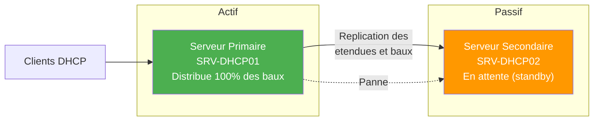
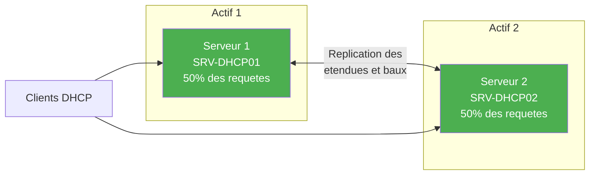
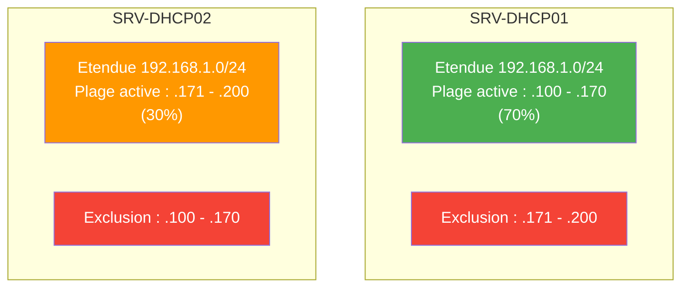

# Basculement DHCP (Failover)

<span class="level-advanced">Avance</span> · Temps estime : 30 minutes

---

## Pourquoi le basculement DHCP ?

!!! example "Analogie"

    Le basculement DHCP fonctionne comme deux guichets de banque identiques. En mode **Hot Standby**, un seul guichet est ouvert (le primaire) et le second reste ferme mais pret a ouvrir immediatement si le premier tombe en panne. En mode **Load Balancing**, les deux guichets sont ouverts simultanement et les clients sont repartis entre eux. Dans les deux cas, chaque guichetier a une copie du registre des operations pour reprendre le travail de l'autre sans perdre d'information.

Le serveur DHCP est un **service critique** : si les clients ne peuvent pas
obtenir ou renouveler leur bail IP, ils perdent leur connectivite reseau.

Sans haute disponibilite, un seul serveur DHCP represente un **point unique de
defaillance** (SPOF).

| Scenario                            | Consequence sans failover                        |
| ----------------------------------- | ------------------------------------------------ |
| Panne du serveur DHCP               | Plus aucun nouveau bail distribue                |
| Maintenance planifiee               | Interruption de service pendant la mise a jour   |
| Expiration des baux existants       | Les clients perdent progressivement leur IP      |

!!! danger "Impact reel"

    Avec un bail de 8 heures, apres une panne de 4 heures les premiers clients
    commencent deja leur tentative de renouvellement T1. Apres 7 heures (T2),
    ils cherchent desesperement un serveur DHCP. Apres 8 heures, ils perdent
    leur adresse IP.

---

## Les deux modes de basculement

Windows Server 2022 propose deux modes de failover DHCP natifs :

### Mode Hot Standby (actif/passif)



| Caracteristique        | Detail                                                        |
| ---------------------- | ------------------------------------------------------------- |
| Serveur actif          | Le **primaire** distribue tous les baux                       |
| Serveur passif         | Le **secondaire** prend le relais uniquement en cas de panne  |
| Reserve d'adresses     | Un pourcentage configurable est reserve au secondaire (defaut : 5 %) |
| Cas d'utilisation      | Site unique avec un serveur principal et un serveur de secours |
| Basculement            | Automatique apres le delai MCLT (Maximum Client Lead Time)    |

### Mode Load Balancing (actif/actif)



| Caracteristique        | Detail                                                        |
| ---------------------- | ------------------------------------------------------------- |
| Charge repartie        | Les deux serveurs distribuent des baux simultanement          |
| Ratio par defaut       | 50/50 (configurable)                                          |
| Algorithme             | Hash de l'adresse MAC du client pour determiner quel serveur repond |
| Cas d'utilisation      | Site unique avec charge importante ou besoin de redondance maximale |
| Basculement            | Chaque serveur prend en charge les clients de l'autre si necessaire |

### Comparaison des modes

| Critere                    | Hot Standby            | Load Balancing         |
| -------------------------- | ---------------------- | ---------------------- |
| Serveurs actifs            | 1                      | 2                      |
| Repartition de charge      | Non                    | Oui                    |
| Complexite                 | Simple                 | Moderee                |
| Utilisation des ressources | Un serveur inactif     | Les deux serveurs actifs |
| Recommande pour            | Petits reseaux, sites distants | Reseaux charges, sites principaux |

---

## Parametres cles du basculement

| Parametre                                | Description                                                | Valeur par defaut |
| ---------------------------------------- | ---------------------------------------------------------- | ----------------- |
| **MCLT** (Maximum Client Lead Time)      | Delai maximal pendant lequel un serveur peut prolonger un bail au-dela de ce que le partenaire connait | 1 heure |
| **State Switchover Interval**            | Delai avant le basculement automatique en cas de perte de communication | Desactive |
| **Shared Secret**                        | Cle partagee pour authentifier la communication entre partenaires | Obligatoire |
| **Load Balance Percentage**              | Ratio de distribution (mode Load Balancing uniquement)     | 50/50 |
| **Reserve Percentage**                   | Pourcentage d'adresses reserve au secondaire (Hot Standby) | 5 % |

!!! note "MCLT : un parametre crucial"

    Le MCLT determine combien de temps un serveur peut agir seul en cas de
    perte de contact avec son partenaire. Une valeur trop courte peut causer
    des problemes si la communication est temporairement interrompue. Une
    valeur trop longue retarde le basculement.

---

## Configurer le basculement

### Prerequis

- Deux serveurs DHCP installes et autorises dans Active Directory
- Les deux serveurs doivent pouvoir communiquer entre eux (port **TCP 647**)
- L'etendue doit etre creee sur le serveur **primaire** (elle sera repliquee)
- Les horloges des deux serveurs doivent etre synchronisees (NTP)

### Configuration en mode Hot Standby

=== "PowerShell"

    ```powershell
    # Create a failover relationship in Hot Standby mode
    Add-DhcpServerv4Failover -ComputerName "SRV-DHCP01" `
        -Name "DHCP-Failover-HotStandby" `
        -PartnerServer "SRV-DHCP02.lab.local" `
        -ScopeId 192.168.1.0 `
        -SharedSecret "P@ssw0rdF@il0ver!" `
        -ServerRole Primary `
        -ReservePercent 5 `
        -MaxClientLeadTime (New-TimeSpan -Hours 1) `
        -AutoStateTransition $true `
        -StateSwitchInterval (New-TimeSpan -Minutes 60)

    # Verify the failover configuration
    Get-DhcpServerv4Failover -ComputerName "SRV-DHCP01"
    ```

    Resultat :

    ```text
    Name                    : DHCP-Failover-HotStandby
    Mode                    : HotStandby
    State                   : Normal
    PartnerServer           : SRV-DHCP02.lab.local
    ServerRole              : Primary
    ReservePercent          : 5
    MaxClientLeadTime       : 01:00:00
    StateSwitchInterval     : 01:00:00
    AutoStateTransition     : True
    ScopeId                 : {10.0.0.0}
    ```

=== "GUI"

    1. Ouvrir la console **DHCP** sur le serveur primaire
    2. Developper **IPv4** > clic droit sur l'etendue > **Configurer le basculement**
    3. Cliquer sur **Suivant**
    4. Saisir le **serveur partenaire** : `SRV-DHCP02`
    5. Choisir le mode **Secours a chaud** (Hot Standby)
    6. Configurer les parametres :
        - Role du serveur partenaire : **Secours**
        - Pourcentage reserve au partenaire : **5 %**
        - MCLT : **1 heure**
        - Basculement d'etat automatique : cocher, **60 minutes**
    7. Saisir le **secret partage**
    8. Cliquer sur **Terminer**

### Configuration en mode Load Balancing

=== "PowerShell"

    ```powershell
    # Create a failover relationship in Load Balancing mode
    Add-DhcpServerv4Failover -ComputerName "SRV-DHCP01" `
        -Name "DHCP-Failover-LoadBalance" `
        -PartnerServer "SRV-DHCP02.lab.local" `
        -ScopeId 192.168.1.0 `
        -SharedSecret "P@ssw0rdF@il0ver!" `
        -LoadBalancePercent 50 `
        -MaxClientLeadTime (New-TimeSpan -Hours 1) `
        -AutoStateTransition $true `
        -StateSwitchInterval (New-TimeSpan -Minutes 60)

    # Verify the configuration
    Get-DhcpServerv4Failover -ComputerName "SRV-DHCP01" -Name "DHCP-Failover-LoadBalance"
    ```

=== "GUI"

    1. Ouvrir la console **DHCP** sur le serveur primaire
    2. Developper **IPv4** > clic droit sur l'etendue > **Configurer le basculement**
    3. Saisir le serveur partenaire : `SRV-DHCP02`
    4. Choisir le mode **Equilibrage de charge** (Load Balancing)
    5. Configurer les parametres :
        - Pourcentage serveur local : **50 %**
        - Pourcentage partenaire : **50 %**
        - MCLT : **1 heure**
    6. Saisir le **secret partage**
    7. Cliquer sur **Terminer**

### Ajouter des etendues a une relation existante

```powershell
# Add another scope to an existing failover relationship
Add-DhcpServerv4FailoverScope -ComputerName "SRV-DHCP01" `
    -Name "DHCP-Failover-LoadBalance" `
    -ScopeId 192.168.2.0

# Verify scopes in the failover relationship
Get-DhcpServerv4Failover -ComputerName "SRV-DHCP01" -Name "DHCP-Failover-LoadBalance"
```

---

## Forcer la replication

Apres une modification de configuration (ajout de reservation, modification
d'option, etc.), il faut **repliquer** les changements vers le partenaire :

=== "PowerShell"

    ```powershell
    # Force replication of a specific scope
    Invoke-DhcpServerv4FailoverReplication -ComputerName "SRV-DHCP01" `
        -ScopeId 192.168.1.0

    # Force replication of all failover scopes
    Invoke-DhcpServerv4FailoverReplication -ComputerName "SRV-DHCP01"
    ```

    Resultat :

    ```text
    PS> Invoke-DhcpServerv4FailoverReplication -ComputerName "SRV-DHCP01" -ScopeId 10.0.0.0

    # No output on success. The scope data is synchronized to the partner server.
    # Verify with:
    PS> Get-DhcpServerv4Failover -ComputerName "SRV-DHCP01" | Select-Object Name, State

    Name                          State
    ----                          -----
    DHCP-Failover-HotStandby      Normal
    ```

=== "GUI"

    1. Clic droit sur l'etendue en basculement
    2. Selectionner **Repliquer l'etendue**
    3. Attendre la confirmation

!!! warning "Replication manuelle apres modification"

    Les modifications faites sur un serveur **ne sont pas automatiquement
    repliquees** en temps reel pour les options et reservations. Il faut
    declencher la replication manuellement apres chaque changement.
    En revanche, les **baux** sont repliques automatiquement.

---

## Alternative : Split Scope (etendues fractionnees)

Avant Windows Server 2012 (qui a introduit le failover natif), la methode
standard etait le **split scope** : diviser la meme plage d'adresses entre
deux serveurs DHCP.

### Principe du Split Scope



| Critere                | Split Scope             | Failover natif          |
| ---------------------- | ----------------------- | ----------------------- |
| Replication des baux   | Non                     | Oui                     |
| Risque de doublon IP   | Faible mais possible    | Aucun                   |
| Configuration          | Manuelle sur 2 serveurs | Assistee                |
| Synchronisation        | Aucune                  | Automatique             |
| Recommandation         | **Obsolete**            | **Recommande**          |

!!! tip "Privilegiez le failover natif"

    Le split scope est une technique **heritee**. Pour tout nouveau
    deploiement sur Windows Server 2012 et ulterieur, utilisez le
    **basculement natif** qui offre la replication automatique des baux
    et elimine les risques de conflits d'adresses.

---

## Surveiller le basculement

### Etat de la relation de basculement

=== "PowerShell"

    ```powershell
    # Check the failover relationship status
    Get-DhcpServerv4Failover -ComputerName "SRV-DHCP01" |
        Select-Object Name, Mode, State, PartnerServer, ScopeId

    # Detailed failover state
    Get-DhcpServerv4Failover -ComputerName "SRV-DHCP01" |
        Format-List Name, Mode, State, PartnerServer,
            MaxClientLeadTime, StateSwitchInterval,
            LoadBalancePercent, ReservePercent
    ```

    Resultat :

    ```text
    Name           Mode        State   PartnerServer          ScopeId
    ----           ----        -----   -------------          -------
    DHCP-Failover  HotStandby  Normal  SRV-DHCP02.lab.local   {10.0.0.0}

    Name                : DHCP-Failover
    Mode                : HotStandby
    State               : Normal
    PartnerServer       : SRV-DHCP02.lab.local
    MaxClientLeadTime   : 01:00:00
    StateSwitchInterval : 01:00:00
    LoadBalancePercent  :
    ReservePercent      : 5
    ```

### Etats possibles de la relation

| Etat                        | Signification                                                |
| --------------------------- | ------------------------------------------------------------ |
| **Normal**                  | Les deux serveurs communiquent correctement                  |
| **Communication Interrupted** | Perte de contact avec le partenaire                        |
| **Partner Down**            | Le partenaire est declare en panne (apres le State Switchover Interval) |
| **Recover**                 | Le partenaire revient en ligne, resynchronisation en cours   |
| **Potential Conflict**      | Des conflits potentiels ont ete detectes                     |
| **Conflict Done**           | Les conflits ont ete resolus                                 |
| **Resolution Interrupted**  | La resolution des conflits a ete interrompue                 |

### Script de surveillance

```powershell
# ============================================================================
# DHCP Failover health monitoring script
# ============================================================================

$DhcpServer = "SRV-DHCP01"

# --- Check failover relationships ---
$Failovers = Get-DhcpServerv4Failover -ComputerName $DhcpServer

foreach ($Fo in $Failovers) {
    Write-Output "=== Failover: $($Fo.Name) ==="
    Write-Output "  Mode          : $($Fo.Mode)"
    Write-Output "  State         : $($Fo.State)"
    Write-Output "  Partner       : $($Fo.PartnerServer)"
    Write-Output "  Scopes        : $($Fo.ScopeId -join ', ')"

    if ($Fo.State -ne "Normal") {
        Write-Warning "ALERT: Failover '$($Fo.Name)' is in state '$($Fo.State)'"
    }
    Write-Output ""
}

# --- Check scope statistics on both servers ---
foreach ($Fo in $Failovers) {
    foreach ($Scope in $Fo.ScopeId) {
        Write-Output "--- Scope $Scope ---"

        $StatsPrimary = Get-DhcpServerv4ScopeStatistics -ComputerName $DhcpServer -ScopeId $Scope
        Write-Output "  Primary   - In Use: $($StatsPrimary.InUse) | Free: $($StatsPrimary.Free) | Usage: $($StatsPrimary.PercentageInUse)%"

        try {
            $StatsPartner = Get-DhcpServerv4ScopeStatistics -ComputerName $Fo.PartnerServer -ScopeId $Scope
            Write-Output "  Secondary - In Use: $($StatsPartner.InUse) | Free: $($StatsPartner.Free) | Usage: $($StatsPartner.PercentageInUse)%"
        } catch {
            Write-Warning "  Cannot reach partner server $($Fo.PartnerServer)"
        }
        Write-Output ""
    }
}
```

---

## Supprimer ou modifier une relation de basculement

```powershell
# Modify an existing failover relationship
Set-DhcpServerv4Failover -ComputerName "SRV-DHCP01" `
    -Name "DHCP-Failover-LoadBalance" `
    -LoadBalancePercent 60 `
    -MaxClientLeadTime (New-TimeSpan -Hours 2) `
    -SharedSecret "N3wP@ssw0rd!"

# Remove a scope from a failover relationship
Remove-DhcpServerv4FailoverScope -ComputerName "SRV-DHCP01" `
    -Name "DHCP-Failover-LoadBalance" `
    -ScopeId 192.168.2.0

# Remove an entire failover relationship
Remove-DhcpServerv4Failover -ComputerName "SRV-DHCP01" `
    -Name "DHCP-Failover-LoadBalance"
```

!!! danger "Suppression de la relation"

    Supprimer une relation de basculement **ne supprime pas** les etendues
    sur le serveur partenaire. Pensez a nettoyer les etendues orphelines
    manuellement apres la suppression.

---

## Regles de pare-feu

Le basculement DHCP utilise le port **TCP 647** pour la communication entre
partenaires :

```powershell
# Verify that the DHCP failover firewall rule exists
Get-NetFirewallRule -DisplayName "*DHCP*Failover*" |
    Select-Object DisplayName, Enabled, Direction, LocalPort

# If needed, create the rule manually
New-NetFirewallRule -DisplayName "DHCP Failover (TCP-In)" `
    -Direction Inbound `
    -Protocol TCP `
    -LocalPort 647 `
    -Action Allow `
    -Profile Domain
```

Resultat :

```text
PS> Get-NetFirewallRule -DisplayName "*DHCP*Failover*" | Select-Object DisplayName, Enabled, Direction

DisplayName                     Enabled  Direction
-----------                     -------  ---------
DHCP Server Failover (TCP-In)   True     Inbound
DHCP Server Failover (TCP-Out)  True     Outbound
```

---

!!! example "Scenario pratique"

    **Situation** : Emma, administratrice reseau, remarque que la relation de basculement DHCP affiche l'etat "Communication Interrupted" depuis plusieurs heures. Le serveur primaire `SRV-DHCP01` fonctionne normalement mais ne communique plus avec `SRV-DHCP02`.

    **Diagnostic** :

    ```powershell
    # Etape 1 : Verifier l'etat du basculement
    Get-DhcpServerv4Failover -ComputerName "SRV-DHCP01" |
        Select-Object Name, State, PartnerServer
    ```

    Resultat : `State` affiche "Communication Interrupted".

    ```powershell
    # Etape 2 : Tester la connectivite vers le partenaire sur le port 647
    Test-NetConnection -ComputerName "SRV-DHCP02" -Port 647
    ```

    Resultat : `TcpTestSucceeded` est a `False`. Le port 647 est bloque.

    ```powershell
    # Etape 3 : Verifier les regles de pare-feu sur le partenaire
    Invoke-Command -ComputerName "SRV-DHCP02" -ScriptBlock {
        Get-NetFirewallRule -DisplayName "*DHCP*Failover*" |
            Select-Object DisplayName, Enabled
    }
    ```

    Resultat : la regle de pare-feu pour le basculement DHCP est desactivee sur `SRV-DHCP02` suite a une mise a jour de la politique de securite.

    **Solution** :

    ```powershell
    # Reactiver la regle de pare-feu sur le partenaire
    Invoke-Command -ComputerName "SRV-DHCP02" -ScriptBlock {
        Enable-NetFirewallRule -DisplayName "DHCP Server Failover (TCP-In)"
        Enable-NetFirewallRule -DisplayName "DHCP Server Failover (TCP-Out)"
    }

    # Forcer la resynchronisation
    Invoke-DhcpServerv4FailoverReplication -ComputerName "SRV-DHCP01"

    # Verifier que l'etat revient a Normal
    Get-DhcpServerv4Failover -ComputerName "SRV-DHCP01" |
        Select-Object Name, State
    ```

    L'etat revient a "Normal" apres quelques secondes de resynchronisation.

!!! danger "Erreurs courantes"

    - **Oublier d'ouvrir le port TCP 647 sur le pare-feu des deux serveurs** : la communication de basculement DHCP utilise le port TCP 647. Si ce port est bloque sur l'un des deux serveurs, la relation tombe en etat "Communication Interrupted".
    - **Ne pas synchroniser les horloges des deux serveurs** : un decalage horaire trop important entre les deux serveurs peut provoquer des erreurs d'authentification lors de la replication. Utilisez le meme serveur NTP pour les deux.
    - **Modifier les reservations ou options sur le serveur secondaire sans repliquer** : les modifications faites sur le secondaire seront ecrasees lors de la prochaine replication depuis le primaire. Faites toujours les modifications sur le primaire puis repliquez.
    - **Configurer le basculement avant d'autoriser les deux serveurs dans AD** : les deux serveurs DHCP doivent etre autorises dans Active Directory avant de configurer le basculement, sinon le serveur secondaire ne pourra pas distribuer d'adresses.
    - **Utiliser un secret partage faible** : le secret partage authentifie la communication entre partenaires. Un mot de passe faible expose le basculement a des attaques de type man-in-the-middle.

## Points cles a retenir

- Le basculement DHCP elimine le **point unique de defaillance** du service DHCP
- Deux modes disponibles : **Hot Standby** (actif/passif) et **Load Balancing** (actif/actif)
- Le **MCLT** controle le delai maximal pendant lequel un serveur peut agir seul
- Les **baux** sont repliques automatiquement, mais les **options et reservations** necessitent une replication manuelle
- Le **split scope** est une technique obsolete : privilegiez le failover natif
- La communication entre partenaires utilise le port **TCP 647**
- Surveillez regulierement l'etat de la relation de basculement

---

## Pour aller plus loin

- [Concepts DHCP](concepts-dhcp.md) -- comprendre les baux et le renouvellement
- [Etendues et options DHCP](etendues-et-options.md) -- creer les etendues avant de configurer le basculement
- [Reservations DHCP](reservations.md) -- les reservations doivent etre repliquees manuellement
- [Installation et configuration](installation-configuration.md) -- installer le role DHCP sur les deux serveurs
- [Concepts Cluster de basculement](../../haute-disponibilite/cluster/concepts-cluster.md) -- autre approche de haute disponibilite pour d'autres services
