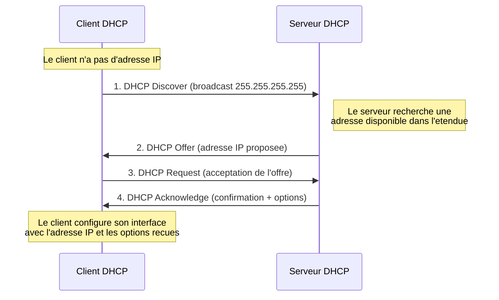
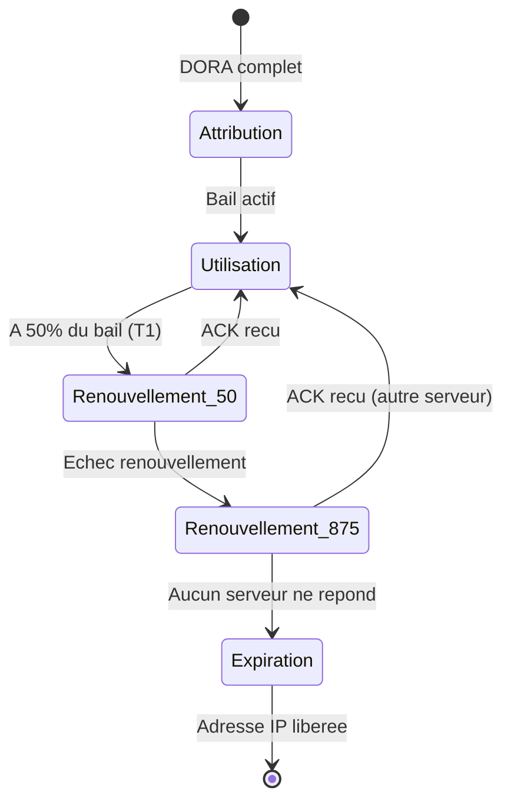
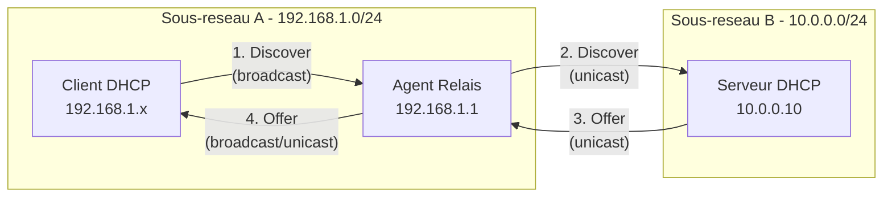

# Concepts DHCP

<span class="level-beginner">Fondamental</span> · Temps estime : 20 minutes

---

## Qu'est-ce que le DHCP ?

!!! example "Analogie"

    Imaginez un hotel : quand un client arrive, la reception lui attribue une chambre (adresse IP), lui donne la cle (masque de sous-reseau), lui indique ou se trouve le restaurant (passerelle) et le numero du concierge (serveur DNS). Le client garde sa chambre pour la duree de son sejour (bail DHCP). S'il prolonge son sejour, la chambre reste la meme. S'il part, la chambre est liberee pour le prochain client. C'est exactement ce que fait un serveur DHCP.

Le **DHCP** (Dynamic Host Configuration Protocol) est un protocole reseau
client-serveur defini par la [RFC 2131](https://datatracker.ietf.org/doc/html/rfc2131).
Il permet aux machines d'un reseau d'obtenir automatiquement une configuration
IP complete :

| Parametre              | Exemple               |
| ---------------------- | --------------------- |
| Adresse IP             | `192.168.1.100`       |
| Masque de sous-reseau  | `255.255.255.0`       |
| Passerelle par defaut  | `192.168.1.1`         |
| Serveur(s) DNS         | `192.168.1.10`        |
| Nom de domaine         | `lab.local`           |
| Duree du bail          | 8 heures              |

!!! tip "Pourquoi utiliser DHCP ?"

    Sans DHCP, chaque poste doit etre configure manuellement. Sur un reseau de
    plusieurs centaines de machines, cela devient ingerable et source d'erreurs
    (conflits d'adresses, fautes de frappe, oubli de mise a jour).

---

## Le processus DORA

L'attribution d'une adresse IP par DHCP suit un echange en **quatre etapes**
appele **DORA** : **D**iscover, **O**ffer, **R**equest, **A**cknowledge.

### Diagramme de sequence DORA



### Detail de chaque etape

#### 1 -- DHCP Discover (decouverte)

Le client envoie un message **broadcast** (`255.255.255.255`) sur le port
**UDP 67** pour localiser les serveurs DHCP disponibles. A ce stade, le client
n'a pas encore d'adresse IP : il utilise `0.0.0.0` comme adresse source.

!!! note "Broadcast uniquement"

    Le Discover est un message de diffusion. Il ne franchit pas les routeurs
    sauf si un **agent relais DHCP** est configure (voir plus bas).

#### 2 -- DHCP Offer (offre)

Chaque serveur DHCP ayant recu le Discover repond avec une **offre** contenant :

- Une adresse IP disponible tiree de son etendue (scope)
- Le masque de sous-reseau
- La duree du bail proposee
- L'identifiant du serveur DHCP

#### 3 -- DHCP Request (demande)

Le client **choisit une offre** (generalement la premiere recue) et envoie un
message Request en **broadcast** pour informer tous les serveurs :

- Le serveur choisi sait que son offre est acceptee
- Les autres serveurs savent que leur offre est refusee et liberent l'adresse

#### 4 -- DHCP Acknowledge (accusee de reception)

Le serveur choisi confirme l'attribution en envoyant un **DHCP ACK** contenant :

- L'adresse IP attribuee
- Toutes les options DHCP configurees (passerelle, DNS, domaine, etc.)
- La duree du bail definitive

!!! danger "DHCP NAK"

    Si le serveur ne peut plus honorer la demande (adresse deja attribuee,
    etendue pleine), il envoie un **DHCP NAK** (Negative Acknowledge).
    Le client doit alors recommencer le processus depuis le Discover.

---

## Les baux DHCP (leases)

### Concept de bail

Un bail DHCP est une **attribution temporaire** d'adresse IP. Le serveur prete
une adresse au client pour une duree determinee. Cette mecanique permet de :

- **Recycler les adresses** non utilisees
- **Eviter les conflits** en centralisant la gestion
- **Adapter la configuration** lors du renouvellement

### Cycle de vie d'un bail



### Processus de renouvellement

Le renouvellement se deroule en deux phases automatiques :

| Phase     | Moment                       | Comportement                                                         |
| --------- | ---------------------------- | -------------------------------------------------------------------- |
| **T1**    | A **50 %** de la duree du bail | Le client envoie un **DHCP Request** en unicast au serveur d'origine |
| **T2**    | A **87,5 %** de la duree du bail | Le client envoie un **DHCP Request** en broadcast a tout serveur     |
| Expiration | A **100 %** du bail           | Le client perd son adresse et reprend le processus DORA              |

!!! example "Exemple concret"

    Pour un bail de **8 heures** :

    - **T1** a 4 heures : tentative de renouvellement aupres du serveur d'origine
    - **T2** a 7 heures : tentative de renouvellement aupres de n'importe quel serveur
    - **Expiration** a 8 heures : l'adresse est rendue et le client recommence

### Duree de bail recommandee

| Scenario                          | Duree conseillee    |
| --------------------------------- | ------------------- |
| Reseau de bureau classique        | 8 heures            |
| Reseau Wi-Fi invite               | 1 a 4 heures        |
| Reseau avec peu de mouvement      | 1 a 8 jours         |
| Reseau avec beaucoup de rotations | 30 minutes a 1 heure|

!!! tip "Regle generale"

    Choisissez une duree de bail adaptee au nombre d'adresses disponibles et
    au taux de rotation des clients. Un bail trop long sur un reseau avec peu
    d'adresses peut provoquer un epuisement de l'etendue.

---

## Commandes PowerShell utiles

Quelques cmdlets pour observer le comportement DHCP cote client :

=== "PowerShell"

    ```powershell
    # Display the current DHCP lease on the client
    Get-NetIPAddress -AddressFamily IPv4 | Where-Object { $_.PrefixOrigin -eq "Dhcp" }

    # Release the current DHCP lease
    ipconfig /release

    # Request a new DHCP lease (triggers DORA)
    ipconfig /renew

    # Display full DHCP configuration details
    ipconfig /all

    # View the DHCP lease in the registry
    Get-ItemProperty "HKLM:\SYSTEM\CurrentControlSet\Services\Tcpip\Parameters\Interfaces\*" |
        Where-Object { $_.DhcpIPAddress } |
        Select-Object DhcpIPAddress, DhcpSubnetMask, DhcpServer, LeaseObtainedTime, LeaseTerminatesTime
    ```

    Resultat :

    ```text
    PS> Get-NetIPAddress -AddressFamily IPv4 | Where-Object { $_.PrefixOrigin -eq "Dhcp" }

    IPAddress         : 10.0.0.105
    InterfaceIndex    : 6
    InterfaceAlias    : Ethernet
    AddressFamily     : IPv4
    PrefixLength      : 24
    PrefixOrigin      : Dhcp
    SuffixOrigin      : Dhcp
    ValidLifetime     : 06:42:15
    PreferredLifetime : 06:42:15

    PS> ipconfig /renew

    Windows IP Configuration

    Ethernet adapter Ethernet:
       Connection-specific DNS Suffix  . : lab.local
       IPv4 Address. . . . . . . . . . . : 10.0.0.105
       Subnet Mask . . . . . . . . . . . : 255.255.255.0
       Default Gateway . . . . . . . . . : 10.0.0.1
    ```

---

## L'agent relais DHCP (DHCP Relay Agent)

!!! example "Analogie"

    Imaginez un employe dans un bureau satellite qui crie pour demander une fourniture. Son cri (broadcast) ne depasse pas les murs de son etage. L'agent relais, c'est la secretaire de l'etage qui entend la demande et passe un coup de telephone (unicast) au service logistique du siege. La reponse revient par telephone, et la secretaire la transmet a l'employe.

### Le probleme : les broadcasts ne traversent pas les routeurs

Par defaut, les messages **DHCP Discover** sont envoyes en broadcast. Or, les
routeurs **ne transmettent pas les broadcasts** d'un sous-reseau a l'autre.

Si le serveur DHCP se trouve sur un sous-reseau different du client, le Discover
n'atteindra jamais le serveur.

### La solution : l'agent relais (IP Helper)

L'**agent relais DHCP** (aussi appele **IP Helper**) est un service configure
sur le routeur ou un serveur du sous-reseau local. Son role :

1. **Intercepter** les broadcasts DHCP du sous-reseau local
2. **Encapsuler** le message dans un paquet unicast
3. **Transmettre** ce paquet au serveur DHCP distant
4. **Relayer** la reponse du serveur au client



### Configuration de l'agent relais

=== "PowerShell"

    ```powershell
    # Install the DHCP Relay Agent role on a Windows Server acting as relay
    Install-WindowsFeature RSAT-RemoteAccess

    # On a Cisco router (example for reference)
    # interface GigabitEthernet0/0
    #   ip helper-address 10.0.0.10
    ```

=== "GUI"

    1. Ouvrir **Gestionnaire de serveur** > **Gerer** > **Ajouter des roles**
    2. Selectionner **Acces a distance** > **Routage**
    3. Dans la console **Routage et acces distant**, ajouter l'**Agent relais DHCP**
    4. Configurer l'adresse IP du serveur DHCP cible

!!! warning "Chaque sous-reseau distant a besoin d'un relais"

    Si vous avez 5 sous-reseaux distants et un seul serveur DHCP, il faut
    configurer un agent relais (ou `ip helper-address`) sur le routeur de
    chaque sous-reseau.

---

## Ports reseau utilises

| Port    | Protocole | Direction                |
| ------- | --------- | ------------------------ |
| UDP 67  | DHCP      | Client vers serveur      |
| UDP 68  | DHCP      | Serveur vers client      |

!!! note "Pare-feu"

    Assurez-vous que les ports UDP 67 et 68 sont ouverts sur le pare-feu
    Windows du serveur DHCP. Le role DHCP cree automatiquement les regles
    necessaires lors de l'installation.

---

!!! example "Scenario pratique"

    **Situation** : Nadia, technicienne reseau, recoit un appel de l'equipe du 3e etage : les postes de travail nouvellement branches n'obtiennent plus d'adresse IP. Ils affichent une adresse APIPA en `169.254.x.x`. Les postes existants fonctionnent toujours.

    **Diagnostic** :

    ```powershell
    # Etape 1 : Depuis un poste affecte, verifier la configuration IP
    ipconfig /all
    ```

    Resultat : l'adresse est `169.254.12.45`, pas de passerelle, pas de DNS. Le client n'a pas recu de bail DHCP.

    ```powershell
    # Etape 2 : Tenter un renouvellement manuel
    ipconfig /release
    ipconfig /renew
    ```

    Resultat : "An error occurred while renewing interface Ethernet: unable to contact your DHCP server."

    ```powershell
    # Etape 3 : Depuis un poste fonctionnel, verifier le serveur DHCP
    Get-DhcpServerv4ScopeStatistics -ComputerName "SRV-01"
    ```

    Resultat : l'etendue `10.0.0.0` affiche 100 % d'utilisation. Toutes les adresses disponibles sont distribuees.

    **Solution** :

    Nadia etend la plage d'adresses de l'etendue ou raccourcit la duree du bail pour recycler les adresses inutilisees plus rapidement. Les nouveaux postes obtiennent ensuite leur configuration IP normalement.

!!! danger "Erreurs courantes"

    - **Confondre adresse APIPA et adresse DHCP** : une adresse en `169.254.x.x` signifie que le client n'a pas recu de bail DHCP. Ce n'est pas une adresse distribuee par le serveur, c'est une auto-configuration de dernier recours.
    - **Oublier l'agent relais sur un nouveau sous-reseau** : si un nouveau VLAN est cree sans agent relais (`ip helper-address`), les broadcasts DHCP ne parviendront jamais au serveur DHCP, et aucun client ne recevra d'adresse.
    - **Configurer un bail trop court sur un reseau stable** : un bail de 30 minutes sur un reseau de bureaux fixes genere un trafic DHCP inutile et augmente la charge sur le serveur. Un bail de 8 heures est generalement adapte.
    - **Avoir deux serveurs DHCP non coordonnes sur le meme sous-reseau** : sans basculement DHCP configure, deux serveurs peuvent distribuer la meme adresse IP a deux clients differents, causant des conflits d'adresses.

## Points cles a retenir

- Le DHCP automatise l'attribution de la configuration IP aux clients du reseau
- Le processus **DORA** se deroule en quatre etapes : Discover, Offer, Request, Acknowledge
- Les **baux** sont temporaires et se renouvellent automatiquement a 50 % (T1) puis 87,5 % (T2)
- Les messages DHCP utilisent le **broadcast** : ils ne traversent pas les routeurs sans **agent relais**
- L'agent relais convertit les broadcasts en unicast pour atteindre un serveur DHCP sur un autre sous-reseau
- Les ports UDP 67 (serveur) et 68 (client) doivent etre ouverts

---

## Pour aller plus loin

- [Installation et configuration du role DHCP](installation-configuration.md) -- deployer DHCP sur Windows Server 2022
- [Etendues et options DHCP](etendues-et-options.md) -- configurer les plages d'adresses et les options
- [Reservations DHCP](reservations.md) -- attribuer des adresses fixes par adresse MAC
- [Basculement DHCP](basculement-dhcp.md) -- haute disponibilite du service DHCP
- [Concepts DNS](../dns/concepts-dns.md) -- le DNS travaille en tandem avec le DHCP
