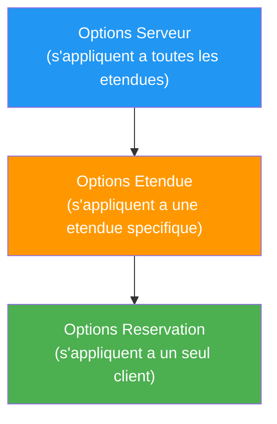

# Etendues et options DHCP

<span class="level-intermediate">Intermediaire</span> · Temps estime : 30 minutes

---

## Qu'est-ce qu'une etendue ?

!!! example "Analogie"

    Une etendue DHCP est comparable a un carnet de tickets numerotes distribues a l'entree d'un parking. Le carnet va du ticket 100 au ticket 200 (plage d'adresses). Certains tickets sont reserves pour les places handicapees (exclusions). Avec chaque ticket, on remet un plan du parking avec les indications de sortie (passerelle) et le numero du gardien (serveur DNS). Quand tous les tickets sont distribues, aucun nouveau vehicule ne peut entrer.

Une **etendue DHCP** (scope) est une plage d'adresses IP consecutives que le
serveur DHCP peut distribuer aux clients d'un sous-reseau donne.

Chaque etendue est definie par :

| Parametre              | Exemple                 | Description                                  |
| ---------------------- | ----------------------- | -------------------------------------------- |
| Nom                    | `LAN-Bureaux`           | Nom descriptif pour l'administration         |
| Plage de debut         | `192.168.1.100`         | Premiere adresse distribuable                |
| Plage de fin           | `192.168.1.200`         | Derniere adresse distribuable                |
| Masque de sous-reseau  | `255.255.255.0`         | Masque associe aux adresses distribuees      |
| Duree du bail          | `8 heures`              | Combien de temps le client garde l'adresse   |
| Exclusions             | `192.168.1.150-160`     | Adresses retirees de la distribution         |

!!! tip "Une etendue par sous-reseau"

    En regle generale, vous creez **une etendue par sous-reseau physique** ou
    logique (VLAN). Le serveur DHCP determine quelle etendue utiliser en
    fonction de l'interface reseau qui a recu la requete ou de l'adresse de
    l'agent relais.

---

## Creer une etendue

=== "PowerShell"

    ```powershell
    # Create a new DHCP scope
    Add-DhcpServerv4Scope -ComputerName "SRV-DHCP01" `
        -Name "LAN-Bureaux" `
        -StartRange 192.168.1.100 `
        -EndRange 192.168.1.200 `
        -SubnetMask 255.255.255.0 `
        -LeaseDuration (New-TimeSpan -Hours 8) `
        -State Active `
        -Description "Etendue pour le reseau bureaux - batiment A"

    # Verify the scope was created
    Get-DhcpServerv4Scope -ComputerName "SRV-DHCP01"
    ```

    Resultat :

    ```text
    ScopeId        Name         SubnetMask      StartRange      EndRange        State  LeaseDuration
    -------        ----         ----------      ----------      --------        -----  -------------
    10.0.0.0       LAN-Bureaux  255.255.255.0   10.0.0.100      10.0.0.200      Active 08:00:00
    ```

=== "GUI"

    1. Ouvrir la console **DHCP** (`dhcpmgmt.msc`)
    2. Developper le serveur > clic droit sur **IPv4** > **Nouvelle etendue**
    3. Suivre l'assistant :
        - Nommer l'etendue : `LAN-Bureaux`
        - Definir la plage : `192.168.1.100` a `192.168.1.200`
        - Masque : `255.255.255.0`
        - Ajouter des exclusions si necessaire
        - Definir la duree du bail : `8 heures`
        - Configurer les options (passerelle, DNS)
    4. **Activer** l'etendue a la derniere etape

---

## Plages d'exclusion

Une **plage d'exclusion** retire un ensemble d'adresses de la distribution
DHCP. Ces adresses restent dans le sous-reseau mais ne seront jamais attribuees
automatiquement.

### Cas d'utilisation des exclusions

| Usage                              | Exemple                    |
| ---------------------------------- | -------------------------- |
| Adresses de serveurs (IP statique) | `192.168.1.1 - 192.168.1.20`  |
| Imprimantes configurees en dur     | `192.168.1.150 - 192.168.1.160` |
| Equipements reseau (switches, AP)  | `192.168.1.240 - 192.168.1.254` |

=== "PowerShell"

    ```powershell
    # Add an exclusion range to an existing scope
    Add-DhcpServerv4ExclusionRange -ComputerName "SRV-DHCP01" `
        -ScopeId 192.168.1.0 `
        -StartRange 192.168.1.1 `
        -EndRange 192.168.1.20

    # Add a second exclusion range
    Add-DhcpServerv4ExclusionRange -ComputerName "SRV-DHCP01" `
        -ScopeId 192.168.1.0 `
        -StartRange 192.168.1.240 `
        -EndRange 192.168.1.254

    # List all exclusion ranges in a scope
    Get-DhcpServerv4ExclusionRange -ComputerName "SRV-DHCP01" -ScopeId 192.168.1.0
    ```

    Resultat :

    ```text
    ScopeId       StartRange       EndRange
    -------       ----------       --------
    10.0.0.0      10.0.0.1         10.0.0.20
    10.0.0.0      10.0.0.240       10.0.0.254
    ```

=== "GUI"

    1. Dans la console DHCP, developper l'etendue cible
    2. Clic droit sur **Pool d'adresses** > **Nouvelle plage d'exclusion**
    3. Saisir l'adresse de debut et de fin
    4. Cliquer sur **Ajouter**

!!! warning "Exclusion vs. Reservation"

    - **Exclusion** : l'adresse est retiree de la distribution, aucun client ne la recevra
    - **Reservation** : l'adresse est reservee pour un client specifique (par MAC)

    Utilisez les exclusions pour les equipements configures en IP statique
    (hors DHCP). Utilisez les [reservations](reservations.md) pour les
    equipements qui doivent obtenir une IP fixe **via** DHCP.

---

## Les options DHCP

Les **options DHCP** sont des parametres supplementaires envoyes au client avec
son bail. Elles permettent de configurer automatiquement la passerelle, les
serveurs DNS, le nom de domaine et bien d'autres parametres.

### Hierarchie des options

Les options peuvent etre definies a trois niveaux. Le niveau le plus specifique
prend toujours la priorite :



| Niveau         | Portee                           | Priorite  |
| -------------- | -------------------------------- | --------- |
| **Serveur**    | Toutes les etendues du serveur   | La plus basse |
| **Etendue**    | Une etendue specifique           | Moyenne   |
| **Reservation**| Un client specifique (par MAC)   | La plus haute |

!!! tip "Strategie recommandee"

    Definissez les options **communes** (nom de domaine, serveur NTP) au
    **niveau serveur**. Definissez les options **specifiques au sous-reseau**
    (passerelle, DNS local) au **niveau etendue**.

### Options les plus courantes

| Code | Nom                        | Description                               | Exemple                |
| ---- | -------------------------- | ----------------------------------------- | ---------------------- |
| 003  | Router (passerelle)        | Passerelle par defaut                     | `192.168.1.1`          |
| 006  | DNS Servers                | Serveur(s) DNS                            | `192.168.1.10`         |
| 015  | DNS Domain Name            | Suffixe DNS du domaine                    | `lab.local`            |
| 044  | WINS/NBNS Servers          | Serveur(s) WINS (legacy)                  | `192.168.1.10`         |
| 051  | Lease Time                 | Duree du bail (secondes)                  | `28800` (8h)           |
| 066  | Boot Server Host Name      | Serveur TFTP pour PXE                     | `192.168.1.5`          |
| 067  | Bootfile Name              | Fichier de demarrage PXE                  | `boot\x64\wdsnbp.com` |

### Configurer les options d'etendue

=== "PowerShell"

    ```powershell
    # Set the default gateway (option 003) for a scope
    Set-DhcpServerv4OptionValue -ComputerName "SRV-DHCP01" `
        -ScopeId 192.168.1.0 `
        -OptionId 3 `
        -Value "192.168.1.1"

    # Set DNS servers (option 006) for a scope
    Set-DhcpServerv4OptionValue -ComputerName "SRV-DHCP01" `
        -ScopeId 192.168.1.0 `
        -OptionId 6 `
        -Value "192.168.1.10", "192.168.1.11"

    # Set DNS domain name (option 015) for a scope
    Set-DhcpServerv4OptionValue -ComputerName "SRV-DHCP01" `
        -ScopeId 192.168.1.0 `
        -OptionId 15 `
        -Value "lab.local"

    # Alternative: use named parameters for common options
    Set-DhcpServerv4OptionValue -ComputerName "SRV-DHCP01" `
        -ScopeId 192.168.1.0 `
        -Router "192.168.1.1" `
        -DnsServer "192.168.1.10", "192.168.1.11" `
        -DnsDomain "lab.local"

    # List all options configured for a scope
    Get-DhcpServerv4OptionValue -ComputerName "SRV-DHCP01" -ScopeId 192.168.1.0
    ```

    Resultat :

    ```text
    OptionId  Name                    Type       Value                   VendorClass  UserClass  PolicyName
    --------  ----                    ----       -----                   -----------  ---------  ----------
    003       Router                  IPv4Address {10.0.0.1}
    006       DNS Servers             IPv4Address {10.0.0.10, 10.0.0.11}
    015       DNS Domain Name         String     {lab.local}
    051       Lease                   DWord      {28800}
    ```

=== "GUI"

    1. Dans la console DHCP, developper l'etendue cible
    2. Clic droit sur **Options d'etendue** > **Configurer les options**
    3. Cocher les options souhaitees :
        - **003 Routeur** : saisir l'adresse de la passerelle
        - **006 Serveurs DNS** : saisir les adresses DNS
        - **015 Nom de domaine DNS** : saisir le suffixe
    4. Cliquer sur **OK**

### Configurer les options au niveau serveur

=== "PowerShell"

    ```powershell
    # Set server-level options (apply to all scopes unless overridden)
    Set-DhcpServerv4OptionValue -ComputerName "SRV-DHCP01" `
        -DnsDomain "lab.local"

    # List server-level options
    Get-DhcpServerv4OptionValue -ComputerName "SRV-DHCP01"
    ```

=== "GUI"

    1. Dans la console DHCP, developper le serveur > **IPv4**
    2. Clic droit sur **Options de serveur** > **Configurer les options**
    3. Cocher et remplir les options souhaitees

---

## Gestion de la duree de bail

La duree de bail se configure au niveau de l'etendue :

=== "PowerShell"

    ```powershell
    # Change the lease duration of an existing scope to 4 hours
    Set-DhcpServerv4Scope -ComputerName "SRV-DHCP01" `
        -ScopeId 192.168.1.0 `
        -LeaseDuration (New-TimeSpan -Hours 4)

    # Check the current lease duration
    Get-DhcpServerv4Scope -ComputerName "SRV-DHCP01" -ScopeId 192.168.1.0 |
        Select-Object Name, ScopeId, LeaseDuration
    ```

---

## Superscopes

Un **superscope** est un regroupement logique de plusieurs etendues. Il est
utile lorsque plusieurs sous-reseaux logiques coexistent sur le **meme segment
physique** (multinetting).

### Cas d'utilisation

- **Multinetting** : deux plages IP sur le meme VLAN (ex : `192.168.1.0/24` et `192.168.2.0/24`)
- **Extension d'adresses** : la premiere etendue est pleine, on en ajoute une seconde

=== "PowerShell"

    ```powershell
    # Create two scopes
    Add-DhcpServerv4Scope -ComputerName "SRV-DHCP01" `
        -Name "Bureaux-Plage1" `
        -StartRange 192.168.1.100 -EndRange 192.168.1.200 `
        -SubnetMask 255.255.255.0 -State Active

    Add-DhcpServerv4Scope -ComputerName "SRV-DHCP01" `
        -Name "Bureaux-Plage2" `
        -StartRange 192.168.2.100 -EndRange 192.168.2.200 `
        -SubnetMask 255.255.255.0 -State Active

    # Group them into a superscope
    Add-DhcpServerv4Superscope -ComputerName "SRV-DHCP01" `
        -SuperscopeName "Bureaux-Combined" `
        -ScopeId 192.168.1.0, 192.168.2.0

    # List superscopes
    Get-DhcpServerv4Superscope -ComputerName "SRV-DHCP01"
    ```

=== "GUI"

    1. Clic droit sur **IPv4** > **Nouveau superscope**
    2. Nommer le superscope
    3. Selectionner les etendues a regrouper
    4. Terminer l'assistant

---

## Etendues multicast

Les **etendues multicast** distribuent des adresses dans la plage de classe D
(`224.0.0.0` a `239.255.255.255`) pour des applications de streaming ou de
visioconference.

!!! note "Usage peu courant"

    Les etendues multicast (MADCAP) sont rarement utilisees en environnement
    d'entreprise classique. Elles servent principalement pour les applications
    de diffusion multimedia.

=== "PowerShell"

    ```powershell
    # Create a multicast scope
    Add-DhcpServerv4MulticastScope -ComputerName "SRV-DHCP01" `
        -Name "Multicast-Video" `
        -StartRange 239.0.0.1 `
        -EndRange 239.0.0.254 `
        -State Active
    ```

---

## Supervision des etendues

### Statistiques d'utilisation

=== "PowerShell"

    ```powershell
    # View scope statistics (usage, free addresses, etc.)
    Get-DhcpServerv4ScopeStatistics -ComputerName "SRV-DHCP01"

    # Detailed statistics for a specific scope
    Get-DhcpServerv4ScopeStatistics -ComputerName "SRV-DHCP01" -ScopeId 192.168.1.0

    # List all active leases in a scope
    Get-DhcpServerv4Lease -ComputerName "SRV-DHCP01" -ScopeId 192.168.1.0

    # View only leases about to expire (within the next hour)
    Get-DhcpServerv4Lease -ComputerName "SRV-DHCP01" -ScopeId 192.168.1.0 |
        Where-Object { $_.LeaseExpiryTime -lt (Get-Date).AddHours(1) }
    ```

    Resultat :

    ```text
    PS> Get-DhcpServerv4ScopeStatistics -ComputerName "SRV-DHCP01" -ScopeId 10.0.0.0

    ScopeId      Free   InUse  PercentageInUse  Reserved  Pending
    -------      ----   -----  ---------------  --------  -------
    10.0.0.0     62     19     23.46            3         0

    PS> Get-DhcpServerv4Lease -ComputerName "SRV-DHCP01" -ScopeId 10.0.0.0 | Select-Object -First 3

    IPAddress       ClientId             HostName         LeaseExpiryTime
    ---------       --------             --------         ---------------
    10.0.0.105      AA-BB-CC-11-22-33    PC-USER01        2/20/2026 4:30:00 PM
    10.0.0.106      AA-BB-CC-11-22-34    PC-USER02        2/20/2026 5:15:00 PM
    10.0.0.110      AA-BB-CC-44-55-66    PC-USER03        2/20/2026 3:45:00 PM
    ```

### Seuils d'alerte

!!! warning "Surveiller le taux d'utilisation"

    Lorsqu'une etendue depasse **80 %** d'utilisation, il est temps de :

    - Raccourcir la duree de bail pour recycler les adresses plus rapidement
    - Ajouter une seconde etendue (via superscope)
    - Verifier qu'il n'y a pas de baux orphelins

---

## Script de creation d'etendue complete

Voici un script complet pour creer une etendue avec toutes ses options :

```powershell
# ============================================================================
# Create a complete DHCP scope with options and exclusions
# ============================================================================

$DhcpServer = "SRV-DHCP01"
$ScopeName = "LAN-Bureaux"
$ScopeDesc = "Reseau bureaux - Batiment A"
$StartRange = "192.168.1.100"
$EndRange = "192.168.1.200"
$SubnetMask = "255.255.255.0"
$ScopeId = "192.168.1.0"
$Gateway = "192.168.1.1"
$DnsServers = @("192.168.1.10", "192.168.1.11")
$DnsDomain = "lab.local"
$LeaseDuration = New-TimeSpan -Hours 8

# --- Create the scope ---
Add-DhcpServerv4Scope -ComputerName $DhcpServer `
    -Name $ScopeName `
    -Description $ScopeDesc `
    -StartRange $StartRange `
    -EndRange $EndRange `
    -SubnetMask $SubnetMask `
    -LeaseDuration $LeaseDuration `
    -State Active

# --- Add exclusion ranges ---
Add-DhcpServerv4ExclusionRange -ComputerName $DhcpServer `
    -ScopeId $ScopeId `
    -StartRange "192.168.1.240" -EndRange "192.168.1.254"

# --- Configure scope options ---
Set-DhcpServerv4OptionValue -ComputerName $DhcpServer `
    -ScopeId $ScopeId `
    -Router $Gateway `
    -DnsServer $DnsServers `
    -DnsDomain $DnsDomain

# --- Verify ---
Write-Output "=== Scope Created ==="
Get-DhcpServerv4Scope -ComputerName $DhcpServer -ScopeId $ScopeId

Write-Output "`n=== Exclusion Ranges ==="
Get-DhcpServerv4ExclusionRange -ComputerName $DhcpServer -ScopeId $ScopeId

Write-Output "`n=== Scope Options ==="
Get-DhcpServerv4OptionValue -ComputerName $DhcpServer -ScopeId $ScopeId
```

---

!!! example "Scenario pratique"

    **Situation** : Caroline, administratrice reseau, constate que les postes du nouveau batiment B n'obtiennent pas la bonne passerelle par defaut. Ils recoivent `10.0.0.1` (passerelle du batiment A) au lieu de `10.0.1.1` (passerelle du batiment B). Le batiment B a sa propre etendue `10.0.1.0/24`.

    **Diagnostic** :

    ```powershell
    # Etape 1 : Verifier les options configurees sur l'etendue du batiment B
    Get-DhcpServerv4OptionValue -ComputerName "SRV-DHCP01" -ScopeId 10.0.1.0
    ```

    Resultat : aucune option 003 (Router) n'est definie au niveau de l'etendue.

    ```powershell
    # Etape 2 : Verifier les options au niveau serveur
    Get-DhcpServerv4OptionValue -ComputerName "SRV-DHCP01"
    ```

    Resultat : l'option 003 est definie au niveau serveur avec la valeur `10.0.0.1`. Comme aucune option d'etendue ne la surcharge, c'est la valeur serveur qui est distribuee.

    **Solution** :

    ```powershell
    # Definir la passerelle specifique au niveau de l'etendue du batiment B
    Set-DhcpServerv4OptionValue -ComputerName "SRV-DHCP01" `
        -ScopeId 10.0.1.0 `
        -Router "10.0.1.1"

    # Verifier la configuration
    Get-DhcpServerv4OptionValue -ComputerName "SRV-DHCP01" -ScopeId 10.0.1.0
    ```

    Les postes du batiment B recoivent desormais la bonne passerelle `10.0.1.1` lors du prochain renouvellement de bail.

!!! danger "Erreurs courantes"

    - **Definir la passerelle au niveau serveur au lieu de l'etendue** : dans un environnement multi-sous-reseaux, chaque etendue doit avoir sa propre passerelle. L'option serveur ne convient que si tous les sous-reseaux partagent la meme passerelle (situation rare).
    - **Creer une etendue qui chevauche une autre** : deux etendues avec des plages qui se chevauchent provoquent des conflits d'adresses IP. Verifiez toujours les plages existantes avant de creer une nouvelle etendue.
    - **Oublier d'activer l'etendue apres creation** : une etendue creee via l'assistant GUI est inactive par defaut si on ne coche pas l'activation a la derniere etape. Verifiez que l'etat est `Active`.
    - **Ne pas exclure les adresses des serveurs et equipements reseau** : les switchs, routeurs et serveurs en IP statique doivent etre exclus de la plage DHCP pour eviter les conflits d'adresses.
    - **Confondre exclusion et reservation** : une exclusion retire definitivement l'adresse de la distribution DHCP. Une reservation attribue une adresse fixe a un client identifie par sa MAC. Utilisez les exclusions pour les equipements hors DHCP et les reservations pour les equipements en DHCP.

## Points cles a retenir

- Une **etendue** correspond a un sous-reseau et definit la plage d'adresses distribuables
- Les **plages d'exclusion** retirent des adresses de la distribution (pour les IP statiques)
- Les options DHCP suivent une hierarchie : **Serveur** < **Etendue** < **Reservation**
- Les options les plus importantes sont la **passerelle** (003), les **DNS** (006) et le **domaine** (015)
- Les **superscopes** regroupent plusieurs etendues sur un meme segment physique
- Surveillez le taux d'utilisation des etendues pour anticiper l'epuisement d'adresses

---

## Pour aller plus loin

- [Concepts DHCP](concepts-dhcp.md) -- revoir le processus DORA et le fonctionnement des baux
- [Installation et configuration](installation-configuration.md) -- installer le role avant de creer des etendues
- [Reservations DHCP](reservations.md) -- attribuer une adresse fixe via les options de reservation
- [Basculement DHCP](basculement-dhcp.md) -- repliquer les etendues entre deux serveurs
- [Adressage IPv4](../../reseau/tcpip/adressage-ipv4.md) -- comprendre le calcul des sous-reseaux pour dimensionner les etendues
