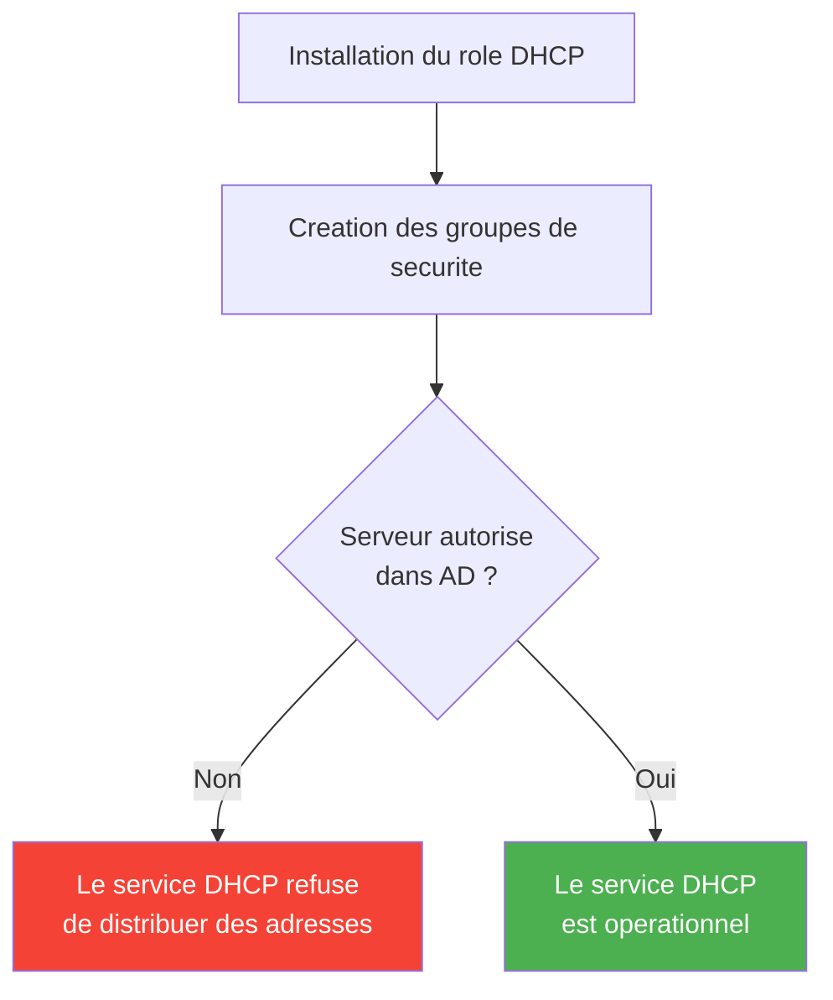

# Installation et configuration du DHCP

<span class="level-intermediate">Intermediaire</span> · Temps estime : 25 minutes

---

## Prerequis

Avant d'installer le role DHCP, verifiez les points suivants :

| Prerequis                        | Detail                                                |
| -------------------------------- | ----------------------------------------------------- |
| Systeme d'exploitation           | Windows Server 2022 (Standard ou Datacenter)          |
| Adresse IP statique              | Le serveur DHCP **doit** avoir une IP fixe            |
| Connectivite Active Directory    | Necessaire pour l'autorisation du serveur              |
| Droits d'administration          | Membre du groupe **Admins du domaine** ou equivalent  |
| Etendue planifiee                | Plage d'adresses IP a distribuer definie en amont     |

!!! danger "IP statique obligatoire"

    Un serveur DHCP ne peut **jamais** obtenir sa propre adresse via DHCP.
    Configurez une adresse IP statique avant de commencer l'installation.

---

## Installation du role DHCP

=== "PowerShell"

    ```powershell
    # Install the DHCP Server role with management tools
    Install-WindowsFeature -Name DHCP -IncludeManagementTools

    # Verify the installation
    Get-WindowsFeature -Name DHCP
    ```

    Le parametre `-IncludeManagementTools` installe automatiquement la console
    de gestion DHCP (`dhcpmgmt.msc`) et les cmdlets PowerShell du module
    `DhcpServer`.

=== "GUI"

    1. Ouvrir le **Gestionnaire de serveur** (Server Manager)
    2. Cliquer sur **Gerer** > **Ajouter des roles et fonctionnalites**
    3. Choisir **Installation basee sur un role ou une fonctionnalite**
    4. Selectionner le serveur cible
    5. Cocher **Serveur DHCP** dans la liste des roles
    6. Accepter l'ajout des fonctionnalites requises
    7. Cliquer sur **Suivant** puis **Installer**
    8. Attendre la fin de l'installation

!!! note "Redemarrage"

    L'installation du role DHCP ne necessite generalement **pas** de redemarrage
    du serveur.

---

## Configuration post-installation

Apres l'installation, un bandeau d'avertissement apparait dans le Gestionnaire
de serveur. Il reste deux etapes essentielles a effectuer.

### Creer les groupes de securite DHCP

L'installation cree automatiquement deux groupes de securite locaux :

| Groupe                       | Role                                                          |
| ---------------------------- | ------------------------------------------------------------- |
| **Administrateurs DHCP**     | Administration complete du service (creer des etendues, etc.) |
| **Utilisateurs DHCP**        | Acces en lecture seule (consultation des statistiques)         |

=== "PowerShell"

    ```powershell
    # Create the required DHCP security groups (post-install task)
    # This is equivalent to clicking "Complete DHCP configuration" in Server Manager
    Add-DhcpServerSecurityGroup -ComputerName "SRV-DHCP01"

    # Restart the DHCP service to apply group membership
    Restart-Service -Name DHCPServer
    ```

=== "GUI"

    1. Dans le **Gestionnaire de serveur**, cliquer sur le drapeau de notification
    2. Cliquer sur **Terminer la configuration DHCP**
    3. L'assistant cree les groupes de securite et effectue l'autorisation AD

### Autoriser le serveur DHCP dans Active Directory

!!! warning "Etape critique"

    Un serveur DHCP **non autorise** dans Active Directory ne distribuera
    **aucune adresse IP**. C'est un mecanisme de securite qui empeche les
    serveurs DHCP non approuves (rogue DHCP) de perturber le reseau.



=== "PowerShell"

    ```powershell
    # Authorize the DHCP server in Active Directory
    Add-DhcpServerInDC -DnsName "SRV-DHCP01.lab.local" -IPAddress 192.168.1.10

    # Verify the authorization
    Get-DhcpServerInDC

    # Notify Server Manager that post-install configuration is complete
    Set-ItemProperty -Path "HKLM:\SOFTWARE\Microsoft\ServerManager\Roles\12" `
        -Name "ConfigurationState" -Value 2
    ```

=== "GUI"

    1. Ouvrir la console **DHCP** (`dhcpmgmt.msc`)
    2. Clic droit sur le nom du serveur
    3. Selectionner **Autoriser**
    4. Verifier que l'icone du serveur passe du **rouge** (non autorise) au **vert** (autorise)

!!! tip "Verification rapide"

    ```powershell
    # List all authorized DHCP servers in the domain
    Get-DhcpServerInDC
    ```

    Si votre serveur apparait dans la liste, il est correctement autorise.

---

## Verification de l'installation

Apres l'installation et l'autorisation, verifiez que tout est en ordre :

```powershell
# Check that the DHCP service is running
Get-Service -Name DHCPServer

# Display DHCP server information
Get-DhcpServerSetting -ComputerName "SRV-DHCP01"

# Verify the DHCP server is authorized in AD
Get-DhcpServerInDC

# List the DHCP security groups
Get-LocalGroup | Where-Object { $_.Name -like "*DHCP*" }

# Check Windows Firewall rules for DHCP
Get-NetFirewallRule -DisplayGroup "DHCP Server" | Select-Object DisplayName, Enabled, Direction
```

---

## Configuration de base du serveur

### Parametres generaux du serveur

=== "PowerShell"

    ```powershell
    # Configure DNS dynamic update settings
    Set-DhcpServerv4DnsSetting -ComputerName "SRV-DHCP01" `
        -DynamicUpdates "Always" `
        -DeleteDnsRROnLeaseExpiry $true

    # Enable DHCP audit logging
    Set-DhcpServerAuditLog -ComputerName "SRV-DHCP01" -Enable $true -Path "C:\Windows\System32\dhcp"

    # Configure conflict detection (number of ping attempts before offering an IP)
    Set-DhcpServerSetting -ComputerName "SRV-DHCP01" -ConflictDetectionAttempts 2
    ```

=== "GUI"

    1. Ouvrir la console **DHCP** (`dhcpmgmt.msc`)
    2. Clic droit sur **IPv4** > **Proprietes**
    3. Onglet **DNS** : activer la mise a jour dynamique DNS
    4. Onglet **Avance** : activer la detection de conflits

### Mise a jour dynamique DNS

Lorsque le DHCP est integre a Active Directory, le serveur DHCP peut
**mettre a jour automatiquement** les enregistrements DNS pour les clients :

| Parametre                      | Description                                                     |
| ------------------------------ | --------------------------------------------------------------- |
| `DynamicUpdates: Always`       | Met a jour le DNS pour tous les clients (recommande)            |
| `DynamicUpdates: OnClientRequest` | Met a jour uniquement si le client le demande               |
| `DeleteDnsRROnLeaseExpiry`     | Supprime l'enregistrement DNS a l'expiration du bail            |

!!! tip "DNS et DHCP : un duo indispensable"

    La mise a jour dynamique DNS permet aux clients DHCP d'etre automatiquement
    resolus par leur nom. Cela facilite grandement l'administration et la
    communication entre machines. Consultez la page
    [Zones integrees AD](../dns/zones-integrees-ad.md) pour en savoir plus.

### Detection de conflits

La detection de conflits envoie des **pings** (ICMP Echo) a une adresse IP
avant de l'offrir a un client. Si l'adresse repond, le serveur la marque comme
**en conflit** et passe a la suivante.

!!! warning "Impact sur la performance"

    Activer la detection de conflits ajoute un delai a chaque attribution.
    Utilisez une valeur de **1 ou 2 tentatives** maximum sur les reseaux de
    production.

---

## Journal d'audit DHCP

Le journal d'audit enregistre toutes les operations du serveur DHCP dans des
fichiers texte :

```powershell
# View audit log status
Get-DhcpServerAuditLog -ComputerName "SRV-DHCP01"

# Default log location
# C:\Windows\System32\dhcp\DhcpSrvLog-*.log
```

Les codes les plus courants dans les journaux :

| Code | Signification                    |
| ---- | -------------------------------- |
| 10   | Nouveau bail attribue            |
| 11   | Bail renouvele                   |
| 12   | Bail libere                      |
| 13   | Adresse IP trouvee en cours d'utilisation |
| 15   | Bail refuse (NAK)                |
| 17   | Bail expire et supprime          |

---

## Script d'installation complete

Voici un script recapitulatif pour installer et configurer le role DHCP sur
un serveur fraichement deploye :

```powershell
# ============================================================================
# Complete DHCP Server installation and base configuration
# Target: Windows Server 2022 with a static IP already assigned
# ============================================================================

# --- Step 1: Install the DHCP role ---
Install-WindowsFeature -Name DHCP -IncludeManagementTools

# --- Step 2: Create security groups ---
Add-DhcpServerSecurityGroup -ComputerName $env:COMPUTERNAME

# --- Step 3: Authorize in Active Directory ---
$ServerFQDN = "$env:COMPUTERNAME.$((Get-WmiObject Win32_ComputerSystem).Domain)"
$ServerIP = (Get-NetIPAddress -AddressFamily IPv4 |
    Where-Object { $_.PrefixOrigin -eq "Manual" -and $_.IPAddress -ne "127.0.0.1" }).IPAddress

Add-DhcpServerInDC -DnsName $ServerFQDN -IPAddress $ServerIP

# --- Step 4: Notify Server Manager that post-install is complete ---
Set-ItemProperty -Path "HKLM:\SOFTWARE\Microsoft\ServerManager\Roles\12" `
    -Name "ConfigurationState" -Value 2

# --- Step 5: Configure DNS dynamic updates ---
Set-DhcpServerv4DnsSetting -ComputerName $env:COMPUTERNAME `
    -DynamicUpdates "Always" `
    -DeleteDnsRROnLeaseExpiry $true

# --- Step 6: Enable audit logging ---
Set-DhcpServerAuditLog -ComputerName $env:COMPUTERNAME -Enable $true

# --- Step 7: Restart the service ---
Restart-Service -Name DHCPServer

# --- Verification ---
Write-Output "=== DHCP Server Status ==="
Get-Service -Name DHCPServer
Write-Output "`n=== Authorized DHCP Servers ==="
Get-DhcpServerInDC
```

---

## Points cles a retenir

- Le serveur DHCP **doit** avoir une adresse IP statique
- L'installation cree deux groupes de securite : **Administrateurs DHCP** et **Utilisateurs DHCP**
- **L'autorisation dans AD** est obligatoire : sans elle, le serveur ne distribue aucune adresse
- La mise a jour dynamique DNS permet au DHCP de creer automatiquement les enregistrements DNS
- La detection de conflits ajoute une verification avant chaque attribution mais impacte legerement la performance
- Les journaux d'audit sont un outil precieux pour le depannage

---

## Pour aller plus loin

- [Concepts DHCP](concepts-dhcp.md) -- revoir les fondamentaux du protocole DORA
- [Etendues et options DHCP](etendues-et-options.md) -- creer votre premiere etendue apres l'installation
- [Reservations DHCP](reservations.md) -- attribuer des adresses fixes aux equipements critiques
- [Basculement DHCP](basculement-dhcp.md) -- mettre en place la haute disponibilite
- [Installer le premier controleur de domaine](../adds/installer-premier-dc.md) -- prerequis AD pour l'autorisation DHCP
