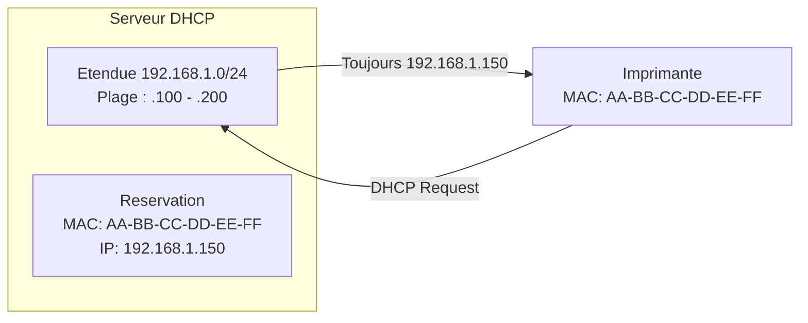

# Reservations DHCP

!!! info "Niveau : Intermediaire | Temps de lecture : 20 minutes"

    Cette page explique comment creer des reservations DHCP pour garantir
    qu'un equipement recoit toujours la meme adresse IP, tout en beneficiant
    de la gestion centralisee du DHCP.

---

## Qu'est-ce qu'une reservation ?

Une **reservation DHCP** associe une adresse IP specifique a une **adresse MAC**
(adresse physique) d'un equipement. Lorsque cet equipement envoie un DHCP
Discover, le serveur lui attribue **toujours la meme adresse IP**.



### Reservation vs. IP statique

| Critere                    | Reservation DHCP           | IP statique manuelle       |
| -------------------------- | -------------------------- | -------------------------- |
| Gestion centralisee        | Oui (sur le serveur DHCP)  | Non (sur chaque machine)   |
| Options DHCP distribuees   | Oui (DNS, passerelle, etc.)| Non                        |
| Mise a jour DNS dynamique  | Automatique                | Manuelle ou via le client  |
| Changement d'adresse       | Modification serveur seul  | Intervention sur la machine|
| Bail et renouvellement     | Oui                        | Non                        |
| Fonctionnement hors reseau | Non (serveur necessaire)   | Oui                        |

!!! tip "Quand utiliser une reservation plutot qu'une IP statique ?"

    Privilegiez la reservation DHCP pour tout equipement qui doit avoir une
    IP fixe **et** qui supporte le DHCP. Cela centralise la gestion et facilite
    les modifications (pas besoin d'acceder physiquement a la machine).

    Reservez l'IP statique aux equipements qui **ne supportent pas** le DHCP
    ou qui doivent fonctionner **meme si le serveur DHCP est indisponible**
    (controleurs de domaine, serveurs DHCP eux-memes, etc.).

---

## Cas d'utilisation courants

| Equipement                  | Raison de la reservation                                      |
| --------------------------- | ------------------------------------------------------------- |
| **Imprimantes reseau**      | Les postes se connectent a l'imprimante par son IP            |
| **Serveurs d'applications** | Les regles de pare-feu referencent des IP fixes               |
| **Bornes Wi-Fi**            | La gestion centralisee necessite des IP previsibles           |
| **Cameras IP**              | Les logiciels de videosurveillance pointent vers des IP fixes |
| **NAS / stockage**          | Les montages reseau (lecteurs mappes) utilisent des IP fixes  |
| **Equipements IoT**         | Les tableaux de bord et API utilisent des IP constantes       |

---

## Trouver l'adresse MAC d'un equipement

Avant de creer une reservation, il faut connaitre l'adresse MAC de
l'equipement cible :

=== "PowerShell"

    ```powershell
    # Find the MAC address of the local machine
    Get-NetAdapter | Select-Object Name, MacAddress, Status

    # Find the MAC address of a remote machine (via its current DHCP lease)
    Get-DhcpServerv4Lease -ComputerName "SRV-DHCP01" -ScopeId 192.168.1.0 |
        Where-Object { $_.HostName -like "*IMPRIMANTE*" } |
        Select-Object IPAddress, ClientId, HostName

    # Find MAC address from an IP via ARP table (must have communicated recently)
    Get-NetNeighbor -IPAddress "192.168.1.155" | Select-Object IPAddress, LinkLayerAddress

    # List all active leases to find a specific device
    Get-DhcpServerv4Lease -ComputerName "SRV-DHCP01" -ScopeId 192.168.1.0 |
        Format-Table IPAddress, ClientId, HostName, LeaseExpiryTime -AutoSize
    ```

=== "CMD"

    ```powershell
    # Classic method via command prompt
    ipconfig /all          # On the target machine (shows Physical Address)
    arp -a                 # On any machine (shows ARP cache)
    getmac /s HOSTNAME     # Query a remote machine
    ```

!!! note "Format de l'adresse MAC"

    L'adresse MAC peut etre saisie avec ou sans tirets.
    Windows Server accepte les deux formats :

    - Avec tirets : `AA-BB-CC-DD-EE-FF`
    - Sans tirets : `AABBCCDDEEFF`

---

## Creer une reservation

=== "PowerShell"

    ```powershell
    # Create a DHCP reservation for a network printer
    Add-DhcpServerv4Reservation -ComputerName "SRV-DHCP01" `
        -ScopeId 192.168.1.0 `
        -IPAddress 192.168.1.150 `
        -ClientId "AA-BB-CC-DD-EE-FF" `
        -Name "IMP-RDC-01" `
        -Description "Imprimante RDC - Batiment A"

    # Verify the reservation
    Get-DhcpServerv4Reservation -ComputerName "SRV-DHCP01" -ScopeId 192.168.1.0
    ```

=== "GUI"

    1. Ouvrir la console **DHCP** (`dhcpmgmt.msc`)
    2. Developper le serveur > **IPv4** > l'etendue cible
    3. Clic droit sur **Reservations** > **Nouvelle reservation**
    4. Remplir les champs :
        - **Nom de la reservation** : `IMP-RDC-01`
        - **Adresse IP** : `192.168.1.150`
        - **Adresse MAC** : `AA-BB-CC-DD-EE-FF`
        - **Description** : `Imprimante RDC - Batiment A`
    5. Choisir le type : **Les deux** (DHCP et BOOTP)
    6. Cliquer sur **Ajouter**

!!! warning "L'adresse doit etre dans l'etendue"

    L'adresse IP reservee doit **obligatoirement** appartenir a la plage
    d'adresses de l'etendue. Elle peut se trouver dans une plage d'exclusion :
    dans ce cas, seul l'equipement reserve pourra l'obtenir.

---

## Configurer des options specifiques a une reservation

Chaque reservation peut avoir ses propres options DHCP, qui prennent la
priorite sur les options d'etendue et de serveur (voir
[hierarchie des options](etendues-et-options.md#hierarchie-des-options)).

=== "PowerShell"

    ```powershell
    # Set specific DNS servers for a reservation
    Set-DhcpServerv4OptionValue -ComputerName "SRV-DHCP01" `
        -ReservedIP 192.168.1.150 `
        -OptionId 6 `
        -Value "10.0.0.53"

    # Set a custom option (example: TFTP server for a VoIP phone)
    Set-DhcpServerv4OptionValue -ComputerName "SRV-DHCP01" `
        -ReservedIP 192.168.1.160 `
        -OptionId 66 `
        -Value "192.168.1.5"

    # View options configured for a reservation
    Get-DhcpServerv4OptionValue -ComputerName "SRV-DHCP01" -ReservedIP 192.168.1.150
    ```

=== "GUI"

    1. Developper l'etendue > **Reservations**
    2. Clic droit sur la reservation cible > **Configurer les options**
    3. Cocher et remplir les options souhaitees
    4. Cliquer sur **OK**

---

## Convertir un bail existant en reservation

Il est courant de vouloir transformer un bail actif en reservation permanente.
Voici comment proceder :

```powershell
# Find the current lease for a device
$Lease = Get-DhcpServerv4Lease -ComputerName "SRV-DHCP01" -ScopeId 192.168.1.0 |
    Where-Object { $_.HostName -like "*CAMERA*" }

# Convert the lease to a reservation
Add-DhcpServerv4Reservation -ComputerName "SRV-DHCP01" `
    -ScopeId 192.168.1.0 `
    -IPAddress $Lease.IPAddress `
    -ClientId $Lease.ClientId `
    -Name "CAM-01" `
    -Description "Camera IP - Hall entree"

Write-Output "Reservation created for $($Lease.HostName) at $($Lease.IPAddress)"
```

---

## Gestion en masse des reservations

### Exporter les reservations

```powershell
# Export all reservations from a scope to CSV
Get-DhcpServerv4Reservation -ComputerName "SRV-DHCP01" -ScopeId 192.168.1.0 |
    Select-Object Name, IPAddress, ClientId, Description |
    Export-Csv -Path "C:\Admin\DHCP-Reservations-Export.csv" -NoTypeInformation -Encoding UTF8
```

### Importer des reservations depuis un CSV

```powershell
# CSV format expected: Name, IPAddress, ClientId, Description
# Example line: IMP-RDC-02,192.168.1.151,BB-CC-DD-EE-FF-00,Imprimante 2e etage

$Reservations = Import-Csv -Path "C:\Admin\DHCP-Reservations-Import.csv"

foreach ($Res in $Reservations) {
    Add-DhcpServerv4Reservation -ComputerName "SRV-DHCP01" `
        -ScopeId 192.168.1.0 `
        -IPAddress $Res.IPAddress `
        -ClientId $Res.ClientId `
        -Name $Res.Name `
        -Description $Res.Description

    Write-Output "Created reservation: $($Res.Name) -> $($Res.IPAddress)"
}
```

### Supprimer une reservation

=== "PowerShell"

    ```powershell
    # Remove a specific reservation
    Remove-DhcpServerv4Reservation -ComputerName "SRV-DHCP01" `
        -ScopeId 192.168.1.0 `
        -ClientId "AA-BB-CC-DD-EE-FF"

    # Remove all reservations in a scope (use with caution)
    Get-DhcpServerv4Reservation -ComputerName "SRV-DHCP01" -ScopeId 192.168.1.0 |
        Remove-DhcpServerv4Reservation
    ```

=== "GUI"

    1. Developper l'etendue > **Reservations**
    2. Clic droit sur la reservation a supprimer > **Supprimer**
    3. Confirmer la suppression

---

## Depannage des reservations

### Problemes courants

| Probleme                                     | Cause probable                                    | Solution                                          |
| -------------------------------------------- | ------------------------------------------------- | ------------------------------------------------- |
| Le client ne recoit pas l'IP reservee        | Adresse MAC incorrecte                            | Verifier avec `Get-NetAdapter` sur le client       |
| Le client recoit une autre IP                | Ancienne carte reseau, MAC change                 | Mettre a jour le `ClientId` de la reservation      |
| Conflit d'adresse IP                         | Un autre appareil utilise deja cette IP            | Supprimer le bail en conflit, verifier les doublons |
| La reservation ne fonctionne pas apres failover | Reservation non repliquee                      | Verifier la configuration du [basculement](basculement-dhcp.md) |

### Commandes de diagnostic

```powershell
# Check if a reservation exists for a specific MAC
Get-DhcpServerv4Reservation -ComputerName "SRV-DHCP01" -ScopeId 192.168.1.0 |
    Where-Object { $_.ClientId -eq "AA-BB-CC-DD-EE-FF" }

# Check if the reserved IP is currently leased to someone else
Get-DhcpServerv4Lease -ComputerName "SRV-DHCP01" -IPAddress 192.168.1.150

# Check for duplicate MAC addresses across all scopes
Get-DhcpServerv4Scope -ComputerName "SRV-DHCP01" | ForEach-Object {
    Get-DhcpServerv4Reservation -ComputerName "SRV-DHCP01" -ScopeId $_.ScopeId
} | Group-Object ClientId | Where-Object { $_.Count -gt 1 }

# Force a client to renew and pick up its reservation
# (run on the client machine)
ipconfig /release
ipconfig /renew
```

---

## Bonnes pratiques

!!! tip "Conventions de nommage"

    Adoptez une convention coherente pour nommer vos reservations :

    - **Imprimantes** : `IMP-<ETAGE>-<NUMERO>` (ex : `IMP-RDC-01`)
    - **Cameras** : `CAM-<LOCALISATION>-<NUMERO>` (ex : `CAM-HALL-01`)
    - **Bornes Wi-Fi** : `WAP-<BATIMENT>-<ETAGE>` (ex : `WAP-A-02`)
    - **Serveurs** : `SRV-<ROLE>-<NUMERO>` (ex : `SRV-APP-01`)

!!! tip "Documentation"

    Utilisez le champ **Description** de chaque reservation pour indiquer
    l'emplacement physique de l'equipement et son role. Cela facilite
    grandement le depannage et la maintenance.

---

## Points cles a retenir

- Une **reservation** associe une adresse IP fixe a une adresse MAC via le serveur DHCP
- La reservation permet de beneficier de la **gestion centralisee** (options, DNS dynamique) contrairement a l'IP statique
- L'adresse IP reservee doit appartenir a la plage de l'etendue
- Les **options de reservation** sont prioritaires sur les options d'etendue et de serveur
- L'export/import CSV facilite la gestion en masse des reservations
- Adoptez une **convention de nommage** claire et utilisez le champ description

---

## Pour aller plus loin

- [Etendues et options DHCP](etendues-et-options.md) -- comprendre la hierarchie des options
- [Concepts DHCP](concepts-dhcp.md) -- revoir le mecanisme d'attribution des baux
- [Basculement DHCP](basculement-dhcp.md) -- repliquer les reservations entre serveurs
- [Installation et configuration](installation-configuration.md) -- mise en place initiale du serveur DHCP
