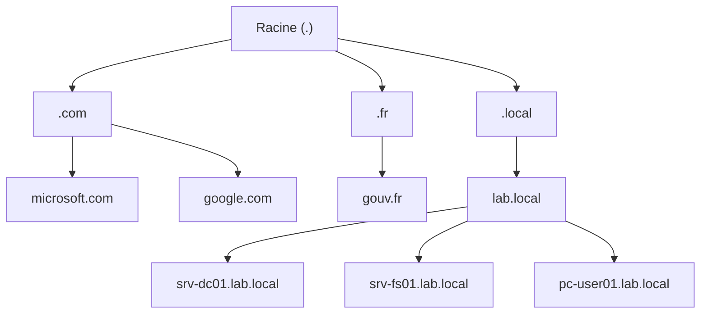
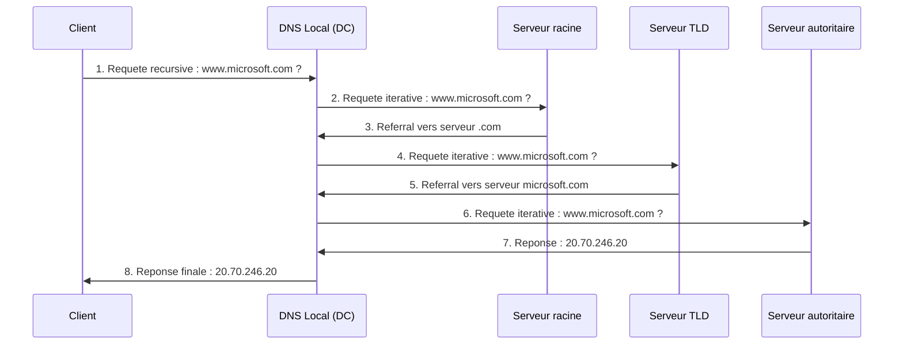
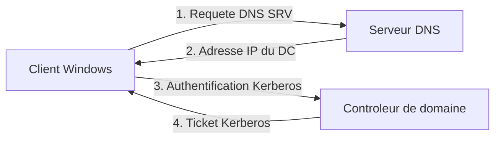

# Concepts DNS

<span class="level-beginner">Fondamental</span> · Temps estime : 30 minutes

## Qu'est-ce que le DNS ?

!!! example "Analogie"

    Imaginez un annuaire telephonique geant : vous cherchez le nom d'une personne (ex : "Martin Dupont") et l'annuaire vous donne son numero de telephone. Le DNS fonctionne exactement pareil, mais pour les ordinateurs : vous donnez un nom (`srv-dc01.lab.local`) et il vous renvoie l'adresse IP correspondante.

Le **Domain Name System** (DNS) est un systeme de resolution de noms distribue. Il traduit les noms de domaine lisibles par l'homme (ex: `srv-dc01.lab.local`) en adresses IP exploitables par les machines (ex: `192.168.1.10`).

DNS fonctionne comme un annuaire telephonique mondial : plutot que de retenir des adresses IP, on utilise des noms.

- **Port 53** : UDP pour les requetes standards, TCP pour les transferts de zone et les reponses volumineuses
- **Protocole de couche application** (modele OSI couche 7)
- **Systeme distribue** : aucun serveur unique ne contient toutes les reponses

## Hierarchie DNS

Le DNS est organise en arborescence inversee, de la racine vers les feuilles :



### Les niveaux de la hierarchie

| Niveau | Description | Exemples |
|--------|-------------|----------|
| **Racine (Root)** | Point invisible tout en haut, represente par un point `.` | `.` |
| **TLD (Top-Level Domain)** | Premier niveau sous la racine | `.com`, `.fr`, `.org`, `.local` |
| **Domaine de second niveau** | Nom enregistre sous le TLD | `lab.local`, `microsoft.com` |
| **Sous-domaine** | Subdivisions supplementaires | `paris.lab.local` |
| **FQDN** | Nom complet avec le point final | `srv-dc01.lab.local.` |

!!! tip "FQDN vs nom relatif"

    Un **FQDN** (Fully Qualified Domain Name) se termine par un point :
    `srv-dc01.lab.local.` -- c'est le nom complet et non ambigu.
    Sans le point final, le systeme peut ajouter un suffixe DNS automatiquement.

## Types de requetes DNS

### Requete recursive

Le client demande une reponse **complete** au serveur DNS. Le serveur doit fournir la reponse finale ou une erreur -- il ne peut pas rediriger vers un autre serveur.

### Requete iterative

Le serveur DNS repond avec la **meilleure information qu'il possede** : soit la reponse, soit une reference vers un autre serveur DNS qui pourrait connaitre la reponse.



Le serveur DNS local effectue le travail iteratif pour le client -- c'est le modele standard dans un reseau Active Directory.

## Resolution directe et inverse

### Resolution directe (Forward Lookup)

Traduit un **nom** en **adresse IP** :

```
srv-dc01.lab.local  -->  192.168.1.10
```

C'est le type de requete le plus courant. Les zones de recherche directe contiennent principalement des enregistrements A et AAAA.

### Resolution inverse (Reverse Lookup)

Traduit une **adresse IP** en **nom** :

```
192.168.1.10  -->  srv-dc01.lab.local
```

Utilise des enregistrements **PTR** dans des zones inversees. Le nom de la zone inverse est construit a partir de l'adresse reseau inversee avec le suffixe `in-addr.arpa` :

| Reseau | Zone inverse |
|--------|-------------|
| `192.168.1.0/24` | `1.168.192.in-addr.arpa` |
| `10.0.0.0/8` | `10.in-addr.arpa` |

```powershell
# Forward lookup
Resolve-DnsName -Name "srv-dc01.lab.local" -Type A

# Reverse lookup
Resolve-DnsName -Name "192.168.1.10" -Type PTR
```

Resultat :

```text
Name                           Type   TTL   Section    IPAddress
----                           ----   ---   -------    ---------
srv-dc01.lab.local             A      3600  Answer     10.0.0.10

Name                           Type   TTL   Section    NameHost
----                           ----   ---   -------    --------
10.0.0.10.in-addr.arpa         PTR    3600  Answer     srv-dc01.lab.local
```

## Cache DNS

Pour eviter de repeter les memes requetes, chaque element de la chaine DNS utilise un cache :

- **Cache client** : le poste Windows conserve les reponses recentes
- **Cache serveur** : le serveur DNS garde les resultats des requetes iteratives
- **TTL** (Time To Live) : duree de vie en secondes de chaque enregistrement en cache

```powershell
# View the local DNS cache on a client
Get-DnsClientCache

# Flush the local DNS cache
Clear-DnsClientCache

# View the DNS server cache
Show-DnsServerCache -ComputerName "SRV-DC01"

# Clear the DNS server cache
Clear-DnsServerCache -ComputerName "SRV-DC01"
```

Resultat :

```text
Entry                     RecordName                Record  Status    Section  TimeTo  Data
                                                    Type                       Live
-----                     ----------                ------  ------    -------  ------  ----
srv-dc01.lab.local        srv-dc01.lab.local        A       Success   Answer   2845    10.0.0.10
srv-01.lab.local          srv-01.lab.local           A       Success   Answer   1230    10.0.0.20
www.microsoft.com         www.microsoft.com          CNAME   Success   Answer   120     www.microsoft...
```

## Pourquoi DNS est critique pour Active Directory

Active Directory est **completement dependant** du DNS. Sans DNS fonctionnel, AD ne peut pas fonctionner.



### Enregistrements SRV

Les clients localisent les services AD via des enregistrements **SRV** (Service Locator) enregistres automatiquement dans le DNS :

| Enregistrement SRV | Service |
|---------------------|---------|
| `_ldap._tcp.lab.local` | Localisation des DC (LDAP) |
| `_kerberos._tcp.lab.local` | Authentification Kerberos |
| `_gc._tcp.lab.local` | Catalogue global |
| `_kpasswd._tcp.lab.local` | Changement de mot de passe |

```powershell
# Find domain controllers via SRV records
Resolve-DnsName -Name "_ldap._tcp.lab.local" -Type SRV

# Find Global Catalog servers
Resolve-DnsName -Name "_gc._tcp.lab.local" -Type SRV
```

Resultat :

```text
Name                                    Type   TTL   Section    NameTarget                 Priority Weight Port
----                                    ----   ---   -------    ----------                 -------- ------ ----
_ldap._tcp.lab.local                    SRV    600   Answer     DC-01.lab.local            0        100    389
_ldap._tcp.lab.local                    SRV    600   Answer     SRV-DC01.lab.local         0        100    389

_gc._tcp.lab.local                      SRV    600   Answer     DC-01.lab.local            0        100    3268
```

!!! danger "Pas de DNS = pas d'Active Directory"

    Si le DNS est en panne, les consequences sont immediates :

    - Les clients ne trouvent plus les controleurs de domaine
    - L'authentification Kerberos echoue
    - Les strategies de groupe ne s'appliquent plus
    - La replication inter-DC est interrompue
    - La jonction au domaine est impossible

### Pourquoi installer DNS sur les DC ?

Dans la majorite des environnements, le role DNS est installe sur chaque controleur de domaine :

- **Enregistrement automatique** : les DC enregistrent leurs SRV dans le DNS local
- **Zones integrees AD** : la base DNS est repliquee via la replication AD
- **Haute disponibilite** : plusieurs DC = plusieurs serveurs DNS
- **Mises a jour dynamiques securisees** : seuls les membres du domaine peuvent enregistrer des noms

## Serveur DNS sous Windows Server

### Installation du role DNS

=== "PowerShell"

    ```powershell
    # Install the DNS Server role
    Install-WindowsFeature -Name DNS -IncludeManagementTools

    # Verify the role is installed
    Get-WindowsFeature -Name DNS
    ```

    Resultat :

    ```text
    Success Restart Needed Exit Code      Feature Result
    ------- -------------- ---------      --------------
    True    No             Success        {DNS Server, DNS Server Tools}

    Display Name                                            Name       Install State
    ------------                                            ----       -------------
    [X] DNS Server                                          DNS        Installed
    ```

=== "GUI"

    1. Ouvrir le **Gestionnaire de serveur**
    2. Cliquer sur **Gerer** > **Ajouter des roles et fonctionnalites**
    3. Selectionner **Serveur DNS**
    4. Valider l'ajout des outils de gestion
    5. Terminer l'assistant

!!! tip "Installation avec AD DS"

    Lors de la promotion d'un serveur en controleur de domaine avec `Install-ADDSForest`
    ou `Install-ADDSDomainController`, le role DNS est propose automatiquement.
    Il est fortement recommande de l'installer en meme temps.

### Console DNS Manager

La console **dnsmgmt.msc** permet d'administrer graphiquement le serveur DNS :

- Zones de recherche directe et inverse
- Redirecteurs (forwarders)
- Enregistrements individuels
- Proprietes du serveur (cache, journalisation, interfaces)

```powershell
# Launch DNS Manager console
dnsmgmt.msc
```

## Flux de resolution dans un environnement AD

Voici le parcours complet lorsqu'un utilisateur ouvre un partage reseau `\\srv-fs01\partage` :

1. Le client interroge son **serveur DNS prefere** (configure via DHCP ou manuellement)
2. Le serveur DNS verifie sa **zone locale** pour `srv-fs01.lab.local`
3. Si l'enregistrement existe, il retourne l'adresse IP
4. Si la zone n'est pas autoritaire, le serveur consulte ses **redirecteurs** ou effectue une **resolution recursive**
5. Le client recoit l'IP et etablit la connexion SMB

```powershell
# Check which DNS server a client is using
Get-DnsClientServerAddress -InterfaceAlias "Ethernet" | Select-Object ServerAddresses

# Test full DNS resolution path
Resolve-DnsName -Name "srv-fs01.lab.local" -Type A -DnsOnly
```

Resultat :

```text
ServerAddresses
---------------
{10.0.0.10, 10.0.0.11}

Name                           Type   TTL   Section    IPAddress
----                           ----   ---   -------    ---------
srv-fs01.lab.local             A      3600  Answer     10.0.0.20
```

!!! example "Scenario pratique"

    **Situation** : Sophie, administratrice systeme, vient de deployer un nouveau serveur de fichiers `SRV-FS02` sur le reseau `10.0.0.0/24`. Les utilisateurs se plaignent de ne pas pouvoir acceder au partage `\\SRV-FS02\Projets`.

    **Diagnostic** :

    ```powershell
    # Etape 1 : Verifier si le nom se resout
    Resolve-DnsName -Name "SRV-FS02.lab.local" -Type A -DnsOnly
    ```

    Le resultat montre que l'enregistrement n'existe pas. Le serveur a une IP statique et n'a pas ete enregistre dans le DNS.

    ```powershell
    # Etape 2 : Verifier le serveur DNS configure sur SRV-FS02
    Get-DnsClientServerAddress -InterfaceAlias "Ethernet"
    ```

    Le serveur DNS pointe vers `8.8.8.8` au lieu du DC local. Le serveur n'est donc pas enregistre dans la zone `lab.local`.

    **Solution** :

    ```powershell
    # Corriger le serveur DNS sur SRV-FS02
    Set-DnsClientServerAddress -InterfaceAlias "Ethernet" -ServerAddresses "10.0.0.10","10.0.0.11"

    # Forcer l'enregistrement DNS
    Register-DnsClient

    # Verifier que l'enregistrement est maintenant present
    Resolve-DnsName -Name "SRV-FS02.lab.local" -Type A -DnsOnly
    ```

    Les utilisateurs peuvent desormais acceder au partage `\\SRV-FS02\Projets`.

!!! danger "Erreurs courantes"

    - **Utiliser un DNS public (8.8.8.8) comme DNS principal sur les postes du domaine** : les postes ne trouvent plus les controleurs de domaine car les enregistrements SRV de `lab.local` ne sont pas dans les DNS publics. Utilisez toujours les DC comme serveurs DNS principaux.
    - **Oublier le suffixe DNS** : taper `ping srv-dc01` au lieu de `ping srv-dc01.lab.local` peut echouer si le suffixe DNS n'est pas configure sur le client. Verifiez la configuration du suffixe via DHCP ou GPO.
    - **Confondre FQDN et nom NetBIOS** : le DNS resout les FQDN (`srv-dc01.lab.local`), pas les noms NetBIOS (`SRV-DC01`). La resolution NetBIOS passe par WINS ou les broadcasts, mecanismes moins fiables.
    - **Ne pas creer la zone de recherche inverse** : sans zone inverse, les commandes `nslookup` affichent des avertissements et certains outils de securite ne fonctionnent pas correctement.

## Points cles a retenir

- DNS traduit les noms de domaine en adresses IP (et inversement)
- La hierarchie DNS va de la racine (`.`) aux FQDN en passant par les TLD
- Les requetes recursives sont effectuees par le serveur pour le client
- Active Directory depend entierement du DNS pour localiser les DC via les enregistrements SRV
- Le role DNS est presque toujours installe sur les controleurs de domaine
- Le cache DNS (client et serveur) ameliore les performances mais peut causer des problemes de resolution si les donnees sont obsoletes

## Pour aller plus loin

- [Zones integrees AD](zones-integrees-ad.md) -- comprendre les zones DNS stockees dans Active Directory
- [Enregistrements DNS](enregistrements.md) -- types d'enregistrements et gestion
- [Depannage DNS](depannage-dns.md) -- diagnostiquer les problemes de resolution
- [Concepts fondamentaux AD DS](../adds/concepts-fondamentaux.md) -- comprendre l'annuaire Active Directory
