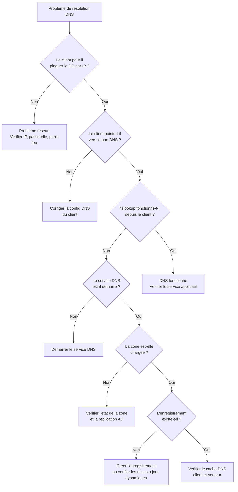

# Depannage DNS

<span class="level-advanced">Avance</span> · Temps estime : 40 minutes

## Methodologie de diagnostic

Face a un probleme de resolution DNS dans un environnement Active Directory, suivez cette approche methodique :



## Outils de diagnostic

### nslookup

L'outil classique de requete DNS, disponible sur tous les systemes Windows :

```powershell
# Basic query
nslookup srv-dc01.lab.local

# Query a specific DNS server
nslookup srv-dc01.lab.local 192.168.1.10

# Interactive mode - useful for multiple queries
nslookup
> server 192.168.1.10
> set type=SRV
> _ldap._tcp.lab.local
> set type=A
> srv-dc01.lab.local
> exit

# Query a specific record type
nslookup -type=MX lab.local
nslookup -type=SOA lab.local
nslookup -type=NS lab.local

# Reverse lookup
nslookup 192.168.1.10

# Enable debug output for detailed response analysis
nslookup -debug srv-dc01.lab.local
```

!!! tip "nslookup ignore le cache client"

    `nslookup` interroge directement le serveur DNS et ne consulte pas le cache
    du client Windows. Si `nslookup` fonctionne mais que `ping` par nom echoue,
    le probleme vient probablement du cache DNS local.

### Resolve-DnsName (PowerShell)

La cmdlet PowerShell moderne, plus flexible et puissante que nslookup :

```powershell
# Basic resolution
Resolve-DnsName -Name "srv-dc01.lab.local"

# Specify record type
Resolve-DnsName -Name "lab.local" -Type MX
Resolve-DnsName -Name "lab.local" -Type SOA
Resolve-DnsName -Name "lab.local" -Type NS

# Query a specific DNS server
Resolve-DnsName -Name "srv-dc01.lab.local" -Server "192.168.1.10"

# DNS only (skip LLMNR and NetBIOS)
Resolve-DnsName -Name "srv-dc01.lab.local" -DnsOnly

# TCP instead of UDP (useful for large responses)
Resolve-DnsName -Name "lab.local" -Type ANY -TcpOnly

# Reverse lookup
Resolve-DnsName -Name "192.168.1.10" -Type PTR

# Check SRV records for AD services
Resolve-DnsName -Name "_ldap._tcp.lab.local" -Type SRV
Resolve-DnsName -Name "_kerberos._tcp.lab.local" -Type SRV
Resolve-DnsName -Name "_gc._tcp.lab.local" -Type SRV
```

### dcdiag /test:dns

L'outil de diagnostic Active Directory inclut un test DNS complet qui verifie l'ensemble de la configuration DNS necessaire au bon fonctionnement d'AD :

```powershell
# Full DNS test on the local DC
dcdiag /test:dns /v

# DNS test targeting a specific DC
dcdiag /test:dns /s:SRV-DC01 /v

# Test specific DNS sub-checks
dcdiag /test:dns /DnsBasic /s:SRV-DC01
dcdiag /test:dns /DnsForwarders /s:SRV-DC01
dcdiag /test:dns /DnsDelegation /s:SRV-DC01
dcdiag /test:dns /DnsDynamicUpdate /s:SRV-DC01
dcdiag /test:dns /DnsRecordRegistration /s:SRV-DC01

# DNS test on all DCs in the domain
dcdiag /test:dns /v /e
```

Les sous-tests DNS de dcdiag :

| Sous-test | Verification |
|-----------|-------------|
| **DnsBasic** | Connectivite DNS et configuration de base |
| **DnsForwarders** | Redirecteurs et resolution externe |
| **DnsDelegation** | Delegation DNS correcte |
| **DnsDynamicUpdate** | Mises a jour dynamiques fonctionnelles |
| **DnsRecordRegistration** | Enregistrements SRV et A du DC |
| **DnsResolveExtName** | Resolution de noms externes |
| **DnsAll** | Tous les sous-tests |

### Autres outils utiles

```powershell
# Test DNS resolution AND connectivity
Test-Connection -ComputerName "srv-dc01.lab.local" -Count 2

# View the client DNS configuration
Get-DnsClientServerAddress | Format-Table InterfaceAlias, ServerAddresses

# View DNS suffix search list
Get-DnsClient | Select-Object InterfaceAlias, ConnectionSpecificSuffix, UseSuffixWhenRegistering

# Test port 53 connectivity to a DNS server
Test-NetConnection -ComputerName "192.168.1.10" -Port 53

# Check the DNS server service status
Get-Service -Name DNS -ComputerName "SRV-DC01"

# View DNS server event log
Get-WinEvent -LogName "DNS Server" -ComputerName "SRV-DC01" -MaxEvents 20

# Check DNS server statistics
Get-DnsServerStatistics -ComputerName "SRV-DC01"
```

## Gestion du cache DNS

### Cache client

Chaque poste Windows conserve un cache DNS local pour accelerer les resolutions repetees :

```powershell
# View the DNS client cache
Get-DnsClientCache

# View cache entries for a specific name
Get-DnsClientCache | Where-Object { $_.Entry -like "*srv-dc01*" }

# Flush the entire DNS client cache
Clear-DnsClientCache

# Register the client's DNS records (force dynamic update)
Register-DnsClient
```

### Cache serveur

Le serveur DNS conserve egalement un cache des requetes resolues pour d'autres domaines :

```powershell
# View the server-side DNS cache
Show-DnsServerCache -ComputerName "SRV-DC01"

# Clear the server-side DNS cache
Clear-DnsServerCache -ComputerName "SRV-DC01" -Force

# View cache settings (max TTL, etc.)
Get-DnsServerCache -ComputerName "SRV-DC01"

# Set maximum cache TTL (example: 1 day)
Set-DnsServerCache -MaxTtl 1.00:00:00 -ComputerName "SRV-DC01"
```

!!! warning "Vider le cache resout souvent les problemes de resolution"

    Quand un enregistrement DNS a ete modifie mais que la resolution retourne
    l'ancienne valeur, videz le cache client (`Clear-DnsClientCache`) puis le
    cache serveur (`Clear-DnsServerCache`) si necessaire. Le TTL controle
    la duree de vie des entrees en cache.

## Validation des enregistrements SRV

Les enregistrements SRV sont la pierre angulaire de la localisation des services AD. Leur absence ou leur erreur provoque des dysfonctionnements graves.

### Verification rapide

```powershell
# Verify all critical SRV records for the domain
$domain = "lab.local"
$srvRecords = @(
    "_ldap._tcp.$domain",
    "_kerberos._tcp.$domain",
    "_gc._tcp.$domain",
    "_kpasswd._tcp.$domain",
    "_ldap._tcp.dc._msdcs.$domain"
)

foreach ($record in $srvRecords) {
    Write-Host "`n--- $record ---" -ForegroundColor Cyan
    try {
        Resolve-DnsName -Name $record -Type SRV -DnsOnly -ErrorAction Stop |
            Format-Table Name, Type, NameTarget, Port, Priority -AutoSize
    }
    catch {
        Write-Host "  ERREUR : Enregistrement non trouve !" -ForegroundColor Red
    }
}
```

### Verification via le fichier Netlogon.dns

Chaque DC genere un fichier contenant les enregistrements SRV qu'il doit enregistrer :

```powershell
# View the expected SRV records for a DC
Get-Content "C:\Windows\System32\config\netlogon.dns" | Select-Object -First 30

# Compare with what is actually registered in DNS
$expectedRecords = Get-Content "C:\Windows\System32\config\netlogon.dns" |
    Where-Object { $_ -match "^_" }
Write-Host "Number of SRV records expected: $($expectedRecords.Count)"
```

### Re-enregistrer les SRV manquants

Si des enregistrements SRV sont absents, forcez leur re-enregistrement :

```powershell
# Restart the Netlogon service (re-registers all SRV records)
Restart-Service -Name Netlogon

# Or force re-registration via nltest
nltest /dsregdns

# Verify the registration was successful
Resolve-DnsName -Name "_ldap._tcp.lab.local" -Type SRV -DnsOnly
```

!!! danger "Enregistrements SRV manquants"

    Si les enregistrements SRV ne se re-enregistrent pas apres un redemarrage de
    Netlogon, verifiez :

    - Que la zone DNS autorise les mises a jour dynamiques
    - Que le DC pointe vers lui-meme (ou un autre DC) comme serveur DNS
    - Que le service DNS est operationnel
    - Que la replication AD fonctionne correctement

## Problemes courants et solutions

### Probleme 1 : Le client ne peut pas joindre le domaine

**Symptome** : le message "Le domaine specifie n'existe pas ou n'est pas joignable" apparait lors de la jonction.

**Diagnostic** :

```powershell
# Check DNS configuration on the client
Get-DnsClientServerAddress -InterfaceAlias "Ethernet"

# Try to resolve the domain
Resolve-DnsName -Name "lab.local" -Type A -DnsOnly

# Check SRV records
Resolve-DnsName -Name "_ldap._tcp.lab.local" -Type SRV -DnsOnly
```

**Solutions** :

- Verifier que le client utilise un serveur DNS du domaine (pas un DNS externe)
- Verifier que le suffixe DNS est correctement configure
- S'assurer que les enregistrements SRV existent dans la zone

### Probleme 2 : Replication AD en echec

**Symptome** : `repadmin /replsummary` montre des erreurs de replication avec des messages DNS.

**Diagnostic** :

```powershell
# Check replication status
repadmin /replsummary

# Test DNS between DCs
Resolve-DnsName -Name "srv-dc02.lab.local" -Server "SRV-DC01" -DnsOnly
Resolve-DnsName -Name "srv-dc01.lab.local" -Server "SRV-DC02" -DnsOnly

# Verify each DC can resolve the other's SRV records
Resolve-DnsName -Name "_ldap._tcp.lab.local" -Type SRV -Server "SRV-DC01"
Resolve-DnsName -Name "_ldap._tcp.lab.local" -Type SRV -Server "SRV-DC02"
```

**Solutions** :

- Verifier que chaque DC pointe vers un serveur DNS qui connait la zone AD
- Verifier que les enregistrements A de chaque DC sont presents
- Forcer le re-enregistrement DNS : `nltest /dsregdns` sur chaque DC

### Probleme 3 : Resolution lente ou intermittente

**Symptome** : les requetes DNS prennent plusieurs secondes ou echouent de maniere aleatoire.

**Diagnostic** :

```powershell
# Measure DNS resolution time
Measure-Command { Resolve-DnsName -Name "srv-dc01.lab.local" -DnsOnly }

# Check if the DNS server is overloaded
Get-DnsServerStatistics -ComputerName "SRV-DC01" |
    Select-Object -ExpandProperty QueryStatistics

# Check the DNS server event log for errors
Get-WinEvent -LogName "DNS Server" -ComputerName "SRV-DC01" -MaxEvents 50 |
    Where-Object { $_.LevelDisplayName -eq "Error" -or $_.LevelDisplayName -eq "Warning" }
```

**Solutions** :

- Verifier les redirecteurs (le serveur tente peut-etre des redirecteurs inaccessibles)
- Augmenter le nombre de serveurs DNS
- Verifier la charge du serveur (CPU, memoire, reseau)
- Vider le cache DNS si des enregistrements obsoletes causent des erreurs

### Probleme 4 : Enregistrements DNS en doublon ou obsoletes

**Symptome** : une adresse IP est associee a plusieurs noms, ou un nom pointe vers une ancienne adresse.

**Diagnostic** :

```powershell
# Find duplicate A records for the same name
Get-DnsServerResourceRecord -ZoneName "lab.local" -Name "srv-app01" -RRType A -ComputerName "SRV-DC01"

# Find all records pointing to a specific IP
Get-DnsServerResourceRecord -ZoneName "lab.local" -RRType A -ComputerName "SRV-DC01" |
    Where-Object { $_.RecordData.IPv4Address -eq "192.168.1.50" }

# Check scavenging status
Get-DnsServerScavenging -ComputerName "SRV-DC01"
Get-DnsServerZoneAging -Name "lab.local" -ComputerName "SRV-DC01"
```

**Solutions** :

- Supprimer les enregistrements obsoletes manuellement
- Activer le [scavenging](enregistrements.md#nettoyage-automatique-scavenging) sur le serveur et la zone
- Verifier que les clients DHCP enregistrent correctement leurs noms

### Probleme 5 : La zone DNS ne se charge pas

**Symptome** : la zone apparait avec une icone d'erreur dans DNS Manager ou `Get-DnsServerZone` retourne une erreur.

**Diagnostic** :

```powershell
# Check the zone status
Get-DnsServerZone -Name "lab.local" -ComputerName "SRV-DC01"

# Check DNS server events
Get-WinEvent -LogName "DNS Server" -ComputerName "SRV-DC01" -MaxEvents 20

# For AD-integrated zones, check AD replication
repadmin /replsummary
dcdiag /test:replications /s:SRV-DC01
```

**Solutions** :

- Pour une zone integree AD : verifier la replication AD et la partition DomainDnsZones
- Pour une zone fichier : verifier les permissions sur le fichier de zone dans `%SystemRoot%\System32\dns\`
- Redemarrer le service DNS : `Restart-Service DNS`

## Script de diagnostic complet

Ce script effectue une verification complete de l'etat DNS d'un environnement AD :

```powershell
# Comprehensive DNS health check script
param(
    [string]$DomainName = (Get-ADDomain).DNSRoot,
    [string]$DCName = $env:COMPUTERNAME
)

Write-Host "=== DNS Health Check - $DomainName ===" -ForegroundColor Green
Write-Host "Target DC: $DCName`n"

# 1. DNS service status
Write-Host "--- DNS Service Status ---" -ForegroundColor Cyan
$dnsService = Get-Service -Name DNS -ComputerName $DCName
Write-Host "  Service: $($dnsService.Status)"

# 2. Zone status
Write-Host "`n--- Zone Status ---" -ForegroundColor Cyan
Get-DnsServerZone -ComputerName $DCName |
    Where-Object { $_.IsAutoCreated -eq $false } |
    Format-Table ZoneName, ZoneType, IsDsIntegrated, DynamicUpdate -AutoSize

# 3. Critical SRV records
Write-Host "--- SRV Record Validation ---" -ForegroundColor Cyan
$srvTests = @(
    @{ Name = "LDAP"; Query = "_ldap._tcp.$DomainName" },
    @{ Name = "Kerberos"; Query = "_kerberos._tcp.$DomainName" },
    @{ Name = "GC"; Query = "_gc._tcp.$DomainName" },
    @{ Name = "PDC"; Query = "_ldap._tcp.pdc._msdcs.$DomainName" }
)

foreach ($test in $srvTests) {
    try {
        $result = Resolve-DnsName -Name $test.Query -Type SRV -DnsOnly -ErrorAction Stop
        Write-Host "  [OK] $($test.Name): $($result.Count) record(s)" -ForegroundColor Green
    }
    catch {
        Write-Host "  [FAIL] $($test.Name): No records found" -ForegroundColor Red
    }
}

# 4. Forwarders
Write-Host "`n--- Forwarders ---" -ForegroundColor Cyan
$forwarders = Get-DnsServerForwarder -ComputerName $DCName
if ($forwarders.IPAddress) {
    foreach ($fw in $forwarders.IPAddress) {
        $reachable = Test-NetConnection -ComputerName $fw -Port 53 -WarningAction SilentlyContinue
        $status = if ($reachable.TcpTestSucceeded) { "[OK]" } else { "[FAIL]" }
        $color = if ($reachable.TcpTestSucceeded) { "Green" } else { "Red" }
        Write-Host "  $status $fw" -ForegroundColor $color
    }
} else {
    Write-Host "  No forwarders configured (using Root Hints)"
}

# 5. Scavenging status
Write-Host "`n--- Scavenging Status ---" -ForegroundColor Cyan
$scavenging = Get-DnsServerScavenging -ComputerName $DCName
Write-Host "  Enabled: $($scavenging.ScavengingState)"
Write-Host "  Interval: $($scavenging.ScavengingInterval)"

# 6. Recent DNS errors
Write-Host "`n--- Recent DNS Errors (last 24h) ---" -ForegroundColor Cyan
$errors = Get-WinEvent -LogName "DNS Server" -ComputerName $DCName -MaxEvents 100 |
    Where-Object { $_.LevelDisplayName -eq "Error" -and $_.TimeCreated -gt (Get-Date).AddDays(-1) }
if ($errors) {
    Write-Host "  $($errors.Count) error(s) found:" -ForegroundColor Yellow
    $errors | Select-Object -First 5 | ForEach-Object {
        Write-Host "    [$($_.TimeCreated)] $($_.Message.Substring(0, [Math]::Min(100, $_.Message.Length)))" -ForegroundColor Yellow
    }
} else {
    Write-Host "  No errors in the last 24 hours" -ForegroundColor Green
}

Write-Host "`n=== Check Complete ===" -ForegroundColor Green
```

## Commandes de reference rapide

| Action | Commande |
|--------|----------|
| Tester la resolution | `Resolve-DnsName -Name "nom" -Type A` |
| Requete vers un serveur specifique | `Resolve-DnsName -Name "nom" -Server "IP"` |
| Vider le cache client | `Clear-DnsClientCache` |
| Vider le cache serveur | `Clear-DnsServerCache -ComputerName "DC"` |
| Forcer l'enregistrement DNS | `Register-DnsClient` |
| Re-enregistrer les SRV du DC | `nltest /dsregdns` |
| Test DNS complet du DC | `dcdiag /test:dns /v` |
| Verifier le service DNS | `Get-Service DNS -ComputerName "DC"` |
| Voir les evenements DNS | `Get-WinEvent -LogName "DNS Server"` |
| Voir la config DNS du client | `Get-DnsClientServerAddress` |

## Points cles a retenir

- Suivez une methodologie systematique : reseau > configuration client > service DNS > zone > enregistrement
- `Resolve-DnsName` est preferable a `nslookup` pour le diagnostic en PowerShell
- `dcdiag /test:dns` verifie l'ensemble de la configuration DNS requise par AD
- Les enregistrements SRV sont critiques : utilisez `nltest /dsregdns` pour les re-enregistrer
- Videz le cache client ET serveur quand un changement DNS n'est pas pris en compte
- Consultez toujours le journal d'evenements DNS pour les erreurs recurrentes

## Pour aller plus loin

- [Concepts DNS](concepts-dns.md) -- revoir les fondamentaux du DNS
- [Enregistrements DNS](enregistrements.md) -- comprendre les types d'enregistrements et le scavenging
- [Resolution conditionnelle](resolution-conditionnelle.md) -- diagnostiquer les redirecteurs
- [Depannage GPO](../gpo/gpresult-et-depannage.md) -- de nombreux problemes GPO sont lies au DNS
- [Methodologie de depannage generale](../../supervision/depannage/methodologie.md) -- approche structuree du diagnostic
