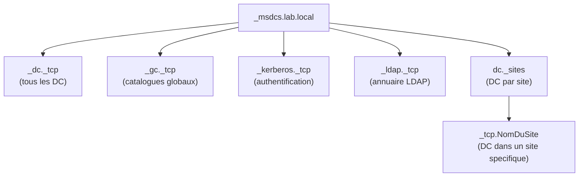
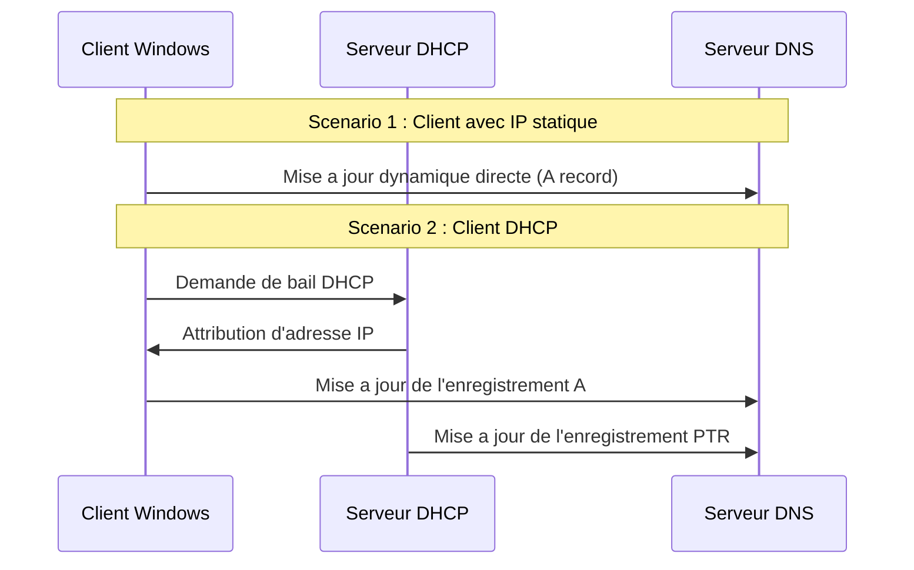
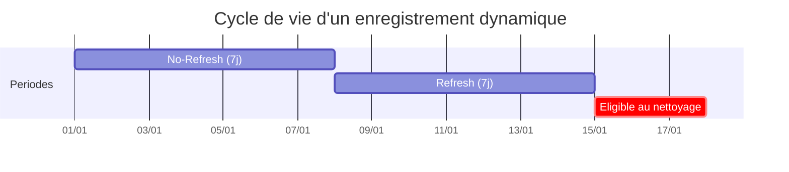

# Enregistrements DNS

<span class="level-intermediate">Intermediaire</span> · Temps estime : 35 minutes

## Types d'enregistrements

Chaque zone DNS contient des **enregistrements de ressources** (Resource Records). Chaque enregistrement associe un nom a une valeur specifique selon son type.

### Enregistrements principaux

| Type | Nom complet | Role | Exemple |
|------|-------------|------|---------|
| **A** | Address | Associe un nom a une adresse IPv4 | `srv-dc01` -> `192.168.1.10` |
| **AAAA** | IPv6 Address | Associe un nom a une adresse IPv6 | `srv-dc01` -> `fd00::10` |
| **CNAME** | Canonical Name | Alias pointant vers un autre nom | `intranet` -> `srv-web01.lab.local` |
| **MX** | Mail Exchanger | Serveur de messagerie pour le domaine | `lab.local` -> `srv-mail.lab.local` (priorite 10) |
| **NS** | Name Server | Serveur DNS autoritaire pour la zone | `lab.local` -> `srv-dc01.lab.local` |
| **SOA** | Start of Authority | Informations autoritaires de la zone | Serveur principal, contact, serial, timers |
| **SRV** | Service Locator | Localise un service specifique | `_ldap._tcp.lab.local` -> `srv-dc01:389` |
| **PTR** | Pointer | Resolution inverse (IP vers nom) | `10.1.168.192.in-addr.arpa` -> `srv-dc01.lab.local` |
| **TXT** | Text | Texte libre (SPF, DKIM, verification) | `v=spf1 include:lab.local ~all` |

### Enregistrement SOA (Start of Authority)

L'enregistrement **SOA** est present dans chaque zone et contient les metadonnees de la zone :

| Champ | Description | Valeur typique |
|-------|-------------|----------------|
| **Primary server** | Serveur de noms principal | `srv-dc01.lab.local` |
| **Responsible person** | Contact administratif | `hostmaster.lab.local` |
| **Serial number** | Numero de version de la zone | Auto-incremente |
| **Refresh interval** | Frequence de verification par les secondaires | 900 secondes (15 min) |
| **Retry interval** | Delai avant nouvelle tentative si le refresh echoue | 600 secondes (10 min) |
| **Expire after** | Duree apres laquelle le secondaire arrete de repondre | 86400 secondes (24 h) |
| **Minimum TTL** | TTL par defaut pour les reponses negatives | 3600 secondes (1 h) |

```powershell
# View SOA record for a zone
Get-DnsServerResourceRecord -ZoneName "lab.local" -RRType SOA -ComputerName "SRV-DC01"
```

### Enregistrements SRV (Service Locator)

Les enregistrements **SRV** sont essentiels pour Active Directory. Leur format est :

```
_service._protocole.domaine  TTL  IN  SRV  priorite  poids  port  cible
```

Exemple concret :

```
_ldap._tcp.lab.local  600  IN  SRV  0  100  389  srv-dc01.lab.local
```

Les enregistrements SRV critiques pour AD sont organises sous `_msdcs.lab.local` :



```powershell
# List all SRV records for the domain
Get-DnsServerResourceRecord -ZoneName "_msdcs.lab.local" -RRType SRV -ComputerName "SRV-DC01"

# Find LDAP SRV records
Resolve-DnsName -Name "_ldap._tcp.lab.local" -Type SRV

# Find site-specific DC
Resolve-DnsName -Name "_ldap._tcp.Paris._sites.lab.local" -Type SRV
```

!!! danger "Ne supprimez jamais les enregistrements SRV manuellement"

    Les enregistrements SRV sous `_msdcs` sont enregistres automatiquement par le service
    **Netlogon** des controleurs de domaine. Les supprimer peut casser l'authentification
    et la localisation des DC. Si des SRV sont manquants, redemarrez le service Netlogon
    sur le DC concerne.

## Creer des enregistrements

### Enregistrement A (Host)

=== "PowerShell"

    ```powershell
    # Create an A record
    Add-DnsServerResourceRecordA `
        -ZoneName "lab.local" `
        -Name "srv-app01" `
        -IPv4Address "192.168.1.50" `
        -TimeToLive 01:00:00 `
        -ComputerName "SRV-DC01"

    # Create an A record and the corresponding PTR record
    Add-DnsServerResourceRecordA `
        -ZoneName "lab.local" `
        -Name "srv-app01" `
        -IPv4Address "192.168.1.50" `
        -CreatePtr `
        -ComputerName "SRV-DC01"
    ```

=== "GUI"

    1. Ouvrir **DNS Manager** > Zone de recherche directe > `lab.local`
    2. Clic droit > **Nouvel hote (A ou AAAA)**
    3. Nom : `srv-app01`
    4. Adresse IP : `192.168.1.50`
    5. Cocher **Creer un enregistrement de pointeur (PTR) associe**
    6. Cliquer sur **Ajouter un hote**

### Enregistrement AAAA (IPv6)

```powershell
# Create an AAAA record
Add-DnsServerResourceRecordAAAA `
    -ZoneName "lab.local" `
    -Name "srv-app01" `
    -IPv6Address "fd00::50" `
    -ComputerName "SRV-DC01"
```

### Enregistrement CNAME (Alias)

=== "PowerShell"

    ```powershell
    # Create a CNAME alias
    Add-DnsServerResourceRecordCName `
        -ZoneName "lab.local" `
        -Name "intranet" `
        -HostNameAlias "srv-web01.lab.local" `
        -ComputerName "SRV-DC01"
    ```

=== "GUI"

    1. Ouvrir **DNS Manager** > Zone > `lab.local`
    2. Clic droit > **Nouvel alias (CNAME)**
    3. Nom de l'alias : `intranet`
    4. FQDN cible : `srv-web01.lab.local`
    5. Valider

!!! warning "Restrictions CNAME"

    Un enregistrement CNAME ne peut pas coexister avec d'autres enregistrements pour le
    meme nom. Par exemple, si `intranet.lab.local` est un CNAME, il ne peut pas
    avoir aussi un enregistrement A ou MX.

### Enregistrement MX (Mail)

```powershell
# Create an MX record
Add-DnsServerResourceRecordMX `
    -ZoneName "lab.local" `
    -Name "." `
    -MailExchange "srv-mail.lab.local" `
    -Preference 10 `
    -ComputerName "SRV-DC01"

# Add a secondary MX with lower priority (higher number)
Add-DnsServerResourceRecordMX `
    -ZoneName "lab.local" `
    -Name "." `
    -MailExchange "srv-mail02.lab.local" `
    -Preference 20 `
    -ComputerName "SRV-DC01"
```

### Enregistrement PTR (Reverse)

```powershell
# Create a PTR record in the reverse zone
Add-DnsServerResourceRecordPtr `
    -ZoneName "1.168.192.in-addr.arpa" `
    -Name "50" `
    -PtrDomainName "srv-app01.lab.local" `
    -ComputerName "SRV-DC01"
```

### Enregistrement TXT

```powershell
# Create a TXT record (e.g., SPF for email)
Add-DnsServerResourceRecord `
    -ZoneName "lab.local" `
    -Name "." `
    -Txt `
    -DescriptiveText "v=spf1 mx a ~all" `
    -ComputerName "SRV-DC01"
```

## Modifier des enregistrements

La modification d'un enregistrement DNS en PowerShell se fait en deux etapes : recuperer l'ancien enregistrement, puis le remplacer.

```powershell
# Step 1: Get the existing record
$OldRecord = Get-DnsServerResourceRecord `
    -ZoneName "lab.local" `
    -Name "srv-app01" `
    -RRType A `
    -ComputerName "SRV-DC01"

# Step 2: Clone and modify
$NewRecord = $OldRecord.Clone()
$NewRecord.RecordData.IPv4Address = [System.Net.IPAddress]::Parse("192.168.1.51")

# Step 3: Apply the change
Set-DnsServerResourceRecord `
    -ZoneName "lab.local" `
    -OldInputObject $OldRecord `
    -NewInputObject $NewRecord `
    -ComputerName "SRV-DC01"
```

!!! tip "Modification via GUI"

    Dans DNS Manager, double-cliquez simplement sur l'enregistrement pour modifier
    ses proprietes. C'est souvent plus pratique pour des modifications ponctuelles.

## Supprimer des enregistrements

=== "PowerShell"

    ```powershell
    # Remove a specific A record
    Remove-DnsServerResourceRecord `
        -ZoneName "lab.local" `
        -Name "srv-app01" `
        -RRType A `
        -RecordData "192.168.1.50" `
        -ComputerName "SRV-DC01" `
        -Force

    # Remove all records for a name (use with caution)
    Remove-DnsServerResourceRecord `
        -ZoneName "lab.local" `
        -Name "srv-ancien" `
        -RRType A `
        -ComputerName "SRV-DC01" `
        -Force
    ```

=== "GUI"

    1. Ouvrir **DNS Manager** > Naviguer vers l'enregistrement
    2. Clic droit sur l'enregistrement > **Supprimer**
    3. Confirmer la suppression

## Enregistrements statiques vs dynamiques

### Enregistrements statiques

- Crees **manuellement** par un administrateur
- Ne sont jamais modifies automatiquement
- Pas de timestamp -- ne sont pas affectes par le nettoyage automatique
- Utilises pour : serveurs, imprimantes, alias permanents

### Enregistrements dynamiques

- Crees et mis a jour **automatiquement** par les clients ou les services
- Possedent un **timestamp** (horodatage) qui indique la derniere mise a jour
- Peuvent etre nettoyes automatiquement (scavenging)
- Utilises pour : postes de travail, DC (enregistrements SRV), DHCP

```powershell
# View the timestamp of a record (0 = static, other = dynamic)
Get-DnsServerResourceRecord -ZoneName "lab.local" -Name "srv-dc01" -ComputerName "SRV-DC01" |
    Select-Object HostName, RecordType, Timestamp, TimeToLive
```

### Comment fonctionnent les mises a jour dynamiques



!!! info "DHCP et mises a jour DNS"

    Par defaut, le client Windows enregistre son enregistrement **A** directement
    dans le DNS. Le serveur DHCP se charge de l'enregistrement **PTR** dans la zone
    inverse. Ce comportement est configurable dans les options du serveur DHCP.

## Nettoyage automatique (Scavenging)

Le **scavenging** est le processus de suppression automatique des enregistrements dynamiques obsoletes. Sans lui, la base DNS accumule des enregistrements fantomes (machines decommissionnees, adresses IP changees).

### Deux parametres cles

| Parametre | Description | Valeur par defaut |
|-----------|-------------|-------------------|
| **No-Refresh Interval** | Periode pendant laquelle un enregistrement ne peut pas rafraichir son timestamp | 7 jours |
| **Refresh Interval** | Periode apres laquelle l'enregistrement peut etre rafraichi et avant laquelle il peut etre nettoye | 7 jours |

Un enregistrement est eligible au nettoyage apres : `Timestamp + No-Refresh + Refresh`



### Activer le scavenging

Le scavenging doit etre active a **deux niveaux** : sur le serveur DNS et sur chaque zone.

=== "PowerShell"

    ```powershell
    # Step 1: Enable scavenging on the DNS server
    Set-DnsServerScavenging `
        -ScavengingState $true `
        -ScavengingInterval 7.00:00:00 `
        -ComputerName "SRV-DC01"

    # Step 2: Enable aging on the zone
    Set-DnsServerZoneAging `
        -Name "lab.local" `
        -Aging $true `
        -NoRefreshInterval 7.00:00:00 `
        -RefreshInterval 7.00:00:00 `
        -ComputerName "SRV-DC01"

    # Verify scavenging settings on the server
    Get-DnsServerScavenging -ComputerName "SRV-DC01"

    # Verify aging settings on a zone
    Get-DnsServerZoneAging -Name "lab.local" -ComputerName "SRV-DC01"

    # Manually trigger scavenging (for testing)
    Start-DnsServerScavenging -ComputerName "SRV-DC01" -Force
    ```

=== "GUI"

    **Sur le serveur :**

    1. Ouvrir **DNS Manager**
    2. Clic droit sur le serveur > **Proprietes**
    3. Onglet **Avance** > Cocher **Activer le nettoyage automatique des enregistrements obsoletes**
    4. Definir la periode de nettoyage (7 jours par defaut)

    **Sur la zone :**

    1. Clic droit sur la zone > **Proprietes**
    2. Onglet **General** > Cliquer sur **Vieillissement...**
    3. Cocher **Nettoyer les enregistrements de ressources obsoletes**
    4. Configurer les intervalles No-Refresh et Refresh

!!! warning "Activez le scavenging uniquement quand vous maitrisez le mecanisme"

    Un scavenging mal configure peut supprimer des enregistrements encore utilises.
    Assurez-vous que les intervalles sont adaptes a votre environnement et que
    les enregistrements critiques (serveurs) sont crees en statique.

## Rechercher des enregistrements

```powershell
# List all records in a zone
Get-DnsServerResourceRecord -ZoneName "lab.local" -ComputerName "SRV-DC01"

# Find all A records in a zone
Get-DnsServerResourceRecord -ZoneName "lab.local" -RRType A -ComputerName "SRV-DC01"

# Find a specific record
Get-DnsServerResourceRecord -ZoneName "lab.local" -Name "srv-dc01" -ComputerName "SRV-DC01"

# Find stale records (timestamp older than 14 days)
$CutoffDate = (Get-Date).AddDays(-14)
Get-DnsServerResourceRecord -ZoneName "lab.local" -RRType A -ComputerName "SRV-DC01" |
    Where-Object { $_.Timestamp -ne $null -and $_.Timestamp -lt $CutoffDate } |
    Select-Object HostName, RecordType, Timestamp, @{N='IP';E={$_.RecordData.IPv4Address}}
```

## Points cles a retenir

- Chaque type d'enregistrement a un role precis : A pour les noms, SRV pour les services, PTR pour l'inverse
- Les enregistrements SRV sous `_msdcs` sont critiques pour Active Directory -- ne jamais les supprimer manuellement
- Les enregistrements dynamiques ont un timestamp, les statiques n'en ont pas
- Le scavenging doit etre active sur le serveur ET sur la zone pour fonctionner
- Utilisez `-CreatePtr` lors de la creation d'enregistrements A pour creer automatiquement le PTR
- Les enregistrements CNAME ne peuvent pas coexister avec d'autres types pour le meme nom

## Pour aller plus loin

- [Concepts DNS](concepts-dns.md) -- comprendre les bases du DNS
- [Zones integrees AD](zones-integrees-ad.md) -- gerer les zones qui contiennent ces enregistrements
- [Depannage DNS](depannage-dns.md) -- diagnostiquer les problemes lies aux enregistrements
- [Concepts DHCP](../dhcp/concepts-dhcp.md) -- interaction entre DHCP et les mises a jour dynamiques DNS
