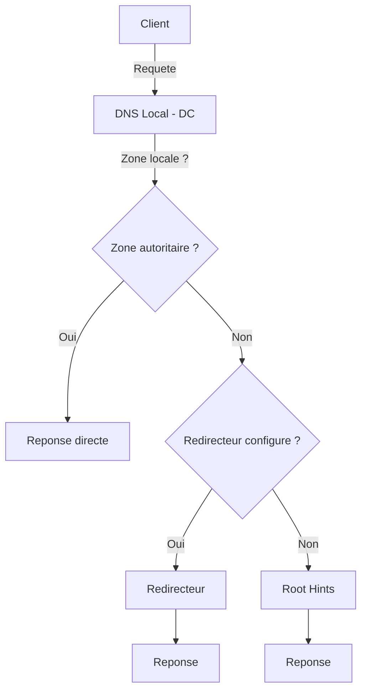
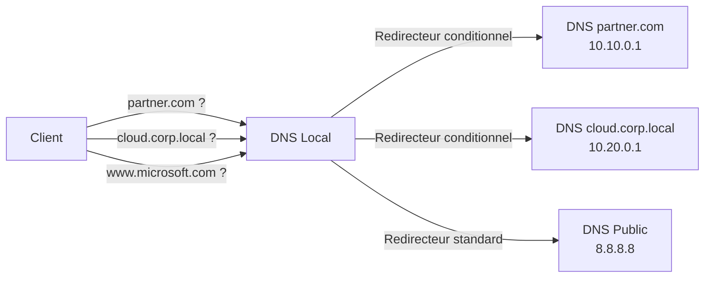
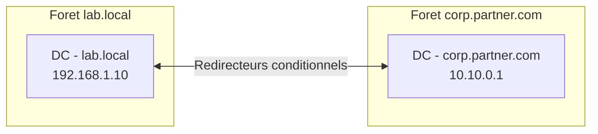

<!--
  Copyright 2026 Julien Bombled

  Licensed under the Apache License, Version 2.0 (the "License");
  you may not use this file except in compliance with the License.
  You may obtain a copy of the License at

      http://www.apache.org/licenses/LICENSE-2.0

  Unless required by applicable law or agreed to in writing, software
  distributed under the License is distributed on an "AS IS" BASIS,
  WITHOUT WARRANTIES OR CONDITIONS OF ANY KIND, either express or implied.
  See the License for the specific language governing permissions and
  limitations under the License.
-->
---
title: Resolution conditionnelle
description: Redirecteurs conditionnels, transfert DNS et cas d'usage pour les environnements hybrides et multi-forets.
tags:
  - active-directory
  - dns
  - avance
---

# Resolution conditionnelle et redirecteurs

<span class="level-advanced">Avance</span> · Temps estime : 25 minutes

## Principe de la redirection DNS

!!! example "Analogie"

    Imaginez un standard telephonique d'entreprise. Quand quelqu'un appelle un numero interne, le standard repond directement. Mais quand on appelle un numero externe, le standard transfère l'appel vers l'operateur telephonique. Un redirecteur conditionnel, c'est comme une regle speciale : "Pour tous les appels vers la filiale de Lyon, transferer directement vers le standard de Lyon au lieu de passer par l'operateur."

Quand un serveur DNS recoit une requete pour un domaine dont il n'est **pas autoritaire**, il doit trouver la reponse ailleurs. Deux mecanismes existent :

1. **Indications de racine** (Root Hints) : le serveur contacte les serveurs racine d'Internet pour resoudre le nom de proche en proche
2. **Redirecteurs** (Forwarders) : le serveur transmet la requete a un autre serveur DNS designe



## Redirecteurs standards (Forwarders)

Les **redirecteurs standards** s'appliquent a **toutes les requetes** que le serveur DNS ne peut pas resoudre localement. Le serveur transmet la requete complete a un serveur externe.

### Cas d'usage typiques

- Resoudre les noms Internet depuis un reseau interne
- Utiliser les serveurs DNS du FAI ou des services publics
- Centraliser la resolution externe sur un serveur specifique

### Configuration

=== "PowerShell"

    ```powershell
    # View current forwarders
    Get-DnsServerForwarder -ComputerName "SRV-DC01"

    # Set forwarders (replaces existing ones)
    Set-DnsServerForwarder `
        -IPAddress "8.8.8.8", "8.8.4.4" `
        -ComputerName "SRV-DC01"

    # Add a forwarder to the existing list
    Add-DnsServerForwarder `
        -IPAddress "1.1.1.1" `
        -ComputerName "SRV-DC01"

    # Remove a specific forwarder
    Remove-DnsServerForwarder `
        -IPAddress "8.8.4.4" `
        -ComputerName "SRV-DC01"
    ```

    Resultat :

    ```text
    IPAddress        EnableReordering  Timeout  UseRootHint
    ---------        ----------------  -------  -----------
    {8.8.8.8, 1.1.1.1}  True          3        True
    ```

=== "GUI"

    1. Ouvrir **DNS Manager** (dnsmgmt.msc)
    2. Clic droit sur le serveur > **Proprietes**
    3. Onglet **Redirecteurs**
    4. Cliquer sur **Modifier**
    5. Ajouter les adresses IP des serveurs DNS
    6. Definir le delai d'attente (timeout)
    7. Valider

!!! tip "Ordre des redirecteurs"

    Les redirecteurs sont contactes dans l'ordre de la liste. Si le premier ne repond
    pas dans le delai imparti, le suivant est utilise. Placez le serveur le plus
    fiable et le plus rapide en premier.

### Desactiver les indications de racine

Si vous utilisez exclusivement des redirecteurs, vous pouvez desactiver le recours aux Root Hints en cas d'echec :

```powershell
# Disable Root Hints fallback (use forwarders only)
Set-DnsServerForwarder `
    -UseRootHint $false `
    -ComputerName "SRV-DC01"
```

## Redirecteurs conditionnels (Conditional Forwarders)

Un **redirecteur conditionnel** redirige les requetes pour un **domaine DNS specifique** vers des serveurs DNS designes. Contrairement aux redirecteurs standards, il ne s'applique qu'aux noms qui correspondent au domaine configure.

### Principe



Le serveur DNS verifie d'abord les zones locales, puis les redirecteurs conditionnels, puis les redirecteurs standards, et enfin les Root Hints.

### Cas d'usage

| Scenario | Redirecteur conditionnel |
|----------|------------------------|
| **Relation d'approbation inter-forets** | Domaine de la foret partenaire vers ses DC |
| **Environnement hybride** | Domaine Azure AD vers les DNS Azure |
| **Fusion / acquisition** | Domaine de l'entreprise acquise vers ses DNS |
| **Partenariat B2B** | Domaine du partenaire vers ses serveurs publics |
| **Reseau segmente** | Domaine d'une DMZ vers les DNS de la DMZ |

### Creer un redirecteur conditionnel

=== "PowerShell"

    ```powershell
    # Create a conditional forwarder (stored in AD for replication)
    Add-DnsServerConditionalForwarderZone `
        -Name "partner.com" `
        -MasterServers "10.10.0.1", "10.10.0.2" `
        -ReplicationScope "Forest" `
        -ComputerName "SRV-DC01"

    # Create a conditional forwarder (not stored in AD)
    Add-DnsServerConditionalForwarderZone `
        -Name "external.local" `
        -MasterServers "172.16.0.1" `
        -ComputerName "SRV-DC01"
    ```

    Resultat :

    ```text
    # Verification avec Get-DnsServerZone
    ZoneName          ZoneType    IsDsIntegrated  MasterServers         DirectoryPartitionName
    --------          --------    --------------  -------------         ----------------------
    partner.com       Forwarder   True            {10.10.0.1, 10.10.0.2}  ForestDnsZones.lab.local
    external.local    Forwarder   False           {172.16.0.1}
    ```

=== "GUI"

    1. Ouvrir **DNS Manager**
    2. Clic droit sur **Redirecteurs conditionnels** > **Nouveau redirecteur conditionnel**
    3. Domaine DNS : `partner.com`
    4. Adresses IP des serveurs maitres : `10.10.0.1`, `10.10.0.2`
    5. Cocher **Stocker ce redirecteur conditionnel dans Active Directory**
    6. Choisir l'etendue de replication
    7. Valider

### Gerer les redirecteurs conditionnels existants

```powershell
# List all conditional forwarders
Get-DnsServerZone -ComputerName "SRV-DC01" |
    Where-Object { $_.ZoneType -eq "Forwarder" }

# View details of a specific conditional forwarder
Get-DnsServerZone -Name "partner.com" -ComputerName "SRV-DC01"

# Modify the master servers of a conditional forwarder
Set-DnsServerConditionalForwarderZone `
    -Name "partner.com" `
    -MasterServers "10.10.0.1", "10.10.0.3" `
    -ComputerName "SRV-DC01"

# Remove a conditional forwarder
Remove-DnsServerZone -Name "partner.com" -ComputerName "SRV-DC01" -Force
```

Resultat :

```text
ZoneName          ZoneType    IsDsIntegrated  MasterServers              DirectoryPartitionName
--------          --------    --------------  -------------              ----------------------
partner.com       Forwarder   True            {10.10.0.1, 10.10.0.2}    ForestDnsZones.lab.local
external.local    Forwarder   False           {172.16.0.1}
```

### Stocker dans Active Directory

Quand un redirecteur conditionnel est stocke dans AD, il est **replique automatiquement** vers les autres serveurs DNS du domaine ou de la foret, selon l'etendue choisie. Sans stockage AD, il faut configurer le redirecteur manuellement sur chaque serveur DNS.

| Etendue de replication | Description |
|----------------------|-------------|
| **Forest** | Tous les DC DNS de la foret |
| **Domain** | Tous les DC DNS du domaine |
| **Legacy** | Tous les DC du domaine (compatibilite) |
| **Non stocke dans AD** | Serveur local uniquement |

## Scenarios pratiques

### Scenario 1 : Relation d'approbation inter-forets

Deux forets Active Directory (`lab.local` et `corp.partner.com`) doivent pouvoir se resoudre mutuellement :



```powershell
# On the lab.local DCs: forward partner domain queries
Add-DnsServerConditionalForwarderZone `
    -Name "corp.partner.com" `
    -MasterServers "10.10.0.1", "10.10.0.2" `
    -ReplicationScope "Forest" `
    -ComputerName "SRV-DC01"

# On the partner DCs: forward lab domain queries (mirror configuration)
# This must be done by the partner's admin on their DNS servers
```

!!! warning "Prerequis reseau"

    Pour que les redirecteurs conditionnels fonctionnent, le trafic DNS (port 53
    TCP/UDP) doit etre autorise entre les serveurs DNS des deux forets.
    Verifiez les regles de pare-feu avant la configuration.

### Scenario 2 : Environnement hybride avec Azure

Les ressources cloud utilisent un domaine specifique qui doit etre resolu par les DNS Azure :

```powershell
# Forward Azure-related DNS queries to Azure DNS resolvers
Add-DnsServerConditionalForwarderZone `
    -Name "privatelink.database.windows.net" `
    -MasterServers "168.63.129.16" `
    -ReplicationScope "Forest" `
    -ComputerName "SRV-DC01"

# Forward Azure AD domain
Add-DnsServerConditionalForwarderZone `
    -Name "azure.lab.local" `
    -MasterServers "10.100.0.4", "10.100.0.5" `
    -ReplicationScope "Forest" `
    -ComputerName "SRV-DC01"
```

### Scenario 3 : Resolution de plusieurs sous-domaines

Si une filiale gere ses propres DNS, un redirecteur conditionnel evite de multiplier les zones secondaires :

```powershell
# Forward all queries for the subsidiary domain
Add-DnsServerConditionalForwarderZone `
    -Name "filiale.groupe.local" `
    -MasterServers "10.50.0.1" `
    -ReplicationScope "Domain" `
    -ComputerName "SRV-DC01"
```

## Redirecteur conditionnel vs zone de stub

Les deux permettent de resoudre un domaine externe, mais leur fonctionnement differe :

| Critere | Redirecteur conditionnel | Zone de stub |
|---------|------------------------|--------------|
| **Mecanisme** | Transmet la requete aux serveurs configures | Interroge les serveurs NS de la zone cible |
| **Serveurs cibles** | Configures manuellement | Appris automatiquement via les enregistrements NS |
| **Mise a jour** | Manuelle si les serveurs changent | Automatique (interroge periodiquement la zone) |
| **Cas d'usage** | Partenaires, forets externes | Sous-domaines delegues, filiales |
| **Stockage AD** | Optionnel | Optionnel |

!!! tip "Quand choisir quoi ?"

    - **Redirecteur conditionnel** : quand vous connaissez et maitrisez les serveurs
      DNS cibles et qu'ils ne changent pas souvent.
    - **Zone de stub** : quand les serveurs DNS de la zone cible peuvent changer et
      que vous voulez une mise a jour automatique.

## Ordre de resolution DNS

Quand un serveur DNS recoit une requete, il suit cet ordre de priorite :

1. **Cache local** du serveur
2. **Zones autoritaires** locales (integrees AD ou fichier)
3. **Redirecteurs conditionnels** correspondant au domaine
4. **Redirecteurs standards** (si configures)
5. **Indications de racine** (Root Hints, si les redirecteurs echouent ou ne sont pas configures)

```powershell
# Test the resolution path for a specific domain
Resolve-DnsName -Name "srv-dc01.partner.com" -Type A -DnsOnly -Server "SRV-DC01"

# Trace the resolution path
Resolve-DnsName -Name "srv-dc01.partner.com" -Type A -Server "SRV-DC01" -DnssecOk
```

Resultat :

```text
Name                           Type   TTL   Section    IPAddress
----                           ----   ---   -------    ---------
srv-dc01.partner.com           A      3600  Answer     10.10.0.1
```

!!! example "Scenario pratique"

    **Situation** : Thomas, administrateur reseau, met en place une relation d'approbation entre la foret `lab.local` et la foret `filiale.groupe.local`. Les utilisateurs de `lab.local` ne parviennent pas a acceder aux ressources de `filiale.groupe.local`. L'erreur indique que le domaine est introuvable.

    **Diagnostic** :

    ```powershell
    # Etape 1 : Tester la resolution du domaine partenaire
    Resolve-DnsName -Name "filiale.groupe.local" -Type A -DnsOnly -Server "DC-01"
    ```

    Resultat : erreur "DNS name does not exist". Le serveur DNS local ne sait pas resoudre ce domaine.

    ```powershell
    # Etape 2 : Verifier s'il existe un redirecteur conditionnel
    Get-DnsServerZone -ComputerName "DC-01" | Where-Object { $_.ZoneType -eq "Forwarder" }
    ```

    Resultat : aucun redirecteur conditionnel n'est configure pour `filiale.groupe.local`.

    ```powershell
    # Etape 3 : Verifier la connectivite vers les DNS de la filiale
    Test-NetConnection -ComputerName "10.50.0.1" -Port 53
    ```

    Resultat : la connectivite TCP 53 fonctionne.

    **Solution** :

    ```powershell
    # Creer le redirecteur conditionnel avec replication sur la foret
    Add-DnsServerConditionalForwarderZone `
        -Name "filiale.groupe.local" `
        -MasterServers "10.50.0.1", "10.50.0.2" `
        -ReplicationScope "Forest" `
        -ComputerName "DC-01"

    # Verifier la resolution
    Resolve-DnsName -Name "srv-dc01.filiale.groupe.local" -Type A -DnsOnly -Server "DC-01"
    ```

    La relation d'approbation peut maintenant etre etablie et les utilisateurs accedent aux ressources partagees.

!!! danger "Erreurs courantes"

    - **Oublier d'ouvrir le port 53 sur le pare-feu entre les deux reseaux** : le redirecteur conditionnel est configure, mais le trafic DNS est bloque. Verifiez toujours la connectivite avec `Test-NetConnection -Port 53` avant de configurer le redirecteur.
    - **Ne pas stocker le redirecteur conditionnel dans AD** : sans stockage AD, le redirecteur n'existe que sur le serveur local. Si les clients interrogent un autre DC, la resolution echoue. Utilisez toujours `-ReplicationScope "Forest"` ou `"Domain"`.
    - **Configurer un redirecteur conditionnel pour un domaine deja present en zone locale** : les zones locales ont priorite sur les redirecteurs conditionnels. Si une zone `partner.com` existe localement (meme vide), le redirecteur conditionnel ne sera jamais utilise.
    - **Utiliser des redirecteurs standards au lieu de redirecteurs conditionnels** : les redirecteurs standards s'appliquent a toutes les requetes non resolues. Pour un domaine partenaire specifique, un redirecteur conditionnel est plus precis et plus performant.

## Points cles a retenir

- Les redirecteurs standards s'appliquent a toutes les requetes non resolues localement
- Les redirecteurs conditionnels ciblent un domaine DNS specifique
- Stocker les redirecteurs conditionnels dans AD les replique automatiquement
- Les redirecteurs conditionnels sont indispensables pour les approbations inter-forets et les environnements hybrides
- L'ordre de resolution est : cache > zones locales > redirecteurs conditionnels > redirecteurs standards > Root Hints
- Les zones de stub sont une alternative quand les serveurs cibles changent frequemment

## Pour aller plus loin

- [Concepts DNS](concepts-dns.md) -- comprendre les requetes recursives et iteratives
- [Zones integrees AD](zones-integrees-ad.md) -- partitions de replication et zones
- [Depannage DNS](depannage-dns.md) -- diagnostiquer les problemes de resolution inter-domaines
- [Sites et replication AD](../adds/sites-et-replication.md) -- topologie multi-sites

