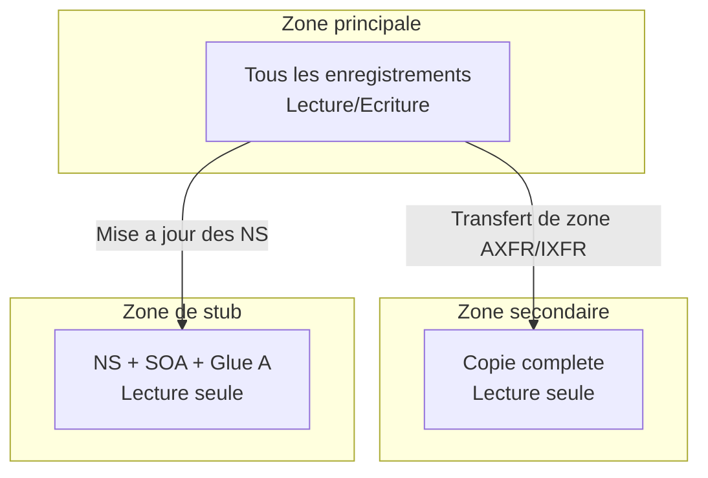
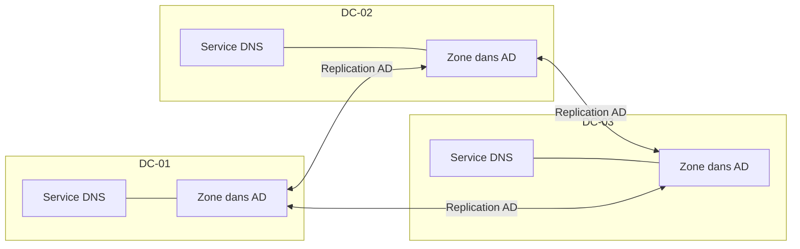

<!--
  Copyright 2026 Julien Bombled

  Licensed under the Apache License, Version 2.0 (the "License");
  you may not use this file except in compliance with the License.
  You may obtain a copy of the License at

      http://www.apache.org/licenses/LICENSE-2.0

  Unless required by applicable law or agreed to in writing, software
  distributed under the License is distributed on an "AS IS" BASIS,
  WITHOUT WARRANTIES OR CONDITIONS OF ANY KIND, either express or implied.
  See the License for the specific language governing permissions and
  limitations under the License.
-->
---
title: Zones integrees AD
description: Zones DNS integrees a Active Directory - types, avantages, replication et creation.
tags:
  - active-directory
  - dns
  - intermediaire
---

# Zones integrees a Active Directory

<span class="level-intermediate">Intermediaire</span> · Temps estime : 35 minutes

## Qu'est-ce qu'une zone DNS ?

!!! example "Analogie"

    Pensez a une zone DNS comme a un classeur dans un bureau de poste. Chaque classeur contient les fiches d'adresses pour un quartier precis. Une zone standard, c'est un classeur unique dans un seul bureau : si ce bureau ferme, plus personne ne peut consulter les fiches. Une zone integree AD, c'est comme avoir une copie synchronisee du classeur dans chaque bureau de poste de la ville : si l'un ferme, les autres prennent le relais.

Une **zone DNS** est une portion de l'espace de noms DNS geree par un serveur ou un groupe de serveurs. Elle contient les enregistrements de ressources (A, CNAME, MX, etc.) pour les noms qu'elle couvre.

Il ne faut pas confondre **zone** et **domaine** :

- Un **domaine** est un noeud dans l'arborescence DNS (`lab.local`)
- Une **zone** est le fichier ou la partition qui stocke les enregistrements pour un ou plusieurs domaines

## Types de zones DNS

### Zone principale (Primary)

- Contient la copie **en lecture/ecriture** des enregistrements
- C'est la seule zone ou les modifications peuvent etre effectuees (sauf en mode integre AD)
- Stockee dans un fichier texte (`%SystemRoot%\System32\dns\<zone>.dns`) ou dans Active Directory

### Zone secondaire (Secondary)

- Copie **en lecture seule** de la zone principale
- Mise a jour via des **transferts de zone** (AXFR/IXFR) depuis le serveur principal
- Fournit la tolerance de panne et la repartition de charge
- Stockee uniquement dans un fichier texte (jamais dans AD)

### Zone de stub (Stub)

- Contient uniquement les enregistrements **NS**, **SOA** et les enregistrements **A** (glue) des serveurs de noms
- Permet de maintenir la connaissance des serveurs DNS autoritaires pour une zone deleguee
- Mise a jour automatiquement depuis les serveurs de noms de la zone cible



## Zones integrees a Active Directory

### Principe

Plutot que de stocker les donnees DNS dans un fichier texte, une **zone integree AD** stocke ses enregistrements directement dans la base de donnees Active Directory (NTDS.dit). La replication DNS est alors assuree par la **replication AD** elle-meme.



### Avantages par rapport aux zones standards

| Caracteristique | Zone standard (fichier) | Zone integree AD |
|----------------|------------------------|------------------|
| **Replication** | Transfert de zone (AXFR/IXFR) | Replication AD multi-maitre |
| **Lecture/Ecriture** | Un seul serveur principal | Tous les DC avec DNS |
| **Securite des mises a jour** | Mises a jour dynamiques non securisees ou desactivees | Mises a jour dynamiques securisees |
| **Tolerance de panne** | Point de defaillance unique (primaire) | Multi-maitre, pas de SPOF |
| **Stockage** | Fichier texte | Base AD (NTDS.dit) |
| **Granularite de replication** | Zone entiere ou incrementale | Par enregistrement |
| **Suppression automatique** | Manuelle | Integree avec le scavenging AD |

!!! tip "Recommandation Microsoft"

    Dans un environnement Active Directory, utilisez **toujours** des zones integrees AD.
    Elles combinent les avantages de la replication multi-maitre, des mises a jour
    dynamiques securisees et de la tolerance de panne native.

### Mises a jour dynamiques securisees

Avec une zone integree AD, les **mises a jour dynamiques securisees** sont disponibles :

- Seuls les ordinateurs **authentifies dans le domaine** peuvent enregistrer ou modifier des enregistrements
- Chaque enregistrement possede une **ACL** (Access Control List) dans Active Directory
- Protection contre le **DNS spoofing** et l'enregistrement non autorise

!!! warning "Mises a jour non securisees"

    Les zones standards ne supportent que les mises a jour dynamiques non securisees
    (n'importe quel client peut enregistrer un nom) ou aucune mise a jour dynamique.
    Cela represente un risque de securite significatif.

## Partitions d'application DNS

Les zones integrees AD sont stockees dans des **partitions d'application** specifiques dans Active Directory. Le choix de la partition determine l'etendue de la replication :

| Partition | Etendue de replication | Nom |
|-----------|----------------------|-----|
| **DomainDnsZones** | Tous les DC DNS du domaine | `DC=DomainDnsZones,DC=lab,DC=local` |
| **ForestDnsZones** | Tous les DC DNS de la foret | `DC=ForestDnsZones,DC=lab,DC=local` |
| **Domaine** | Tous les DC du domaine (meme sans DNS) | `DC=lab,DC=local` |
| **Partition personnalisee** | DC specifiques | Nom defini par l'administrateur |

```powershell
# List DNS directory partitions
Get-DnsServerDirectoryPartition -ComputerName "SRV-DC01"

# View the replication scope of a zone
Get-DnsServerZone -Name "lab.local" -ComputerName "SRV-DC01" |
    Select-Object ZoneName, ZoneType, IsDsIntegrated, DirectoryPartitionName
```

Resultat :

```text
DirectoryPartitionName                  State  Flags
----------------------                  -----  -----
DomainDnsZones.lab.local                Ready  Enlisted
ForestDnsZones.lab.local                Ready  Enlisted

ZoneName    ZoneType  IsDsIntegrated  DirectoryPartitionName
--------    --------  --------------  ----------------------
lab.local   Primary   True            DomainDnsZones.lab.local
```

!!! info "Partition par defaut"

    Lors de la creation d'une zone integree AD, Windows propose par defaut la partition
    **DomainDnsZones** pour les zones de recherche directe. C'est le choix recommande
    dans la plupart des cas.

## Zones de recherche directe et inverse

### Zone de recherche directe (Forward Lookup Zone)

Contient les enregistrements qui resolvent un **nom vers une adresse IP** :

- Enregistrements A (IPv4), AAAA (IPv6)
- Enregistrements CNAME, MX, SRV, TXT, etc.
- Cree automatiquement lors de la promotion du premier DC

### Zone de recherche inverse (Reverse Lookup Zone)

Contient les enregistrements **PTR** qui resolvent une **adresse IP vers un nom** :

- Le nom de zone est base sur l'adresse reseau inversee avec le suffixe `in-addr.arpa`
- **Non creee automatiquement** -- elle doit etre creee manuellement
- Utilisee par de nombreux outils de diagnostic et de securite

!!! warning "Creez toujours la zone inverse"

    La zone de recherche inverse n'est pas creee automatiquement mais elle est
    essentielle pour le bon fonctionnement de nombreux services :
    nslookup, journaux d'audit, outils de supervision et certaines applications.

## Creation de zones

### Creer une zone de recherche directe integree AD

=== "PowerShell"

    ```powershell
    # Create an AD-integrated primary forward lookup zone
    Add-DnsServerPrimaryZone `
        -Name "dev.lab.local" `
        -ReplicationScope "Domain" `
        -DynamicUpdate "Secure" `
        -ComputerName "SRV-DC01"

    # Verify the zone was created
    Get-DnsServerZone -Name "dev.lab.local" -ComputerName "SRV-DC01"
    ```

    Resultat :

    ```text
    ZoneName        ZoneType  IsDsIntegrated  DynamicUpdate  IsReverseLookupZone  DirectoryPartitionName
    --------        --------  --------------  -------------  -------------------  ----------------------
    dev.lab.local   Primary   True            Secure         False                DomainDnsZones.lab.local
    ```

=== "GUI"

    1. Ouvrir **DNS Manager** (dnsmgmt.msc)
    2. Clic droit sur **Zones de recherche directes** > **Nouvelle zone**
    3. Type de zone : **Zone principale**
    4. Cocher **Stocker la zone dans Active Directory**
    5. Etendue de replication : **Vers tous les serveurs DNS du domaine**
    6. Nom de la zone : `dev.lab.local`
    7. Mise a jour dynamique : **N'autoriser que les mises a jour dynamiques securisees**
    8. Terminer

### Creer une zone de recherche inverse integree AD

=== "PowerShell"

    ```powershell
    # Create an AD-integrated reverse lookup zone for 192.168.1.0/24
    Add-DnsServerPrimaryZone `
        -NetworkId "192.168.1.0/24" `
        -ReplicationScope "Domain" `
        -DynamicUpdate "Secure" `
        -ComputerName "SRV-DC01"

    # Verify the zone
    Get-DnsServerZone -Name "1.168.192.in-addr.arpa" -ComputerName "SRV-DC01"
    ```

    Resultat :

    ```text
    ZoneName                    ZoneType  IsDsIntegrated  DynamicUpdate  IsReverseLookupZone
    --------                    --------  --------------  -------------  -------------------
    1.168.192.in-addr.arpa      Primary   True            Secure         True
    ```

=== "GUI"

    1. Ouvrir **DNS Manager** (dnsmgmt.msc)
    2. Clic droit sur **Zones de recherche inversees** > **Nouvelle zone**
    3. Type de zone : **Zone principale**
    4. Cocher **Stocker la zone dans Active Directory**
    5. Selectionner **Zone de recherche inversee IPv4**
    6. ID reseau : `192.168.1`
    7. Mise a jour dynamique : **N'autoriser que les mises a jour dynamiques securisees**
    8. Terminer

### Creer une zone secondaire

=== "PowerShell"

    ```powershell
    # Create a secondary zone (not AD-integrated)
    Add-DnsServerSecondaryZone `
        -Name "partenaire.local" `
        -ZoneFile "partenaire.local.dns" `
        -MasterServers "10.0.0.1", "10.0.0.2" `
        -ComputerName "SRV-DC01"
    ```

=== "GUI"

    1. Ouvrir **DNS Manager**
    2. Clic droit sur **Zones de recherche directes** > **Nouvelle zone**
    3. Type de zone : **Zone secondaire**
    4. Nom de la zone : `partenaire.local`
    5. Adresses IP des serveurs maitres : `10.0.0.1`, `10.0.0.2`
    6. Terminer

### Creer une zone de stub

=== "PowerShell"

    ```powershell
    # Create a stub zone
    Add-DnsServerStubZone `
        -Name "filiale.corp.local" `
        -MasterServers "10.10.0.1" `
        -ReplicationScope "Domain" `
        -ComputerName "SRV-DC01"
    ```

=== "GUI"

    1. Ouvrir **DNS Manager**
    2. Clic droit sur **Zones de recherche directes** > **Nouvelle zone**
    3. Type de zone : **Zone de stub**
    4. Cocher **Stocker la zone dans Active Directory** (optionnel)
    5. Nom de la zone : `filiale.corp.local`
    6. Adresses IP des serveurs maitres : `10.10.0.1`
    7. Terminer

## Convertir une zone standard en zone integree AD

Si une zone existante est stockee dans un fichier, il est possible de la convertir :

=== "PowerShell"

    ```powershell
    # Convert a file-backed zone to AD-integrated
    Set-DnsServerPrimaryZone `
        -Name "lab.local" `
        -ReplicationScope "Domain" `
        -ComputerName "SRV-DC01"
    ```

=== "GUI"

    1. Ouvrir **DNS Manager**
    2. Clic droit sur la zone > **Proprietes**
    3. Onglet **General** > Cliquer sur **Modifier** a cote du type de zone
    4. Cocher **Stocker la zone dans Active Directory**
    5. Valider

## Gestion des zones existantes

```powershell
# List all DNS zones on a server
Get-DnsServerZone -ComputerName "SRV-DC01"

# List only AD-integrated zones
Get-DnsServerZone -ComputerName "SRV-DC01" | Where-Object { $_.IsDsIntegrated -eq $true }

# View detailed zone properties
Get-DnsServerZone -Name "lab.local" -ComputerName "SRV-DC01" | Format-List *

# Change dynamic update setting
Set-DnsServerPrimaryZone -Name "lab.local" -DynamicUpdate "Secure" -ComputerName "SRV-DC01"

# Change replication scope
Set-DnsServerPrimaryZone -Name "lab.local" -ReplicationScope "Forest" -ComputerName "SRV-DC01"

# Remove a zone
Remove-DnsServerZone -Name "dev.lab.local" -ComputerName "SRV-DC01" -Force
```

Resultat :

```text
ZoneName                    ZoneType  IsDsIntegrated  DynamicUpdate  ReplicationScope
--------                    --------  --------------  -------------  ----------------
lab.local                   Primary   True            Secure         Domain
_msdcs.lab.local            Primary   True            Secure         Forest
0.0.10.in-addr.arpa         Primary   True            Secure         Domain
dev.lab.local               Primary   True            Secure         Domain
TrustAnchors                Primary   False           None
```

## Transferts de zone (pour les zones non integrees)

Les zones secondaires se mettent a jour via des transferts de zone. Il existe deux types :

| Type | Description |
|------|-------------|
| **AXFR** | Transfert complet -- toute la zone est copiee |
| **IXFR** | Transfert incremental -- seuls les changements depuis le dernier transfert |

```powershell
# Configure zone transfer settings on the primary zone
Set-DnsServerPrimaryZone `
    -Name "partenaire.local" `
    -SecureSecondaries "TransferToSecureServers" `
    -SecondaryServers "10.0.0.5", "10.0.0.6" `
    -ComputerName "SRV-DC01"

# Force a zone transfer on a secondary server
Start-DnsServerZoneTransfer -Name "partenaire.local" -FullTransfer -ComputerName "SRV-DNS02"
```

!!! danger "Securisez les transferts de zone"

    Un transfert de zone expose l'integralite de vos enregistrements DNS.
    Limitez toujours les transferts aux serveurs secondaires identifies
    et n'autorisez jamais les transferts vers n'importe quel serveur.

!!! example "Scenario pratique"

    **Situation** : Marc, administrateur reseau, constate que les mises a jour DNS depuis les postes clients echouent. Les postes de travail ne peuvent plus enregistrer leurs noms dans la zone `lab.local`. Le message d'erreur indique "Mise a jour refusee".

    **Diagnostic** :

    ```powershell
    # Etape 1 : Verifier le type de mise a jour dynamique configuree
    Get-DnsServerZone -Name "lab.local" -ComputerName "DC-01" |
        Select-Object ZoneName, DynamicUpdate, IsDsIntegrated
    ```

    Resultat : `DynamicUpdate` affiche `None`, les mises a jour dynamiques sont desactivees.

    ```powershell
    # Etape 2 : Verifier si la zone est bien integree AD
    Get-DnsServerZone -Name "lab.local" -ComputerName "DC-01" |
        Select-Object ZoneName, ZoneType, IsDsIntegrated
    ```

    Resultat : `IsDsIntegrated` est a `True`, la zone est bien integree AD.

    **Solution** :

    ```powershell
    # Activer les mises a jour dynamiques securisees
    Set-DnsServerPrimaryZone -Name "lab.local" -DynamicUpdate "Secure" -ComputerName "DC-01"

    # Verifier le changement
    Get-DnsServerZone -Name "lab.local" -ComputerName "DC-01" |
        Select-Object ZoneName, DynamicUpdate

    # Forcer l'enregistrement DNS depuis un poste client
    Register-DnsClient
    ```

    Les postes clients peuvent desormais enregistrer automatiquement leurs noms dans la zone DNS.

!!! danger "Erreurs courantes"

    - **Oublier de creer la zone de recherche inverse** : cette zone n'est pas creee automatiquement lors de la promotion d'un DC. Sans elle, les commandes `nslookup` affichent des erreurs et certains outils de diagnostic ne fonctionnent pas.
    - **Choisir la mauvaise etendue de replication** : utiliser "Tous les DC du domaine" au lieu de "Tous les DC DNS du domaine" replique inutilement la zone vers des DC qui n'executent pas le service DNS, augmentant le trafic de replication.
    - **Laisser les mises a jour dynamiques en mode non securise** : n'importe quelle machine peut enregistrer un nom, ce qui permet a un attaquant de detourner un nom de serveur vers sa propre adresse IP.
    - **Ne pas securiser les transferts de zone pour les zones secondaires** : autoriser les transferts vers n'importe quel serveur expose l'integralite de vos enregistrements DNS, facilitant la reconnaissance reseau par un attaquant.
    - **Convertir une zone sans verifier la replication AD** : avant de convertir une zone fichier en zone integree AD, assurez-vous que la replication AD fonctionne correctement entre tous les DC, sinon la zone ne sera pas disponible partout.

## Points cles a retenir

- Les zones integrees AD stockent les enregistrements dans la base Active Directory (NTDS.dit)
- La replication AD multi-maitre remplace les transferts de zone -- tous les DC peuvent ecrire
- Les mises a jour dynamiques securisees ne sont disponibles qu'avec les zones integrees AD
- Les partitions DomainDnsZones et ForestDnsZones controlent l'etendue de la replication
- Les zones de recherche inverse doivent etre creees manuellement
- Les zones secondaires et de stub restent utiles pour les domaines externes ou les filiales

## Pour aller plus loin

- [Concepts DNS](concepts-dns.md) -- les bases de DNS et son role dans AD
- [Enregistrements DNS](enregistrements.md) -- gerer les enregistrements dans les zones
- [Resolution conditionnelle](resolution-conditionnelle.md) -- rediriger les requetes vers d'autres serveurs
- [Sites et replication AD](../adds/sites-et-replication.md) -- comprendre la replication AD

