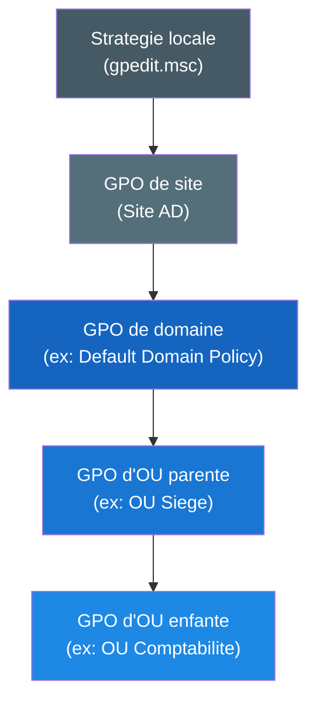

<!--
  Copyright 2026 Julien Bombled

  Licensed under the Apache License, Version 2.0 (the "License");
  you may not use this file except in compliance with the License.
  You may obtain a copy of the License at

      http://www.apache.org/licenses/LICENSE-2.0

  Unless required by applicable law or agreed to in writing, software
  distributed under the License is distributed on an "AS IS" BASIS,
  WITHOUT WARRANTIES OR CONDITIONS OF ANY KIND, either express or implied.
  See the License for the specific language governing permissions and
  limitations under the License.
-->
---
title: Concepts GPO
description: Comprendre les objets de strategie de groupe (GPO), leur ordre de traitement LSDOU, le stockage SYSVOL et les commandes essentielles.
tags:
  - gpo
  - active-directory
  - strategie-de-groupe
  - sysvol
---

# Concepts des strategies de groupe (GPO)

<span class="level-intermediate">Intermediaire</span> · Temps estime : 45 minutes

## Qu'est-ce qu'un objet de strategie de groupe (GPO) ?

!!! example "Analogie"

    Imaginez une entreprise ou le directeur affiche des regles sur le tableau d'entree : « pas de telephone en reunion », « badge obligatoire ». Chaque employe qui passe devant le panneau recoit automatiquement les memes consignes. Une GPO fonctionne de la meme maniere : elle affiche des regles de configuration que chaque ordinateur ou utilisateur du domaine lit et applique automatiquement.

Un **Group Policy Object (GPO)** est un ensemble de parametres de configuration geres
de facon centralisee dans Active Directory. Les GPO permettent aux administrateurs de
controler l'environnement de travail des utilisateurs et des ordinateurs du domaine
sans intervention manuelle sur chaque poste.

Chaque GPO contient deux grandes sections :

| Section                      | Cible                       | Exemples de parametres                          |
| :--------------------------- | :-------------------------- | :---------------------------------------------- |
| **Computer Configuration**   | Compte ordinateur           | Scripts de demarrage, politique de securite, pare-feu |
| **User Configuration**       | Compte utilisateur          | Redirection de dossiers, lecteurs mappes, bureau |

!!! tip "Bonne pratique"

    Desactivez la section inutilisee d'une GPO (Computer ou User) pour accelerer
    le traitement. Cela se fait dans les proprietes de la GPO, onglet **Details**,
    champ **GPO Status**.

---

## Ordre de traitement : LSDOU

!!! example "Analogie"

    Pensez a un courrier qui traverse plusieurs bureaux de poste avant d'arriver a destination : chaque bureau peut ajouter un tampon. Si deux bureaux apposent un tampon contradictoire, c'est le dernier bureau (le plus proche du destinataire) qui fait foi. LSDOU fonctionne ainsi : le dernier niveau applique a le dernier mot.

Les GPO sont appliquees dans un ordre precis appele **LSDOU** :

1. **L**ocal -- la strategie de groupe locale de la machine (`gpedit.msc`)
2. **S**ite -- GPO liees au site Active Directory
3. **D**omaine -- GPO liees au domaine
4. **OU** -- GPO liees aux unites organisationnelles (de la plus haute a la plus basse)

Le dernier parametre applique **l'emporte** en cas de conflit. Ainsi, une GPO liee a
une OU enfant prevaut sur une GPO liee au domaine pour le meme parametre.



!!! warning "Exceptions a LSDOU"

    Deux mecanismes peuvent modifier cet ordre :

    - **Enforced (Applique)** : force une GPO a s'appliquer meme si une GPO de
      niveau inferieur definit le meme parametre.
    - **Block Inheritance** : empeche les GPO parentes de s'appliquer a une OU,
      sauf si elles sont marquees Enforced.

    Ces mecanismes sont detailles dans la page
    [Filtrage et heritage](filtrage-et-heritage.md).

---

## Computer Configuration vs User Configuration

### Computer Configuration

Les parametres de la section **Computer Configuration** sont appliques au
**demarrage de la machine** et rafraichis periodiquement (toutes les 90 minutes
par defaut, avec un decalage aleatoire de 0 a 30 minutes).

Exemples courants :

- Politique de mot de passe et de verrouillage de compte
- Regles du pare-feu Windows
- Configuration de Windows Update
- Scripts de demarrage/arret
- Parametres de securite (audit, droits utilisateur)

### User Configuration

Les parametres de la section **User Configuration** sont appliques a
**l'ouverture de session** de l'utilisateur et rafraichis periodiquement.

Exemples courants :

- Redirection de dossiers (Bureau, Documents)
- Lecteurs reseau mappes
- Restrictions du menu Demarrer et du bureau
- Configuration des applications (Office, navigateurs)
- Scripts d'ouverture/fermeture de session

!!! info "Cycle de rafraichissement"

    Le rafraichissement automatique a lieu toutes les **90 minutes** (+ decalage
    aleatoire de 0 a 30 min) pour les postes de travail et serveurs membres.
    Pour les **controleurs de domaine**, le cycle est de **5 minutes**.

---

## SYSVOL et stockage des GPO

Les GPO sont stockees a deux endroits :

1. **Active Directory** (conteneur `CN=Policies,CN=System,DC=domaine,DC=local`) :
   contient les **metadonnees** de la GPO (liens, filtres de securite, version).

2. **SYSVOL** (`\\domaine\SYSVOL\domaine\Policies\{GUID}`) : contient les
   **fichiers de parametres** (fichiers `.pol`, scripts, modeles ADMX).

Chaque GPO est identifiee par un **GUID** unique. Le dossier SYSVOL correspondant
contient :

```
{GUID-de-la-GPO}/
    Machine/                  # Computer Configuration settings
        Registry.pol          # Registry-based policy settings
        Scripts/              # Startup / Shutdown scripts
    User/                     # User Configuration settings
        Registry.pol          # Registry-based policy settings
        Scripts/              # Logon / Logoff scripts
    GPT.INI                   # Version information
```

!!! danger "SYSVOL et replication"

    Le dossier SYSVOL est replique entre tous les controleurs de domaine via
    **DFS-R** (ou l'ancien FRS). Un probleme de replication SYSVOL entraine
    des GPO incoherentes entre les DC. Verifiez regulierement l'etat de
    replication avec `dcdiag /test:sysvolcheck`.

=== "PowerShell"

    ```powershell
    # List all GPOs in the domain
    Get-GPO -All | Select-Object DisplayName, Id, GpoStatus, CreationTime |
        Format-Table -AutoSize

    # View the SYSVOL path of a specific GPO
    $gpoId = (Get-GPO -Name "Default Domain Policy").Id
    $sysvolPath = "\\$env:USERDNSDOMAIN\SYSVOL\$env:USERDNSDOMAIN\Policies\{$gpoId}"
    Get-ChildItem -Path $sysvolPath -Recurse
    ```

=== "GUI (gpmc.msc)"

    1. Ouvrir **Group Policy Management** (`gpmc.msc`)
    2. Developper **Forest** > **Domains** > votre domaine > **Group Policy Objects**
    3. Cliquer droit sur une GPO > **Properties** > onglet **Details**
    4. Le champ **Unique ID** correspond au GUID du dossier SYSVOL

Resultat :

```text
DisplayName                           Id                                   GpoStatus        CreationTime
-----------                           --                                   ---------        ------------
Default Domain Policy                 31b2f340-016d-11d2-945f-00c04fb984f9 AllSettingsEnabled 12/01/2025 09:15:30
Default Domain Controllers Policy     6ac1786c-016f-11d2-945f-00c04fae2b69 AllSettingsEnabled 12/01/2025 09:15:30
SEC - Security Baseline               a3f2b8c1-4d5e-4f6a-8b9c-1d2e3f4a5b6c AllSettingsEnabled 15/01/2025 14:22:10
CFG - Desktop Restrictions            b7c9d1e2-3f4a-5b6c-9d0e-2a3b4c5d6e7f UserSettingsOnly   20/01/2025 10:45:00
CFG - Mapped Drives                   c8d0e1f2-4a5b-6c7d-0e1f-3b4c5d6e7f8a AllSettingsEnabled 22/01/2025 16:30:45
```

---

## Commande gpupdate

La commande `gpupdate` permet de forcer le rafraichissement immediat des
strategies de groupe sur un poste, sans attendre le cycle automatique.

=== "PowerShell"

    ```powershell
    # Standard refresh -- applies only new and changed settings
    gpupdate

    # Force full reapplication of all settings
    gpupdate /force

    # Refresh only Computer Configuration
    gpupdate /target:computer

    # Refresh only User Configuration
    gpupdate /target:user

    # Force refresh on a remote computer (requires PSRemoting)
    Invoke-GPUpdate -Computer "PC-COMPTA-01" -Force -RandomDelayInMinutes 0
    ```

=== "GUI (gpmc.msc)"

    1. Dans **Group Policy Management**, cliquer droit sur une OU
    2. Selectionner **Group Policy Update...**
    3. Confirmer pour forcer le rafraichissement sur tous les ordinateurs de l'OU

Resultat :

```text
Updating policy...

Computer Policy update has completed successfully.
User Policy update has completed successfully.
```

!!! tip "gpupdate vs gpupdate /force"

    - `gpupdate` : applique uniquement les parametres **nouveaux ou modifies**
      (plus rapide, recommande).
    - `gpupdate /force` : reapplique **tous** les parametres, y compris ceux
      deja en place. Utile pour le depannage, mais plus lourd.

---

## Les GPO par defaut

A la creation du domaine, deux GPO sont automatiquement creees :

| GPO                            | Liee a   | Role                                                    |
| :----------------------------- | :------- | :------------------------------------------------------ |
| **Default Domain Policy**      | Domaine  | Politique de mot de passe, verrouillage de compte, Kerberos |
| **Default Domain Controllers Policy** | OU Domain Controllers | Parametres de securite specifiques aux DC |

!!! warning "Ne pas modifier excessivement les GPO par defaut"

    Il est recommande de ne modifier les GPO par defaut **que** pour les
    parametres de politique de mot de passe et de verrouillage de compte.
    Pour tous les autres besoins, creez de **nouvelles GPO** dediees.
    Cela facilite le depannage et evite les effets de bord.

---

## Scenario pratique

!!! example "Scenario pratique"

    **Contexte** : Sophie, administratrice systeme chez une PME, vient de creer une GPO `CFG - Fond d'ecran Entreprise` pour imposer le fond d'ecran corporate a tous les postes de l'OU `Siege`. Apres une heure, les utilisateurs signalent qu'ils n'ont toujours pas le nouveau fond d'ecran.

    **Diagnostic** :

    1. Sophie se connecte sur un poste concerne et execute :

        ```powershell
        gpresult /r /scope:user
        ```

    2. La GPO `CFG - Fond d'ecran Entreprise` n'apparait pas dans les GPO appliquees. Elle verifie le lien :

        ```powershell
        (Get-GPInheritance -Target "OU=Siege,DC=lab,DC=local").GpoLinks |
            Select-Object DisplayName, Enabled
        ```

        Resultat :

        ```text
        DisplayName                    Enabled
        -----------                    -------
        CFG - Desktop Settings         True
        ```

    3. La GPO n'est pas liee. Sophie la lie correctement :

        ```powershell
        New-GPLink -Name "CFG - Fond d'ecran Entreprise" `
            -Target "OU=Siege,DC=lab,DC=local"
        ```

    4. Elle force le rafraichissement sur un poste de test :

        ```powershell
        gpupdate /force
        ```

    **Resolution** : la GPO etait creee dans le conteneur Group Policy Objects mais n'avait jamais ete liee a l'OU. Apres liaison et rafraichissement, le fond d'ecran s'applique correctement.

---

## Erreurs courantes

!!! danger "Erreurs courantes"

    1. **Oublier de lier la GPO** : creer une GPO ne suffit pas, elle doit etre **liee** a un conteneur (Site, Domaine ou OU) pour prendre effet. C'est l'erreur la plus frequente chez les debutants.

    2. **Confondre l'ordre LSDOU** : penser que la GPO de domaine ecrase celle de l'OU, alors que c'est l'inverse. La derniere appliquee (OU enfant) l'emporte.

    3. **Modifier les GPO par defaut pour tout** : la Default Domain Policy doit etre reservee aux politiques de mot de passe et de verrouillage. Ajouter des parametres divers complique le depannage et cree des effets de bord.

    4. **Ne pas desactiver la section inutilisee** : une GPO qui ne contient que des parametres Computer devrait avoir la section User desactivee (et inversement). Cela accelere le traitement et evite les confusions.

    5. **Oublier la replication SYSVOL** : apres modification d'une GPO, les changements doivent se repliquer sur tous les DC. Tester immediatement sur un poste qui contacte un autre DC peut donner de faux resultats.

---

## Points cles a retenir

- Un **GPO** est un conteneur de parametres appliques de facon centralisee aux
  utilisateurs et/ou ordinateurs du domaine.
- L'ordre de traitement **LSDOU** (Local > Site > Domain > OU) determine quelle
  GPO l'emporte en cas de conflit : la derniere appliquee gagne.
- Les GPO contiennent deux sections independantes : **Computer Configuration**
  (appliquee au demarrage) et **User Configuration** (appliquee a l'ouverture de session).
- Les donnees des GPO sont stockees dans **Active Directory** (metadonnees) et
  **SYSVOL** (fichiers de parametres).
- La commande `gpupdate` force le rafraichissement immediat ; `gpupdate /force`
  reapplique tous les parametres.
- Ne modifiez les GPO par defaut que pour les politiques de mot de passe ; creez
  des GPO dediees pour tout le reste.

---

## Pour aller plus loin

- [Creer et lier une GPO](creer-et-lier.md) -- mise en pratique
- [Filtrage et heritage](filtrage-et-heritage.md) -- controle fin de l'application
- [GPResult et depannage](gpresult-et-depannage.md) -- verifier ce qui s'applique
- [Modeles ADMX](modeles-admx.md) -- etendre les parametres disponibles
- [Structure des OU](../adds/structure-ou.md) -- organiser les objets pour les GPO
- [Sites et replication](../adds/sites-et-replication.md) -- impact sur la replication SYSVOL

---

## Quizz de validation

??? question "Question 1 : Dans l'ordre LSDOU, qui gagne entre une GPO de Domaine et une GPO d'OU ?"
    C'est la **GPO d'OU** qui gagne (la derniere appliquee l'emporte).

??? question "Question 2 : Ou sont stockes les fichiers physiques des GPO (scripts, modeles) ?"
    Dans le dossier partagé **SYSVOL** sur chaque controleur de domaine.

??? question "Question 3 : A quelle frequence les postes clients actualisent-ils leurs GPO par defaut ?"
    Toutes les **90 minutes** (avec un decalage aleatoire de 0 a 30 minutes).

