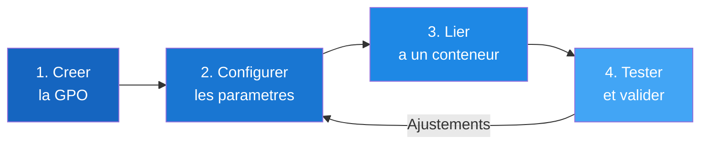

# Creer et lier une GPO

!!! info "Niveau : Intermediaire | Temps estime : 50 minutes"

    Cette page detaille les etapes pour creer, lier et configurer des strategies
    de groupe dans un environnement Active Directory sous Windows Server 2022.
    Prerequis : comprendre les [concepts GPO](concepts-gpo.md) et disposer d'un
    domaine AD DS fonctionnel.

## Cycle de vie d'une GPO

La gestion d'une GPO suit un cycle en quatre etapes :



!!! tip "Bonne pratique : creer avant de lier"

    Creez la GPO dans le conteneur **Group Policy Objects** et configurez-la
    entierement **avant** de la lier a une OU. Cela evite d'appliquer des
    parametres incomplets aux utilisateurs ou ordinateurs.

---

## Creer une nouvelle GPO

=== "PowerShell"

    ```powershell
    # Create a new GPO (not yet linked)
    New-GPO -Name "SEC - Password Policy" -Comment "Enforce strong password requirements"

    # Create and immediately link to an OU
    New-GPO -Name "CFG - Mapped Drives" -Comment "Map network drives for all users" |
        New-GPLink -Target "OU=Utilisateurs,OU=Siege,DC=lab,DC=local"
    ```

=== "GUI (gpmc.msc)"

    1. Ouvrir **Group Policy Management** (`gpmc.msc`)
    2. Developper **Forest** > **Domains** > votre domaine
    3. Cliquer droit sur **Group Policy Objects** > **New**
    4. Saisir un nom descriptif et cliquer **OK**

!!! tip "Convention de nommage"

    Adoptez un prefixe pour identifier rapidement le type de GPO :

    | Prefixe | Usage                        | Exemple                         |
    | :------ | :--------------------------- | :------------------------------ |
    | `SEC`   | Securite                     | `SEC - Account Lockout Policy`  |
    | `CFG`   | Configuration poste/user     | `CFG - Desktop Restrictions`    |
    | `SW`    | Deploiement logiciel         | `SW - 7-Zip Deployment`         |
    | `SCR`   | Scripts                      | `SCR - Logon Drive Mapping`     |
    | `PRF`   | Preferences                  | `PRF - Printer Deployment`      |

---

## Lier une GPO a un conteneur

Une GPO doit etre **liee** a un ou plusieurs conteneurs pour prendre effet.
Les conteneurs valides sont : **Site**, **Domaine** ou **OU**.

=== "PowerShell"

    ```powershell
    # Link an existing GPO to an OU
    New-GPLink -Name "SEC - Password Policy" `
        -Target "OU=Utilisateurs,OU=Siege,DC=lab,DC=local"

    # Link to the domain root
    New-GPLink -Name "SEC - Password Policy" `
        -Target "DC=lab,DC=local"

    # Link to a site
    New-GPLink -Name "CFG - Branch Office Settings" `
        -Target "CN=Lyon,CN=Sites,CN=Configuration,DC=lab,DC=local"

    # Disable a link (GPO remains but does not apply)
    Set-GPLink -Name "CFG - Mapped Drives" `
        -Target "OU=Utilisateurs,OU=Siege,DC=lab,DC=local" `
        -LinkEnabled No

    # Remove a link (does not delete the GPO)
    Remove-GPLink -Name "CFG - Mapped Drives" `
        -Target "OU=Utilisateurs,OU=Siege,DC=lab,DC=local"
    ```

=== "GUI (gpmc.msc)"

    1. Dans **Group Policy Management**, cliquer droit sur l'OU cible
    2. Selectionner **Link an Existing GPO...**
    3. Choisir la GPO dans la liste et cliquer **OK**

    Pour **desactiver** un lien : cliquer droit sur le lien > decocher
    **Link Enabled**.

!!! warning "GPO liee vs GPO presente"

    Une GPO existe dans le conteneur **Group Policy Objects** meme sans lien.
    Supprimer un **lien** ne supprime pas la GPO. Supprimer la **GPO** elle-meme
    supprime aussi tous ses liens.

---

## Configurer les parametres d'une GPO

=== "PowerShell"

    ```powershell
    # Set a registry-based policy value
    # Example: disable the Windows Store for all computers
    Set-GPRegistryValue -Name "CFG - Desktop Restrictions" `
        -Key "HKLM\SOFTWARE\Policies\Microsoft\WindowsStore" `
        -ValueName "RemoveWindowsStore" `
        -Type DWord -Value 1

    # Remove a specific policy value
    Remove-GPRegistryValue -Name "CFG - Desktop Restrictions" `
        -Key "HKLM\SOFTWARE\Policies\Microsoft\WindowsStore" `
        -ValueName "RemoveWindowsStore"

    # Generate a report of all settings in a GPO
    Get-GPOReport -Name "SEC - Password Policy" -ReportType Html `
        -Path "$env:USERPROFILE\Desktop\GPO-Report.html"
    ```

=== "GUI (gpmc.msc)"

    1. Dans **Group Policy Objects**, cliquer droit sur la GPO > **Edit**
    2. L'editeur de strategie de groupe s'ouvre (GPME)
    3. Naviguer dans **Computer Configuration** ou **User Configuration**
    4. Modifier les parametres souhaites

---

## Exemples de parametres courants

### Politique de mot de passe

!!! info "Emplacement"

    **Computer Configuration** > **Policies** > **Windows Settings** >
    **Security Settings** > **Account Policies** > **Password Policy**

=== "PowerShell"

    ```powershell
    # Configure password policy via the Default Domain Policy
    # Note: Fine-grained password policies (PSOs) are preferred for per-group settings
    Set-GPRegistryValue -Name "Default Domain Policy" `
        -Key "HKLM\SOFTWARE\Microsoft\Windows\CurrentVersion\Policies\System" `
        -ValueName "MinimumPasswordLength" `
        -Type DWord -Value 12
    ```

=== "GUI (gpmc.msc)"

    | Parametre                          | Valeur recommandee |
    | :--------------------------------- | :----------------- |
    | Minimum password length            | 12 caracteres      |
    | Password must meet complexity      | Enabled            |
    | Maximum password age               | 90 jours           |
    | Minimum password age               | 1 jour             |
    | Enforce password history            | 24 mots de passe   |

!!! warning "Politique de mot de passe et domaine"

    La politique de mot de passe definie par GPO ne s'applique qu'au niveau
    **domaine** (Default Domain Policy). Une GPO de mot de passe liee a une OU
    n'aura **aucun effet** sur les comptes du domaine. Pour des politiques
    differentes par groupe, utilisez les **Fine-Grained Password Policies (PSO)**.

### Verrouillage du bureau

!!! info "Emplacement"

    **User Configuration** > **Policies** > **Administrative Templates** >
    **Desktop** / **Start Menu and Taskbar**

```powershell
# Disable access to the Control Panel and PC Settings
Set-GPRegistryValue -Name "CFG - Desktop Restrictions" `
    -Key "HKCU\Software\Microsoft\Windows\CurrentVersion\Policies\Explorer" `
    -ValueName "NoControlPanel" `
    -Type DWord -Value 1

# Remove Run command from Start Menu
Set-GPRegistryValue -Name "CFG - Desktop Restrictions" `
    -Key "HKCU\Software\Microsoft\Windows\CurrentVersion\Policies\Explorer" `
    -ValueName "NoRun" `
    -Type DWord -Value 1
```

### Lecteurs reseau mappes

!!! info "Emplacement"

    **User Configuration** > **Preferences** > **Windows Settings** >
    **Drive Maps**

=== "PowerShell"

    ```powershell
    # Map drives via a logon script GPO (alternative to Preferences)
    # Create the script content
    $scriptContent = @'
    # Map shared drives
    New-PSDrive -Name "S" -PSProvider FileSystem -Root "\\SRV-FILE\Partage" -Persist
    New-PSDrive -Name "U" -PSProvider FileSystem -Root "\\SRV-FILE\Users\%USERNAME%" -Persist
    '@

    # Deploy via GPO logon script
    Set-GPRegistryValue -Name "SCR - Drive Mapping" `
        -Key "HKCU\Software\Microsoft\Windows\CurrentVersion\Group Policy\Scripts\Logon" `
        -ValueName "Script" `
        -Type String -Value "\\lab.local\NETLOGON\Map-Drives.ps1"
    ```

=== "GUI (gpmc.msc)"

    1. Editer la GPO > **User Configuration** > **Preferences** >
       **Windows Settings** > **Drive Maps**
    2. Cliquer droit > **New** > **Mapped Drive**
    3. Configurer :
        - **Action** : Create
        - **Location** : `\\SRV-FILE\Partage`
        - **Label as** : Partage commun
        - **Drive Letter** : `S:`
    4. Onglet **Common** : cocher **Run in logged-on user's security context**

!!! tip "Preferences vs Scripts"

    Les **Preferences Drive Maps** sont generalement preferees aux scripts de
    logon car elles offrent une interface graphique, un ciblage par element
    (item-level targeting) et une gestion plus propre. Voir la page
    [Preferences vs Policies](preferences-vs-policies.md) pour plus de details.

---

## Ordre de liaison et priorite

Lorsque plusieurs GPO sont liees au meme conteneur, leur **ordre de liaison**
(Link Order) determine la priorite. La GPO avec l'ordre de liaison **le plus bas
(1)** a la **priorite la plus elevee**.

=== "PowerShell"

    ```powershell
    # View link order on an OU
    (Get-GPInheritance -Target "OU=Utilisateurs,OU=Siege,DC=lab,DC=local").GpoLinks |
        Select-Object DisplayName, Order, Enabled |
        Sort-Object Order

    # Change link order (move GPO to position 1 = highest priority)
    Set-GPLink -Name "SEC - Password Policy" `
        -Target "OU=Utilisateurs,OU=Siege,DC=lab,DC=local" `
        -Order 1
    ```

=== "GUI (gpmc.msc)"

    1. Selectionner l'OU dans GPMC
    2. Dans le volet droit, onglet **Linked Group Policy Objects**
    3. Utiliser les fleches haut/bas pour modifier l'ordre de liaison

---

## Sauvegarder et restaurer une GPO

=== "PowerShell"

    ```powershell
    # Backup a single GPO
    Backup-GPO -Name "SEC - Password Policy" `
        -Path "C:\GPO-Backups" -Comment "Before quarterly review"

    # Backup all GPOs
    Backup-GPO -All -Path "C:\GPO-Backups"

    # Restore a GPO from backup
    Restore-GPO -Name "SEC - Password Policy" -Path "C:\GPO-Backups"

    # Import settings from a backup into a different GPO
    Import-GPO -BackupGpoName "SEC - Password Policy" `
        -Path "C:\GPO-Backups" `
        -TargetName "SEC - Password Policy v2" `
        -CreateIfNeeded
    ```

=== "GUI (gpmc.msc)"

    1. Cliquer droit sur **Group Policy Objects** > **Manage Backups...**
    2. **Backup** : selectionner la GPO et cliquer **Back Up**
    3. **Restore** : selectionner la sauvegarde et cliquer **Restore**

!!! tip "Automatiser les sauvegardes"

    Planifiez un script PowerShell de sauvegarde GPO via le
    **Planificateur de taches** pour maintenir un historique regulier.
    Voir [Taches planifiees](../../automatisation/taches-planifiees/task-scheduler.md).

---

## Points cles a retenir

- Creez et configurez une GPO **avant** de la lier pour eviter d'appliquer des
  parametres incomplets.
- Adoptez une **convention de nommage** coherente (prefixes par type).
- Une GPO peut etre liee a plusieurs conteneurs (Site, Domaine, OU) ; chaque lien
  est independant.
- L'**ordre de liaison** determine la priorite quand plusieurs GPO sont liees au
  meme conteneur (1 = priorite maximale).
- La politique de mot de passe par GPO ne fonctionne qu'au niveau **domaine**.
- Sauvegardez regulierement vos GPO avec `Backup-GPO`.

---

## Pour aller plus loin

- [Concepts GPO](concepts-gpo.md) -- rappel sur LSDOU et le fonctionnement general
- [Filtrage et heritage](filtrage-et-heritage.md) -- controler finement qui recoit la GPO
- [Preferences vs Policies](preferences-vs-policies.md) -- choisir entre preference et strategie
- [GPResult et depannage](gpresult-et-depannage.md) -- verifier l'application effective
- [Structure des OU](../adds/structure-ou.md) -- concevoir une arborescence adaptee aux GPO
- [Utilisateurs et groupes](../adds/utilisateurs-et-groupes.md) -- gerer les cibles des GPO
