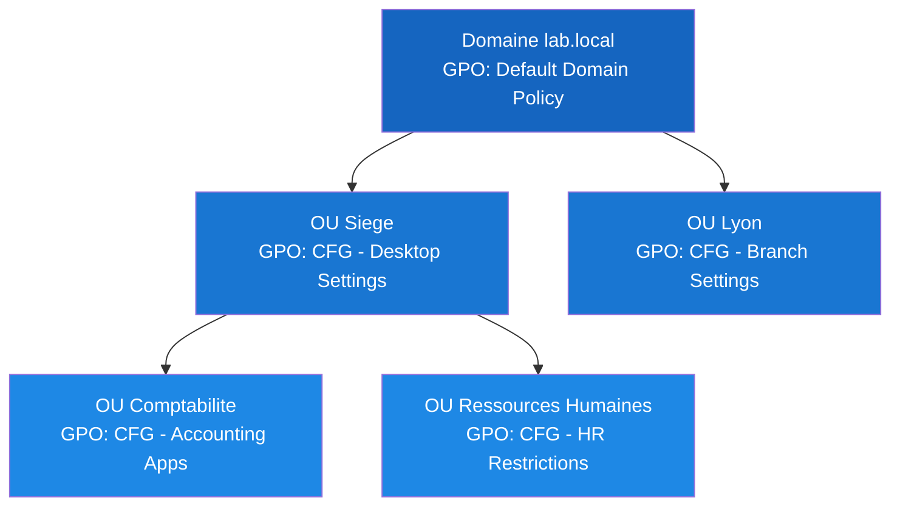
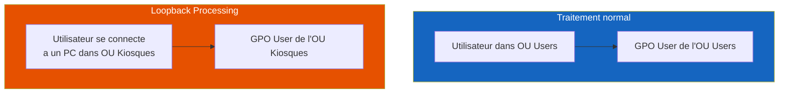
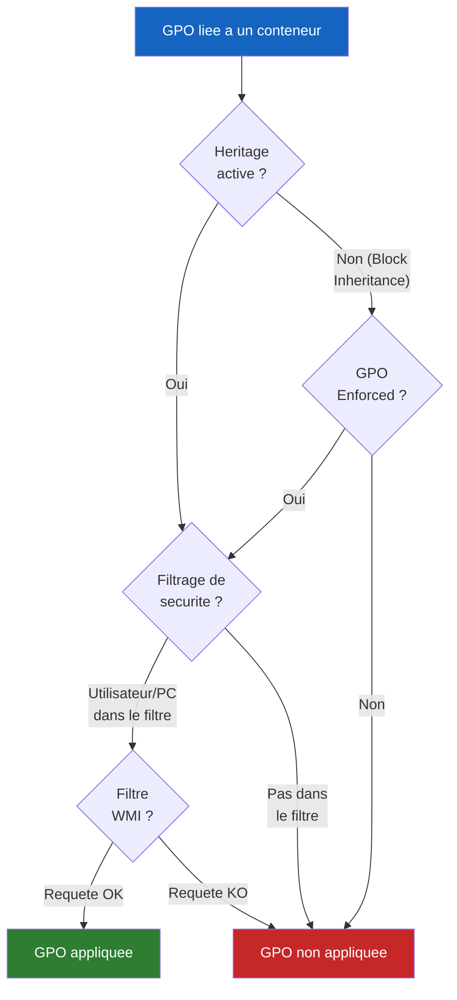

# Filtrage et heritage des GPO

<span class="level-advanced">Intermediaire-Avance</span> · Temps estime : 55 minutes

## Heritage des GPO

!!! example "Analogie"

    L'heritage des GPO ressemble aux regles d'un immeuble de bureaux. Le reglement general du batiment (domaine) s'applique a tous les etages. Chaque etage (OU parente) peut ajouter ses propres regles, et chaque service a l'interieur de l'etage (OU enfante) peut en rajouter encore. Un employe recoit donc les regles du batiment + celles de son etage + celles de son service.

Par defaut, les GPO sont **heritees** du conteneur parent vers les conteneurs
enfants. Un objet (utilisateur ou ordinateur) dans une OU enfant recoit donc :

1. Les GPO liees au **domaine**
2. Les GPO liees a l'**OU parente**
3. Les GPO liees a sa **propre OU**



Dans cet exemple, un utilisateur dans l'OU **Comptabilite** recoit :

- `Default Domain Policy` (heritee du domaine)
- `CFG - Desktop Settings` (heritee de l'OU Siege)
- `CFG - Accounting Apps` (liee directement a son OU)

---

## Block Inheritance (Bloquer l'heritage)

Le **blocage d'heritage** empeche toutes les GPO heritees des conteneurs parents
de s'appliquer a une OU donnee. Seules les GPO directement liees a cette OU
et les GPO marquees **Enforced** continueront de s'appliquer.

=== "PowerShell"

    ```powershell
    # Enable Block Inheritance on an OU
    Set-GPInheritance -Target "OU=Labo-Test,DC=lab,DC=local" -IsBlocked Yes

    # Disable Block Inheritance
    Set-GPInheritance -Target "OU=Labo-Test,DC=lab,DC=local" -IsBlocked No

    # Check inheritance status of an OU
    Get-GPInheritance -Target "OU=Labo-Test,DC=lab,DC=local" |
        Select-Object ContainerName, GpoInheritanceBlocked
    ```

    Resultat :

    ```text
    ContainerName            GpoInheritanceBlocked
    -------------            ---------------------
    Labo-Test                True
    ```

=== "GUI (gpmc.msc)"

    1. Dans **Group Policy Management**, cliquer droit sur l'OU
    2. Selectionner **Block Inheritance**
    3. Un point d'exclamation bleu apparait sur l'icone de l'OU

!!! warning "Utiliser avec precaution"

    Le blocage d'heritage peut empecher l'application de GPO de securite
    essentielles. Reservez-le a des cas specifiques (OU de test, environnement
    sandbox). Preferez le **filtrage de securite** pour un controle plus precis.

---

## Enforced (Applique / No Override)

Marquer un lien GPO comme **Enforced** (anciennement "No Override") garantit que
cette GPO s'applique **meme si** l'OU cible utilise Block Inheritance. De plus,
une GPO Enforced prevaut toujours sur les GPO de niveau inferieur en cas de
conflit de parametres.

=== "PowerShell"

    ```powershell
    # Enforce a GPO link
    Set-GPLink -Name "SEC - Security Baseline" `
        -Target "DC=lab,DC=local" `
        -Enforced Yes

    # Remove enforcement
    Set-GPLink -Name "SEC - Security Baseline" `
        -Target "DC=lab,DC=local" `
        -Enforced No

    # List all enforced GPO links in the domain
    Get-GPInheritance -Target "DC=lab,DC=local" |
        Select-Object -ExpandProperty InheritedGpoLinks |
        Where-Object { $_.Enforced -eq $true } |
        Select-Object DisplayName, Target, Enforced
    ```

    Resultat :

    ```text
    DisplayName              Target                  Enforced
    -----------              ------                  --------
    SEC - Security Baseline  dc=lab,dc=local         True
    ```

=== "GUI (gpmc.msc)"

    1. Dans GPMC, cliquer droit sur le **lien GPO** (pas la GPO elle-meme)
    2. Selectionner **Enforced**
    3. Un cadenas apparait sur l'icone du lien

!!! danger "Enforced au niveau domaine"

    Une GPO marquee Enforced au niveau du domaine s'applique a **toutes** les OU
    du domaine, sans exception. Reservez ce mecanisme aux politiques de securite
    critiques (baseline de securite, politique de mot de passe).

### Interaction entre Block Inheritance et Enforced

| Scenario                             | Resultat                                    |
| :----------------------------------- | :------------------------------------------ |
| GPO parente normale + OU sans blocage | GPO heritee normalement                    |
| GPO parente normale + Block Inheritance | GPO **bloquee**, ne s'applique pas        |
| GPO parente Enforced + OU sans blocage | GPO heritee normalement                   |
| GPO parente Enforced + Block Inheritance | GPO **appliquee malgre** le blocage       |

**Regle simple** : Enforced l'emporte toujours sur Block Inheritance.

---

## Filtrage de securite

Par defaut, une GPO liee a une OU s'applique a tous les **Authenticated Users**.
Le **filtrage de securite** permet de restreindre l'application a un groupe,
un utilisateur ou un ordinateur specifique.

=== "PowerShell"

    ```powershell
    # View current security filtering for a GPO
    Get-GPPermission -Name "CFG - Accounting Apps" -All |
        Where-Object { $_.Permission -eq "GpoApply" } |
        Select-Object Trustee, Permission

    # Remove default "Authenticated Users" Apply permission
    Set-GPPermission -Name "CFG - Accounting Apps" `
        -TargetName "Authenticated Users" `
        -TargetType Group `
        -PermissionLevel None

    # Grant Apply permission to a specific security group
    Set-GPPermission -Name "CFG - Accounting Apps" `
        -TargetName "GRP_Comptabilite" `
        -TargetType Group `
        -PermissionLevel GpoApply

    # Ensure "Authenticated Users" retains Read permission (required for processing)
    Set-GPPermission -Name "CFG - Accounting Apps" `
        -TargetName "Authenticated Users" `
        -TargetType Group `
        -PermissionLevel GpoRead
    ```

    Resultat :

    ```text
    Trustee                          Permission
    -------                          ----------
    GRP_Comptabilite                 GpoApply
    Authenticated Users              GpoRead
    ENTERPRISE DOMAIN CONTROLLERS    GpoRead
    ```

=== "GUI (gpmc.msc)"

    1. Selectionner la GPO dans GPMC
    2. Dans l'onglet **Scope**, section **Security Filtering**
    3. Retirer **Authenticated Users** (cliquer > **Remove**)
    4. Cliquer **Add** et saisir le groupe cible
    5. Dans l'onglet **Delegation**, verifier que **Authenticated Users**
       dispose de la permission **Read**

!!! danger "Ne pas oublier la permission Read"

    Lorsque vous retirez **Authenticated Users** du filtrage de securite,
    vous devez conserver la permission **Read** (via l'onglet Delegation).
    Sans cette permission, les ordinateurs ne peuvent pas lire la GPO et
    elle ne sera pas traitee du tout.

### Empecher l'application avec Deny

Vous pouvez egalement **refuser** explicitement l'application d'une GPO
a un groupe specifique en utilisant une permission **Deny** sur **Apply
Group Policy**.

```powershell
# Deny a GPO from applying to a specific group
Set-GPPermission -Name "CFG - Desktop Restrictions" `
    -TargetName "GRP_Admins_Exclusion" `
    -TargetType Group `
    -PermissionLevel None -Replace

# Then set explicit Deny via GPMC (Delegation tab > Advanced)
# PowerShell does not natively support Deny; use the GUI or Set-Acl
```

!!! tip "Deny vs retrait du groupe"

    - **Retirer le groupe** du filtrage : la GPO ne s'applique simplement pas.
    - **Deny Apply** : empeche explicitement l'application, meme si l'utilisateur
      est membre d'un autre groupe qui a la permission Apply.

    Deny est prioritaire sur Allow dans le modele de securite Windows.

---

## Filtrage WMI

Le **filtrage WMI** (Windows Management Instrumentation) permet d'appliquer
une GPO uniquement aux ordinateurs qui correspondent a une requete WQL
(WMI Query Language). C'est utile pour cibler un OS specifique, un type
de materiel ou une configuration logicielle.

=== "PowerShell"

    ```powershell
    # Create a WMI filter for Windows 11 only
    $wmiFilterName = "WMI - Windows 11 Only"
    $wmiQuery = "SELECT * FROM Win32_OperatingSystem WHERE Version LIKE '10.0.2%' AND ProductType = 1"

    # Note: WMI filter creation requires ADSI manipulation or the GPO module
    # The following uses the GroupPolicy module (Windows Server 2022)
    $domain = Get-ADDomain
    $wmiPath = "CN=SOM,CN=WMIPolicy,CN=System,$($domain.DistinguishedName)"

    # In practice, use GPMC GUI for WMI filter creation (simpler)
    # Then link via PowerShell:
    $gpo = Get-GPO -Name "CFG - Windows 11 Settings"
    # WMI filter linking is done via GPMC GUI
    ```

=== "GUI (gpmc.msc)"

    1. Dans GPMC, developper **WMI Filters**
    2. Cliquer droit > **New**
    3. Nommer le filtre et ajouter une requete WQL :

    ```sql
    SELECT * FROM Win32_OperatingSystem WHERE Version LIKE '10.0.2%' AND ProductType = 1
    ```

    4. Cliquer **Save**
    5. Selectionner la GPO > onglet **Scope** > section **WMI Filtering**
    6. Choisir le filtre dans la liste deroulante

### Exemples de requetes WMI courantes

| Cible                        | Requete WQL                                                                        |
| :--------------------------- | :--------------------------------------------------------------------------------- |
| Windows 11 uniquement        | `SELECT * FROM Win32_OperatingSystem WHERE Version LIKE '10.0.2%' AND ProductType = 1` |
| Windows Server 2022          | `SELECT * FROM Win32_OperatingSystem WHERE Version LIKE '10.0.20348%' AND ProductType != 1` |
| Ordinateurs portables        | `SELECT * FROM Win32_Battery WHERE BatteryStatus != 0`                             |
| RAM >= 8 Go                  | `SELECT * FROM Win32_ComputerSystem WHERE TotalPhysicalMemory >= 8589934592`       |
| Architecture 64 bits         | `SELECT * FROM Win32_Processor WHERE AddressWidth = 64`                            |

!!! warning "Impact sur les performances"

    Le filtrage WMI est evalue a **chaque cycle de traitement GPO** sur chaque
    ordinateur. Des requetes complexes ou nombreuses peuvent ralentir
    l'ouverture de session. Privilegiez le filtrage de securite quand possible.

---

## Traitement en boucle (Loopback Processing)

!!! example "Analogie"

    Imaginez un hopital ou chaque medecin a ses preferences personnelles (bureau, logiciels). Mais quand il entre dans le bloc operatoire (salle specifique), ce sont les regles de la salle qui priment : tenue obligatoire, equipement standardise. Le Loopback Processing fonctionne ainsi : les regles de la machine (la salle) prennent le dessus sur les preferences personnelles de l'utilisateur.

Par defaut, les GPO **User Configuration** s'appliquent en fonction de l'OU
ou se trouve le **compte utilisateur**. Le **Loopback Processing** permet
d'appliquer les parametres utilisateur en fonction de l'OU ou se trouve le
**compte ordinateur**.

C'est indispensable pour les environnements ou n'importe quel utilisateur
se connecte a des machines specifiques (salles de formation, kiosques, serveurs
RDS).



### Deux modes de loopback

| Mode        | Comportement                                                                   |
| :---------- | :----------------------------------------------------------------------------- |
| **Replace** | Les GPO User de l'OU du **compte ordinateur** remplacent completement celles de l'OU de l'utilisateur. |
| **Merge**   | Les GPO User des deux OU sont fusionnees. En cas de conflit, les parametres de l'OU de l'**ordinateur** l'emportent. |

!!! info "Emplacement du parametre"

    **Computer Configuration** > **Policies** > **Administrative Templates** >
    **System** > **Group Policy** > **Configure user Group Policy loopback
    processing mode**

=== "PowerShell"

    ```powershell
    # Enable Loopback Processing in Replace mode
    Set-GPRegistryValue -Name "CFG - Kiosk Loopback" `
        -Key "HKLM\SOFTWARE\Policies\Microsoft\Windows\System" `
        -ValueName "UserPolicyMode" `
        -Type DWord -Value 1  # 1 = Replace, 2 = Merge
    ```

=== "GUI (gpmc.msc)"

    1. Editer la GPO liee a l'OU contenant les **ordinateurs**
    2. Naviguer vers **Computer Configuration** > **Policies** >
       **Administrative Templates** > **System** > **Group Policy**
    3. Activer **Configure user Group Policy loopback processing mode**
    4. Choisir **Replace** ou **Merge**

!!! tip "Cas d'usage typiques"

    - **Salles de formation** : verrouiller le bureau pour tous les utilisateurs,
      meme les administrateurs (mode Replace).
    - **Serveurs RDS** : appliquer des parametres de session specifiques
      (mode Merge pour conserver les preferences utilisateur de base).
    - **Kiosques** : bureau minimal pour tout utilisateur (mode Replace).

---

## Resume visuel des mecanismes



---

## Scenario pratique

!!! example "Scenario pratique"

    **Contexte** : Thomas, administrateur chez un cabinet comptable, a deploye une GPO `CFG - Accounting Apps` liee a l'OU `Siege`. Il a restreint le filtrage de securite au groupe `GRP_Comptabilite`. Les comptables signalent que la GPO ne s'applique pas.

    **Diagnostic** :

    1. Thomas genere un rapport sur le poste d'un comptable :

        ```powershell
        gpresult /h "C:\Temp\diag-compta.html" /f
        ```

    2. Dans le rapport, la GPO apparait comme **filtree (Denied - Security)**. Il verifie les permissions :

        ```powershell
        Get-GPPermission -Name "CFG - Accounting Apps" -All |
            Select-Object Trustee, Permission
        ```

        Resultat :

        ```text
        Trustee                  Permission
        -------                  ----------
        GRP_Comptabilite         GpoApply
        Domain Admins            GpoEditDeleteModifySecurity
        ```

    3. La permission **GpoRead** pour **Authenticated Users** est absente. Sans elle, les postes ne peuvent pas lire la GPO. Thomas corrige :

        ```powershell
        Set-GPPermission -Name "CFG - Accounting Apps" `
            -TargetName "Authenticated Users" `
            -TargetType Group `
            -PermissionLevel GpoRead
        ```

    4. Apres un `gpupdate /force` sur le poste, la GPO s'applique correctement.

    **Resolution** : en retirant Authenticated Users du filtrage de securite, Thomas avait aussi supprime la permission Read. La GPO ne pouvait plus etre lue par les postes clients.

---

## Erreurs courantes

!!! danger "Erreurs courantes"

    1. **Supprimer Read en meme temps que Apply** : quand on retire Authenticated Users du filtrage de securite, il faut imperativement conserver la permission **Read** dans l'onglet Delegation. Sans Read, la GPO est invisible pour les postes.

    2. **Abuser du Block Inheritance** : bloquer l'heritage sur une OU empeche l'application de toutes les GPO parentes, y compris les politiques de securite critiques. Preferez le filtrage de securite pour exclure des groupes precis.

    3. **Utiliser Enforced sans discernement** : une GPO Enforced au niveau domaine s'impose a toutes les OU sans exception. A n'utiliser que pour les politiques de securite essentielles.

    4. **Oublier l'impact performance des filtres WMI** : chaque filtre WMI est evalue a chaque cycle de traitement GPO sur chaque poste. Multiplier les filtres WMI complexes ralentit sensiblement les ouvertures de session.

    5. **Confondre les modes Loopback** : en mode **Replace**, les GPO User de l'OU de l'utilisateur sont completement ignorees. En mode **Merge**, elles sont fusionnees avec celles de l'OU de l'ordinateur. Choisir le mauvais mode peut soit etre trop restrictif, soit trop permissif.

---

## Points cles a retenir

- Les GPO sont **heritees** par defaut des conteneurs parents vers les enfants.
- **Block Inheritance** bloque l'heritage sur une OU, sauf pour les GPO
  marquees **Enforced**.
- **Enforced** l'emporte toujours sur Block Inheritance.
- Le **filtrage de securite** restreint l'application a des groupes specifiques ;
  conservez toujours la permission **Read** pour Authenticated Users.
- Le **filtrage WMI** cible des ordinateurs selon leurs caracteristiques
  (OS, materiel) mais a un cout en performance.
- Le **Loopback Processing** permet d'appliquer les parametres User en fonction
  de l'OU de l'ordinateur (modes Replace ou Merge).

---

## Pour aller plus loin

- [Concepts GPO](concepts-gpo.md) -- rappel de l'ordre LSDOU
- [Creer et lier une GPO](creer-et-lier.md) -- mettre en place les liens
- [Preferences vs Policies](preferences-vs-policies.md) -- comprendre les deux types de parametres
- [GPResult et depannage](gpresult-et-depannage.md) -- diagnostiquer les problemes d'heritage
- [Structure des OU](../adds/structure-ou.md) -- concevoir les OU pour un heritage efficace
- [Utilisateurs et groupes](../adds/utilisateurs-et-groupes.md) -- groupes pour le filtrage de securite
