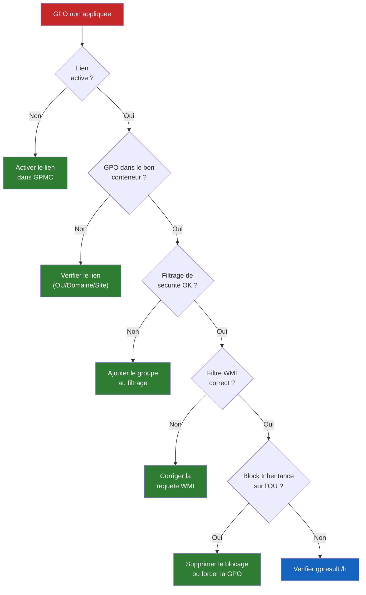

<!--
  Copyright 2026 Julien Bombled

  Licensed under the Apache License, Version 2.0 (the "License");
  you may not use this file except in compliance with the License.
  You may obtain a copy of the License at

      http://www.apache.org/licenses/LICENSE-2.0

  Unless required by applicable law or agreed to in writing, software
  distributed under the License is distributed on an "AS IS" BASIS,
  WITHOUT WARRANTIES OR CONDITIONS OF ANY KIND, either express or implied.
  See the License for the specific language governing permissions and
  limitations under the License.
-->
---
title: GPResult et depannage
description: Diagnostiquer et depanner les strategies de groupe avec gpresult, RSoP, Group Policy Modeling, les journaux d'evenements et les outils de depannage.
tags:
  - gpo
  - active-directory
  - gpresult
  - rsop
  - depannage
  - troubleshooting
---

# GPResult et depannage des GPO

<span class="level-advanced">Intermediaire-Avance</span> · Temps estime : 50 minutes

## gpresult : l'outil de diagnostic principal

!!! example "Analogie"

    Imaginez que vous recevez du courrier de plusieurs expediteurs (domaine, OU parente, OU enfant), et que certains messages se contredisent. `gpresult` est comme un recapitulatif postal qui vous montre exactement quels courriers ont ete livres, quels courriers ont ete bloques, et lequel fait foi pour chaque sujet. C'est votre outil de tracabilite.

La commande `gpresult` affiche le **jeu de strategies resultant** (Resultant
Set of Policy - RSoP) pour un utilisateur et/ou un ordinateur. C'est l'outil
de premiere intention pour verifier quelles GPO sont effectivement appliquees.

### Syntaxe de base

```powershell
# Summary of applied GPOs for the current user and computer
gpresult /r

# Detailed results for computer settings only
gpresult /r /scope:computer

# Detailed results for user settings only
gpresult /r /scope:user

# Generate an HTML report (most readable format)
gpresult /h "$env:USERPROFILE\Desktop\GPO-Report.html" /f

# Run for a specific user (requires admin privileges)
gpresult /r /user:lab\jdupont

# Run on a remote computer
gpresult /s PC-COMPTA-01 /r

# Remote computer + specific user
gpresult /s PC-COMPTA-01 /user:lab\jdupont /h "C:\Temp\GPO-Report.html" /f
```

### Lecture du rapport gpresult /r

Le rapport `gpresult /r` se divise en deux sections principales :

```
COMPUTER SETTINGS
-----------------
    Applied Group Policy Objects
        SEC - Security Baseline
        Default Domain Policy

    The following GPOs were not applied because they were filtered out
        CFG - Windows 11 Settings
            Filtering:  Denied (WMI Filter)
        CFG - Accounting Apps
            Filtering:  Denied (Security)

USER SETTINGS
-------------
    Applied Group Policy Objects
        CFG - Desktop Settings
        CFG - Drive Mapping

    The following GPOs were not applied because they were filtered out
        CFG - HR Restrictions
            Filtering:  Denied (Security)
```

!!! tip "Rapport HTML"

    Le rapport HTML (`gpresult /h`) est plus lisible et navigable que la sortie
    texte. Il inclut des sections depliables, un code couleur et des details
    sur chaque parametre applique. Privilegiez ce format pour le depannage.

### gpresult avec PowerShell avance

```powershell
# Generate XML report for programmatic analysis
gpresult /x "$env:USERPROFILE\Desktop\GPO-Report.xml" /f

# Parse XML report to extract applied GPOs
[xml]$report = Get-Content "$env:USERPROFILE\Desktop\GPO-Report.xml"
$computerGPOs = $report.Rsop.ComputerResults.GPO | Select-Object Name, Enabled
$userGPOs = $report.Rsop.UserResults.GPO | Select-Object Name, Enabled

Write-Output "=== Computer GPOs ==="
$computerGPOs | Format-Table -AutoSize

Write-Output "=== User GPOs ==="
$userGPOs | Format-Table -AutoSize
```

Resultat :

```text
=== Computer GPOs ===

Name                              Enabled
----                              -------
SEC - Security Baseline           True
Default Domain Policy             True
CFG - Windows Update Settings     True

=== User GPOs ===

Name                              Enabled
----                              -------
CFG - Desktop Settings            True
CFG - Mapped Drives               True
Default Domain Policy             True
```

---

## Resultant Set of Policy (RSoP)

Le RSoP est le resultat final de toutes les GPO appliquees apres resolution
des conflits (heritage, filtrage, priorite). Deux outils permettent de
le visualiser :

### Group Policy Results (rsop.msc)

!!! warning "rsop.msc est obsolete"

    La console `rsop.msc` est consideree comme obsolete. Preferez
    `gpresult /h` ou la fonctionnalite **Group Policy Results** dans GPMC.

### Group Policy Results dans GPMC

=== "GUI (gpmc.msc)"

    1. Ouvrir **Group Policy Management** (`gpmc.msc`)
    2. Cliquer droit sur **Group Policy Results** > **Group Policy Results Wizard**
    3. Selectionner l'ordinateur cible (local ou distant)
    4. Selectionner l'utilisateur cible
    5. Le rapport affiche les GPO appliquees, refusees et les parametres resultants

=== "PowerShell"

    ```powershell
    # The Get-GPResultantSetOfPolicy cmdlet generates an RSoP report
    Get-GPResultantSetOfPolicy -ReportType Html `
        -Path "$env:USERPROFILE\Desktop\RSoP-Report.html"

    # RSoP for a remote computer
    Get-GPResultantSetOfPolicy -Computer "PC-COMPTA-01" `
        -User "lab\jdupont" `
        -ReportType Html `
        -Path "C:\Temp\RSoP-Remote.html"
    ```

---

## Group Policy Modeling

Contrairement a **Group Policy Results** (qui montre ce qui est **deja
applique**), **Group Policy Modeling** simule ce qui **serait applique**
si un utilisateur/ordinateur se trouvait dans un conteneur donne.

=== "GUI (gpmc.msc)"

    1. Dans GPMC, cliquer droit sur **Group Policy Modeling** > **Group Policy
       Modeling Wizard**
    2. Selectionner le DC qui effectuera la simulation
    3. Definir :
        - Le conteneur pour l'**utilisateur** (OU)
        - Le conteneur pour l'**ordinateur** (OU)
    4. Optionnellement, simuler :
        - Un site specifique
        - Le traitement en boucle (loopback)
        - Des groupes de securite specifiques
        - Un filtre WMI
    5. Consulter le rapport de simulation

!!! tip "Quand utiliser Modeling vs Results ?"

    | Outil                    | Quand l'utiliser                                            |
    | :----------------------- | :---------------------------------------------------------- |
    | **Group Policy Results** | Diagnostiquer un probleme **actuel** sur un poste existant  |
    | **Group Policy Modeling** | Planifier et **prevoir** l'impact avant de lier une GPO    |

---

## Commande gpupdate pour le depannage

```powershell
# Force full reapplication of all GPO settings
gpupdate /force

# Force reapplication and reboot if required (Computer policies only)
gpupdate /force /boot

# Force reapplication and logoff if required (User policies only)
gpupdate /force /logoff

# Force GPO refresh on a remote computer via PowerShell
Invoke-GPUpdate -Computer "PC-COMPTA-01" -Force -RandomDelayInMinutes 0

# Force GPO refresh on all computers in an OU
Get-ADComputer -Filter * -SearchBase "OU=Comptabilite,OU=Siege,DC=lab,DC=local" |
    ForEach-Object {
        Invoke-GPUpdate -Computer $_.Name -Force -RandomDelayInMinutes 0
    }
```

!!! warning "gpupdate /force vs gpupdate"

    `gpupdate /force` reapplique **tous** les parametres, y compris ceux deja
    en place. En fonctionnement normal, `gpupdate` sans `/force` est suffisant
    et plus leger. Reservez `/force` au depannage.

---

## Journaux d'evenements pour les GPO

Les journaux d'evenements Windows sont essentiels pour diagnostiquer les
problemes de traitement des GPO.

### Journaux principaux

| Journal                                           | Contenu                                           |
| :------------------------------------------------ | :------------------------------------------------ |
| **Applications and Services Logs > Microsoft > Windows > GroupPolicy > Operational** | Details du traitement GPO |
| **System**                                        | Erreurs majeures de traitement                    |

### Evenements importants

| Event ID | Source       | Signification                                          |
| :------- | :----------- | :----------------------------------------------------- |
| **4016** | GroupPolicy  | Traitement GPO reussi (Computer)                       |
| **5016** | GroupPolicy  | Traitement GPO reussi (User)                           |
| **7016** | GroupPolicy  | Traitement termine pour une extension specifique        |
| **7320** | GroupPolicy  | Erreur de traitement -- GPO inaccessible               |
| **1058** | GroupPolicy  | Impossible de lire la GPO dans SYSVOL                  |
| **1030** | GroupPolicy  | Erreur d'acces au service d'annuaire                   |
| **1006** | GroupPolicy  | Traitement GPO abandonne (delai depasse)               |

### Consulter les journaux

=== "PowerShell"

    ```powershell
    # View recent Group Policy events
    Get-WinEvent -LogName "Microsoft-Windows-GroupPolicy/Operational" -MaxEvents 50 |
        Select-Object TimeCreated, Id, LevelDisplayName, Message |
        Format-Table -Wrap

    # Filter for errors only
    Get-WinEvent -LogName "Microsoft-Windows-GroupPolicy/Operational" |
        Where-Object { $_.Level -eq 2 } |
        Select-Object TimeCreated, Id, Message |
        Format-List

    # Search for a specific Event ID
    Get-WinEvent -FilterHashtable @{
        LogName = "Microsoft-Windows-GroupPolicy/Operational"
        Id = 7320
    } -MaxEvents 10 |
        Format-List TimeCreated, Message

    # Enable verbose Group Policy logging (debug mode)
    # Registry key to enable detailed logging:
    $regPath = "HKLM:\SOFTWARE\Microsoft\Windows NT\CurrentVersion\Diagnostics"
    New-Item -Path $regPath -Force | Out-Null
    Set-ItemProperty -Path $regPath -Name "GPSvcDebugLevel" -Value 0x30002 -Type DWord
    # Log file: %SYSTEMROOT%\debug\usermode\gpsvc.log
    ```

    Resultat :

    ```text
    TimeCreated           Id LevelDisplayName Message
    -----------           -- ---------------- -------
    20/02/2026 08:15:32 5016 Information      Completed user Group Policy processing...
    20/02/2026 08:15:30 4016 Information      Completed computer Group Policy processing...
    20/02/2026 08:15:28 7016 Information      Completed Registry Extension Processing...
    20/02/2026 08:15:25 7320 Error            The GPO "CFG - Branch Settings" could not...
    20/02/2026 08:12:10 4016 Information      Completed computer Group Policy processing...
    ```

=== "GUI (eventvwr.msc)"

    1. Ouvrir **Event Viewer** (`eventvwr.msc`)
    2. Naviguer vers **Applications and Services Logs** > **Microsoft** >
       **Windows** > **GroupPolicy** > **Operational**
    3. Filtrer par niveau (Error, Warning) ou par Event ID

---

## Problemes courants et solutions

### Probleme 1 : La GPO ne s'applique pas du tout



```powershell
# Step 1: Verify the GPO link is enabled
Get-GPO -Name "CFG - Desktop Restrictions" | Select-Object DisplayName, GpoStatus

# Step 2: Verify link targets
(Get-GPO -Name "CFG - Desktop Restrictions").GetSecurityInfo()

# Step 3: Check security filtering
Get-GPPermission -Name "CFG - Desktop Restrictions" -All |
    Select-Object Trustee, Permission, Inherited

# Step 4: Check for Block Inheritance
Get-GPInheritance -Target "OU=Comptabilite,OU=Siege,DC=lab,DC=local" |
    Select-Object ContainerName, GpoInheritanceBlocked
```

Resultat :

```text
DisplayName              GpoStatus
-----------              ---------
CFG - Desktop Restrictions AllSettingsEnabled

Trustee                  Permission                   Inherited
-------                  ----------                   ---------
Authenticated Users      GpoApply                     False
Domain Admins            GpoEditDeleteModifySecurity   False
ENTERPRISE DOMAIN CTRL   GpoRead                      False

ContainerName            GpoInheritanceBlocked
-------------            ---------------------
Comptabilite             False
```

### Probleme 2 : Conflit entre GPO

```powershell
# Generate a detailed RSoP report to identify winning GPO
gpresult /h "$env:USERPROFILE\Desktop\Conflict-Report.html" /f

# In the HTML report, look for "Winning GPO" column to see which GPO
# provides the final value for each conflicting setting
```

!!! tip "Identifier la GPO gagnante"

    Dans le rapport HTML de `gpresult`, chaque parametre indique la **Winning
    GPO** (GPO gagnante). Si un parametre ne s'applique pas comme prevu,
    verifiez quelle GPO l'emporte et ajustez l'ordre de liaison ou le
    mecanisme Enforced.

### Probleme 3 : Replication SYSVOL

Si les GPO sont incoherentes entre les controleurs de domaine, le probleme
vient probablement de la replication SYSVOL.

```powershell
# Check SYSVOL replication health
dcdiag /test:sysvolcheck /s:DC01

# Check DFS-R replication status
dfsrdiag.exe PollAD /Member:DC01

# Compare GPO versions between DCs
$gpo = Get-GPO -Name "SEC - Security Baseline"
Write-Output "User version  : $($gpo.User.DSVersion) (AD) / $($gpo.User.SysvolVersion) (SYSVOL)"
Write-Output "Computer version: $($gpo.Computer.DSVersion) (AD) / $($gpo.Computer.SysvolVersion) (SYSVOL)"

# If AD version != SYSVOL version, replication is out of sync
```

Resultat :

```text
User version  : 12 (AD) / 12 (SYSVOL)
Computer version: 8 (AD) / 7 (SYSVOL)    <-- INCOHERENCE
```

!!! danger "Incoherence de version"

    Si la version AD et la version SYSVOL d'une GPO different, cela indique
    un probleme de replication. Les parametres peuvent etre differents selon
    le DC contacte. Verifiez l'etat de DFS-R et assurez-vous que tous les DC
    communiquent correctement.

### Probleme 4 : Lenteur de traitement GPO

```powershell
# Check Group Policy processing time in event logs
Get-WinEvent -FilterHashtable @{
    LogName = "Microsoft-Windows-GroupPolicy/Operational"
    Id = 8001  # Group Policy processing started
} -MaxEvents 5 |
    Select-Object TimeCreated, Message

Get-WinEvent -FilterHashtable @{
    LogName = "Microsoft-Windows-GroupPolicy/Operational"
    Id = 8007  # Group Policy processing completed
} -MaxEvents 5 |
    Select-Object TimeCreated, Message

# Identify slow CSE (Client-Side Extensions)
Get-WinEvent -FilterHashtable @{
    LogName = "Microsoft-Windows-GroupPolicy/Operational"
    Id = 4016
} -MaxEvents 1 | Format-List *
```

**Causes frequentes de lenteur :**

- Trop de filtres WMI (evalues a chaque cycle)
- Scripts de logon longs ou bloques
- Problemes reseau vers un DC ou le partage SYSVOL
- Nombre excessif de GPO liees

### Probleme 5 : Permission "Authenticated Users" manquante

```powershell
# A common mistake: removing Authenticated Users from both Apply AND Read
# This prevents the GPO from being processed at all

# Verify Read permission exists
Get-GPPermission -Name "CFG - Accounting Apps" -TargetName "Authenticated Users" `
    -TargetType Group -ErrorAction SilentlyContinue

# Fix: restore Read permission
Set-GPPermission -Name "CFG - Accounting Apps" `
    -TargetName "Authenticated Users" `
    -TargetType Group `
    -PermissionLevel GpoRead
```

---

## Checklist de depannage rapide

Utilisez cette liste pour diagnostiquer systematiquement un probleme GPO :

- [ ] Le lien GPO est-il **active** ? (GPMC > OU > lien coche)
- [ ] La GPO est-elle liee au **bon conteneur** ? (OU de l'objet cible)
- [ ] Le **statut GPO** est-il correct ? (pas desactivee dans Details)
- [ ] Le **filtrage de securite** inclut-il le groupe de l'utilisateur/ordinateur ?
- [ ] La permission **Read** pour Authenticated Users est-elle presente ?
- [ ] Le **filtre WMI** (s'il y en a un) retourne-t-il vrai pour le poste ?
- [ ] Y a-t-il un **Block Inheritance** sur l'OU ?
- [ ] Une autre GPO de priorite superieure ecrase-t-elle le parametre ?
- [ ] La **replication SYSVOL** est-elle saine ? (versions AD = SYSVOL)
- [ ] Le poste a-t-il une **connectivite** reseau vers un DC ?
- [ ] Les **journaux d'evenements** GroupPolicy signalent-ils des erreurs ?

---

## Scenario pratique

!!! example "Scenario pratique"

    **Contexte** : Julien, technicien de support niveau 2, recoit un ticket de Paul, comptable, qui signale que son lecteur reseau `S:` n'apparait plus depuis ce matin. D'autres comptables n'ont pas le probleme.

    **Diagnostic** :

    1. Julien se connecte a distance sur le poste de Paul et genere un rapport :

        ```powershell
        gpresult /s PC-COMPTA-03 /user:lab\paul.martin /h "C:\Temp\paul-gpo.html" /f
        ```

    2. Dans le rapport HTML, il constate que la GPO `CFG - Mapped Drives` apparait dans la section **User Settings** > **Applied GPOs**. Le parametre est donc bien recu.

    3. Il verifie si le lecteur est presente :

        ```powershell
        Invoke-Command -ComputerName PC-COMPTA-03 -ScriptBlock {
            Get-PSDrive -PSProvider FileSystem | Where-Object Name -eq "S"
        }
        ```

        Resultat :

        ```text
        (aucun resultat)
        ```

    4. Le lecteur n'existe pas malgre la GPO appliquee. Julien teste l'acces au partage :

        ```powershell
        Invoke-Command -ComputerName PC-COMPTA-03 -ScriptBlock {
            Test-Path "\\SRV-FILE\Partage"
        }
        ```

        Resultat :

        ```text
        False
        ```

    5. Le partage `\\SRV-FILE\Partage` est inaccessible depuis le poste de Paul. Julien teste depuis un autre poste : le partage fonctionne. Il verifie la connectivite reseau de PC-COMPTA-03 vers SRV-FILE :

        ```powershell
        Test-NetConnection -ComputerName SRV-FILE -Port 445
        ```

        Resultat :

        ```text
        ComputerName     : SRV-FILE
        RemoteAddress    : 10.0.0.20
        RemotePort       : 445
        TcpTestSucceeded : False
        ```

    **Resolution** : le port SMB (445) est bloque. Apres verification, une regle de pare-feu locale avait ete modifiee manuellement sur le poste de Paul. La restauration de la regle par defaut et un `gpupdate /force` resolvent le probleme. La GPO n'etait pas en cause, mais c'est le diagnostic GPO qui a permis d'identifier que le probleme etait reseau et non strategique.

---

## Erreurs courantes

!!! danger "Erreurs courantes"

    1. **Oublier d'executer gpresult en tant qu'administrateur** : sans privileges d'administration, `gpresult /r` ne montre que les parametres utilisateur et omet les parametres ordinateur. Toujours lancer depuis une invite elevee.

    2. **Confondre Group Policy Results et Group Policy Modeling** : Results montre ce qui est **deja applique** sur un poste reel. Modeling **simule** ce qui serait applique. Utiliser Modeling pour diagnostiquer un probleme actuel ne sert a rien.

    3. **Ne pas verifier les journaux d'evenements** : `gpresult` montre les GPO filtrees mais n'explique pas toujours pourquoi. Les journaux **GroupPolicy/Operational** (Event ID 7320, 1058, 1030) donnent les details precis de l'echec.

    4. **Ignorer les versions AD/SYSVOL** : une incoherence de version entre AD et SYSVOL indique un probleme de replication. Les parametres peuvent differer selon le DC contacte par le poste, rendant le depannage confus si on ne verifie pas ce point.

    5. **Forcer gpupdate /force systematiquement** : `gpupdate /force` reapplique tout, ce qui est lourd et peut masquer un probleme intermittent. Utilisez d'abord `gpupdate` sans `/force` pour identifier si le probleme se reproduit.

---

## Points cles a retenir

- `gpresult /h` est l'outil de diagnostic principal ; le rapport HTML est le
  format le plus lisible.
- **Group Policy Results** montre ce qui est applique actuellement ;
  **Group Policy Modeling** simule ce qui serait applique.
- Les journaux **GroupPolicy/Operational** dans l'Event Viewer fournissent les
  details de traitement et les erreurs.
- Verifiez toujours le **filtrage de securite**, les **liens actifs**, et la
  **permission Read** pour Authenticated Users en premier.
- Les problemes de **replication SYSVOL** (versions AD != SYSVOL) causent des
  GPO incoherentes entre les DC.
- Activez le log debug (`GPSvcDebugLevel`) pour les problemes difficiles a
  diagnostiquer.

---

## Pour aller plus loin

- [Concepts GPO](concepts-gpo.md) -- rappel de l'ordre de traitement LSDOU
- [Filtrage et heritage](filtrage-et-heritage.md) -- comprendre les mecanismes qui bloquent une GPO
- [Creer et lier une GPO](creer-et-lier.md) -- verifier la configuration des liens
- [Modeles ADMX](modeles-admx.md) -- diagnostiquer les modeles manquants
- [Depannage general](../../supervision/depannage/methodologie.md) -- methodologie de depannage Windows
- [Journaux d'evenements](../../securite/audit/journaux-evenements.md) -- approfondir l'Event Viewer

