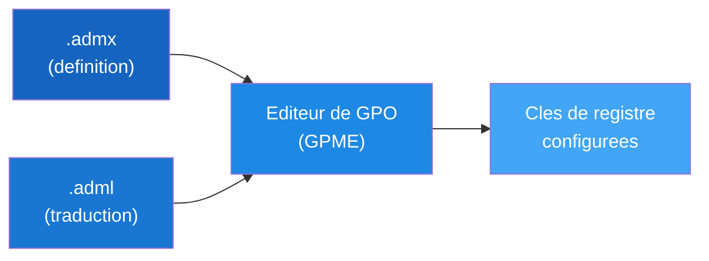

# Modeles ADMX / ADML

!!! info "Niveau : Intermediaire-Avance | Temps estime : 45 minutes"

    Cette page explique le fonctionnement des modeles d'administration
    ADMX/ADML, la mise en place du Central Store et l'integration de modeles
    tiers sous Windows Server 2022. Prerequis : maitriser les
    [concepts GPO](concepts-gpo.md) et savoir
    [creer et lier une GPO](creer-et-lier.md).

## Qu'est-ce qu'un modele ADMX ?

Les **Administrative Templates** (modeles d'administration) definissent les
parametres configurables dans la section **Administrative Templates** de
l'editeur de GPO. Depuis Windows Vista / Server 2008, ces modeles utilisent
le format **XML** :

| Fichier   | Role                                                               |
| :-------- | :----------------------------------------------------------------- |
| **`.admx`** | Fichier de definition XML -- decrit les cles de registre, les parametres et leur structure |
| **`.adml`** | Fichier de langue XML -- contient les traductions (titres, descriptions, aide) |



### Emplacement par defaut (local)

Sur chaque machine Windows, les modeles ADMX sont stockes dans :

```
C:\Windows\PolicyDefinitions\              # Fichiers .admx
C:\Windows\PolicyDefinitions\fr-FR\        # Fichiers .adml (francais)
C:\Windows\PolicyDefinitions\en-US\        # Fichiers .adml (anglais)
```

!!! info "Anciens fichiers ADM"

    Les fichiers `.adm` (format pre-Vista) sont toujours pris en charge mais
    sont obsoletes. Ils stockent definition et traduction dans un seul fichier
    texte. Preferez le format ADMX pour tout nouveau modele.

---

## Le Central Store

Par defaut, chaque administrateur qui edite une GPO utilise les modeles ADMX
**locaux** de sa machine. Cela peut entrainer des incoherences si les versions
different entre les postes d'administration.

Le **Central Store** est un emplacement centralise dans SYSVOL qui garantit
que tous les administrateurs utilisent **les memes modeles ADMX**.

### Architecture du Central Store

```
\\lab.local\SYSVOL\lab.local\Policies\
    PolicyDefinitions\                     # Central Store
        Windows.admx                       # ADMX files
        WindowsFirewall.admx
        ...
        fr-FR\                             # French translations
            Windows.adml
            WindowsFirewall.adml
            ...
        en-US\                             # English translations
            Windows.adml
            WindowsFirewall.adml
            ...
```

!!! tip "Detection automatique"

    Quand le dossier `PolicyDefinitions` existe dans SYSVOL, l'editeur de GPO
    l'utilise **automatiquement** a la place des fichiers locaux. Aucune
    configuration supplementaire n'est necessaire.

### Creer le Central Store

=== "PowerShell"

    ```powershell
    # Step 1: Create the PolicyDefinitions folder in SYSVOL
    $centralStore = "\\$env:USERDNSDOMAIN\SYSVOL\$env:USERDNSDOMAIN\Policies\PolicyDefinitions"
    New-Item -Path $centralStore -ItemType Directory -Force

    # Step 2: Copy local ADMX files to the Central Store
    Copy-Item -Path "C:\Windows\PolicyDefinitions\*.admx" `
        -Destination $centralStore -Force

    # Step 3: Copy language folders (French and English)
    $languages = @("fr-FR", "en-US")
    foreach ($lang in $languages) {
        $langPath = Join-Path -Path $centralStore -ChildPath $lang
        New-Item -Path $langPath -ItemType Directory -Force
        Copy-Item -Path "C:\Windows\PolicyDefinitions\$lang\*.adml" `
            -Destination $langPath -Force
    }

    # Step 4: Verify the Central Store
    Get-ChildItem -Path $centralStore -Recurse |
        Measure-Object |
        Select-Object @{N="Total files in Central Store"; E={$_.Count}}
    ```

=== "GUI"

    1. Ouvrir l'Explorateur de fichiers
    2. Naviguer vers `\\lab.local\SYSVOL\lab.local\Policies\`
    3. Creer le dossier `PolicyDefinitions`
    4. Copier le contenu de `C:\Windows\PolicyDefinitions\` dans ce dossier
    5. Inclure les sous-dossiers de langue (`fr-FR`, `en-US`)

!!! warning "Utiliser les modeles du dernier OS"

    Copiez les modeles ADMX depuis la machine executant la **version la plus
    recente** de Windows (Server 2022 ou Windows 11). Les modeles plus anciens
    ne contiennent pas les parametres des nouvelles fonctionnalites.

---

## Modeles ADMX tiers

De nombreux editeurs fournissent des modeles ADMX pour gerer leurs applications
via les GPO. Voici les plus courants :

### Google Chrome

```powershell
# Download location (check for latest version):
# https://chromeenterprise.google/browser/download/#manage-policies-tab

# After downloading, extract and copy to Central Store:
$chromePath = "C:\Temp\ChromeADMX"  # Extracted files location
$centralStore = "\\$env:USERDNSDOMAIN\SYSVOL\$env:USERDNSDOMAIN\Policies\PolicyDefinitions"

Copy-Item -Path "$chromePath\windows\admx\chrome.admx" -Destination $centralStore
Copy-Item -Path "$chromePath\windows\admx\google.admx" -Destination $centralStore
Copy-Item -Path "$chromePath\windows\admx\fr-FR\*" -Destination "$centralStore\fr-FR\"
Copy-Item -Path "$chromePath\windows\admx\en-US\*" -Destination "$centralStore\en-US\"
```

### Microsoft Edge

```powershell
# Download location:
# https://www.microsoft.com/en-us/edge/business/download

# Edge ADMX files to copy:
$edgePath = "C:\Temp\EdgeADMX"
$centralStore = "\\$env:USERDNSDOMAIN\SYSVOL\$env:USERDNSDOMAIN\Policies\PolicyDefinitions"

Copy-Item -Path "$edgePath\msedge.admx" -Destination $centralStore
Copy-Item -Path "$edgePath\msedgeupdate.admx" -Destination $centralStore
Copy-Item -Path "$edgePath\fr-FR\*" -Destination "$centralStore\fr-FR\"
Copy-Item -Path "$edgePath\en-US\*" -Destination "$centralStore\en-US\"
```

### Mozilla Firefox

```powershell
# Download location:
# https://github.com/nickelheim/firefox-admx

$firefoxPath = "C:\Temp\FirefoxADMX"
$centralStore = "\\$env:USERDNSDOMAIN\SYSVOL\$env:USERDNSDOMAIN\Policies\PolicyDefinitions"

Copy-Item -Path "$firefoxPath\firefox.admx" -Destination $centralStore
Copy-Item -Path "$firefoxPath\mozilla.admx" -Destination $centralStore
Copy-Item -Path "$firefoxPath\fr-FR\*" -Destination "$centralStore\fr-FR\"
Copy-Item -Path "$firefoxPath\en-US\*" -Destination "$centralStore\en-US\"
```

### Microsoft Office

```powershell
# Download the Office ADMX from:
# https://www.microsoft.com/en-us/download/details.aspx?id=49030

# After installation, files are located in:
# C:\Program Files (x86)\Microsoft Office\admx\

$officePath = "C:\Program Files (x86)\Microsoft Office\admx"
$centralStore = "\\$env:USERDNSDOMAIN\SYSVOL\$env:USERDNSDOMAIN\Policies\PolicyDefinitions"

Copy-Item -Path "$officePath\*.admx" -Destination $centralStore
Copy-Item -Path "$officePath\fr-FR\*" -Destination "$centralStore\fr-FR\"
Copy-Item -Path "$officePath\en-US\*" -Destination "$centralStore\en-US\"
```

### Tableau recapitulatif

| Application       | Parametres utiles                                           |
| :---------------- | :---------------------------------------------------------- |
| **Google Chrome** | Page d'accueil, proxy, extensions autorisees, mise a jour   |
| **Microsoft Edge**| Page d'accueil, mode IE, collections, synchronisation       |
| **Mozilla Firefox** | Page d'accueil, proxy, certificats, mises a jour          |
| **Microsoft Office** | Macros, emplacements approuves, signature, telemetrie    |
| **Adobe Reader**  | Mises a jour, JavaScript, sandbox                           |
| **OneDrive**      | Dossiers connus, connexion silencieuse, limites bande passante |

!!! danger "Compatibilite des versions"

    Assurez-vous que les modeles ADMX tiers correspondent a la **version
    installee** de l'application. Des modeles trop anciens ou trop recents
    peuvent definir des cles de registre inutiles ou manquer des parametres.

---

## Mettre a jour le Central Store

Lors de la mise a jour des modeles (nouveau Windows, nouvelle version d'Office),
suivez cette procedure :

```powershell
# Step 1: Backup the current Central Store
$centralStore = "\\$env:USERDNSDOMAIN\SYSVOL\$env:USERDNSDOMAIN\Policies\PolicyDefinitions"
$backupPath = "C:\GPO-Backups\PolicyDefinitions-$(Get-Date -Format 'yyyy-MM-dd')"
Copy-Item -Path $centralStore -Destination $backupPath -Recurse

# Step 2: Copy updated Windows ADMX from a Windows Server 2022 machine
# (or download the latest Administrative Templates from Microsoft)
Copy-Item -Path "C:\Windows\PolicyDefinitions\*.admx" `
    -Destination $centralStore -Force
Copy-Item -Path "C:\Windows\PolicyDefinitions\fr-FR\*.adml" `
    -Destination "$centralStore\fr-FR\" -Force
Copy-Item -Path "C:\Windows\PolicyDefinitions\en-US\*.adml" `
    -Destination "$centralStore\en-US\" -Force

# Step 3: Verify no ADMX files are orphaned (missing ADML)
$admxFiles = Get-ChildItem -Path $centralStore -Filter "*.admx" |
    Select-Object -ExpandProperty BaseName
$admlFiles = Get-ChildItem -Path "$centralStore\fr-FR" -Filter "*.adml" |
    Select-Object -ExpandProperty BaseName

$orphaned = $admxFiles | Where-Object { $_ -notin $admlFiles }
if ($orphaned) {
    Write-Warning "ADMX files without corresponding fr-FR ADML:"
    $orphaned | ForEach-Object { Write-Warning "  - $_.admx" }
} else {
    Write-Output "All ADMX files have corresponding ADML translations."
}
```

!!! tip "Sauvegardez avant chaque mise a jour"

    Conservez une copie du Central Store avant chaque mise a jour. En cas de
    probleme, vous pourrez restaurer rapidement les modeles precedents.

---

## Creer un modele ADMX personnalise

Pour des besoins specifiques (application interne, parametres personnalises),
vous pouvez creer vos propres modeles ADMX.

### Structure d'un fichier ADMX

```xml
<?xml version="1.0" encoding="utf-8"?>
<!--
  Copyright 2026 Julien Bombled

  Licensed under the Apache License, Version 2.0 (the "License");
  you may not use this file except in compliance with the License.
  You may obtain a copy of the License at

      http://www.apache.org/licenses/LICENSE-2.0
-->
<policyDefinitions
    xmlns:xsd="http://www.w3.org/2001/XMLSchema"
    xmlns:xsi="http://www.w3.org/2001/XMLSchema-instance"
    revision="1.0"
    schemaVersion="1.0">

  <policyNamespaces>
    <target prefix="myapp" namespace="MyCompany.Policies.MyApp" />
    <using prefix="windows" namespace="Microsoft.Policies.Windows" />
  </policyNamespaces>

  <resources minRequiredRevision="1.0" />

  <categories>
    <category name="MyApp" displayName="$(string.MyApp_Category)" />
    <category name="MyApp_Settings" displayName="$(string.MyApp_Settings_Category)">
      <parentCategory ref="MyApp" />
    </category>
  </categories>

  <policies>
    <policy name="EnableFeatureX"
            class="Machine"
            displayName="$(string.EnableFeatureX)"
            explainText="$(string.EnableFeatureX_Help)"
            key="SOFTWARE\MyCompany\MyApp"
            valueName="EnableFeatureX">
      <parentCategory ref="MyApp_Settings" />
      <supportedOn ref="windows:SUPPORTED_WindowsVista" />
      <enabledValue><decimal value="1" /></enabledValue>
      <disabledValue><decimal value="0" /></disabledValue>
    </policy>

    <policy name="ServerUrl"
            class="Machine"
            displayName="$(string.ServerUrl)"
            explainText="$(string.ServerUrl_Help)"
            presentation="$(presentation.ServerUrl)"
            key="SOFTWARE\MyCompany\MyApp"
            valueName="ServerUrl">
      <parentCategory ref="MyApp_Settings" />
      <supportedOn ref="windows:SUPPORTED_WindowsVista" />
      <elements>
        <text id="ServerUrl_TextBox" valueName="ServerUrl" required="true" />
      </elements>
    </policy>
  </policies>
</policyDefinitions>
```

### Structure du fichier ADML correspondant

```xml
<?xml version="1.0" encoding="utf-8"?>
<policyDefinitionResources
    xmlns:xsd="http://www.w3.org/2001/XMLSchema"
    xmlns:xsi="http://www.w3.org/2001/XMLSchema-instance"
    revision="1.0"
    schemaVersion="1.0">

  <displayName>MyApp Policy Definitions</displayName>
  <description>Administrative Template for MyApp configuration.</description>

  <resources>
    <stringTable>
      <string id="MyApp_Category">MyApp</string>
      <string id="MyApp_Settings_Category">Settings</string>
      <string id="EnableFeatureX">Enable Feature X</string>
      <string id="EnableFeatureX_Help">Enables the Feature X functionality.
When enabled, Feature X will be active for all users on this computer.
When disabled or not configured, Feature X uses the application default.</string>
      <string id="ServerUrl">Server URL</string>
      <string id="ServerUrl_Help">Specifies the server URL for the MyApp backend.
Enter the full URL including the protocol (e.g., https://app.example.com).</string>
    </stringTable>

    <presentationTable>
      <presentation id="ServerUrl">
        <textBox refId="ServerUrl_TextBox">
          <label>Server URL:</label>
        </textBox>
      </presentation>
    </presentationTable>
  </resources>
</policyDefinitionResources>
```

### Deployer le modele personnalise

```powershell
# Copy custom ADMX to Central Store
$centralStore = "\\$env:USERDNSDOMAIN\SYSVOL\$env:USERDNSDOMAIN\Policies\PolicyDefinitions"

Copy-Item -Path "C:\Temp\MyApp.admx" -Destination $centralStore
Copy-Item -Path "C:\Temp\en-US\MyApp.adml" -Destination "$centralStore\en-US\"
Copy-Item -Path "C:\Temp\fr-FR\MyApp.adml" -Destination "$centralStore\fr-FR\"

# Verify the template appears in GPME
# Open gpmc.msc > Edit a GPO > Computer Configuration > Policies >
# Administrative Templates > MyApp > Settings
```

!!! tip "Outils de creation ADMX"

    Plusieurs outils facilitent la creation de modeles ADMX sans ecrire de
    XML a la main :

    - **ADMX Migrator** (Microsoft) : convertit les anciens ADM en ADMX
    - **Registry to ADMX** : genere un ADMX a partir de cles de registre
      existantes
    - Un editeur XML avec schema de validation `PolicyDefinitions.xsd`

---

## Diagnostiquer les problemes ADMX

### Modele manquant dans l'editeur de GPO

```powershell
# Verify the Central Store exists and is accessible
$centralStore = "\\$env:USERDNSDOMAIN\SYSVOL\$env:USERDNSDOMAIN\Policies\PolicyDefinitions"
Test-Path -Path $centralStore

# List ADMX files in the Central Store
Get-ChildItem -Path $centralStore -Filter "*.admx" |
    Select-Object Name, Length, LastWriteTime |
    Sort-Object Name |
    Format-Table -AutoSize

# Check for missing ADML files (language mismatch)
$admxCount = (Get-ChildItem -Path $centralStore -Filter "*.admx").Count
$admlCount = (Get-ChildItem -Path "$centralStore\fr-FR" -Filter "*.adml").Count
Write-Output "ADMX files: $admxCount | ADML files (fr-FR): $admlCount"
```

### Erreur "Administrative Templates namespace already defined"

Cette erreur survient quand deux fichiers ADMX definissent le meme namespace.
Cela arrive souvent avec des versions multiples d'un meme modele tiers.

```powershell
# Find duplicate namespaces
$admxFiles = Get-ChildItem -Path $centralStore -Filter "*.admx"
foreach ($file in $admxFiles) {
    [xml]$content = Get-Content $file.FullName
    $ns = $content.policyDefinitions.policyNamespaces.target.namespace
    Write-Output "$($file.Name) -> $ns"
}
# Look for duplicate namespace values in the output
```

!!! warning "Conflits de namespace"

    Supprimez les anciens fichiers ADMX quand vous installez une version
    mise a jour. Ne conservez qu'une seule version de chaque modele dans
    le Central Store.

---

## Points cles a retenir

- Les modeles **ADMX** (definition) et **ADML** (traduction) remplacent les
  anciens fichiers ADM et utilisent le format XML.
- Le **Central Store** dans SYSVOL garantit que tous les administrateurs
  utilisent les memes modeles ; il est detecte automatiquement par l'editeur
  de GPO.
- Les modeles tiers (Chrome, Edge, Firefox, Office) s'ajoutent simplement en
  copiant les fichiers dans le Central Store.
- Sauvegardez le Central Store **avant** chaque mise a jour de modeles.
- Les modeles ADMX personnalises permettent de gerer des applications internes
  via les GPO.
- Verifiez l'absence de **conflits de namespace** quand des parametres ne
  s'affichent pas dans l'editeur.

---

## Pour aller plus loin

- [Concepts GPO](concepts-gpo.md) -- rappel sur le stockage SYSVOL
- [Creer et lier une GPO](creer-et-lier.md) -- utiliser les nouveaux modeles dans une GPO
- [Preferences vs Policies](preferences-vs-policies.md) -- les modeles ADMX definissent des Policies
- [GPResult et depannage](gpresult-et-depannage.md) -- verifier l'application des parametres ADMX
- [Sites et replication](../adds/sites-et-replication.md) -- impact de la replication SYSVOL sur le Central Store
- [Security Baselines](../../securite/durcissement/security-baselines.md) -- modeles de securite Microsoft
