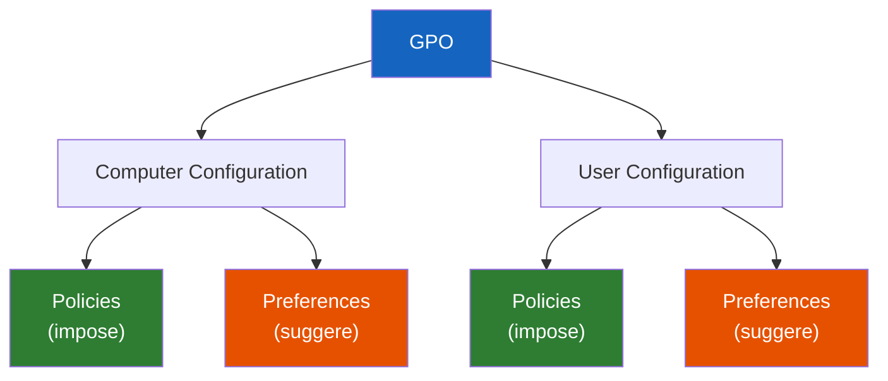

<!--
  Copyright 2026 Julien Bombled

  Licensed under the Apache License, Version 2.0 (the "License");
  you may not use this file except in compliance with the License.
  You may obtain a copy of the License at

      http://www.apache.org/licenses/LICENSE-2.0

  Unless required by applicable law or agreed to in writing, software
  distributed under the License is distributed on an "AS IS" BASIS,
  WITHOUT WARRANTIES OR CONDITIONS OF ANY KIND, either express or implied.
  See the License for the specific language governing permissions and
  limitations under the License.
-->
---
title: Preferences vs Policies
description: Comprendre la difference entre les strategies (Policies) et les preferences (Preferences) dans les GPO, et savoir quand utiliser chaque approche.
tags:
  - gpo
  - active-directory
  - preferences
  - policies
  - item-level-targeting
---

# Preferences vs Policies

<span class="level-intermediate">Intermediaire</span> · Temps estime : 40 minutes

## Vue d'ensemble

!!! example "Analogie"

    Imaginez un hotel. Les **Policies** sont les regles de l'etablissement : interdiction de fumer, horaires du petit-dejeuner. Le client ne peut pas les changer. Les **Preferences** sont les reglages de la chambre : temperature du thermostat, orientation de la lampe. Le client peut les ajuster a sa convenance. Si le client quitte l'hotel, les regles disparaissent (Policies = pas de tatouage), mais le thermostat reste tel que le client l'a laisse (Preferences = tatouage).

L'editeur de GPO (GPME) contient deux grandes branches sous chaque section
(Computer Configuration et User Configuration) :

- **Policies** : parametres **imposes** et controles de facon stricte.
- **Preferences** : parametres **suggeres** qui configurent l'environnement
  tout en laissant une certaine flexibilite a l'utilisateur.



---

## Policies (Strategies)

Les **Policies** sont des parametres **forces** par le systeme. Elles modifient
des cles de registre dans des emplacements **proteges** (`Policies`) et ne
peuvent pas etre contournees par l'utilisateur.

### Caracteristiques des Policies

| Aspect                  | Comportement                                                    |
| :---------------------- | :-------------------------------------------------------------- |
| **Application**         | Forcee -- l'utilisateur ne peut pas modifier le parametre       |
| **Registre**            | Ecrit sous `HKLM\SOFTWARE\Policies\` ou `HKCU\SOFTWARE\Policies\` |
| **Tatouage (tattooing)**| Non -- le parametre est retire quand la GPO ne s'applique plus  |
| **Interface utilisateur**| Le parametre est grise (inaccessible) dans l'interface        |
| **Rafraichissement**    | Appliquee a chaque cycle de rafraichissement GPO                |

!!! info "Pas de tatouage"

    Les Policies n'ecrivent que dans les branches `Policies` du registre.
    Quand la GPO est retiree, le parametre revient a sa valeur par defaut.
    C'est ce qu'on appelle l'absence de **tatouage** (tattooing).

### Exemples courants de Policies

| Categorie                  | Emplacement GPME                                              | Exemple                          |
| :------------------------- | :------------------------------------------------------------ | :------------------------------- |
| Securite                   | Computer > Policies > Windows Settings > Security Settings    | Politique de mot de passe        |
| Modeles d'administration   | User > Policies > Administrative Templates > Desktop          | Masquer toutes les icones du bureau |
| Scripts                    | Computer > Policies > Windows Settings > Scripts              | Script de demarrage              |
| Pare-feu                   | Computer > Policies > Windows Settings > Security > Windows Firewall | Regles de pare-feu         |

---

## Preferences

Les **Preferences** configurent des parametres que l'utilisateur **peut
modifier** par la suite. Elles ecrivent directement dans les cles de registre
standard (pas sous `Policies`), comme le ferait une configuration manuelle.

### Caracteristiques des Preferences

| Aspect                  | Comportement                                                    |
| :---------------------- | :-------------------------------------------------------------- |
| **Application**         | Suggeree -- l'utilisateur peut modifier le parametre            |
| **Registre**            | Ecrit dans les cles standard (`HKLM\SOFTWARE\` ou `HKCU\SOFTWARE\`) |
| **Tatouage (tattooing)**| Oui -- le parametre reste meme si la GPO est retiree            |
| **Interface utilisateur**| Le parametre reste modifiable                                  |
| **Rafraichissement**    | Selon l'action choisie (voir ci-dessous)                        |

### Actions disponibles pour les Preferences

Chaque element de Preference propose quatre actions :

| Action      | Icone   | Comportement                                                     |
| :---------- | :------ | :--------------------------------------------------------------- |
| **Create**  | Vert    | Cree l'element s'il n'existe pas ; ne modifie pas s'il existe    |
| **Replace** | Rouge   | Supprime et recree l'element a chaque application                |
| **Update**  | Jaune   | Met a jour l'element existant ou le cree s'il n'existe pas       |
| **Delete**  | Croix   | Supprime l'element s'il existe                                   |

!!! tip "Action recommandee"

    **Update** est l'action la plus polyvalente : elle cree l'element s'il
    n'existe pas et le met a jour s'il existe deja. C'est le choix par defaut
    dans la plupart des cas.

---

## Preferences courantes

### Lecteurs reseau (Drive Maps)

!!! info "Emplacement"

    **User Configuration** > **Preferences** > **Windows Settings** > **Drive Maps**

=== "PowerShell"

    ```powershell
    # Drive mapping is typically configured via Preferences GUI
    # Alternatively, use a logon script approach:
    $drives = @(
        @{ Letter = "S"; Path = "\\SRV-FILE\Partage" },
        @{ Letter = "U"; Path = "\\SRV-FILE\Users\$env:USERNAME" }
    )

    foreach ($drive in $drives) {
        New-PSDrive -Name $drive.Letter -PSProvider FileSystem `
            -Root $drive.Path -Persist -ErrorAction SilentlyContinue
    }
    ```

    Resultat :

    ```text
    Name Status
    ---- ------
    S    OK
    U    OK
    ```

=== "GUI (gpmc.msc)"

    1. Editer la GPO > **User Configuration** > **Preferences** >
       **Windows Settings** > **Drive Maps**
    2. Cliquer droit > **New** > **Mapped Drive**
    3. **Action** : Update
    4. **Location** : `\\SRV-FILE\Partage`
    5. **Label as** : Partage commun
    6. **Drive Letter** : Use `S:`
    7. Onglet **Common** > cocher **Run in logged-on user's security context**

### Imprimantes

!!! info "Emplacement"

    **User Configuration** > **Preferences** > **Windows Settings** > **Printers**

=== "GUI (gpmc.msc)"

    1. **New** > **Shared Printer**
    2. **Action** : Update
    3. **Share Path** : `\\SRV-PRINT\HP-Comptabilite`
    4. Cocher **Set this printer as the default printer** si besoin
    5. Onglet **Common** > configurer l'item-level targeting

### Raccourcis

!!! info "Emplacement"

    **User Configuration** > **Preferences** > **Windows Settings** > **Shortcuts**

Permet de deployer des raccourcis sur le bureau, le menu Demarrer ou la barre
des taches de tous les utilisateurs cibles.

### Registre

!!! info "Emplacement"

    **Computer/User Configuration** > **Preferences** > **Windows Settings** >
    **Registry**

```powershell
# Example: Configure a registry preference via GPO
# (Preferences are best configured via GPME GUI)
# This shows the equivalent manual registry write:
Set-ItemProperty -Path "HKCU:\Software\MonApplication" `
    -Name "ConfigValue" -Value "Production" -Type String
```

Resultat :

```text
ConfigValue : Production
PSPath      : Microsoft.PowerShell.Core\Registry::HKEY_CURRENT_USER\Software\MonApplication
PSProvider  : Microsoft.PowerShell.Core\Registry
```

### Taches planifiees

!!! info "Emplacement"

    **Computer Configuration** > **Preferences** > **Control Panel Settings** >
    **Scheduled Tasks**

Permet de deployer des taches planifiees de facon centralisee sur les postes,
sans utiliser de scripts complexes.

---

## Item-Level Targeting (Ciblage par element)

L'une des fonctionnalites les plus puissantes des Preferences est le
**ciblage par element** (Item-Level Targeting). Il permet de conditionner
l'application d'une preference a des criteres precis, sans creer de GPO
separee.

### Criteres de ciblage disponibles

| Critere                    | Exemple                                              |
| :------------------------- | :--------------------------------------------------- |
| **Security Group**         | Appliquer uniquement au groupe GRP_Comptabilite      |
| **Operating System**       | Windows 11 uniquement                                |
| **IP Address Range**       | Sous-reseau 192.168.10.0/24                          |
| **Computer Name**          | PC dont le nom commence par "PC-COMPTA"              |
| **Organizational Unit**    | OU specifique                                        |
| **User**                   | Utilisateur specifique                               |
| **Environment Variable**   | Variable d'environnement presente                    |
| **File Match**             | Fichier ou dossier existant sur le poste             |
| **Registry Match**         | Cle ou valeur de registre presente                   |
| **Battery Present**        | Ordinateur portable (batterie detectee)              |
| **LDAP Query**             | Requete LDAP personnalisee                           |

!!! tip "Combinaison de criteres"

    Les criteres peuvent etre combines avec des operateurs **AND**, **OR** et
    **NOT** pour creer des conditions complexes. Par exemple :

    - Groupe = GRP_Comptabilite **AND** OS = Windows 11
    - IP = 192.168.10.0/24 **OR** IP = 192.168.20.0/24

=== "GUI (gpmc.msc)"

    1. Editer une preference > onglet **Common**
    2. Cocher **Item-level targeting**
    3. Cliquer **Targeting...**
    4. Utiliser **New Item** pour ajouter des criteres
    5. Combiner avec les boutons **Item Options** (AND/OR/NOT)

---

## Tableau comparatif : Policies vs Preferences

| Critere                        | Policies                          | Preferences                        |
| :----------------------------- | :-------------------------------- | :--------------------------------- |
| **Imposition**                 | Forcee                            | Suggeree                           |
| **Modifiable par l'utilisateur** | Non                             | Oui                                |
| **Tatouage**                   | Non (registre `Policies`)         | Oui (registre standard)            |
| **Suppression auto**           | Oui (quand GPO retiree)           | Non (parametre persiste)           |
| **Item-level targeting**       | Non (filtrage de securite/WMI)    | Oui (interface graphique dediee)   |
| **Actions (Create/Replace/...)** | Non applicable                  | Oui (4 actions)                    |
| **Interface grisee**           | Oui                               | Non                                |
| **Cas d'usage principal**      | Securite, restrictions            | Configuration d'environnement      |

---

## Quand utiliser Policies vs Preferences ?

### Utilisez les Policies quand :

- Le parametre est une **exigence de securite** (mot de passe, pare-feu, audit)
- L'utilisateur ne doit **en aucun cas** pouvoir modifier le parametre
- Le parametre doit etre **retire automatiquement** si la GPO ne s'applique plus
- Vous configurez des **modeles d'administration** (Administrative Templates)

### Utilisez les Preferences quand :

- Vous configurez l'**environnement de travail** (lecteurs, imprimantes, raccourcis)
- L'utilisateur doit pouvoir **ajuster** le parametre selon ses besoins
- Vous avez besoin d'un **ciblage fin** (item-level targeting)
- Vous gerez des **cles de registre** hors de la branche `Policies`
- Le parametre doit **persister** meme si la GPO est retiree

!!! warning "Preferences et securite"

    N'utilisez **jamais** les Preferences pour imposer des parametres de
    securite. L'utilisateur pourrait les modifier manuellement, contournant
    ainsi la politique prevue. Voir aussi le
    [filtrage de securite](filtrage-et-heritage.md) pour le controle d'acces
    aux GPO.

---

## Scenario pratique

!!! example "Scenario pratique"

    **Contexte** : Claire, administratrice systeme, doit deployer un lecteur reseau `S:` vers `\\SRV-FILE\Partage` pour tous les utilisateurs du siege, mais uniquement pour les membres du groupe `GRP_Siege`. Elle hesite entre un script de logon (Policy) et une Drive Map (Preference).

    **Analyse** :

    - Les utilisateurs doivent pouvoir **deconnecter** temporairement le lecteur s'ils le souhaitent.
    - Le lecteur doit etre **recree** a chaque ouverture de session s'il a ete supprime.
    - Le deploiement doit cibler uniquement `GRP_Siege`, sans creer une GPO separee.

    **Solution** : Claire choisit les **Preferences Drive Maps** avec l'action **Update** et un ciblage par element (Item-Level Targeting) sur le groupe de securite.

    1. Elle edite la GPO `CFG - Mapped Drives` > **User Configuration** > **Preferences** > **Drive Maps** > **New Mapped Drive**
    2. Configuration :
        - **Action** : Update
        - **Location** : `\\SRV-FILE\Partage`
        - **Drive Letter** : `S:`
    3. Onglet **Common** > cocher **Item-level targeting** > **Targeting** > **New Item** > **Security Group** > `GRP_Siege`
    4. Elle verifie avec un membre du groupe :

        ```powershell
        gpupdate /force
        Get-PSDrive -PSProvider FileSystem | Where-Object { $_.Name -eq "S" }
        ```

        Resultat :

        ```text
        Name           Used (GB)     Free (GB) Provider      Root
        ----           ---------     --------- --------      ----
        S                  45.2         154.8  FileSystem    \\SRV-FILE\Partage
        ```

    **Conclusion** : les Preferences avec Item-Level Targeting offrent plus de flexibilite qu'un script de logon, permettent un ciblage fin sans filtrage de securite supplementaire, et l'action Update garantit la recreation du lecteur a chaque session.

---

## Erreurs courantes

!!! danger "Erreurs courantes"

    1. **Utiliser les Preferences pour des parametres de securite** : les Preferences sont modifiables par l'utilisateur. Imposer le verrouillage de session via une Preference au lieu d'une Policy permet a l'utilisateur de contourner la restriction.

    2. **Oublier le tatouage des Preferences** : contrairement aux Policies, les Preferences persistent dans le registre meme apres retrait de la GPO. Si vous deployez une cle de registre par Preference et retirez ensuite la GPO, la cle reste en place.

    3. **Choisir l'action Create au lieu de Update** : l'action Create ne cree l'element que s'il n'existe pas. Si l'utilisateur supprime le lecteur reseau, il ne sera pas recree au prochain cycle. L'action Update recree ou met a jour systematiquement.

    4. **Ne pas activer le contexte de securite de l'utilisateur** : pour les Drive Maps, oublier de cocher **Run in logged-on user's security context** peut empecher l'acces aux partages qui requierent l'identite de l'utilisateur.

    5. **Confondre Policies et Preferences dans le registre** : les Policies ecrivent sous `HKLM\SOFTWARE\Policies\` ou `HKCU\SOFTWARE\Policies\`, tandis que les Preferences ecrivent dans les cles standard. Chercher une valeur de Preference sous la branche Policies ne donnera rien.

---

## Points cles a retenir

- Les **Policies** imposent des parametres que l'utilisateur ne peut pas modifier
  et ne laissent pas de tatouage dans le registre.
- Les **Preferences** configurent l'environnement de maniere flexible ; les
  parametres persistent meme apres retrait de la GPO.
- Les Preferences offrent quatre **actions** (Create, Replace, Update, Delete) et
  un puissant systeme de **ciblage par element** (Item-Level Targeting).
- Utilisez les Policies pour la **securite** et les Preferences pour la
  **configuration d'environnement**.
- L'action **Update** est recommandee par defaut pour les Preferences.

---

## Pour aller plus loin

- [Concepts GPO](concepts-gpo.md) -- comprendre le fonctionnement general
- [Creer et lier une GPO](creer-et-lier.md) -- mettre en place les parametres
- [Filtrage et heritage](filtrage-et-heritage.md) -- filtrage de securite et WMI
- [GPResult et depannage](gpresult-et-depannage.md) -- verifier l'application des Policies et Preferences
- [Modeles ADMX](modeles-admx.md) -- etendre les parametres Policies disponibles
- [Permissions NTFS](../../stockage/partage/permissions-ntfs.md) -- securiser les partages mappes par Preferences

