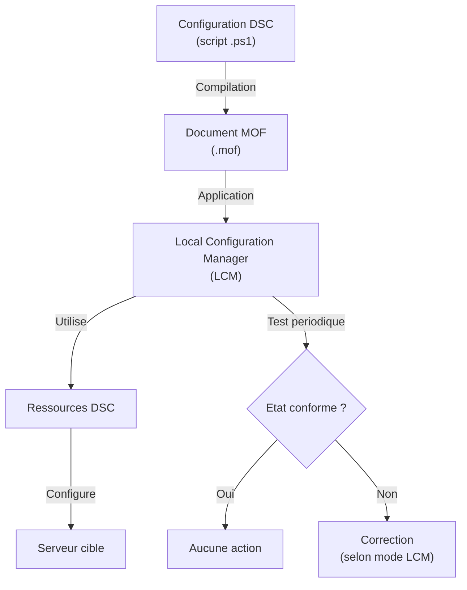
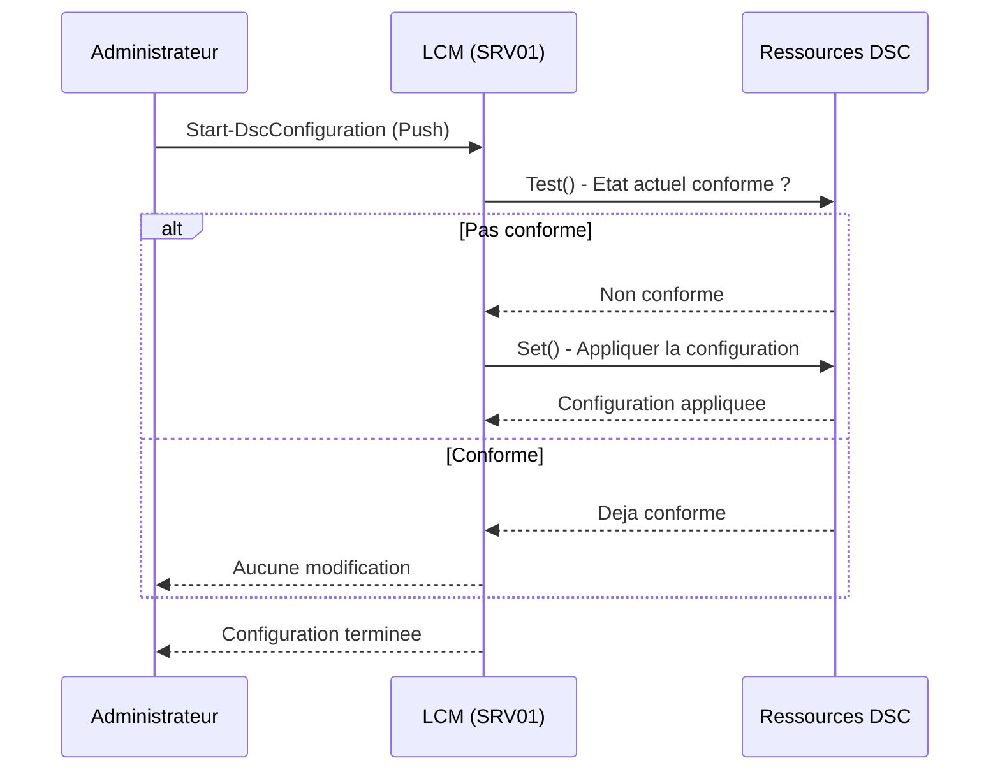

# Concepts de Desired State Configuration

<span class="level-advanced">Avance</span> · Temps estime : 45 minutes

## Introduction

**Desired State Configuration** (DSC) est un framework de gestion de configuration integre a PowerShell. Il permet de definir l'etat souhaite d'un serveur de maniere **declarative** : on decrit **ce que** le serveur doit etre, pas **comment** y parvenir. DSC se charge ensuite d'appliquer et de maintenir cette configuration.

!!! example "Analogie"

    Imaginez que vous commandez un meuble. Avec l'approche **imperative**, vous recevez une liste d'instructions : "coupez la planche a 80 cm, percez un trou a 15 cm du bord, vissez l'etagere..." Avec l'approche **declarative** (DSC), vous montrez simplement une photo du meuble fini et dites "je veux ca". Le systeme se debrouille pour atteindre le resultat. Et si quelqu'un enleve une etagere, DSC la remet automatiquement en place.

## Approche declarative vs imperative

### Approche imperative (script classique)

```powershell
# Imperative: describe step by step HOW to configure
Install-WindowsFeature -Name Web-Server
Set-Service -Name W3SVC -StartupType Automatic
Start-Service -Name W3SVC
New-Item -Path "C:\inetpub\wwwroot\index.html" -ItemType File -Value "<h1>Hello</h1>"
```

### Approche declarative (DSC)

```powershell
# Declarative: describe WHAT the server should look like
Configuration WebServerConfig {
    Node "SRV01" {
        WindowsFeature IIS {
            Name   = "Web-Server"
            Ensure = "Present"
        }

        Service W3SVC {
            Name        = "W3SVC"
            StartupType = "Automatic"
            State       = "Running"
        }

        File IndexPage {
            DestinationPath = "C:\inetpub\wwwroot\index.html"
            Contents        = "<h1>Hello</h1>"
            Ensure          = "Present"
            Type            = "File"
        }
    }
}
```

### Comparaison

| Aspect | Imperatif (script) | Declaratif (DSC) |
|---|---|---|
| Description | Comment faire | Quoi obtenir |
| Idempotence | Doit etre codee manuellement | Native |
| Detection de derive | Non integree | Integree (Test-DscConfiguration) |
| Correction automatique | Non | Oui (via LCM) |
| Lisibilite | Variable | Structuree |

!!! tip "Idempotence"

    Un script idempotent produit le meme resultat qu'il soit execute une ou plusieurs fois. DSC est nativement idempotent : si un serveur est deja dans l'etat souhaite, DSC ne modifie rien.

## Architecture DSC



## Document de configuration

Une configuration DSC est un bloc PowerShell special qui definit l'etat souhaite.

### Structure d'une configuration

```powershell
Configuration NomDeLaConfiguration {
    # Import des ressources DSC
    Import-DscResource -ModuleName PSDesiredStateConfiguration

    # Parametres de la configuration
    param(
        [string[]]$NodeName = "localhost"
    )

    # Definition de l'etat par noeud
    Node $NodeName {
        # Ressources et leur configuration
        WindowsFeature ExempleFeature {
            Name   = "Telnet-Client"
            Ensure = "Absent"
        }
    }
}
```

### Compiler la configuration

La compilation genere un fichier **MOF** (Managed Object Format) pour chaque noeud cible.

```powershell
# Define the configuration
Configuration BaseServerConfig {
    Import-DscResource -ModuleName PSDesiredStateConfiguration

    Node "SRV01" {
        WindowsFeature TelnetAbsent {
            Name   = "Telnet-Client"
            Ensure = "Absent"
        }

        Registry DisableIPv6 {
            Key       = "HKLM:\SYSTEM\CurrentControlSet\Services\Tcpip6\Parameters"
            ValueName = "DisabledComponents"
            ValueData = "255"
            ValueType = "DWord"
            Ensure    = "Present"
        }
    }
}

# Compile the configuration (generates MOF files)
BaseServerConfig -OutputPath "C:\DSC\Configs"
```

Resultat :

```text
    Directory: C:\DSC\Configs

Mode                 LastWriteTime         Length Name
----                 -------------         ------ ----
-a----         2/20/2026  10:30 AM          2584 SRV01.mof
```

La compilation produit le fichier `C:\DSC\Configs\SRV01.mof`.

## Fichiers MOF

Le fichier **MOF** est le format intermediaire compile que DSC applique au serveur. Il est au format texte mais n'est generalement pas modifie manuellement.

```powershell
# List generated MOF files
Get-ChildItem -Path "C:\DSC\Configs" -Filter "*.mof"
```

Resultat :

```text
    Directory: C:\DSC\Configs

Mode                 LastWriteTime         Length Name
----                 -------------         ------ ----
-a----         2/20/2026  10:30 AM          2584 SRV01.mof
```

| Fichier | Role |
|---|---|
| `NodeName.mof` | Configuration a appliquer |
| `NodeName.meta.mof` | Configuration du LCM |

!!! warning "Ne pas modifier les fichiers MOF"

    Les fichiers MOF sont generes automatiquement a partir des configurations DSC. Modifiez toujours la **configuration source** (`.ps1`), puis recompilez.

## Local Configuration Manager (LCM)

Le **LCM** est le moteur DSC present sur chaque noeud cible. Il est responsable de :

- Recevoir et appliquer les configurations
- Tester periodiquement la conformite
- Corriger les derives (selon la configuration)

### Configurer le LCM

```powershell
[DSCLocalConfigurationManager()]
Configuration LCMConfig {
    Node "SRV01" {
        Settings {
            # Apply and monitor: correct drift automatically
            ConfigurationMode              = "ApplyAndAutoCorrect"

            # Check for drift every 30 minutes
            ConfigurationModeFrequencyMins = 30

            # Check for new configurations every 15 minutes (Pull mode)
            RefreshFrequencyMins           = 15

            # Refresh mode: Push or Pull
            RefreshMode                    = "Push"

            # Reboot if needed
            RebootNodeIfNeeded             = $true

            # Allow overwriting modules
            AllowModuleOverwrite           = $true
        }
    }
}

# Compile LCM configuration
LCMConfig -OutputPath "C:\DSC\LCM"

# Apply LCM configuration
Set-DscLocalConfigurationManager -Path "C:\DSC\LCM" -ComputerName "SRV01" -Verbose
```

### Modes du LCM

| Mode | Comportement |
|---|---|
| **ApplyOnly** | Applique la configuration une seule fois |
| **ApplyAndMonitor** | Applique et detecte les derives (sans corriger) |
| **ApplyAndAutoCorrect** | Applique, detecte et **corrige** les derives automatiquement |

### Verifier le LCM

```powershell
# View LCM configuration on a node
Get-DscLocalConfigurationManager -CimSession "SRV01"

# Check current configuration status
Get-DscConfigurationStatus -CimSession "SRV01"

# Test if the node is in desired state
Test-DscConfiguration -CimSession "SRV01" -Detailed
```

Resultat (Get-DscLocalConfigurationManager) :

```text
ActionAfterReboot              : ContinueConfiguration
AgentId                        : A1B2C3D4-E5F6-7890-ABCD-EF0123456789
AllowModuleOverwrite           : True
CertificateID                  :
ConfigurationDownloadManagers  : {}
ConfigurationID                :
ConfigurationMode              : ApplyAndAutoCorrect
ConfigurationModeFrequencyMins : 30
Credential                     :
DebugMode                      : {NONE}
LCMCompatibleVersions          : {1.0, 2.0}
LCMState                       : Idle
LCMVersion                     : 2.0
RefreshFrequencyMins           : 15
RefreshMode                    : Push
RebootNodeIfNeeded             : True
StatusRetentionTimeInDays      : 10
```

Resultat (Test-DscConfiguration) :

```text
InDesiredState            : False
ResourcesInDesiredState   : {[WindowsFeature]TelnetAbsent}
ResourcesNotInDesiredState: {[Registry]DisableIPv6}
ReturnValue               : 0
PSComputerName            : SRV-01
```

## Appliquer une configuration (mode Push)

```powershell
# Push a configuration to a node
Start-DscConfiguration -Path "C:\DSC\Configs" -ComputerName "SRV01" -Wait -Verbose -Force

# Check the current applied configuration
Get-DscConfiguration -CimSession "SRV01"

# Test compliance
$testResult = Test-DscConfiguration -CimSession "SRV01" -Detailed
$testResult.ResourcesInDesiredState
$testResult.ResourcesNotInDesiredState
```

Resultat (Start-DscConfiguration) :

```text
VERBOSE: Perform operation 'Invoke CimMethod' with following parameters, ''methodName' = SendConfigurationApply'.
VERBOSE: An LCM method call arrived from computer SRV-01 with user sid S-1-5-21-xxx.
VERBOSE: [SRV-01]: LCM:  [ Start  Set      ]
VERBOSE: [SRV-01]: LCM:  [ Start  Resource ]  [[WindowsFeature]TelnetAbsent]
VERBOSE: [SRV-01]: LCM:  [ Start  Test     ]  [[WindowsFeature]TelnetAbsent]
VERBOSE: [SRV-01]:                            [[WindowsFeature]TelnetAbsent] The operation 'Get' did not return
 any result.
VERBOSE: [SRV-01]: LCM:  [ End    Test     ]  [[WindowsFeature]TelnetAbsent] True in 0.4200 seconds.
VERBOSE: [SRV-01]: LCM:  [ Skip   Set      ]  [[WindowsFeature]TelnetAbsent]
VERBOSE: [SRV-01]: LCM:  [ End    Resource ]  [[WindowsFeature]TelnetAbsent]
VERBOSE: [SRV-01]: LCM:  [ End    Set      ]    in  1.2340 seconds.
VERBOSE: Operation 'Invoke CimMethod' complete.
```



## Workflow typique DSC

1. **Ecrire** la configuration DSC (fichier `.ps1`)
2. **Compiler** pour generer les fichiers MOF
3. **Appliquer** la configuration (Push ou Pull)
4. **Tester** la conformite (`Test-DscConfiguration`)
5. **Surveiller** les derives via le LCM

## Points cles a retenir

- DSC est un framework **declaratif** : on definit l'etat souhaite, pas les etapes
- La configuration est **idempotente** : elle peut etre reappliquee sans effet secondaire
- Les fichiers **MOF** sont le format compile intermediaire (ne pas modifier manuellement)
- Le **LCM** est le moteur qui applique, teste et corrige les configurations
- Le mode **ApplyAndAutoCorrect** garantit que le serveur reste conforme en permanence
- DSC est un pilier de l'**Infrastructure as Code** pour les environnements Windows

!!! example "Scenario pratique"

    **Laurent**, administrateur systeme, gere 8 serveurs web. Apres un audit de securite, il decouvre que le client Telnet a ete installe manuellement sur 3 serveurs et que le pare-feu est desactive sur 2 autres. Il doit garantir la conformite de tous les serveurs en permanence.

    **Diagnostic :**

    1. Ecrire une configuration DSC pour l'etat souhaite :
    ```powershell
    Configuration WebServerBaseline {
        Import-DscResource -ModuleName PSDesiredStateConfiguration

        Node @("SRV-01", "SRV-02", "SRV-03", "SRV-04", "SRV-05", "SRV-06", "SRV-07", "SRV-08") {
            WindowsFeature TelnetAbsent {
                Name   = "Telnet-Client"
                Ensure = "Absent"
            }
            WindowsFeature IISPresent {
                Name   = "Web-Server"
                Ensure = "Present"
            }
            Service W3SVC {
                Name        = "W3SVC"
                State       = "Running"
                StartupType = "Automatic"
                DependsOn   = "[WindowsFeature]IISPresent"
            }
        }
    }
    WebServerBaseline -OutputPath "C:\DSC\WebBaseline"
    ```
    Resultat :
    ```text
        Directory: C:\DSC\WebBaseline

    Mode                 LastWriteTime         Length Name
    ----                 -------------         ------ ----
    -a----         2/20/2026  11:00 AM          3215 SRV-01.mof
    -a----         2/20/2026  11:00 AM          3215 SRV-02.mof
    ...
    -a----         2/20/2026  11:00 AM          3215 SRV-08.mof
    ```

    2. Configurer le LCM en mode `ApplyAndAutoCorrect` et pousser la configuration :
    ```powershell
    Start-DscConfiguration -Path "C:\DSC\WebBaseline" -Wait -Verbose -Force
    ```

    3. Verifier la conformite :
    ```powershell
    $servers = @("SRV-01", "SRV-02", "SRV-03", "SRV-04", "SRV-05", "SRV-06", "SRV-07", "SRV-08")
    foreach ($server in $servers) {
        $result = Test-DscConfiguration -CimSession $server
        [PSCustomObject]@{ Server = $server; Compliant = $result }
    }
    ```
    Resultat :
    ```text
    Server Compliant
    ------ ---------
    SRV-01      True
    SRV-02      True
    SRV-03      True
    SRV-04      True
    SRV-05      True
    SRV-06      True
    SRV-07      True
    SRV-08      True
    ```

    **Resolution :** DSC a automatiquement desinstalle Telnet sur les 3 serveurs non conformes, demarre le pare-feu sur les 2 serveurs ou il etait desactive, et garantit que toute derive future sera corrigee automatiquement par le LCM.

!!! danger "Erreurs courantes"

    - **Modifier les fichiers MOF manuellement** : les fichiers MOF sont generes par la compilation. Toute modification manuelle sera ecrasee lors de la prochaine compilation. Modifiez toujours la configuration source `.ps1`.
    - **Oublier `Import-DscResource`** : sans cette directive, la compilation echoue avec un message d'erreur peu explicite. Importez toujours les modules de ressources en debut de configuration.
    - **Confondre les modes du LCM** : `ApplyOnly` n'applique qu'une seule fois, `ApplyAndMonitor` detecte les derives sans corriger, seul `ApplyAndAutoCorrect` corrige automatiquement. Choisissez en fonction du niveau d'automatisation souhaite.
    - **Ne pas tester avant de deployer** : utilisez toujours `Test-DscConfiguration -Detailed` avant `Start-DscConfiguration` pour visualiser les changements qui seront appliques.
    - **Oublier les dependances (`DependsOn`)** : sans dependances explicites, DSC peut tenter de demarrer un service avant que le role correspondant ne soit installe, provoquant un echec.

## Pour aller plus loin

- Ressources DSC : [Ressources DSC](ressources-dsc.md)
- Modes Push et Pull : [Configuration Push/Pull](configuration-push-pull.md)
- Documentation Microsoft : Desired State Configuration Overview
