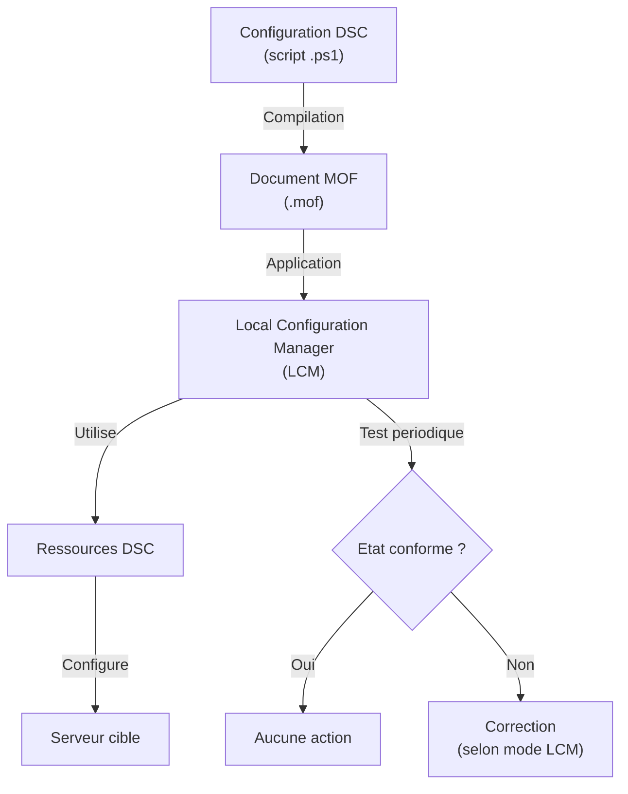
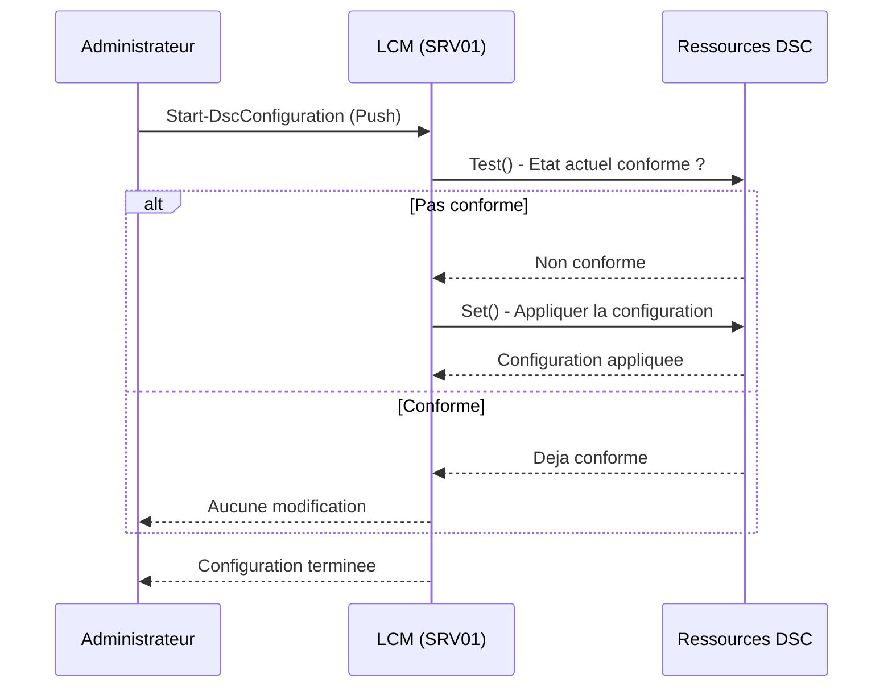

# Concepts de Desired State Configuration

!!! info "Niveau : avance | Temps estime : 45 minutes"

## Introduction

**Desired State Configuration** (DSC) est un framework de gestion de configuration integre a PowerShell. Il permet de definir l'etat souhaite d'un serveur de maniere **declarative** : on decrit **ce que** le serveur doit etre, pas **comment** y parvenir. DSC se charge ensuite d'appliquer et de maintenir cette configuration.

## Approche declarative vs imperative

### Approche imperative (script classique)

```powershell
# Imperative: describe step by step HOW to configure
Install-WindowsFeature -Name Web-Server
Set-Service -Name W3SVC -StartupType Automatic
Start-Service -Name W3SVC
New-Item -Path "C:\inetpub\wwwroot\index.html" -ItemType File -Value "<h1>Hello</h1>"
```

### Approche declarative (DSC)

```powershell
# Declarative: describe WHAT the server should look like
Configuration WebServerConfig {
    Node "SRV01" {
        WindowsFeature IIS {
            Name   = "Web-Server"
            Ensure = "Present"
        }

        Service W3SVC {
            Name        = "W3SVC"
            StartupType = "Automatic"
            State       = "Running"
        }

        File IndexPage {
            DestinationPath = "C:\inetpub\wwwroot\index.html"
            Contents        = "<h1>Hello</h1>"
            Ensure          = "Present"
            Type            = "File"
        }
    }
}
```

### Comparaison

| Aspect | Imperatif (script) | Declaratif (DSC) |
|---|---|---|
| Description | Comment faire | Quoi obtenir |
| Idempotence | Doit etre codee manuellement | Native |
| Detection de derive | Non integree | Integree (Test-DscConfiguration) |
| Correction automatique | Non | Oui (via LCM) |
| Lisibilite | Variable | Structuree |

!!! tip "Idempotence"

    Un script idempotent produit le meme resultat qu'il soit execute une ou plusieurs fois. DSC est nativement idempotent : si un serveur est deja dans l'etat souhaite, DSC ne modifie rien.

## Architecture DSC



## Document de configuration

Une configuration DSC est un bloc PowerShell special qui definit l'etat souhaite.

### Structure d'une configuration

```powershell
Configuration NomDeLaConfiguration {
    # Import des ressources DSC
    Import-DscResource -ModuleName PSDesiredStateConfiguration

    # Parametres de la configuration
    param(
        [string[]]$NodeName = "localhost"
    )

    # Definition de l'etat par noeud
    Node $NodeName {
        # Ressources et leur configuration
        WindowsFeature ExempleFeature {
            Name   = "Telnet-Client"
            Ensure = "Absent"
        }
    }
}
```

### Compiler la configuration

La compilation genere un fichier **MOF** (Managed Object Format) pour chaque noeud cible.

```powershell
# Define the configuration
Configuration BaseServerConfig {
    Import-DscResource -ModuleName PSDesiredStateConfiguration

    Node "SRV01" {
        WindowsFeature TelnetAbsent {
            Name   = "Telnet-Client"
            Ensure = "Absent"
        }

        Registry DisableIPv6 {
            Key       = "HKLM:\SYSTEM\CurrentControlSet\Services\Tcpip6\Parameters"
            ValueName = "DisabledComponents"
            ValueData = "255"
            ValueType = "DWord"
            Ensure    = "Present"
        }
    }
}

# Compile the configuration (generates MOF files)
BaseServerConfig -OutputPath "C:\DSC\Configs"
```

La compilation produit le fichier `C:\DSC\Configs\SRV01.mof`.

## Fichiers MOF

Le fichier **MOF** est le format intermediaire compile que DSC applique au serveur. Il est au format texte mais n'est generalement pas modifie manuellement.

```powershell
# List generated MOF files
Get-ChildItem -Path "C:\DSC\Configs" -Filter "*.mof"
```

| Fichier | Role |
|---|---|
| `NodeName.mof` | Configuration a appliquer |
| `NodeName.meta.mof` | Configuration du LCM |

!!! warning "Ne pas modifier les fichiers MOF"

    Les fichiers MOF sont generes automatiquement a partir des configurations DSC. Modifiez toujours la **configuration source** (`.ps1`), puis recompilez.

## Local Configuration Manager (LCM)

Le **LCM** est le moteur DSC present sur chaque noeud cible. Il est responsable de :

- Recevoir et appliquer les configurations
- Tester periodiquement la conformite
- Corriger les derives (selon la configuration)

### Configurer le LCM

```powershell
[DSCLocalConfigurationManager()]
Configuration LCMConfig {
    Node "SRV01" {
        Settings {
            # Apply and monitor: correct drift automatically
            ConfigurationMode              = "ApplyAndAutoCorrect"

            # Check for drift every 30 minutes
            ConfigurationModeFrequencyMins = 30

            # Check for new configurations every 15 minutes (Pull mode)
            RefreshFrequencyMins           = 15

            # Refresh mode: Push or Pull
            RefreshMode                    = "Push"

            # Reboot if needed
            RebootNodeIfNeeded             = $true

            # Allow overwriting modules
            AllowModuleOverwrite           = $true
        }
    }
}

# Compile LCM configuration
LCMConfig -OutputPath "C:\DSC\LCM"

# Apply LCM configuration
Set-DscLocalConfigurationManager -Path "C:\DSC\LCM" -ComputerName "SRV01" -Verbose
```

### Modes du LCM

| Mode | Comportement |
|---|---|
| **ApplyOnly** | Applique la configuration une seule fois |
| **ApplyAndMonitor** | Applique et detecte les derives (sans corriger) |
| **ApplyAndAutoCorrect** | Applique, detecte et **corrige** les derives automatiquement |

### Verifier le LCM

```powershell
# View LCM configuration on a node
Get-DscLocalConfigurationManager -CimSession "SRV01"

# Check current configuration status
Get-DscConfigurationStatus -CimSession "SRV01"

# Test if the node is in desired state
Test-DscConfiguration -CimSession "SRV01" -Detailed
```

## Appliquer une configuration (mode Push)

```powershell
# Push a configuration to a node
Start-DscConfiguration -Path "C:\DSC\Configs" -ComputerName "SRV01" -Wait -Verbose -Force

# Check the current applied configuration
Get-DscConfiguration -CimSession "SRV01"

# Test compliance
$testResult = Test-DscConfiguration -CimSession "SRV01" -Detailed
$testResult.ResourcesInDesiredState
$testResult.ResourcesNotInDesiredState
```



## Workflow typique DSC

1. **Ecrire** la configuration DSC (fichier `.ps1`)
2. **Compiler** pour generer les fichiers MOF
3. **Appliquer** la configuration (Push ou Pull)
4. **Tester** la conformite (`Test-DscConfiguration`)
5. **Surveiller** les derives via le LCM

## Points cles a retenir

- DSC est un framework **declaratif** : on definit l'etat souhaite, pas les etapes
- La configuration est **idempotente** : elle peut etre reappliquee sans effet secondaire
- Les fichiers **MOF** sont le format compile intermediaire (ne pas modifier manuellement)
- Le **LCM** est le moteur qui applique, teste et corrige les configurations
- Le mode **ApplyAndAutoCorrect** garantit que le serveur reste conforme en permanence
- DSC est un pilier de l'**Infrastructure as Code** pour les environnements Windows

## Pour aller plus loin

- Ressources DSC : [Ressources DSC](ressources-dsc.md)
- Modes Push et Pull : [Configuration Push/Pull](configuration-push-pull.md)
- Documentation Microsoft : Desired State Configuration Overview
