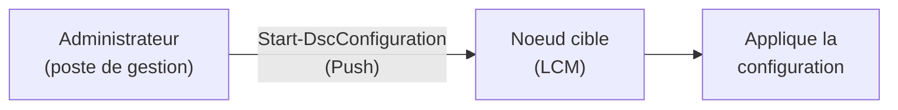
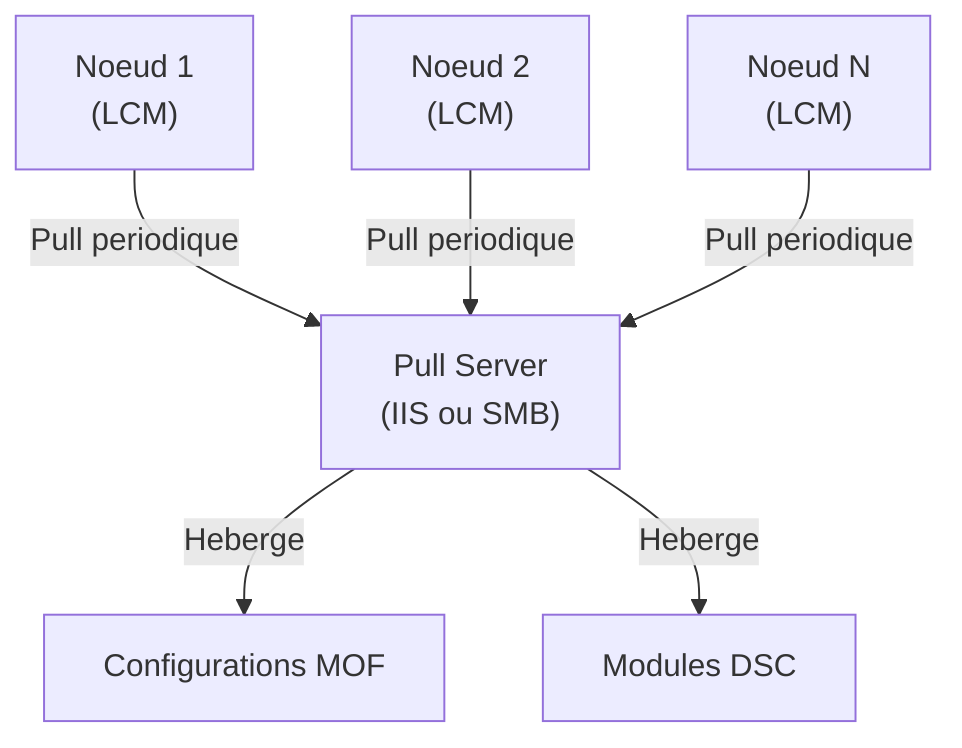
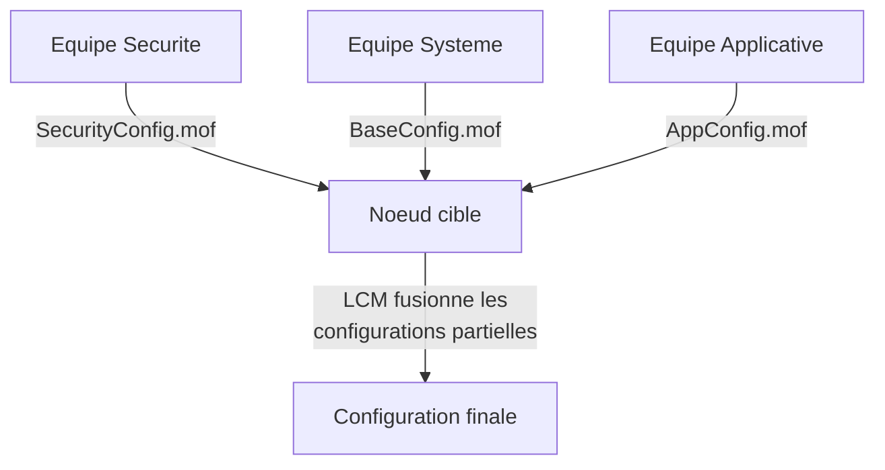

<!--
  Copyright 2026 Julien Bombled

  Licensed under the Apache License, Version 2.0 (the "License");
  you may not use this file except in compliance with the License.
  You may obtain a copy of the License at

      http://www.apache.org/licenses/LICENSE-2.0

  Unless required by applicable law or agreed to in writing, software
  distributed under the License is distributed on an "AS IS" BASIS,
  WITHOUT WARRANTIES OR CONDITIONS OF ANY KIND, either express or implied.
  See the License for the specific language governing permissions and
  limitations under the License.
-->
---
title: "Configuration Push et Pull"
description: "Comprendre et configurer les modes Push et Pull de DSC : application directe, serveur Pull, configurations partielles et bonnes pratiques."
tags:
  - automatisation
  - dsc
  - push
  - pull
  - windows-server
---

# Configuration Push et Pull

<span class="level-advanced">Avance</span> · Temps estime : 50 minutes

## Introduction

DSC propose deux modeles de distribution des configurations vers les noeuds cibles : le mode **Push** (envoi direct) et le mode **Pull** (recuperation a la demande). Le choix entre ces deux modes depend de la taille de l'environnement et du niveau d'automatisation souhaite.

## Mode Push

### Principe

!!! example "Analogie"

    Le mode Push ressemble a un chef cuisinier qui livre lui-meme les menus du jour dans chaque salle. C'est rapide et direct, mais il doit faire le tour de toutes les tables a chaque changement. Le mode Pull, lui, c'est un tableau d'affichage central : chaque serveur consulte le tableau a intervalle regulier et prend sa nouvelle configuration tout seul.

En mode Push, l'administrateur **envoie** la configuration directement au noeud cible. C'est le mode le plus simple et le point de depart pour la plupart des implementations DSC.



### Mise en oeuvre

```powershell
# Step 1: Write the configuration
Configuration WebServer {
    Import-DscResource -ModuleName PSDesiredStateConfiguration

    Node "SRV01" {
        WindowsFeature IIS {
            Name   = "Web-Server"
            Ensure = "Present"
        }

        Service W3SVC {
            Name        = "W3SVC"
            State       = "Running"
            StartupType = "Automatic"
            DependsOn   = "[WindowsFeature]IIS"
        }
    }
}

# Step 2: Compile to MOF
WebServer -OutputPath "C:\DSC\WebServer"

# Step 3: Push the configuration
Start-DscConfiguration -Path "C:\DSC\WebServer" -ComputerName "SRV01" -Wait -Verbose -Force
```

Resultat :

```text
VERBOSE: Perform operation 'Invoke CimMethod' with following parameters, ...
VERBOSE: An LCM method call arrived from computer SRV-01 with user sid S-1-5-21-...
VERBOSE: [SRV-01]: LCM: [Start Set      ]
VERBOSE: [SRV-01]: LCM: [Start Resource ]  [[WindowsFeature]IIS]
VERBOSE: [SRV-01]:                         [[WindowsFeature]IIS] The operation 'Set' completed successfully.
VERBOSE: [SRV-01]: LCM: [Start Resource ]  [[Service]W3SVC]
VERBOSE: [SRV-01]:                         [[Service]W3SVC] The operation 'Set' completed successfully.
VERBOSE: [SRV-01]: LCM: [End Set        ]
```

### Configuration du LCM pour le mode Push

```powershell
[DSCLocalConfigurationManager()]
Configuration PushModeLCM {
    Node "SRV01" {
        Settings {
            RefreshMode                    = "Push"
            ConfigurationMode              = "ApplyAndAutoCorrect"
            ConfigurationModeFrequencyMins = 30
            RebootNodeIfNeeded             = $true
        }
    }
}

PushModeLCM -OutputPath "C:\DSC\LCM"
Set-DscLocalConfigurationManager -Path "C:\DSC\LCM" -ComputerName "SRV01" -Verbose
```

Resultat :

```text
VERBOSE: Performing the operation "Start-DscConfiguration: SendMetaConfigurationApply" on target "MSFT_DSCLocalConfigurationManager".
VERBOSE: Perform operation 'Invoke CimMethod' with following parameters, ...
VERBOSE: An LCM method call arrived from computer SRV-01 with user sid S-1-5-21-...
VERBOSE: [SRV-01]: LCM: [Start Set      ]
VERBOSE: [SRV-01]: LCM: [End Set        ]
```

### Avantages et limites du mode Push

| Avantage | Limite |
|---|---|
| Simple a mettre en oeuvre | L'admin doit envoyer chaque mise a jour manuellement |
| Pas d'infrastructure supplementaire | Pas de distribution centralisee a grande echelle |
| Ideal pour le dev/test | Le noeud ne peut pas demander sa config lui-meme |
| Feedback immediat | Pas de rapport centralise |

## Mode Pull

### Principe

En mode Pull, les noeuds cibles **recuperent** leur configuration depuis un serveur central (**Pull Server**). Le LCM interroge periodiquement le Pull Server pour obtenir les nouvelles configurations et les modules requis.



### Configurer un Pull Server (IIS)

```powershell
# Install prerequisites
Install-WindowsFeature -Name DSC-Service, Web-Server -IncludeManagementTools

# Install the DSC service module
Install-Module -Name xPSDesiredStateConfiguration -Force

# Configure the Pull Server
Configuration PullServer {
    Import-DscResource -ModuleName PSDesiredStateConfiguration
    Import-DscResource -ModuleName xPSDesiredStateConfiguration

    Node "YOURPULLSERVER" {
        WindowsFeature DSCService {
            Name   = "DSC-Service"
            Ensure = "Present"
        }

        xDscWebService PullServerEndpoint {
            EndpointName          = "PSDSCPullServer"
            Port                  = 8080
            PhysicalPath          = "C:\inetpub\PSDSCPullServer"
            CertificateThumbPrint = "YOUR_CERT_THUMBPRINT"
            ModulePath            = "C:\Program Files\WindowsPowerShell\DscService\Modules"
            ConfigurationPath     = "C:\Program Files\WindowsPowerShell\DscService\Configuration"
            State                 = "Started"
            UseSecurityBestPractices = $true
            DependsOn             = "[WindowsFeature]DSCService"
        }
    }
}

PullServer -OutputPath "C:\DSC\PullServer"
Start-DscConfiguration -Path "C:\DSC\PullServer" -Wait -Verbose -Force
```

### Publier des configurations sur le Pull Server

```powershell
# Step 1: Compile the configuration with Configuration IDs
Configuration WebServer {
    Import-DscResource -ModuleName PSDesiredStateConfiguration

    Node "a]b1c2d3-e4f5-6789-abcd-ef0123456789" {
        # Use the node's Configuration ID (GUID) instead of the hostname
        WindowsFeature IIS {
            Name   = "Web-Server"
            Ensure = "Present"
        }
    }
}

WebServer -OutputPath "C:\DSC\Publish"

# Step 2: Create checksum file
New-DscChecksum -Path "C:\DSC\Publish" -Force

# Step 3: Copy MOF and checksum to the Pull Server configuration path
$pullServerConfigPath = "C:\Program Files\WindowsPowerShell\DscService\Configuration"
Copy-Item -Path "C:\DSC\Publish\*.mof" -Destination $pullServerConfigPath
Copy-Item -Path "C:\DSC\Publish\*.mof.checksum" -Destination $pullServerConfigPath
```

### Configurer un noeud pour le mode Pull

```powershell
[DSCLocalConfigurationManager()]
Configuration PullModeLCM {
    Node "SRV01" {
        Settings {
            RefreshMode                    = "Pull"
            ConfigurationMode              = "ApplyAndAutoCorrect"
            ConfigurationModeFrequencyMins = 30
            RefreshFrequencyMins           = 15
            RebootNodeIfNeeded             = $true
            ConfigurationID                = "a]b1c2d3-e4f5-6789-abcd-ef0123456789"
        }

        ConfigurationRepositoryWeb PullServer {
            ServerURL          = "https://YOURPULLSERVER:8080/PSDSCPullServer.svc"
            RegistrationKey    = "YOUR_REGISTRATION_KEY"
            ConfigurationNames = @("WebServer")
            AllowUnsecureConnection = $false
        }

        ResourceRepositoryWeb PullServerModules {
            ServerURL       = "https://YOURPULLSERVER:8080/PSDSCPullServer.svc"
            RegistrationKey = "YOUR_REGISTRATION_KEY"
        }

        ReportServerWeb PullServerReports {
            ServerURL       = "https://YOURPULLSERVER:8080/PSDSCPullServer.svc"
            RegistrationKey = "YOUR_REGISTRATION_KEY"
        }
    }
}

PullModeLCM -OutputPath "C:\DSC\LCM"
Set-DscLocalConfigurationManager -Path "C:\DSC\LCM" -ComputerName "SRV01" -Verbose
```

### Pull Server SMB (alternative)

Pour les environnements sans IIS, le Pull Server peut etre un simple partage SMB.

```powershell
[DSCLocalConfigurationManager()]
Configuration SMBPullLCM {
    Node "SRV01" {
        Settings {
            RefreshMode = "Pull"
        }

        ConfigurationRepositoryShare SMBPull {
            SourcePath = "\\YOURFILESERVER\DSCConfigurations"
        }

        ResourceRepositoryShare SMBModules {
            SourcePath = "\\YOURFILESERVER\DSCModules"
        }
    }
}
```

### Comparaison Push vs Pull

| Critere | Push | Pull |
|---|---|---|
| Complexite | Faible | Elevee |
| Infrastructure requise | Aucune | Pull Server (IIS ou SMB) |
| Scalabilite | Petits environnements | Grands environnements |
| Mise a jour des configs | Manuelle | Automatique (polling) |
| Rapport centralise | Non | Oui (via Report Server) |
| Modules DSC | Doivent etre sur chaque noeud | Distribues par le Pull Server |

## Configurations partielles

Les **configurations partielles** permettent de fragmenter la configuration d'un noeud en plusieurs documents, chacun gere par une equipe differente.



### Configuration du LCM pour les partielles

```powershell
[DSCLocalConfigurationManager()]
Configuration PartialLCM {
    Node "SRV01" {
        Settings {
            RefreshMode = "Pull"
        }

        # Partial configuration from Pull Server
        PartialConfiguration SecurityBaseline {
            Description         = "Security baseline from security team"
            ConfigurationSource = @("[ConfigurationRepositoryWeb]PullServer")
            RefreshMode         = "Pull"
        }

        # Partial configuration pushed manually
        PartialConfiguration ApplicationConfig {
            Description = "Application configuration from dev team"
            RefreshMode = "Push"
            DependsOn   = "[PartialConfiguration]SecurityBaseline"
        }

        ConfigurationRepositoryWeb PullServer {
            ServerURL       = "https://YOURPULLSERVER:8080/PSDSCPullServer.svc"
            RegistrationKey = "YOUR_REGISTRATION_KEY"
        }
    }
}
```

!!! warning "Conflits de configurations partielles"

    Si deux configurations partielles tentent de configurer la meme ressource, un conflit se produit et la configuration echoue. Etablissez des conventions claires entre les equipes pour eviter les chevauchements.

## Rapport et conformite

### Interroger le Report Server

```powershell
# Query the Pull Server report endpoint
$reportURL = "https://YOURPULLSERVER:8080/PSDSCPullServer.svc/Nodes(AgentId='AGENT-GUID')/Reports"
$reports = Invoke-RestMethod -Uri $reportURL -Method Get -ContentType "application/json"

# View compliance status
$reports.value | Select-Object Status, StartDate, RebootRequested | Format-Table -AutoSize
```

### Verification locale

```powershell
# Check configuration status on a node
Get-DscConfigurationStatus -All | Format-Table Status, StartDate, Type, Mode

# Detailed compliance report
Test-DscConfiguration -Detailed | Format-List *

# Force a Pull refresh
Update-DscConfiguration -ComputerName "SRV01" -Wait -Verbose
```

Resultat :

```text
Status  StartDate             Type    Mode
------  ---------             ----    ----
Success 20/02/2026 02:00:13  Initial Pull
Success 19/02/2026 02:00:08  Reboot  Pull

InDesiredState     : True
ResourcesInDesiredState :
    ResourceId                : [WindowsFeature]IIS
    ConfigurationName         : WebServer
    SourceInfo                : C:\DSC\WebServer.ps1::10::9::WindowsFeature
    DurationInSeconds         : 0.5
    StartDate                 : 20/02/2026 02:00:14
    InDesiredState            : True
```

!!! example "Scenario pratique"

    **Contexte :** Sophie est administratrice systeme dans une entreprise de 150 personnes avec 30 serveurs Windows. Elle utilise DSC en mode Push pour les configurations ponctuelles, mais elle constate que certains serveurs "derivent" entre deux envois : des services sont arretes manuellement, des fonctionnalites ajoutees sans autorisation.

    **Probleme :** En mode Push, DSC ne corrige les derives que lorsque Sophie renvoie explicitement la configuration. Entre deux envois, les serveurs peuvent rester non conformes pendant des jours.

    **Solution :** Sophie migre les serveurs vers le mode Pull avec une frequence de verification de 30 minutes.

    ```powershell
    # Step 1: Configure each server's LCM for Pull mode
    [DSCLocalConfigurationManager()]
    Configuration PullModeLCM {
        Node "SRV-01" {
            Settings {
                RefreshMode                    = "Pull"
                ConfigurationMode              = "ApplyAndAutoCorrect"
                ConfigurationModeFrequencyMins = 30
                RefreshFrequencyMins           = 15
                RebootNodeIfNeeded             = $false
                ConfigurationID                = "a1b2c3d4-e5f6-7890-abcd-ef0123456789"
            }

            ConfigurationRepositoryWeb PullServer {
                ServerURL          = "https://SRV-01.lab.local:8080/PSDSCPullServer.svc"
                RegistrationKey    = "7d8e9f0a-1b2c-3d4e-5f6g-7h8i9j0k1l2m"
                ConfigurationNames = @("WebBaseline")
                AllowUnsecureConnection = $false
            }
        }
    }

    PullModeLCM -OutputPath "C:\DSC\LCM"
    Set-DscLocalConfigurationManager -Path "C:\DSC\LCM" -ComputerName "SRV-01" -Verbose

    # Step 2: Verify that the node pulled its configuration
    Get-DscConfigurationStatus -CimSession (New-CimSession -ComputerName "SRV-01")
    ```

    ```text
    Status  StartDate             Type    Mode
    ------  ---------             ----    ----
    Success 20/02/2026 14:30:02   Pull    Pull
    ```

    Maintenant, meme si un collegue arrete manuellement le service W3SVC sur SRV-01, DSC le redemarrera dans les 30 minutes suivantes sans intervention de Sophie.

!!! danger "Erreurs courantes"

    **Checksum manquant sur le Pull Server** — Chaque fichier `.mof` publie sur le Pull Server doit avoir un fichier `.mof.checksum` correspondant genere par `New-DscChecksum`. Sans checksum, le noeud refuse de telecharger la configuration.

    **Certificat SSL non valide sur le Pull Server** — Si le certificat est auto-signe ou expire, les noeuds rejettent la connexion. En dev/test uniquement, utilisez `AllowUnsecureConnection = $true` ; en production, deployez un certificat valide.

    **ConfigurationID en double** — Si deux noeuds partagent le meme ConfigurationID (GUID), ils tenteront tous deux de recuperer la meme configuration. Chaque noeud doit avoir un GUID unique.

    **Modules DSC non publies sur le Pull Server** — Si une configuration utilise un module communautaire (ex. `NetworkingDsc`) qui n'est pas dans le dossier modules du Pull Server, le noeud ne pourra pas appliquer la configuration. Publiez les modules en meme temps que les configurations.

    **Configurations partielles en conflit** — Si deux equipes configurent la meme ressource (ex. le meme service) dans des configurations partielles differentes, DSC echoue avec une erreur de conflit. Etablissez des conventions claires de responsabilite.

## Points cles a retenir

- Le mode **Push** est simple et adapte aux petits environnements ou au dev/test
- Le mode **Pull** centralise la distribution et est recommande pour les grands environnements
- Le Pull Server peut etre base sur **IIS** (HTTP/HTTPS) ou sur un **partage SMB**
- Les **configurations partielles** permettent a plusieurs equipes de gerer des aspects differents d'un meme noeud
- Utilisez toujours **HTTPS** pour les Pull Servers en production
- Le **Report Server** fournit des rapports de conformite centralises
- Les fichiers **checksum** sont obligatoires pour les configurations publiees sur un Pull Server

## Pour aller plus loin

- Concepts DSC : [Concepts DSC](concepts-dsc.md)
- Ressources DSC : [Ressources DSC](ressources-dsc.md)
- Documentation Microsoft : Setting Up a Pull Server

