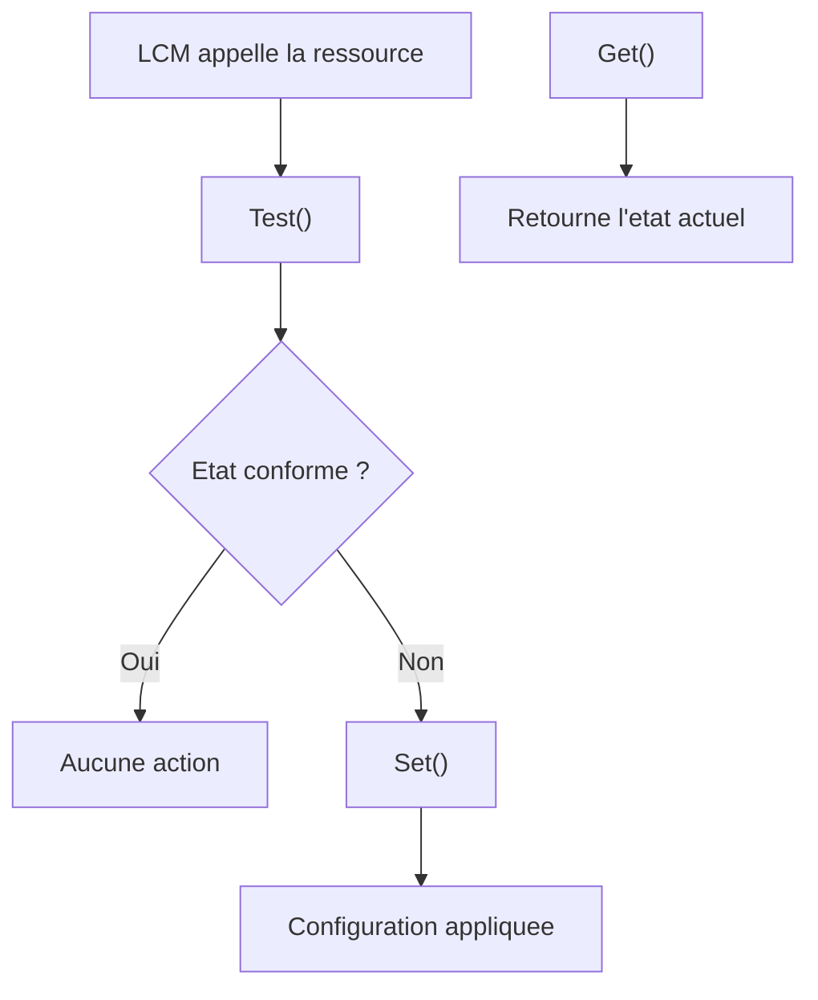

# Ressources DSC

<span class="level-advanced">Avance</span> · Temps estime : 40 minutes

## Introduction

Les **ressources DSC** sont les briques de base de toute configuration. Chaque ressource gere un aspect specifique de la configuration d'un serveur : fonctionnalites Windows, services, fichiers, registre, etc. Comprendre les ressources disponibles et savoir en trouver de nouvelles est essentiel pour exploiter pleinement DSC.

## Anatomie d'une ressource

Chaque ressource DSC implemente trois fonctions :

| Fonction | Role |
|---|---|
| **Get** | Retourne l'etat actuel de la ressource |
| **Test** | Compare l'etat actuel a l'etat souhaite (retourne `$true` ou `$false`) |
| **Set** | Applique l'etat souhaite si `Test` retourne `$false` |



## Ressources integrees (built-in)

Windows Server 2022 inclut les ressources suivantes dans le module `PSDesiredStateConfiguration` :

### Liste des ressources integrees

| Ressource | Description | Exemple d'usage |
|---|---|---|
| **File** | Gestion de fichiers et dossiers | Creer/supprimer des fichiers |
| **Archive** | Extraction d'archives ZIP | Deployer des packages |
| **Environment** | Variables d'environnement | Definir PATH, JAVA_HOME |
| **Group** | Groupes locaux | Gerer les membres d'un groupe |
| **Log** | Ecriture dans les journaux | Messages d'information DSC |
| **Package** | Packages MSI/EXE | Installer des applications |
| **Registry** | Cles de registre | Configurer des parametres systeme |
| **Script** | Scripts personnalises | Logique personnalisee |
| **Service** | Services Windows | Demarrer/arreter des services |
| **User** | Utilisateurs locaux | Creer/configurer des comptes |
| **WindowsFeature** | Roles et fonctionnalites | Installer IIS, DNS, etc. |
| **WindowsProcess** | Processus Windows | Lancer un processus |

```powershell
# List all built-in DSC resources
Get-DscResource -Module PSDesiredStateConfiguration | Format-Table Name, ModuleName, Version
```

### Exemples d'utilisation

#### WindowsFeature

```powershell
Configuration InstallRoles {
    Import-DscResource -ModuleName PSDesiredStateConfiguration

    Node "SRV01" {
        WindowsFeature IIS {
            Name                 = "Web-Server"
            Ensure               = "Present"
            IncludeAllSubFeature = $true
        }

        WindowsFeature IISManagement {
            Name      = "Web-Mgmt-Console"
            Ensure    = "Present"
            DependsOn = "[WindowsFeature]IIS"
        }

        WindowsFeature TelnetRemoved {
            Name   = "Telnet-Client"
            Ensure = "Absent"
        }
    }
}
```

#### Service

```powershell
Configuration ServiceConfig {
    Import-DscResource -ModuleName PSDesiredStateConfiguration

    Node "SRV01" {
        Service W3SVC {
            Name        = "W3SVC"
            State       = "Running"
            StartupType = "Automatic"
            DependsOn   = "[WindowsFeature]IIS"
        }

        Service Spooler {
            Name        = "Spooler"
            State       = "Stopped"
            StartupType = "Disabled"
        }
    }
}
```

#### File

```powershell
Configuration FileManagement {
    Import-DscResource -ModuleName PSDesiredStateConfiguration

    Node "SRV01" {
        File AppDirectory {
            DestinationPath = "C:\App\Data"
            Type            = "Directory"
            Ensure          = "Present"
        }

        File ConfigFile {
            DestinationPath = "C:\App\config.xml"
            SourcePath      = "\\YOURFILESERVER\DSC\Configs\config.xml"
            Type            = "File"
            Ensure          = "Present"
            Checksum        = "SHA-256"
            Force           = $true
            DependsOn       = "[File]AppDirectory"
        }
    }
}
```

#### Registry

```powershell
Configuration RegistrySettings {
    Import-DscResource -ModuleName PSDesiredStateConfiguration

    Node "SRV01" {
        Registry NLA {
            Key       = "HKLM:\SYSTEM\CurrentControlSet\Control\Terminal Server\WinStations\RDP-Tcp"
            ValueName = "UserAuthentication"
            ValueType = "DWord"
            ValueData = "1"
            Ensure    = "Present"
        }
    }
}
```

#### Script (ressource personnalisee inline)

```powershell
Configuration CustomCheck {
    Import-DscResource -ModuleName PSDesiredStateConfiguration

    Node "SRV01" {
        Script CheckDiskSpace {
            GetScript = {
                $disk = Get-CimInstance -ClassName Win32_LogicalDisk -Filter "DeviceID='C:'"
                $freePercent = [math]::Round(($disk.FreeSpace / $disk.Size) * 100, 1)
                return @{ Result = "Free space: $freePercent%" }
            }
            TestScript = {
                $disk = Get-CimInstance -ClassName Win32_LogicalDisk -Filter "DeviceID='C:'"
                $freePercent = ($disk.FreeSpace / $disk.Size) * 100
                return ($freePercent -gt 10)
            }
            SetScript = {
                # Cleanup action when free space is below 10%
                Clear-RecycleBin -DriveLetter C -Force
                # Additional cleanup logic
            }
        }
    }
}
```

!!! warning "Ressource Script"

    La ressource `Script` est pratique mais brise le modele declaratif. Privilegiez les ressources dediees quand elles existent. Reservez `Script` pour les cas ou aucune ressource adaptee n'est disponible.

## Ressources communautaires (PowerShell Gallery)

La communaute publie de nombreuses ressources DSC sur la PowerShell Gallery. Les modules les plus utilises :

### Trouver des ressources

```powershell
# Search for DSC resources on the gallery
Find-DscResource -Tag "ActiveDirectory" | Format-Table Name, ModuleName, Version

# Search by module name
Find-Module -Name "xActive*" -Tag "DSCResource"

# Install a community DSC resource module
Install-Module -Name ActiveDirectoryDsc -Scope AllUsers
Install-Module -Name NetworkingDsc -Scope AllUsers
Install-Module -Name ComputerManagementDsc -Scope AllUsers
```

### Modules communautaires courants

| Module | Ressources principales | Usage |
|---|---|---|
| **ActiveDirectoryDsc** | ADDomain, ADUser, ADGroup, ADOrganizationalUnit | Configuration AD |
| **NetworkingDsc** | IPAddress, DnsServerAddress, Firewall, NetAdapterBinding | Configuration reseau |
| **ComputerManagementDsc** | Computer, TimeZone, ScheduledTask, PowerPlan | Parametres systeme |
| **SqlServerDsc** | SqlSetup, SqlDatabase, SqlLogin | Configuration SQL Server |
| **xWebAdministration** | xWebsite, xWebApplication, xWebAppPool | Configuration IIS |
| **StorageDsc** | Disk, WaitForDisk, MountImage | Gestion des disques |
| **CertificateDsc** | CertReq, PfxImport, CertificateExport | Gestion des certificats |

### Exemple avec ActiveDirectoryDsc

```powershell
Configuration ADSetup {
    Import-DscResource -ModuleName PSDesiredStateConfiguration
    Import-DscResource -ModuleName ActiveDirectoryDsc

    Node "DC01" {
        WindowsFeature ADDomainServices {
            Name   = "AD-Domain-Services"
            Ensure = "Present"
        }

        ADDomain CreateDomain {
            DomainName                    = "yourdomain.local"
            Credential                    = $domainAdminCred
            SafemodeAdministratorPassword = $safeModePassword
            DependsOn                     = "[WindowsFeature]ADDomainServices"
        }

        ADOrganizationalUnit ServersOU {
            Name      = "Servers"
            Path      = "DC=yourdomain,DC=local"
            Ensure    = "Present"
            DependsOn = "[ADDomain]CreateDomain"
        }
    }
}
```

### Exemple avec NetworkingDsc

```powershell
Configuration NetworkConfig {
    Import-DscResource -ModuleName NetworkingDsc

    Node "SRV01" {
        IPAddress StaticIP {
            InterfaceAlias = "Ethernet"
            AddressFamily  = "IPv4"
            IPAddress      = "192.168.1.10/24"
        }

        DefaultGatewayAddress Gateway {
            InterfaceAlias = "Ethernet"
            AddressFamily  = "IPv4"
            Address        = "192.168.1.1"
        }

        DnsServerAddress DNSServers {
            InterfaceAlias = "Ethernet"
            AddressFamily  = "IPv4"
            Address        = "192.168.1.1", "192.168.1.2"
        }

        Firewall AllowRDP {
            Name    = "RemoteDesktop-UserMode-In-TCP"
            Ensure  = "Present"
            Enabled = "True"
        }
    }
}
```

## Dependances entre ressources

L'attribut `DependsOn` definit l'ordre d'application des ressources.

```powershell
Configuration WithDependencies {
    Import-DscResource -ModuleName PSDesiredStateConfiguration

    Node "SRV01" {
        WindowsFeature IIS {
            Name   = "Web-Server"
            Ensure = "Present"
        }

        # This resource waits for IIS to be installed
        File WebContent {
            DestinationPath = "C:\inetpub\wwwroot\index.html"
            Contents        = "<h1>Server configured by DSC</h1>"
            Ensure          = "Present"
            DependsOn       = "[WindowsFeature]IIS"
        }

        # This resource waits for both IIS and the file
        Service W3SVC {
            Name        = "W3SVC"
            State       = "Running"
            StartupType = "Automatic"
            DependsOn   = "[WindowsFeature]IIS", "[File]WebContent"
        }
    }
}
```

## Points cles a retenir

- Les ressources DSC implementent trois fonctions : **Get**, **Test** et **Set**
- Les ressources integrees couvrent les besoins de base (fichiers, registre, services, features)
- La PowerShell Gallery fournit des ressources communautaires pour AD, reseau, SQL, IIS, etc.
- Utilisez `DependsOn` pour definir l'ordre d'application des ressources
- Privilegiez les ressources dediees a la ressource `Script` pour maintenir l'approche declarative
- Verifiez les ressources disponibles avec `Get-DscResource` et `Find-DscResource`

## Pour aller plus loin

- Concepts DSC : [Concepts DSC](concepts-dsc.md)
- Modes Push et Pull : [Configuration Push/Pull](configuration-push-pull.md)
- Documentation Microsoft : DSC Resources
