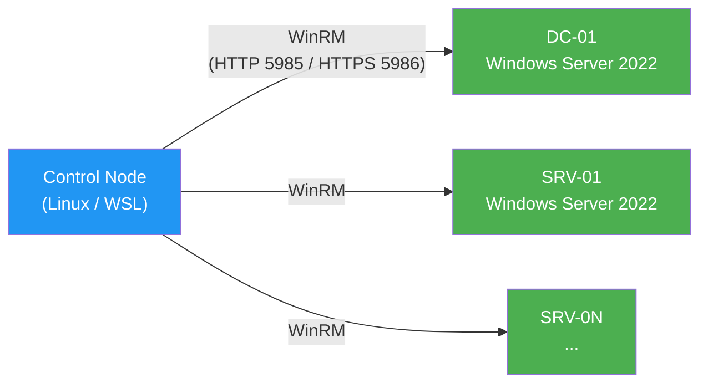

<!--
  Copyright 2026 Julien Bombled

  Licensed under the Apache License, Version 2.0 (the "License");
  you may not use this file except in compliance with the License.
  You may obtain a copy of the License at

      http://www.apache.org/licenses/LICENSE-2.0

  Unless required by applicable law or agreed to in writing, software
  distributed under the License is distributed on an "AS IS" BASIS,
  WITHOUT WARRANTIES OR CONDITIONS OF ANY KIND, either express or implied.
  See the License for the specific language governing permissions and
  limitations under the License.
-->
---
title: "Ansible pour Windows Server"
description: "Automatiser la configuration de serveurs Windows avec Ansible : WinRM, inventaire, roles et playbooks pour un lab Windows Server 2022."
tags:
  - automatisation
  - iac
  - ansible
  - winrm
---

# Ansible pour Windows Server

<span class="level-advanced">Avance</span> · Temps estime : 50 minutes

## Introduction

**Ansible** est un outil d'automatisation open source (Red Hat) qui permet de configurer et gerer des serveurs a distance, sans agent. Contrairement a la plupart des outils d'automatisation Linux, Ansible supporte nativement Windows via le protocole **WinRM** (Windows Remote Management) et les modules dedies des collections `ansible.windows` et `community.windows`.

!!! example "Analogie"

    Ansible, c'est comme un chef d'orchestre. Il ne joue d'aucun instrument lui-meme, mais il lit la partition (le playbook) et donne les instructions a chaque musicien (serveur) au bon moment. Chaque musicien sait jouer sa partie (les modules WinRM executent les commandes localement), mais c'est le chef qui coordonne l'ensemble pour que le resultat soit harmonieux. Et si un nouveau musicien rejoint l'orchestre, il suffit de l'ajouter a la liste -- la partition reste la meme.

## Architecture Ansible + Windows



!!! info "Control Node"

    Le noeud de controle Ansible doit etre un systeme Linux (ou WSL). Ansible ne s'execute pas nativement sur Windows. Les cibles Windows sont gerees via WinRM.

## Ansible vs DSC

| Critere | Ansible | DSC (Desired State Configuration) |
|---|---|---|
| Agent requis | Non (agentless via WinRM) | LCM integre a Windows |
| Langage | YAML (playbooks) | PowerShell (configurations) |
| Control Node | Linux / WSL | Windows ou Azure Automation |
| Idempotence | Par module | Par ressource DSC |
| Gestion multi-OS | Linux + Windows + reseau | Windows uniquement |
| Courbe d'apprentissage | Douce (YAML lisible) | Moyenne (PowerShell avance) |
| Push vs Pull | Push (par defaut) | Push ou Pull (via pull server) |
| Gestion des secrets | Ansible Vault | Certificats / MOF chiffre |

!!! tip "Quand utiliser quoi ?"

    Utilisez **Ansible** quand vous gerez un parc mixte (Linux + Windows) ou quand vous voulez un outil unique pour l'orchestration. Utilisez **DSC** quand vous etes dans un environnement 100% Windows et que vous avez besoin d'un mode Pull natif (Azure Automation DSC).

## Prerequis

### Sur le control node (Linux / WSL)

```bash
# Install Ansible
pip install ansible

# Install pywinrm (WinRM Python library)
pip install pywinrm

# Install required Galaxy collections
ansible-galaxy collection install -r requirements.yml
```

### Sur les cibles Windows

```powershell
# Enable WinRM (run as Administrator)
winrm quickconfig -q

# Allow unencrypted traffic for lab (HTTP 5985)
Set-Item WSMan:\localhost\Service\AllowUnencrypted $true

# Configure WinRM for NTLM authentication
Set-Item WSMan:\localhost\Service\Auth\Basic $true

# Verify WinRM listener
winrm enumerate winrm/config/Listener
```

Resultat :

```text
Listener
    Address = *
    Transport = HTTP
    Port = 5985
    Hostname
    Enabled = true
    URLPrefix = wsman
```

!!! warning "Environnement lab uniquement"

    La configuration `AllowUnencrypted` et `Auth\Basic` convient pour un lab isole. En production, utilisez **HTTPS (port 5986)** avec des certificats et l'authentification **Kerberos** ou **CredSSP**.

### Test de connectivite

```bash
# Test Ansible connectivity to all Windows hosts
ansible windows -m ansible.windows.win_ping
```

Resultat :

```text
DC-01 | SUCCESS => {
    "changed": false,
    "ping": "pong"
}
SRV-01 | SUCCESS => {
    "changed": false,
    "ping": "pong"
}
```

## Inventaire

L'inventaire definit les machines cibles et leur regroupement.

### Fichier hosts.ini

```ini
[dc]
DC-01 ansible_host=10.0.0.10

[servers]
SRV-01 ansible_host=10.0.0.20

[windows:children]
dc
servers
```

### Variables de groupe (group_vars/windows.yml)

```yaml
---
ansible_connection: winrm
ansible_winrm_transport: ntlm
ansible_port: 5985
ansible_winrm_scheme: http
ansible_winrm_server_cert_validation: ignore
```

!!! danger "Credentials"

    Ne stockez jamais `ansible_user` et `ansible_password` dans les fichiers d'inventaire commites dans Git. Passez-les via `--ask-pass`, des variables d'environnement ou **Ansible Vault**.

```bash
# Run with password prompt
ansible-playbook playbooks/base.yml --ask-pass

# Or use Ansible Vault
ansible-vault create inventory/group_vars/windows_vault.yml
ansible-playbook playbooks/base.yml --ask-vault-pass
```

## Structure du projet Ansible

```
infrastructure/ansible/
├── ansible.cfg                  # Configuration Ansible
├── requirements.yml             # Collections Galaxy requises
├── inventory/
│   ├── hosts.ini                # Inventaire des machines
│   └── group_vars/
│       ├── all.yml              # Variables globales (domaine)
│       └── windows.yml          # Connexion WinRM
├── playbooks/
│   ├── site.yml                 # Playbook complet (base + roles)
│   └── base.yml                 # Base OS uniquement
└── roles/
    ├── metabaseos/              # Configuration de base (complet)
    ├── dc/                      # Domain Controller (stub)
    ├── fileserver/              # File Server (stub)
    └── webserver/               # Web Server IIS (stub)
```

## Role metabaseos

Le role `metabaseos` standardise la configuration de base de tout serveur Windows du lab. Il est concu pour etre idempotent et entierement parametrable via des variables.

### Taches du role

| Fichier | Configuration | Tag |
|---|---|---|
| `hostname.yml` | Renommage machine + reboot si necessaire | `hostname` |
| `network.yml` | DNS servers, suffixe DNS | `network` |
| `regional.yml` | Timezone Romance Standard Time, NTP, locale fr-FR, clavier | `regional` |
| `updates.yml` | WSUS (optionnel) ou WU direct, planification | `updates` |
| `security.yml` | Firewall profiles ON + allow-list, SMBv1 off, audit | `security` |
| `winrm.yml` | Certificat auto-signe, listener HTTPS, tuning | `winrm` |
| `rdp.yml` | Activer RDP + NLA obligatoire | `rdp` |
| `powershell.yml` | ExecutionPolicy RemoteSigned | `powershell` |
| `features.yml` | RSAT-AD-Tools, RSAT-DNS, RSAT-DHCP, .NET Framework | `features` |
| `performance.yml` | Telemetrie niveau 0, effets visuels, pagefile auto | `performance` |

### Variables principales (defaults/main.yml)

```yaml
# Hostname
metabaseos_hostname: "{{ inventory_hostname }}"

# Network
metabaseos_dns_servers:
  - 10.0.0.10
  - 127.0.0.1
metabaseos_dns_suffix: winopslab.local

# Regional
metabaseos_timezone: "Romance Standard Time"
metabaseos_ntp_servers:
  - fr.pool.ntp.org
metabaseos_locale: fr-FR

# Security
metabaseos_firewall_enabled: true
metabaseos_smbv1_disabled: true
metabaseos_firewall_allowed_ports:
  - { port: 5985, protocol: tcp, name: "WinRM-HTTP" }
  - { port: 5986, protocol: tcp, name: "WinRM-HTTPS" }
  - { port: 3389, protocol: tcp, name: "RDP" }

# Features
metabaseos_windows_features:
  - RSAT-AD-Tools
  - RSAT-DNS-Server
  - RSAT-DHCP
  - NET-Framework-Core
```

### Handlers

Le role utilise quatre handlers pour les redemarrages de services :

```yaml
- name: Restart WinRM    # Apres modification WinRM
- name: Restart W32Time   # Apres modification NTP
- name: Restart TermService  # Apres modification RDP
- name: Reboot server     # Apres renommage hostname
```

## Execution

### Playbook complet (base + roles specifiques)

```bash
# Apply full configuration
ansible-playbook playbooks/site.yml --ask-pass
```

Resultat :

```text
PLAY [Apply base OS configuration to all Windows hosts] ***********************

TASK [metabaseos : Set computer hostname] *************************************
ok: [DC-01]
ok: [SRV-01]

TASK [metabaseos : Set DNS client server addresses] ***************************
changed: [DC-01]
changed: [SRV-01]

TASK [metabaseos : Set timezone] **********************************************
ok: [DC-01]
ok: [SRV-01]

TASK [metabaseos : Enable firewall profiles] **********************************
ok: [DC-01]
ok: [SRV-01]

TASK [metabaseos : Disable SMBv1 server] **************************************
changed: [DC-01]
changed: [SRV-01]

TASK [metabaseos : Install Windows features] **********************************
changed: [DC-01] => (item=RSAT-AD-Tools)
ok: [DC-01] => (item=RSAT-DNS-Server)
changed: [SRV-01] => (item=RSAT-AD-Tools)
changed: [SRV-01] => (item=RSAT-DNS-Server)

PLAY RECAP ********************************************************************
DC-01   : ok=14   changed=6    unreachable=0    failed=0    skipped=2
SRV-01  : ok=14   changed=8    unreachable=0    failed=0    skipped=0
```

### Playbook base uniquement

```bash
# Apply base OS configuration only
ansible-playbook playbooks/base.yml --ask-pass
```

### Execution par tags

```bash
# Apply only security hardening
ansible-playbook playbooks/base.yml --tags security --ask-pass

# Apply hostname + network only
ansible-playbook playbooks/base.yml --tags hostname,network --ask-pass

# Apply everything except features (long install)
ansible-playbook playbooks/base.yml --skip-tags features --ask-pass
```

### Mode check (dry run)

```bash
# Preview changes without applying
ansible-playbook playbooks/base.yml --check --ask-pass
```

!!! example "Scenario pratique"

    **Contexte :** Marc est administrateur systeme dans une PME qui ouvre une succursale. Il doit deployer 5 nouveaux serveurs Windows Server 2022 (1 DC, 2 serveurs de fichiers, 2 serveurs web) avec une configuration identique : timezone Paris, NTP francais, firewall configure, SMBv1 desactive, RSAT installe et RDP avec NLA.

    **Probleme :** Configurer manuellement chaque serveur prend 45 minutes et les derives de configuration sont frequentes (un technicien oublie de desactiver SMBv1, un autre oublie le NLA sur RDP).

    **Solution :** Marc utilise le role `metabaseos` d'Ansible :

    ```bash
    # Step 1: Add the 5 new servers to inventory
    cat inventory/hosts.ini
    ```

    ```ini
    [dc]
    DC-SUC01 ansible_host=10.1.0.10

    [fileservers]
    FS-SUC01 ansible_host=10.1.0.20
    FS-SUC02 ansible_host=10.1.0.21

    [webservers]
    WEB-SUC01 ansible_host=10.1.0.30
    WEB-SUC02 ansible_host=10.1.0.31

    [windows:children]
    dc
    fileservers
    webservers
    ```

    ```bash
    # Step 2: Test connectivity
    ansible windows -m ansible.windows.win_ping --ask-pass
    ```

    ```text
    DC-SUC01  | SUCCESS => { "ping": "pong" }
    FS-SUC01  | SUCCESS => { "ping": "pong" }
    FS-SUC02  | SUCCESS => { "ping": "pong" }
    WEB-SUC01 | SUCCESS => { "ping": "pong" }
    WEB-SUC02 | SUCCESS => { "ping": "pong" }
    ```

    ```bash
    # Step 3: Apply base configuration to all 5 servers
    ansible-playbook playbooks/base.yml --ask-pass
    ```

    ```text
    PLAY RECAP ****************************************************************
    DC-SUC01  : ok=14  changed=10  unreachable=0  failed=0  skipped=2
    FS-SUC01  : ok=14  changed=10  unreachable=0  failed=0  skipped=2
    FS-SUC02  : ok=14  changed=10  unreachable=0  failed=0  skipped=2
    WEB-SUC01 : ok=14  changed=10  unreachable=0  failed=0  skipped=2
    WEB-SUC02 : ok=14  changed=10  unreachable=0  failed=0  skipped=2
    ```

    En 8 minutes, les 5 serveurs sont configures de maniere identique. Marc peut relancer le playbook a tout moment pour verifier la conformite -- Ansible ne modifie que ce qui a change (idempotence).

!!! danger "Erreurs courantes"

    **WinRM connection refused (port 5985)** -- Ansible ne peut pas se connecter au serveur cible. Verifiez que WinRM est active (`winrm quickconfig`), que le service ecoute sur le bon port (`winrm enumerate winrm/config/Listener`) et que le pare-feu autorise le port 5985 (ou 5986 pour HTTPS).

    **NTLM/Kerberos authentication failure** -- Le transport d'authentification ne correspond pas a la configuration du serveur. Verifiez que `ansible_winrm_transport` dans `group_vars/windows.yml` correspond a ce qui est configure sur la cible. Pour NTLM, `Set-Item WSMan:\localhost\Service\Auth\Negotiate $true` doit etre actif.

    **Firewall bloque WinRM apres application du role security** -- Si le role `security` active le firewall sans les regles d'allow-list pour WinRM, vous perdez la connexion. Le role `metabaseos` applique les regles firewall **avant** d'activer les profils, mais si vous modifiez l'ordre des taches, verifiez que les ports 5985/5986 sont autorises.

    **Module pywinrm manquant** -- L'erreur `winrm or requests is not installed` signifie que la bibliotheque Python `pywinrm` n'est pas installee sur le control node. Installez-la avec `pip install pywinrm`.

    **Collections Galaxy non installees** -- L'erreur `couldn't resolve module/action 'ansible.windows.win_ping'` indique que les collections requises ne sont pas installees. Executez `ansible-galaxy collection install -r requirements.yml`.

    **Utilisation de modules Linux sur Windows** -- Les modules standards comme `ansible.builtin.command` ou `ansible.builtin.shell` ne fonctionnent pas sur Windows. Utilisez les equivalents Windows : `ansible.windows.win_command`, `ansible.windows.win_shell` ou `ansible.windows.win_powershell`.

## Points cles a retenir

- Ansible gere Windows via **WinRM** (pas SSH) -- le control node doit etre Linux/WSL
- Les collections **ansible.windows** et **community.windows** fournissent tous les modules necessaires
- Le role `metabaseos` standardise la configuration de base : hostname, reseau, securite, RDP, PowerShell
- Les **tags** permettent d'appliquer selectivement certaines parties de la configuration
- L'**idempotence** garantit qu'un playbook peut etre relance sans effet secondaire
- Utilisez **Ansible Vault** pour les secrets, jamais de mots de passe en clair dans l'inventaire

## Pour aller plus loin

- Packer pour les golden images : [Packer](packer-images.md)
- Templates ARM et Bicep : [ARM et Bicep](templates-arm-bicep.md)
- DSC pour la configuration declarative : [Concepts DSC](../dsc/concepts-dsc.md)
- PowerShell Remoting : [Remoting](../powershell-avance/remoting.md)
