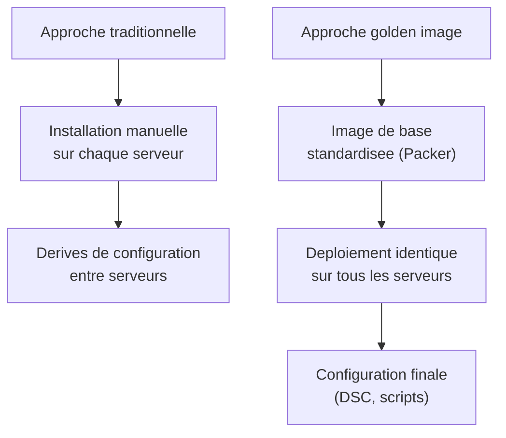
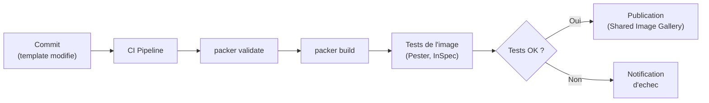

# Packer pour les images Windows Server

<span class="level-advanced">Avance</span> · Temps estime : 45 minutes

## Introduction

**Packer** est un outil open source de HashiCorp qui automatise la creation d'images de machines (VM templates, AMI, images Azure, etc.). Pour les environnements Windows Server, Packer permet de construire des **golden images** : des images de base standardisees, securisees et preconfigures qui servent de point de depart pour tous les nouveaux deploiements.

## Pourquoi des golden images ?



| Approche | Avantage | Inconvenient |
|---|---|---|
| Installation manuelle | Simple pour 1-2 serveurs | Non reproductible, chronophage |
| Golden image (Packer) | Reproductible, rapide, conforme | Maintenance de l'image necessaire |

### Avantages des golden images

- **Coherence** : tous les serveurs partent de la meme base
- **Rapidite** : deploiement en minutes (pas d'installation OS)
- **Securite** : mises a jour et hardening integres a l'image
- **Conformite** : configuration de base auditee et validee
- **Versionnement** : chaque image est versionnee et tracable

## Installation de Packer

```powershell
# Download Packer from HashiCorp (or use Chocolatey)
choco install packer -y

# Verify installation
packer version
```

## Structure d'un projet Packer

```
packer-windows/
    windows-server-2022.pkr.hcl    # Template Packer (HCL2)
    variables.pkrvars.hcl           # Variables (secrets exclus)
    scripts/
        Install-WindowsUpdates.ps1  # Provisioning scripts
        Configure-Baseline.ps1
        Cleanup-Image.ps1
    answer_files/
        autounattend.xml            # Unattended setup (on-premise)
```

## Template Packer pour Azure

### Template HCL2

```hcl
# windows-server-2022.pkr.hcl

packer {
  required_plugins {
    azure = {
      source  = "github.com/hashicorp/azure"
      version = "~> 2"
    }
  }
}

# Variables
variable "client_id" {
  type        = string
  description = "Azure Service Principal Client ID"
  sensitive   = true
}

variable "client_secret" {
  type        = string
  description = "Azure Service Principal Client Secret"
  sensitive   = true
}

variable "subscription_id" {
  type        = string
  description = "Azure Subscription ID"
}

variable "tenant_id" {
  type        = string
  description = "Azure Tenant ID"
}

variable "image_version" {
  type        = string
  default     = "1.0.0"
  description = "Version of the golden image"
}

# Source: Azure ARM builder
source "azure-arm" "windows-2022" {
  client_id       = var.client_id
  client_secret   = var.client_secret
  subscription_id = var.subscription_id
  tenant_id       = var.tenant_id

  # Source image
  os_type         = "Windows"
  image_publisher = "MicrosoftWindowsServer"
  image_offer     = "WindowsServer"
  image_sku       = "2022-datacenter-g2"

  # Build VM configuration
  location = "westeurope"
  vm_size  = "Standard_D4s_v5"

  # Output to Managed Image
  managed_image_resource_group_name = "rg-images"
  managed_image_name                = "ws2022-golden-${var.image_version}"

  # Communicator (WinRM for Windows)
  communicator   = "winrm"
  winrm_use_ssl  = true
  winrm_insecure = true
  winrm_timeout  = "10m"
  winrm_username = "packer"
}

# Build definition
build {
  sources = ["source.azure-arm.windows-2022"]

  # Provisioner: Install Windows Updates
  provisioner "powershell" {
    script = "scripts/Install-WindowsUpdates.ps1"
  }

  # Provisioner: Configure baseline
  provisioner "powershell" {
    script = "scripts/Configure-Baseline.ps1"
  }

  # Provisioner: Install common tools
  provisioner "powershell" {
    inline = [
      "Install-WindowsFeature -Name NET-Framework-Core",
      "Install-WindowsFeature -Name Telnet-Client",
      "Install-WindowsFeature -Name RSAT-AD-Tools"
    ]
  }

  # Provisioner: Cleanup and sysprep
  provisioner "powershell" {
    script = "scripts/Cleanup-Image.ps1"
  }

  # Azure-specific: Generalize the image
  provisioner "powershell" {
    inline = [
      "if (Test-Path $env:SystemRoot\\system32\\Sysprep\\sysprep.exe) {",
      "  & $env:SystemRoot\\system32\\Sysprep\\sysprep.exe /oobe /generalize /quiet /quit /mode:vm",
      "  while ($true) {",
      "    $imageState = (Get-ItemProperty HKLM:\\SOFTWARE\\Microsoft\\Windows\\CurrentVersion\\Setup\\State).ImageState",
      "    Write-Output $imageState",
      "    if ($imageState -eq 'IMAGE_STATE_GENERALIZE_RESEAL_TO_OOBE') { break }",
      "    Start-Sleep -Seconds 10",
      "  }",
      "}"
    ]
  }
}
```

## Provisioners (scripts de provisioning)

### Installation des mises a jour

```powershell
# scripts/Install-WindowsUpdates.ps1
# Install PSWindowsUpdate module and apply updates
[Net.ServicePointManager]::SecurityProtocol = [Net.SecurityProtocolType]::Tls12

Install-PackageProvider -Name NuGet -Force
Install-Module -Name PSWindowsUpdate -Force

# Install all available updates
$updateCount = (Get-WindowsUpdate -MicrosoftUpdate).Count
Write-Output "Found $updateCount updates to install"

Install-WindowsUpdate -MicrosoftUpdate -AcceptAll -AutoReboot -IgnoreReboot
```

### Configuration de base (hardening)

```powershell
# scripts/Configure-Baseline.ps1

# Disable SMBv1
Set-SmbServerConfiguration -EnableSMB1Protocol $false -Force
Disable-WindowsOptionalFeature -Online -FeatureName SMB1Protocol -NoRestart

# Configure Windows Firewall
Set-NetFirewallProfile -Profile Domain, Public, Private -Enabled True

# Disable unnecessary services
$servicesToDisable = @("XblAuthManager", "XblGameSave", "XboxNetApiSvc")
foreach ($svc in $servicesToDisable) {
    $service = Get-Service -Name $svc -ErrorAction SilentlyContinue
    if ($service) {
        Set-Service -Name $svc -StartupType Disabled
        Stop-Service -Name $svc -Force -ErrorAction SilentlyContinue
    }
}

# Configure NTP
w32tm /config /manualpeerlist:"time.windows.com" /syncfromflags:manual /reliable:yes /update

# Enable PowerShell transcription
$transcriptPath = "HKLM:\SOFTWARE\Policies\Microsoft\Windows\PowerShell\Transcription"
if (-not (Test-Path $transcriptPath)) {
    New-Item -Path $transcriptPath -Force
}
Set-ItemProperty -Path $transcriptPath -Name "EnableTranscripting" -Value 1 -Type DWord
Set-ItemProperty -Path $transcriptPath -Name "OutputDirectory" -Value "C:\PSTranscripts" -Type String

Write-Output "Baseline configuration completed"
```

### Nettoyage de l'image

```powershell
# scripts/Cleanup-Image.ps1

# Clear Windows Update cache
Stop-Service -Name wuauserv -Force
Remove-Item -Path "C:\Windows\SoftwareDistribution\Download\*" -Recurse -Force
Start-Service -Name wuauserv

# Clear temp files
Remove-Item -Path "$env:TEMP\*" -Recurse -Force -ErrorAction SilentlyContinue
Remove-Item -Path "C:\Windows\Temp\*" -Recurse -Force -ErrorAction SilentlyContinue

# Clear event logs
Get-WinEvent -ListLog * -Force | ForEach-Object {
    [System.Diagnostics.Eventing.Reader.EventLogSession]::GlobalSession.ClearLog($_.LogName)
}

# Optimize disk (reduce image size)
Optimize-Volume -DriveLetter C -Defrag -Verbose

Write-Output "Image cleanup completed"
```

## Construire l'image

```powershell
# Validate the template
packer validate -var-file="variables.pkrvars.hcl" windows-server-2022.pkr.hcl

# Build the image
packer build -var-file="variables.pkrvars.hcl" windows-server-2022.pkr.hcl

# Build with specific variable overrides
packer build -var "image_version=1.1.0" -var-file="variables.pkrvars.hcl" windows-server-2022.pkr.hcl
```

### Fichier de variables

```hcl
# variables.pkrvars.hcl
subscription_id = "xxxxxxxx-xxxx-xxxx-xxxx-xxxxxxxxxxxx"
tenant_id       = "xxxxxxxx-xxxx-xxxx-xxxx-xxxxxxxxxxxx"
image_version   = "1.0.0"
# client_id and client_secret should be passed via environment variables
```

!!! danger "Secrets dans les fichiers de variables"

    Ne stockez jamais les `client_id` et `client_secret` dans les fichiers de variables commites dans Git. Utilisez des variables d'environnement ou un coffre-fort de secrets.

```powershell
# Set secrets via environment variables
$env:PKR_VAR_client_id = "your-client-id"
$env:PKR_VAR_client_secret = "your-client-secret"
packer build windows-server-2022.pkr.hcl
```

## Template Packer pour Hyper-V (on-premise)

```hcl
source "hyperv-iso" "windows-2022" {
  iso_url          = "C:/ISOs/SERVER_EVAL_x64FRE_en-us.iso"
  iso_checksum     = "sha256:YOURCHECKSUM"
  generation       = 2
  switch_name      = "Default Switch"
  cpus             = 4
  memory           = 4096
  disk_size        = 61440
  communicator     = "winrm"
  winrm_username   = "packer"
  winrm_password   = "PackerBuild123!"
  winrm_timeout    = "30m"
  shutdown_command  = "shutdown /s /t 10 /f /d p:4:1 /c \"Packer Shutdown\""
  floppy_files     = ["answer_files/autounattend.xml"]
}

build {
  sources = ["source.hyperv-iso.windows-2022"]

  provisioner "powershell" {
    scripts = [
      "scripts/Install-WindowsUpdates.ps1",
      "scripts/Configure-Baseline.ps1",
      "scripts/Cleanup-Image.ps1"
    ]
  }
}
```

## Pipeline CI/CD pour les golden images



## Bonnes pratiques

| Pratique | Recommandation |
|---|---|
| Versionnement | Versionner les templates dans Git avec Semantic Versioning |
| Secrets | Variables d'environnement ou coffre-fort (Key Vault, Vault) |
| Mises a jour | Reconstruire l'image mensuellement (Patch Tuesday) |
| Tests | Tester l'image avec Pester ou InSpec apres construction |
| Nettoyage | Toujours nettoyer et sysprep avant de finaliser l'image |
| Documentation | Documenter le contenu de chaque version d'image |

## Points cles a retenir

- Packer automatise la creation d'**images de base reproductibles** (golden images)
- Les provisioners PowerShell permettent d'installer les mises a jour, configurer la baseline et nettoyer l'image
- **Sysprep** est obligatoire pour generaliser une image Windows avant reutilisation
- Utilisez le format **HCL2** (pas JSON) pour les templates Packer modernes
- Les secrets doivent etre passes via des **variables d'environnement**, jamais dans les fichiers commites
- Integrez la construction d'images dans un **pipeline CI/CD** pour une mise a jour reguliere

## Pour aller plus loin

- Templates ARM et Bicep : [ARM et Bicep](templates-arm-bicep.md)
- DSC pour la configuration post-deploiement : [Concepts DSC](../dsc/concepts-dsc.md)
- Documentation HashiCorp : Packer Documentation
