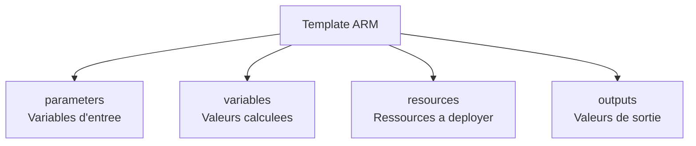

# Templates ARM et Bicep

<span class="level-advanced">Avance</span> · Temps estime : 50 minutes

## Introduction

Les templates **ARM** (Azure Resource Manager) et **Bicep** sont les outils d'**Infrastructure as Code** (IaC) natifs d'Azure. Ils permettent de definir l'infrastructure de maniere declarative et de la deployer de facon reproductible. Bicep est le successeur de ARM JSON : il offre une syntaxe plus lisible tout en compilant vers ARM en arriere-plan.

## ARM vs Bicep

| Critere | ARM (JSON) | Bicep |
|---|---|---|
| Format | JSON verbeux | Syntaxe concise et lisible |
| Courbe d'apprentissage | Raide (JSON imbrique) | Douce (syntaxe dediee) |
| IntelliSense | Limite | Excellent (VS Code extension) |
| Compilation | Direct | Compile vers ARM JSON |
| Modules | Linked templates (complexe) | Modules natifs (simple) |
| Etat | Mature, stable | Recommande par Microsoft |

!!! tip "Bicep est le choix recommande"

    Microsoft recommande Bicep pour tous les nouveaux projets IaC Azure. Bicep compile vers ARM JSON et offre toutes les memes fonctionnalites avec une syntaxe nettement plus lisible.

## Structure d'un template ARM

Un template ARM est un fichier JSON avec quatre sections principales :



### Exemple ARM : VM Windows Server

```json
{
  "$schema": "https://schema.management.azure.com/schemas/2019-04-01/deploymentTemplate.json#",
  "contentVersion": "1.0.0.0",
  "parameters": {
    "vmName": {
      "type": "string",
      "metadata": {
        "description": "Name of the virtual machine"
      }
    },
    "adminUsername": {
      "type": "string",
      "metadata": {
        "description": "Admin username for the VM"
      }
    },
    "adminPassword": {
      "type": "securestring",
      "metadata": {
        "description": "Admin password for the VM"
      }
    },
    "vmSize": {
      "type": "string",
      "defaultValue": "Standard_D2s_v5",
      "allowedValues": [
        "Standard_D2s_v5",
        "Standard_D4s_v5",
        "Standard_D8s_v5"
      ]
    }
  },
  "variables": {
    "nicName": "[concat(parameters('vmName'), '-nic')]",
    "vnetName": "[concat(parameters('vmName'), '-vnet')]",
    "subnetName": "default",
    "publicIPName": "[concat(parameters('vmName'), '-pip')]"
  },
  "resources": [
    {
      "type": "Microsoft.Compute/virtualMachines",
      "apiVersion": "2023-03-01",
      "name": "[parameters('vmName')]",
      "location": "[resourceGroup().location]",
      "properties": {
        "hardwareProfile": {
          "vmSize": "[parameters('vmSize')]"
        },
        "osProfile": {
          "computerName": "[parameters('vmName')]",
          "adminUsername": "[parameters('adminUsername')]",
          "adminPassword": "[parameters('adminPassword')]"
        },
        "storageProfile": {
          "imageReference": {
            "publisher": "MicrosoftWindowsServer",
            "offer": "WindowsServer",
            "sku": "2022-datacenter-g2",
            "version": "latest"
          },
          "osDisk": {
            "createOption": "FromImage",
            "managedDisk": {
              "storageAccountType": "Premium_LRS"
            }
          }
        },
        "networkProfile": {
          "networkInterfaces": [
            {
              "id": "[resourceId('Microsoft.Network/networkInterfaces', variables('nicName'))]"
            }
          ]
        }
      },
      "dependsOn": [
        "[resourceId('Microsoft.Network/networkInterfaces', variables('nicName'))]"
      ]
    }
  ],
  "outputs": {
    "vmResourceId": {
      "type": "string",
      "value": "[resourceId('Microsoft.Compute/virtualMachines', parameters('vmName'))]"
    }
  }
}
```

## Structure d'un template Bicep

La meme VM en Bicep est nettement plus concise :

### Exemple Bicep : VM Windows Server

```bicep
// parameters
@description('Name of the virtual machine')
param vmName string

@description('Admin username for the VM')
param adminUsername string

@description('Admin password for the VM')
@secure()
param adminPassword string

@description('VM size')
@allowed([
  'Standard_D2s_v5'
  'Standard_D4s_v5'
  'Standard_D8s_v5'
])
param vmSize string = 'Standard_D2s_v5'

@description('Azure region for the deployment')
param location string = resourceGroup().location

// variables
var nicName = '${vmName}-nic'
var vnetName = '${vmName}-vnet'
var subnetName = 'default'
var publicIPName = '${vmName}-pip'

// resources
resource publicIP 'Microsoft.Network/publicIPAddresses@2023-04-01' = {
  name: publicIPName
  location: location
  sku: {
    name: 'Standard'
  }
  properties: {
    publicIPAllocationMethod: 'Static'
  }
}

resource vnet 'Microsoft.Network/virtualNetworks@2023-04-01' = {
  name: vnetName
  location: location
  properties: {
    addressSpace: {
      addressPrefixes: [
        '10.0.0.0/16'
      ]
    }
    subnets: [
      {
        name: subnetName
        properties: {
          addressPrefix: '10.0.1.0/24'
        }
      }
    ]
  }
}

resource nic 'Microsoft.Network/networkInterfaces@2023-04-01' = {
  name: nicName
  location: location
  properties: {
    ipConfigurations: [
      {
        name: 'ipconfig1'
        properties: {
          subnet: {
            id: vnet.properties.subnets[0].id
          }
          publicIPAddress: {
            id: publicIP.id
          }
        }
      }
    ]
  }
}

resource vm 'Microsoft.Compute/virtualMachines@2023-03-01' = {
  name: vmName
  location: location
  properties: {
    hardwareProfile: {
      vmSize: vmSize
    }
    osProfile: {
      computerName: vmName
      adminUsername: adminUsername
      adminPassword: adminPassword
    }
    storageProfile: {
      imageReference: {
        publisher: 'MicrosoftWindowsServer'
        offer: 'WindowsServer'
        sku: '2022-datacenter-g2'
        version: 'latest'
      }
      osDisk: {
        createOption: 'FromImage'
        managedDisk: {
          storageAccountType: 'Premium_LRS'
        }
      }
    }
    networkProfile: {
      networkInterfaces: [
        {
          id: nic.id
        }
      ]
    }
  }
}

// outputs
output vmResourceId string = vm.id
output publicIPAddress string = publicIP.properties.ipAddress
```

## Deploiement

### Deployer un template ARM

```powershell
# Deploy ARM template
New-AzResourceGroupDeployment `
    -ResourceGroupName "rg-yourproject" `
    -TemplateFile ".\templates\vm-windows.json" `
    -TemplateParameterFile ".\parameters\vm-windows.parameters.json" `
    -Verbose
```

### Deployer un template Bicep

```powershell
# Deploy Bicep template (Azure CLI)
az deployment group create `
    --resource-group "rg-yourproject" `
    --template-file ".\templates\vm-windows.bicep" `
    --parameters vmName="SRV-WEB01" adminUsername="youradmin"

# Deploy Bicep template (PowerShell Az module)
New-AzResourceGroupDeployment `
    -ResourceGroupName "rg-yourproject" `
    -TemplateFile ".\templates\vm-windows.bicep" `
    -vmName "SRV-WEB01" `
    -adminUsername "youradmin" `
    -Verbose
```

### Fichier de parametres

```json
{
  "$schema": "https://schema.management.azure.com/schemas/2019-04-01/deploymentParameters.json#",
  "contentVersion": "1.0.0.0",
  "parameters": {
    "vmName": {
      "value": "SRV-WEB01"
    },
    "adminUsername": {
      "value": "youradmin"
    },
    "vmSize": {
      "value": "Standard_D2s_v5"
    }
  }
}
```

!!! danger "Mots de passe dans les fichiers de parametres"

    Ne stockez jamais de mots de passe en clair dans les fichiers de parametres. Utilisez un **Azure Key Vault** pour les secrets.

```json
{
  "adminPassword": {
    "reference": {
      "keyVault": {
        "id": "/subscriptions/YOUR_SUB/resourceGroups/YOUR_RG/providers/Microsoft.KeyVault/vaults/YOUR_KV"
      },
      "secretName": "vmAdminPassword"
    }
  }
}
```

### Mode What-If (simulation)

```powershell
# Preview changes without deploying
New-AzResourceGroupDeployment `
    -ResourceGroupName "rg-yourproject" `
    -TemplateFile ".\templates\vm-windows.bicep" `
    -vmName "SRV-WEB01" `
    -WhatIf
```

## Modules Bicep

Les modules permettent de reutiliser des composants d'infrastructure.

```bicep
// modules/windows-vm.bicep
@description('Deploy a Windows Server VM')
param vmName string
param location string
param vmSize string
param adminUsername string
@secure()
param adminPassword string
param subnetId string

resource nic 'Microsoft.Network/networkInterfaces@2023-04-01' = {
  name: '${vmName}-nic'
  location: location
  properties: {
    ipConfigurations: [
      {
        name: 'ipconfig1'
        properties: {
          subnet: {
            id: subnetId
          }
        }
      }
    ]
  }
}

resource vm 'Microsoft.Compute/virtualMachines@2023-03-01' = {
  name: vmName
  location: location
  properties: {
    hardwareProfile: { vmSize: vmSize }
    osProfile: {
      computerName: vmName
      adminUsername: adminUsername
      adminPassword: adminPassword
    }
    storageProfile: {
      imageReference: {
        publisher: 'MicrosoftWindowsServer'
        offer: 'WindowsServer'
        sku: '2022-datacenter-g2'
        version: 'latest'
      }
      osDisk: { createOption: 'FromImage' }
    }
    networkProfile: {
      networkInterfaces: [ { id: nic.id } ]
    }
  }
}

output vmId string = vm.id
```

```bicep
// main.bicep - using the module
module webServer 'modules/windows-vm.bicep' = {
  name: 'deploy-web-server'
  params: {
    vmName: 'SRV-WEB01'
    location: resourceGroup().location
    vmSize: 'Standard_D2s_v5'
    adminUsername: 'youradmin'
    adminPassword: adminPassword
    subnetId: vnet.properties.subnets[0].id
  }
}
```

## Points cles a retenir

- **Bicep** est le choix recommande pour les nouveaux projets IaC Azure (compile vers ARM JSON)
- Les templates sont **declaratifs** et **idempotents** : ils peuvent etre re-deployes sans effet secondaire
- Utilisez **Azure Key Vault** pour les secrets (mots de passe, cles)
- Le mode **What-If** permet de previsualiser les changements avant deploiement
- Les **modules Bicep** favorisent la reutilisation et la maintenabilite
- Versionnez vos templates dans un depot Git pour la tracabilite

## Pour aller plus loin

- Packer pour les images : [Packer](packer-images.md)
- DSC pour la configuration : [Concepts DSC](../dsc/concepts-dsc.md)
- Documentation Microsoft : Bicep Documentation
