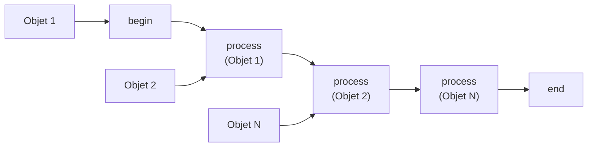

# Fonctions avancees PowerShell

!!! info "Niveau : avance | Temps estime : 50 minutes"

## Introduction

Les **fonctions avancees** (advanced functions) sont des fonctions PowerShell qui se comportent comme des cmdlets compiles. Elles offrent la validation des parametres, le support du pipeline, la gestion de `-WhatIf`/`-Confirm`, et une aide integree. C'est la base de l'ecriture de code PowerShell professionnel et reutilisable.

## CmdletBinding

L'attribut `[CmdletBinding()]` transforme une fonction simple en fonction avancee.

```powershell
function Get-ServerInfo {
    [CmdletBinding()]
    param(
        [Parameter(Mandatory)]
        [string]$ComputerName
    )

    Write-Verbose "Querying $ComputerName..."
    # Function body
}
```

### Ce que CmdletBinding apporte

| Fonctionnalite | Description |
|---|---|
| `-Verbose` | Active les messages `Write-Verbose` |
| `-Debug` | Active les messages `Write-Debug` |
| `-ErrorAction` | Controle le comportement en cas d'erreur |
| `-ErrorVariable` | Capture les erreurs dans une variable |
| `-WarningAction` | Controle le comportement des avertissements |
| `-OutVariable` | Capture la sortie dans une variable |
| `-PipelineVariable` | Variable accessible dans le pipeline |
| `-InformationAction` | Controle les messages d'information |

### Options de CmdletBinding

```powershell
function Set-ServerConfig {
    [CmdletBinding(
        SupportsShouldProcess,       # Enable -WhatIf and -Confirm
        ConfirmImpact = "High",      # Auto-prompt for confirmation
        DefaultParameterSetName = "ByName"  # Default parameter set
    )]
    param(
        [Parameter(ParameterSetName = "ByName")]
        [string]$Name,

        [Parameter(ParameterSetName = "ByIP")]
        [string]$IPAddress
    )

    if ($PSCmdlet.ShouldProcess($Name, "Update configuration")) {
        # Perform the action
    }
}
```

## Validation des parametres

### Attributs de validation

```powershell
function New-AdminUser {
    [CmdletBinding()]
    param(
        # Mandatory with help message
        [Parameter(Mandatory, HelpMessage = "Enter the username")]
        [ValidateNotNullOrEmpty()]
        [string]$Username,

        # Validate from a set of allowed values
        [Parameter()]
        [ValidateSet("Admin", "Operator", "ReadOnly")]
        [string]$Role = "ReadOnly",

        # Validate numeric range
        [Parameter()]
        [ValidateRange(1, 365)]
        [int]$ExpirationDays = 90,

        # Validate with regex
        [Parameter()]
        [ValidatePattern("^[A-Z]{2}\d{3}$", ErrorMessage = "Format must be XX999")]
        [string]$SiteCode,

        # Validate with custom script
        [Parameter()]
        [ValidateScript({
            if (Test-Path $_) { $true }
            else { throw "Path '$_' does not exist" }
        })]
        [string]$HomePath,

        # Validate string length
        [Parameter()]
        [ValidateLength(8, 64)]
        [string]$Password,

        # Validate count of array items
        [Parameter()]
        [ValidateCount(1, 10)]
        [string[]]$Groups
    )

    # Function body
}
```

### Jeux de parametres (Parameter Sets)

Les jeux de parametres permettent de definir des groupes de parametres mutuellement exclusifs.

```powershell
function Get-Machine {
    [CmdletBinding(DefaultParameterSetName = "ByName")]
    param(
        [Parameter(Mandatory, ParameterSetName = "ByName", Position = 0)]
        [string]$Name,

        [Parameter(Mandatory, ParameterSetName = "ByIP")]
        [System.Net.IPAddress]$IPAddress,

        [Parameter(Mandatory, ParameterSetName = "ByOU")]
        [string]$OrganizationalUnit,

        # Common parameter (available in all sets)
        [Parameter()]
        [switch]$IncludeDisabled
    )

    # Determine which parameter set is being used
    switch ($PSCmdlet.ParameterSetName) {
        "ByName" { Write-Verbose "Searching by name: $Name" }
        "ByIP"   { Write-Verbose "Searching by IP: $IPAddress" }
        "ByOU"   { Write-Verbose "Searching by OU: $OrganizationalUnit" }
    }
}
```

## Support du pipeline

### ValueFromPipeline

```powershell
function Test-ServerConnection {
    [CmdletBinding()]
    param(
        [Parameter(Mandatory, ValueFromPipeline, ValueFromPipelineByPropertyName)]
        [Alias("ComputerName", "CN")]
        [string[]]$Name
    )

    begin {
        # Executed once at the start
        Write-Verbose "Starting connectivity tests"
        $results = @()
    }

    process {
        # Executed for each pipeline object
        foreach ($server in $Name) {
            $online = Test-Connection -ComputerName $server -Count 1 -Quiet
            $results += [PSCustomObject]@{
                ServerName = $server
                Online     = $online
                TestTime   = Get-Date
            }
        }
    }

    end {
        # Executed once at the end
        Write-Verbose "Completed testing $($results.Count) servers"
        $results
    }
}
```

```powershell
# Usage examples
"SRV01", "SRV02", "SRV03" | Test-ServerConnection -Verbose

# With AD objects (uses ValueFromPipelineByPropertyName)
Get-ADComputer -Filter 'OperatingSystem -like "*Server*"' | Test-ServerConnection
```



!!! tip "Begin / Process / End"

    - **begin** : initialisation (connexion DB, ouverture fichier, etc.)
    - **process** : traitement de chaque objet du pipeline
    - **end** : finalisation (fermeture connexion, export resultat, etc.)

## Types de sortie

### OutputType

L'attribut `[OutputType()]` declare le type d'objet retourne par la fonction. Il ne force pas le type mais sert de documentation et aide IntelliSense.

```powershell
function Get-DiskReport {
    [CmdletBinding()]
    [OutputType([PSCustomObject])]
    param(
        [Parameter(Mandatory, ValueFromPipeline)]
        [string[]]$ComputerName
    )

    process {
        foreach ($computer in $ComputerName) {
            $disks = Get-CimInstance -ClassName Win32_LogicalDisk -ComputerName $computer `
                -Filter "DriveType = 3"

            foreach ($disk in $disks) {
                [PSCustomObject]@{
                    PSTypeName   = "DiskReport"
                    ComputerName = $computer
                    Drive        = $disk.DeviceID
                    SizeGB       = [math]::Round($disk.Size / 1GB, 2)
                    FreeGB       = [math]::Round($disk.FreeSpace / 1GB, 2)
                    PercentFree  = [math]::Round(($disk.FreeSpace / $disk.Size) * 100, 1)
                }
            }
        }
    }
}
```

### Retourner des objets types

```powershell
# Define a custom class (PowerShell 5.1+)
class ServerHealthResult {
    [string]$ServerName
    [bool]$IsOnline
    [double]$CpuPercent
    [double]$MemoryPercent
    [datetime]$CheckTime

    ServerHealthResult([string]$name) {
        $this.ServerName = $name
        $this.CheckTime = Get-Date
    }
}

function Get-ServerHealth {
    [CmdletBinding()]
    [OutputType([ServerHealthResult])]
    param(
        [Parameter(Mandatory)]
        [string]$ComputerName
    )

    $result = [ServerHealthResult]::new($ComputerName)
    $result.IsOnline = Test-Connection -ComputerName $ComputerName -Count 1 -Quiet

    if ($result.IsOnline) {
        $cpu = Get-CimInstance -ClassName Win32_Processor -ComputerName $ComputerName
        $os = Get-CimInstance -ClassName Win32_OperatingSystem -ComputerName $ComputerName

        $result.CpuPercent = $cpu.LoadPercentage
        $result.MemoryPercent = [math]::Round(
            (($os.TotalVisibleMemorySize - $os.FreePhysicalMemory) / $os.TotalVisibleMemorySize) * 100, 1
        )
    }

    $result
}
```

## Aide basee sur les commentaires

```powershell
function Restart-ServiceSafely {
    <#
    .SYNOPSIS
        Safely restarts a Windows service with dependency handling.

    .DESCRIPTION
        Restarts a Windows service by first stopping dependent services,
        restarting the target service, then restarting dependents.
        Includes timeout handling and logging.

    .PARAMETER ServiceName
        The name of the service to restart.

    .PARAMETER TimeoutSeconds
        Maximum seconds to wait for service state changes. Default: 30.

    .PARAMETER ComputerName
        Target computer. Default: localhost.

    .EXAMPLE
        Restart-ServiceSafely -ServiceName "W3SVC"

        Restarts the IIS World Wide Web Publishing Service on the local machine.

    .EXAMPLE
        "W3SVC", "WAS" | Restart-ServiceSafely -TimeoutSeconds 60

        Restarts IIS and WAS services with a 60-second timeout.

    .INPUTS
        System.String
        You can pipe service names to this function.

    .OUTPUTS
        PSCustomObject
        Returns an object with ServiceName, Status, and RestartTime properties.

    .NOTES
        Version: 1.0.0
        Author:  Julien Bombled
    #>
    [CmdletBinding(SupportsShouldProcess)]
    [OutputType([PSCustomObject])]
    param(
        [Parameter(Mandatory, ValueFromPipeline)]
        [ValidateNotNullOrEmpty()]
        [string[]]$ServiceName,

        [Parameter()]
        [ValidateRange(10, 300)]
        [int]$TimeoutSeconds = 30,

        [Parameter()]
        [string]$ComputerName = $env:COMPUTERNAME
    )

    process {
        foreach ($name in $ServiceName) {
            if ($PSCmdlet.ShouldProcess("$name on $ComputerName", "Restart service")) {
                Write-Verbose "Restarting service $name on $ComputerName"
                # Restart logic here
                [PSCustomObject]@{
                    ServiceName = $name
                    Status      = "Running"
                    RestartTime = Get-Date
                }
            }
        }
    }
}
```

## Points cles a retenir

- `[CmdletBinding()]` est le point de depart de toute fonction avancee : il active `-Verbose`, `-Debug`, `-WhatIf`, etc.
- Les attributs de validation (`ValidateSet`, `ValidateRange`, `ValidateScript`) protegent contre les entrees invalides
- Le support du pipeline (`ValueFromPipeline`, `begin/process/end`) rend les fonctions composables
- `[OutputType()]` documente le type de retour et aide IntelliSense
- Les jeux de parametres permettent des modes d'utilisation mutuellement exclusifs
- L'aide comment-based (`.SYNOPSIS`, `.EXAMPLE`, etc.) rend la fonction auto-documentee

## Pour aller plus loin

- Structure des scripts : [Structure de script](scripting-structure.md)
- Creation de modules : [Modules](modules.md)
- Gestion des erreurs : [Gestion des erreurs](gestion-erreurs.md)
