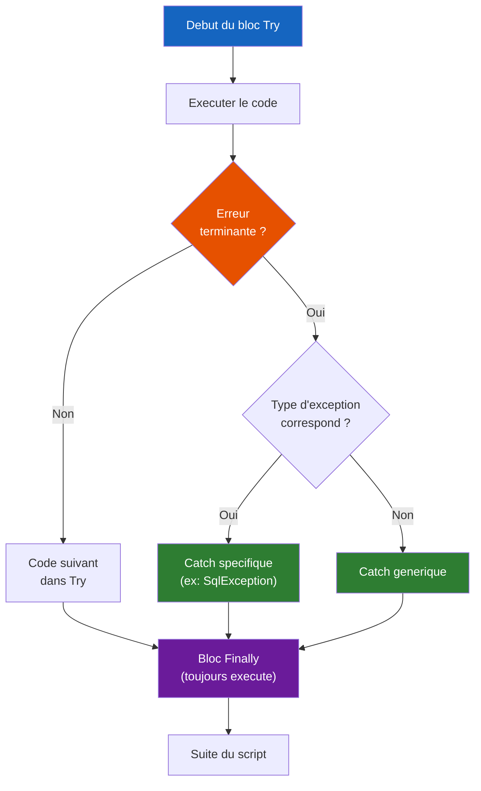

# Gestion des erreurs PowerShell

<span class="level-advanced">Avance</span> · Temps estime : 45 minutes

## Introduction

La gestion des erreurs est un aspect critique du scripting professionnel. Un script qui ne gere pas correctement les erreurs peut echouer silencieusement, corrompre des donnees ou laisser un systeme dans un etat incoherent. PowerShell distingue deux categories d'erreurs et offre plusieurs mecanismes pour les intercepter et les traiter.

## Erreurs terminantes vs non-terminantes

### Erreurs terminantes (Terminating Errors)

Les erreurs **terminantes** arretent immediatement l'execution du pipeline ou du script. Elles sont interceptees par `try/catch`.

Exemples :

- Division par zero
- Appel de methode sur un objet `$null`
- `throw` explicite
- Cmdlets avec `-ErrorAction Stop`

### Erreurs non-terminantes (Non-Terminating Errors)

Les erreurs **non-terminantes** sont signalees mais n'arretent pas l'execution. Le pipeline continue avec l'element suivant.

Exemples :

- `Get-Item` sur un chemin inexistant
- `Get-Service` sur un service absent
- Acces refuse a un fichier

```powershell
# Non-terminating error: script continues
Get-Item -Path "C:\DoesNotExist.txt"
Write-Output "This line STILL executes"

# Terminating error: script stops
throw "Critical failure"
Write-Output "This line NEVER executes"
```

!!! warning "Piege classique"

    La plupart des cmdlets PowerShell generent des erreurs **non-terminantes** par defaut. Cela signifie que `try/catch` ne les intercepte **pas** sans `-ErrorAction Stop`.

## $ErrorActionPreference

La variable `$ErrorActionPreference` definit le comportement par defaut face aux erreurs non-terminantes.

| Valeur | Comportement |
|---|---|
| `Continue` | Affiche l'erreur et continue (defaut) |
| `Stop` | Transforme en erreur terminante (interceptable par try/catch) |
| `SilentlyContinue` | Supprime l'erreur et continue |
| `Inquire` | Demande a l'utilisateur quoi faire |
| `Ignore` | Supprime completement l'erreur (meme de `$Error`) |

```powershell
# Recommended at the top of production scripts
$ErrorActionPreference = "Stop"
```

### -ErrorAction par cmdlet

Le parametre `-ErrorAction` surcharge `$ErrorActionPreference` pour une cmdlet specifique.

```powershell
# Force a non-terminating error to become terminating
Get-Item -Path "C:\DoesNotExist.txt" -ErrorAction Stop

# Suppress an expected error silently
$service = Get-Service -Name "NonExistentService" -ErrorAction SilentlyContinue
if (-not $service) {
    Write-Verbose "Service not found, installing..."
}
```

## Try / Catch / Finally



### Syntaxe de base

```powershell
try {
    # Code that might throw an error
    $result = Get-Item -Path "C:\Important.txt" -ErrorAction Stop
    $content = Get-Content -Path $result.FullName -ErrorAction Stop
}
catch {
    # Handle the error
    Write-Warning "An error occurred: $($_.Exception.Message)"
}
finally {
    # Always executes (cleanup)
    Write-Verbose "Operation completed"
}
```

### Intercepter des types d'erreurs specifiques

```powershell
try {
    $connection = New-Object System.Data.SqlClient.SqlConnection
    $connection.ConnectionString = "Server=YOURSQLSERVER;Database=master;Integrated Security=True"
    $connection.Open()
}
catch [System.Data.SqlClient.SqlException] {
    Write-Warning "SQL Server error: $($_.Exception.Message)"
}
catch [System.Net.Sockets.SocketException] {
    Write-Warning "Network error: server unreachable"
}
catch [System.UnauthorizedAccessException] {
    Write-Warning "Access denied: check permissions"
}
catch {
    # Catch-all for any other error
    Write-Warning "Unexpected error: $($_.Exception.GetType().FullName)"
    Write-Warning "Message: $($_.Exception.Message)"
}
finally {
    if ($connection.State -eq "Open") {
        $connection.Close()
    }
}
```

### L'objet erreur ($_)

Dans le bloc `catch`, la variable `$_` contient l'objet erreur avec des informations detaillees.

```powershell
catch {
    # Error message
    $_.Exception.Message

    # Full exception type
    $_.Exception.GetType().FullName

    # Inner exception (if any)
    $_.Exception.InnerException

    # Script stack trace
    $_.ScriptStackTrace

    # Invocation info (which command caused the error)
    $_.InvocationInfo.ScriptName
    $_.InvocationInfo.ScriptLineNumber
    $_.InvocationInfo.Line

    # Category info
    $_.CategoryInfo.Category
    $_.CategoryInfo.Reason
}
```

## La variable $Error

PowerShell maintient une collection `$Error` qui contient les dernieres erreurs rencontrees (par defaut les 256 dernieres).

```powershell
# View the most recent error
$Error[0]

# View the most recent error with full details
$Error[0] | Format-List * -Force

# Count of errors in the session
$Error.Count

# Clear all errors
$Error.Clear()
```

## Throw et Write-Error

### Throw

`throw` genere une erreur **terminante** qui arrete l'execution.

```powershell
function Get-ConfigFile {
    param([string]$Path)

    if (-not (Test-Path -Path $Path)) {
        throw "Configuration file not found at '$Path'"
    }

    Get-Content -Path $Path
}
```

### Write-Error

`Write-Error` genere une erreur **non-terminante** par defaut.

```powershell
function Test-Prerequisites {
    param([string]$ComputerName)

    if (-not (Test-Connection -ComputerName $ComputerName -Count 1 -Quiet)) {
        Write-Error "Cannot reach $ComputerName" -ErrorAction Stop
        # -ErrorAction Stop transforms it to terminating
    }
}
```

### Erreur personnalisee avec ErrorRecord

```powershell
function Get-UserMailbox {
    param(
        [Parameter(Mandatory)]
        [string]$Username
    )

    $user = Get-ADUser -Filter "SamAccountName -eq '$Username'" -ErrorAction SilentlyContinue

    if (-not $user) {
        $errorRecord = [System.Management.Automation.ErrorRecord]::new(
            [System.Exception]::new("User '$Username' not found in Active Directory"),
            "UserNotFound",
            [System.Management.Automation.ErrorCategory]::ObjectNotFound,
            $Username
        )
        $PSCmdlet.ThrowTerminatingError($errorRecord)
    }

    # Continue processing
}
```

## Patterns courants

### Pattern de retry

```powershell
function Invoke-WithRetry {
    [CmdletBinding()]
    param(
        [Parameter(Mandatory)]
        [scriptblock]$ScriptBlock,

        [int]$MaxRetries = 3,

        [int]$DelaySeconds = 5
    )

    $attempt = 0
    $lastError = $null

    while ($attempt -lt $MaxRetries) {
        $attempt++
        try {
            Write-Verbose "Attempt $attempt of $MaxRetries"
            $result = & $ScriptBlock
            return $result
        }
        catch {
            $lastError = $_
            Write-Warning "Attempt $attempt failed: $($_.Exception.Message)"
            if ($attempt -lt $MaxRetries) {
                Write-Verbose "Waiting $DelaySeconds seconds before retry..."
                Start-Sleep -Seconds $DelaySeconds
            }
        }
    }

    throw "Operation failed after $MaxRetries attempts. Last error: $($lastError.Exception.Message)"
}

# Usage
$data = Invoke-WithRetry -ScriptBlock {
    Invoke-RestMethod -Uri "https://api.yourservice.local/status" -TimeoutSec 10
} -MaxRetries 3 -DelaySeconds 10
```

### Pattern de journalisation des erreurs

```powershell
function Write-ErrorLog {
    param(
        [Parameter(Mandatory)]
        [System.Management.Automation.ErrorRecord]$ErrorRecord,

        [string]$LogPath = "C:\Logs\errors.log"
    )

    $logEntry = [PSCustomObject]@{
        Timestamp  = Get-Date -Format "yyyy-MM-dd HH:mm:ss"
        Message    = $ErrorRecord.Exception.Message
        Category   = $ErrorRecord.CategoryInfo.Category
        Script     = $ErrorRecord.InvocationInfo.ScriptName
        Line       = $ErrorRecord.InvocationInfo.ScriptLineNumber
        Command    = $ErrorRecord.InvocationInfo.Line.Trim()
        StackTrace = $ErrorRecord.ScriptStackTrace
    }

    $logEntry | ConvertTo-Json | Add-Content -Path $LogPath
}

# Usage in catch block
try {
    # Operations
}
catch {
    Write-ErrorLog -ErrorRecord $_
    throw  # Re-throw after logging
}
```

### Trap (alternative a try/catch)

```powershell
# Trap catches errors at the scope level (less common than try/catch)
trap [System.IO.FileNotFoundException] {
    Write-Warning "File not found: $($_.Exception.Message)"
    continue  # Resume execution after the error
}

trap {
    Write-Error "Unhandled error: $($_.Exception.Message)"
    break  # Stop execution
}
```

!!! tip "Privilegiez try/catch"

    `trap` est une construction heritee de PowerShell v1. Privilegiez `try/catch/finally` qui offre un controle plus precis et une meilleure lisibilite.

## Points cles a retenir

- Les erreurs **non-terminantes** ne sont pas interceptees par `try/catch` sans `-ErrorAction Stop`
- Utilisez `$ErrorActionPreference = "Stop"` en debut de script pour une gestion coherente
- Le bloc `finally` s'execute **toujours**, ideal pour le nettoyage (fermeture de connexions, etc.)
- Interceptez des types d'exceptions specifiques avant le `catch` generique
- La variable `$_` dans `catch` contient l'objet erreur complet (message, stack trace, source)
- Le pattern de **retry** est essentiel pour les operations reseau ou les API

## Pour aller plus loin

- Structure des scripts : [Structure de script](scripting-structure.md)
- Fonctions avancees : [Fonctions avancees](fonctions-avancees.md)
- Documentation Microsoft : About Try Catch Finally
