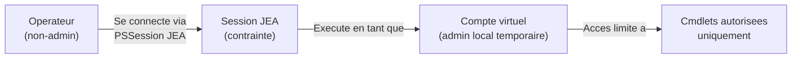
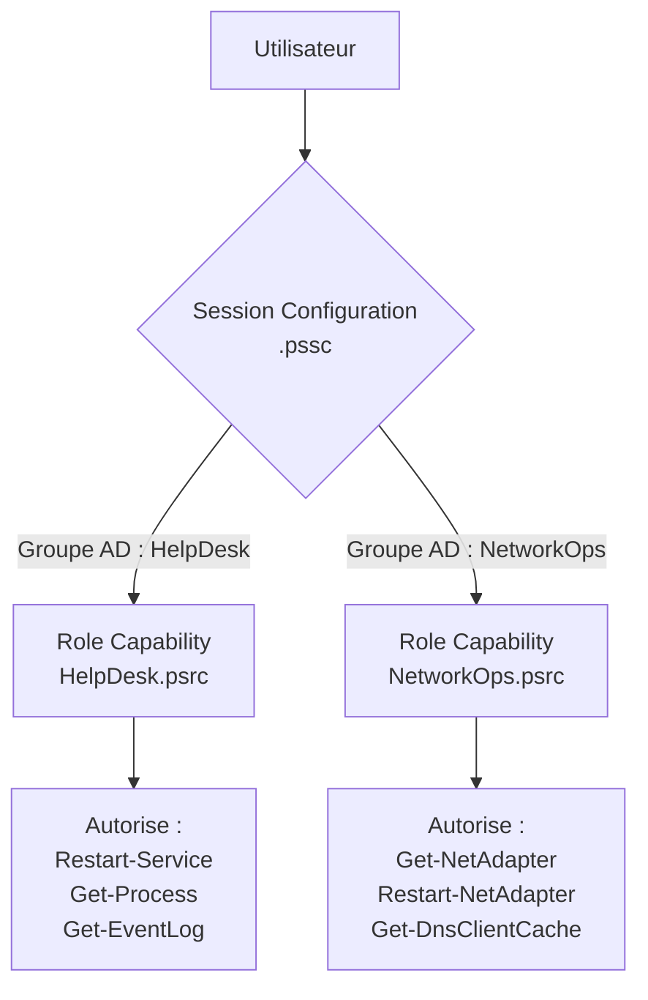

<!--
  Copyright 2026 Julien Bombled

  Licensed under the Apache License, Version 2.0 (the "License");
  you may not use this file except in compliance with the License.
  You may obtain a copy of the License at

      http://www.apache.org/licenses/LICENSE-2.0

  Unless required by applicable law or agreed to in writing, software
  distributed under the License is distributed on an "AS IS" BASIS,
  WITHOUT WARRANTIES OR CONDITIONS OF ANY KIND, either express or implied.
  See the License for the specific language governing permissions and
  limitations under the License.
-->
---
title: "Just Enough Administration (JEA)"
description: "Mettre en oeuvre JEA sous Windows Server 2022 : concept du moindre privilege, capacites de role, configurations de session et comptes virtuels."
tags:
  - automatisation
  - powershell
  - jea
  - securite
  - windows-server
---

# Just Enough Administration (JEA)

<span class="level-advanced">Avance</span> · Temps estime : 50 minutes

## Introduction

**Just Enough Administration** (JEA) est une technologie de securite PowerShell qui permet de deleguer des taches d'administration specifiques sans accorder de droits administrateur complets. JEA applique le **principe du moindre privilege** : chaque operateur n'a acces qu'aux commandes strictement necessaires a son role.

## Pourquoi JEA ?

!!! example "Analogie"

    JEA fonctionne comme le systeme de cles d'un hotel. Le client (operateur) recoit une carte magnetique qui n'ouvre que sa chambre et les espaces communs, pas les cuisines ni la salle des serveurs. Il peut utiliser la television et le minibar (cmdlets autorisees), mais pas modifier l'installation electrique (commandes administrateur). Et chaque ouverture de porte est enregistree dans un journal.

### Le probleme

En l'absence de JEA, la delegation d'administration se limite souvent a :

- Ajouter l'operateur au groupe **Administrateurs locaux** (trop de droits)
- Creer des comptes de service avec des mots de passe partages (risque securitaire)
- Accorder des droits globaux dans AD (non granulaire)

### La solution JEA



JEA cree un **endpoint PowerShell contraint** ou :

- L'utilisateur se connecte avec son compte normal (non-admin)
- La session s'execute sous un **compte virtuel** temporaire (admin local)
- L'utilisateur ne peut executer que les cmdlets **explicitement autorisees**
- Toutes les actions sont journalisees

## Architecture JEA

JEA repose sur deux fichiers de configuration :

| Fichier | Extension | Role |
|---|---|---|
| **Role Capability** | `.psrc` | Definit les commandes autorisees |
| **Session Configuration** | `.pssc` | Definit qui peut se connecter et quel role est attribue |



## Creer un fichier Role Capability (.psrc)

Le fichier `.psrc` definit les commandes qu'un role peut executer.

### Generer le fichier

```powershell
# Create a directory for JEA role capabilities
$jcaPath = "C:\ProgramData\JEA\RoleCapabilities"
New-Item -Path $jcaPath -ItemType Directory -Force

# Generate a role capability file
New-PSRoleCapabilityFile -Path "$jcaPath\HelpDeskOperator.psrc"
```

### Configurer les permissions

```powershell
# HelpDeskOperator.psrc
@{
    # Visible cmdlets (fully qualified or with parameter restrictions)
    VisibleCmdlets = @(
        # Allow full access to these cmdlets
        'Get-Service',
        'Get-Process',
        'Get-EventLog',

        # Allow Restart-Service but ONLY for specific services
        @{
            Name       = 'Restart-Service'
            Parameters = @{
                Name      = 'Name'
                ValidateSet = 'Spooler', 'W3SVC', 'WAS', 'BITS'
            }
        },

        # Allow Stop-Process but only with -Name parameter
        @{
            Name       = 'Stop-Process'
            Parameters = @{
                Name      = 'Name'
                ValidatePattern = '^(notepad|calc)$'
            }
        }
    )

    # Visible external commands (executables)
    VisibleExternalCommands = @(
        'C:\Windows\System32\ipconfig.exe',
        'C:\Windows\System32\nslookup.exe'
    )

    # Visible functions
    VisibleFunctions = @(
        'Get-HelpDeskTicket',
        'Reset-UserPassword'
    )

    # Visible PowerShell providers
    VisibleProviders = @('FileSystem')

    # Functions defined in this role
    FunctionDefinitions = @(
        @{
            Name        = 'Reset-UserPassword'
            ScriptBlock = {
                param(
                    [Parameter(Mandatory)]
                    [string]$Username
                )
                $newPassword = ConvertTo-SecureString "TempP@ss123!" -AsPlainText -Force
                Set-ADAccountPassword -Identity $Username -NewPassword $newPassword -Reset
                Set-ADUser -Identity $Username -ChangePasswordAtLogon $true
                Write-Output "Password reset for $Username. User must change at next logon."
            }
        }
    )

    # Modules to import
    ModulesToImport = @('ActiveDirectory')
}
```

!!! warning "Granularite des permissions"

    Soyez le plus restrictif possible. Autoriser `Restart-Service` sans restriction de parametre permet de redemarrer **n'importe quel** service, y compris les services critiques. Utilisez `ValidateSet` pour limiter aux services specifiques.

## Creer un fichier Session Configuration (.pssc)

Le fichier `.pssc` definit les parametres de la session JEA : qui peut se connecter, quel role est attribue, et le type de compte d'execution.

### Generer le fichier

```powershell
# Generate a session configuration file
New-PSSessionConfigurationFile -Path "C:\ProgramData\JEA\HelpDeskEndpoint.pssc"
```

### Configurer la session

```powershell
# HelpDeskEndpoint.pssc
@{
    # Session type: RestrictedRemoteServer locks down the session
    SessionType            = 'RestrictedRemoteServer'

    # Run as a virtual account (temporary local admin)
    RunAsVirtualAccount    = $true

    # Virtual account groups (determines the permissions of the virtual account)
    RunAsVirtualAccountGroups = @('Administrators')

    # Role definitions: map AD groups to role capabilities
    RoleDefinitions        = @{
        'YOURDOMAIN\HelpDesk-Operators' = @{
            RoleCapabilities = 'HelpDeskOperator'
        }
        'YOURDOMAIN\Network-Operators'  = @{
            RoleCapabilities = 'NetworkOperator'
        }
    }

    # Transcription (logging)
    TranscriptDirectory    = 'C:\ProgramData\JEA\Transcripts'

    # Language mode (NoLanguage prevents arbitrary code execution)
    LanguageMode           = 'NoLanguage'

    # Module path to search for role capabilities
    # RoleCapabilities files must be in a "RoleCapabilities" subfolder
    # of a module listed in this path
    ModulesToImport        = @()
}
```

## Comptes virtuels

Les **comptes virtuels** sont des comptes locaux temporaires crees automatiquement par JEA pour chaque session. Ils sont membres du groupe Administrateurs locaux (ou d'un autre groupe specifie) mais n'ont pas de mot de passe persistant.

| Propriete | Description |
|---|---|
| Nom | `WinRM Virtual Users\WinRM_VA_<SessionID>` |
| Duree de vie | Existe uniquement pendant la session JEA |
| Permissions | Selon `RunAsVirtualAccountGroups` |
| Mot de passe | Aucun (genere temporairement par le systeme) |
| Journalisation | Toutes les actions sont tracees avec l'identite de l'utilisateur reel |

!!! tip "gMSA comme alternative"

    Pour les scenarios ou le compte d'execution doit acceder a des ressources reseau (partages, SQL Server), utilisez un **Group Managed Service Account** (gMSA) au lieu d'un compte virtuel.

```powershell
# Using a gMSA instead of virtual account
@{
    SessionType         = 'RestrictedRemoteServer'
    RunAsVirtualAccount = $false
    GroupManagedServiceAccount = 'YOURDOMAIN\gMSA-JEA$'
    # ...
}
```

## Deployer la configuration JEA

### Structure de fichiers

```
C:\Program Files\WindowsPowerShell\Modules\
    JEA-HelpDesk\
        JEA-HelpDesk.psd1          # Module manifest
        RoleCapabilities\
            HelpDeskOperator.psrc   # Role capability file
```

### Enregistrer l'endpoint

```powershell
# Register the JEA session configuration
Register-PSSessionConfiguration -Name "HelpDeskEndpoint" `
    -Path "C:\ProgramData\JEA\HelpDeskEndpoint.pssc" `
    -Force

# Verify registration
Get-PSSessionConfiguration -Name "HelpDeskEndpoint"
```

Resultat :

```text
Name          : HelpDeskEndpoint
PSVersion     : 5.1
StartupScript :
RunAsUser     :
Permission    : NT AUTHORITY\INTERACTIVE AccessAllowed, BUILTIN\Administrators AccessAllowed,
                LAB\HelpDesk-Operators AccessAllowed
```

### Tester l'endpoint

```powershell
# Connect to the JEA endpoint as a helpdesk operator
Enter-PSSession -ComputerName "SRV01" `
    -ConfigurationName "HelpDeskEndpoint" `
    -Credential (Get-Credential -UserName "YOURDOMAIN\helpdesk-user")

# Inside the JEA session:
# List available commands
Get-Command

# Allowed command
Restart-Service -Name Spooler

# Blocked command (will fail)
Stop-Service -Name WinRM
```

Resultat (Get-Command dans la session JEA) :

```text
CommandType     Name                    Version    Source
-----------     ----                    -------    ------
Function        Clear-Host
Function        Exit-PSSession
Function        Get-Command
Function        Get-FormatData
Function        Get-Help
Function        Get-HelpDeskTicket
Function        Measure-Object
Function        Out-Default
Function        Reset-UserPassword
Function        Select-Object
Cmdlet          Get-EventLog            3.1.0.0    Microsoft.PowerShell.Management
Cmdlet          Get-Process             3.1.0.0    Microsoft.PowerShell.Management
Cmdlet          Get-Service             3.1.0.0    Microsoft.PowerShell.Management
Cmdlet          Restart-Service         3.1.0.0    Microsoft.PowerShell.Management
```

Resultat (commande bloquee) :

```text
The term 'Stop-Service' is not recognized as the name of a cmdlet, function, script file, or operable
program. Check the spelling of the name, or if a path was included, verify that the path is correct and
try again.
    + CategoryInfo          : ObjectNotFound: (Stop-Service:String) [], CommandNotFoundException
```

## Journalisation et audit

JEA enregistre automatiquement toutes les actions dans des transcriptions PowerShell.

```powershell
# View JEA transcripts
Get-ChildItem -Path "C:\ProgramData\JEA\Transcripts" -Recurse -Filter "*.txt" |
    Sort-Object LastWriteTime -Descending | Select-Object -First 5

# Check Windows Event Log for JEA connections
Get-WinEvent -LogName "Microsoft-Windows-PowerShell/Operational" -MaxEvents 20 |
    Where-Object { $_.Message -like "*JEA*" -or $_.Message -like "*session configuration*" }
```

Resultat :

```text
    Directory: C:\ProgramData\JEA\Transcripts\20260220

Mode                 LastWriteTime         Length Name
----                 -------------         ------ ----
-a----         2/20/2026  10:22 AM          3542 PowerShell_transcript.SRV-01.Random123.20260220102215.txt
-a----         2/20/2026   9:45 AM          2108 PowerShell_transcript.SRV-01.Random456.20260220094503.txt
-a----         2/19/2026   3:15 PM          4821 PowerShell_transcript.SRV-01.Random789.20260219151522.txt
```

## Gestion de l'endpoint

```powershell
# Update a JEA configuration (after modifying .pssc or .psrc files)
Register-PSSessionConfiguration -Name "HelpDeskEndpoint" `
    -Path "C:\ProgramData\JEA\HelpDeskEndpoint.pssc" `
    -Force

# Disable a JEA endpoint temporarily
Disable-PSSessionConfiguration -Name "HelpDeskEndpoint"

# Re-enable
Enable-PSSessionConfiguration -Name "HelpDeskEndpoint"

# Remove a JEA endpoint
Unregister-PSSessionConfiguration -Name "HelpDeskEndpoint"
```

## Points cles a retenir

- JEA applique le **principe du moindre privilege** en limitant les commandes disponibles
- Les fichiers `.psrc` definissent les **commandes autorisees** par role
- Les fichiers `.pssc` definissent **qui peut se connecter** et quel role est attribue
- Les **comptes virtuels** sont des administrateurs locaux temporaires (pas de mot de passe persistant)
- Utilisez `ValidateSet` et `ValidatePattern` pour restreindre les parametres des cmdlets autorisees
- Toutes les actions JEA sont **journalisees** via les transcriptions PowerShell
- Deployez les `.psrc` dans un module PowerShell sous `RoleCapabilities\`

!!! example "Scenario pratique"

    **Nadia**, responsable securite, constate que 12 operateurs du helpdesk sont membres du groupe Administrateurs locaux sur les serveurs de production. Apres un audit, elle doit restreindre leurs droits tout en leur permettant de redemarrer les services IIS et de reinitialiser les mots de passe utilisateurs.

    **Diagnostic :**

    1. Identifier les actions necessaires pour le helpdesk :
    ```powershell
    # List the commands currently used by helpdesk (from transcripts)
    Get-ChildItem "C:\PSTranscripts" -Recurse -Filter "*.txt" |
        Select-String -Pattern "^PS>" | Select-Object -First 20
    ```
    Le helpdesk utilise principalement : `Restart-Service`, `Get-Service`, `Get-EventLog`, `Set-ADAccountPassword`.

    2. Creer le fichier Role Capability :
    ```powershell
    New-PSRoleCapabilityFile -Path "C:\Program Files\WindowsPowerShell\Modules\JEA-HelpDesk\RoleCapabilities\HelpDeskOperator.psrc" `
        -VisibleCmdlets @(
            'Get-Service',
            'Get-EventLog',
            @{ Name = 'Restart-Service'; Parameters = @{ Name = 'Name'; ValidateSet = 'W3SVC', 'WAS', 'Spooler' } }
        ) `
        -ModulesToImport @('ActiveDirectory') `
        -VisibleFunctions @('Reset-UserPassword')
    ```

    3. Enregistrer et tester l'endpoint :
    ```powershell
    Register-PSSessionConfiguration -Name "HelpDeskEndpoint" `
        -Path "C:\ProgramData\JEA\HelpDeskEndpoint.pssc" -Force
    Enter-PSSession -ComputerName "SRV-01" -ConfigurationName "HelpDeskEndpoint" `
        -Credential (Get-Credential -UserName "LAB\helpdesk-user")
    ```
    Resultat :
    ```text
    [SRV-01]: PS> Get-Command | Measure-Object | Select-Object Count

    Count
    -----
       14

    [SRV-01]: PS> Restart-Service -Name W3SVC
    [SRV-01]: PS> Restart-Service -Name WinRM
    The term 'Restart-Service' cannot be used with parameter 'Name' value 'WinRM'.
    ```

    **Resolution :** Les operateurs du helpdesk sont retires du groupe Administrateurs locaux. Ils se connectent via l'endpoint JEA et ne peuvent executer que les 14 commandes autorisees. Toutes leurs actions sont journalisees dans les transcriptions.

!!! danger "Erreurs courantes"

    - **Autoriser une cmdlet sans restreindre ses parametres** : `Restart-Service` sans `ValidateSet` permet de redemarrer n'importe quel service, y compris les services critiques comme WinRM ou DNS. Restreignez toujours les parametres sensibles.
    - **Oublier le mode `RestrictedRemoteServer`** : sans `SessionType = 'RestrictedRemoteServer'`, la session JEA n'est pas verrouille et l'utilisateur peut executer du code arbitraire via le langage PowerShell complet.
    - **Ne pas placer les `.psrc` dans un dossier `RoleCapabilities`** : les fichiers Role Capability doivent etre dans un sous-dossier `RoleCapabilities\` d'un module PowerShell. Sans cette structure, JEA ne les trouve pas.
    - **Utiliser CredSSP avec JEA** : JEA utilise des comptes virtuels qui n'ont pas d'identite reseau. Pour acceder a des ressources reseau, utilisez un gMSA (Group Managed Service Account) au lieu de CredSSP.
    - **Ne pas tester l'endpoint avant le deploiement** : toujours verifier avec `Get-Command` dans la session JEA que les commandes autorisees sont correctes et que les commandes dangereuses sont bien bloquees.

## Pour aller plus loin

- PowerShell Remoting : [Remoting](remoting.md)
- Modules PowerShell : [Modules](modules.md)
- Documentation Microsoft : Just Enough Administration Overview

