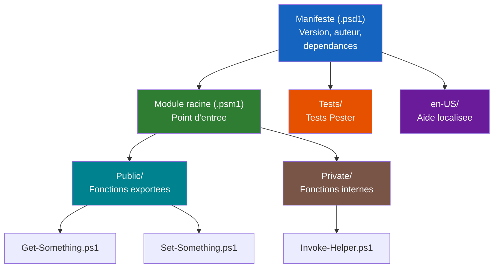

# Modules PowerShell

<span class="level-advanced">Avance</span> · Temps estime : 45 minutes

## Introduction

Un **module PowerShell** est un package reutilisable qui regroupe des fonctions, des cmdlets, des variables et des ressources. Les modules permettent d'organiser le code, de le partager et de le versionner. C'est le mecanisme standard pour distribuer des outils PowerShell.

## Types de modules

| Type | Extension | Description |
|---|---|---|
| **Module de script** | `.psm1` | Fichier de script contenant des fonctions |
| **Module binaire** | `.dll` | Assembly .NET compilee |
| **Manifeste** | `.psd1` | Metadonnees du module (version, dependances, etc.) |
| **Module DSC** | `.psm1` + schema | Ressources DSC personnalisees |

## Emplacements des modules

```powershell
# List module search paths
$env:PSModulePath -split ";"
```

| Emplacement | Portee | Chemin typique |
|---|---|---|
| Utilisateur courant | Utilisateur | `$HOME\Documents\PowerShell\Modules` |
| Tous les utilisateurs | Machine | `$env:ProgramFiles\PowerShell\Modules` |
| Systeme | Built-in | `$PSHOME\Modules` |

## Architecture d'un module



## Creer un module de script

### Structure minimale

```
MonModule/
    MonModule.psd1    # Manifeste (metadonnees)
    MonModule.psm1    # Code du module (fonctions)
```

### Structure recommandee

```
MonModule/
    MonModule.psd1         # Manifeste
    MonModule.psm1         # Point d'entree (dot-source les fichiers)
    Public/                # Fonctions exportees
        Get-Something.ps1
        Set-Something.ps1
    Private/               # Fonctions internes (non exportees)
        Invoke-Helper.ps1
    en-US/                 # Aide localisee
        about_MonModule.help.txt
    Tests/                 # Tests Pester
        MonModule.Tests.ps1
```

### Fichier .psm1 (module de script)

```powershell
# MonModule.psm1
# Dot-source all public and private function files

$publicFunctions = @(Get-ChildItem -Path "$PSScriptRoot\Public\*.ps1" -ErrorAction SilentlyContinue)
$privateFunctions = @(Get-ChildItem -Path "$PSScriptRoot\Private\*.ps1" -ErrorAction SilentlyContinue)

foreach ($function in @($publicFunctions + $privateFunctions)) {
    try {
        . $function.FullName
    }
    catch {
        Write-Error "Failed to import function $($function.FullName): $_"
    }
}

# Export only public functions
Export-ModuleMember -Function $publicFunctions.BaseName
```

### Exemple de fonction publique

```powershell
# Public/Get-ServerDiskSpace.ps1
function Get-ServerDiskSpace {
    [CmdletBinding()]
    [OutputType([PSCustomObject])]
    param(
        [Parameter(Mandatory, ValueFromPipeline)]
        [string[]]$ComputerName
    )

    process {
        foreach ($computer in $ComputerName) {
            Write-Verbose "Querying disk space on $computer"
            $disks = Get-CimInstance -ClassName Win32_LogicalDisk `
                -ComputerName $computer -Filter "DriveType = 3"

            foreach ($disk in $disks) {
                [PSCustomObject]@{
                    ComputerName = $computer
                    Drive        = $disk.DeviceID
                    SizeGB       = [math]::Round($disk.Size / 1GB, 2)
                    FreeGB       = [math]::Round($disk.FreeSpace / 1GB, 2)
                    PercentFree  = [math]::Round(($disk.FreeSpace / $disk.Size) * 100, 1)
                }
            }
        }
    }
}
```

## Manifeste de module (.psd1)

Le manifeste contient les metadonnees du module : version, auteur, dependances, fonctions exportees, etc.

### Generer un manifeste

```powershell
# Generate a new module manifest
New-ModuleManifest -Path ".\MonModule\MonModule.psd1" `
    -RootModule "MonModule.psm1" `
    -ModuleVersion "1.0.0" `
    -Author "Julien Bombled" `
    -Description "Server administration toolkit" `
    -PowerShellVersion "5.1" `
    -FunctionsToExport @("Get-ServerDiskSpace", "Get-ServerHealth") `
    -CmdletsToExport @() `
    -VariablesToExport @() `
    -AliasesToExport @() `
    -Tags @("server", "admin", "monitoring")
```

### Contenu du manifeste

```powershell
# MonModule.psd1
@{
    # Script module associated with this manifest
    RootModule        = 'MonModule.psm1'

    # Version number
    ModuleVersion     = '1.0.0'

    # Unique ID
    GUID              = 'xxxxxxxx-xxxx-xxxx-xxxx-xxxxxxxxxxxx'

    # Author
    Author            = 'Julien Bombled'

    # Description
    Description       = 'Server administration toolkit'

    # Minimum PowerShell version
    PowerShellVersion = '5.1'

    # Required modules (dependencies)
    RequiredModules   = @()

    # Functions to export (use explicit list for performance)
    FunctionsToExport = @(
        'Get-ServerDiskSpace'
        'Get-ServerHealth'
    )

    # Do not export cmdlets, variables, or aliases
    CmdletsToExport   = @()
    VariablesToExport  = @()
    AliasesToExport    = @()

    # Private data for PSGallery
    PrivateData       = @{
        PSData = @{
            Tags       = @('server', 'admin', 'monitoring')
            ProjectUri = 'https://github.com/yourname/MonModule'
            LicenseUri = 'https://github.com/yourname/MonModule/blob/main/LICENSE'
        }
    }
}
```

!!! warning "FunctionsToExport"

    Utilisez **toujours** une liste explicite dans `FunctionsToExport`. L'utilisation du wildcard `'*'` ralentit l'import du module car PowerShell doit analyser tout le code pour decouvrir les fonctions.

## Importer et utiliser un module

```powershell
# Import a module (auto-discovery from PSModulePath)
Import-Module MonModule

# Import from a specific path
Import-Module "C:\Modules\MonModule\MonModule.psd1"

# Import with verbose output (see what gets loaded)
Import-Module MonModule -Verbose

# List functions exported by a module
Get-Command -Module MonModule

# Get module info
Get-Module MonModule | Format-List *

# Remove a module from the session
Remove-Module MonModule

# Force reimport (useful during development)
Import-Module MonModule -Force
```

## Installer un module depuis la PowerShell Gallery

La **PowerShell Gallery** (PSGallery) est le depot public de modules PowerShell.

```powershell
# Search for modules
Find-Module -Name "*ActiveDirectory*" | Select-Object Name, Version, Author

# Install a module for the current user
Install-Module -Name PSWindowsUpdate -Scope CurrentUser

# Install a module for all users (requires admin)
Install-Module -Name PSWindowsUpdate -Scope AllUsers

# Update an installed module
Update-Module -Name PSWindowsUpdate

# List installed modules
Get-InstalledModule
```

### Configurer un depot prive

```powershell
# Register a private NuGet repository
Register-PSRepository -Name "InternalRepo" `
    -SourceLocation "https://nuget.yourcompany.local/v2" `
    -PublishLocation "https://nuget.yourcompany.local/v2/package" `
    -InstallationPolicy Trusted

# Install from private repo
Install-Module -Name MonModule -Repository "InternalRepo"
```

## Publier un module

### Vers la PowerShell Gallery

```powershell
# Test the module manifest
Test-ModuleManifest -Path ".\MonModule\MonModule.psd1"

# Publish to PSGallery (requires API key)
Publish-Module -Path ".\MonModule" -NuGetApiKey "YOUR-API-KEY" -Repository PSGallery
```

### Vers un depot prive

```powershell
# Publish to internal repository
Publish-Module -Path ".\MonModule" -Repository "InternalRepo" -NuGetApiKey "YOUR-KEY"
```

## Versionnement

Suivez le **Semantic Versioning** (SemVer) :

| Version | Signification | Exemple |
|---|---|---|
| `MAJOR.0.0` | Changements incompatibles | Suppression d'une fonction |
| `1.MINOR.0` | Nouvelles fonctionnalites compatibles | Ajout d'un parametre |
| `1.0.PATCH` | Corrections de bugs | Fix d'un bug |

```powershell
# Update module version in the manifest
Update-ModuleManifest -Path ".\MonModule\MonModule.psd1" -ModuleVersion "1.1.0"
```

## Points cles a retenir

- Un module regroupe des fonctions reutilisables dans un package versionne
- La structure recommandee separe les fonctions **Public** (exportees) et **Private** (internes)
- Le manifeste (`.psd1`) est obligatoire pour la publication et ameliore les performances d'import
- Listez explicitement les fonctions dans `FunctionsToExport` (jamais `'*'`)
- La PowerShell Gallery est le depot public ; configurez un depot NuGet prive pour l'entreprise
- Suivez le Semantic Versioning pour le numerotage des versions

## Pour aller plus loin

- Fonctions avancees : [Fonctions avancees](fonctions-avancees.md)
- Gestion des erreurs : [Gestion des erreurs](gestion-erreurs.md)
- Documentation Microsoft : About Modules
