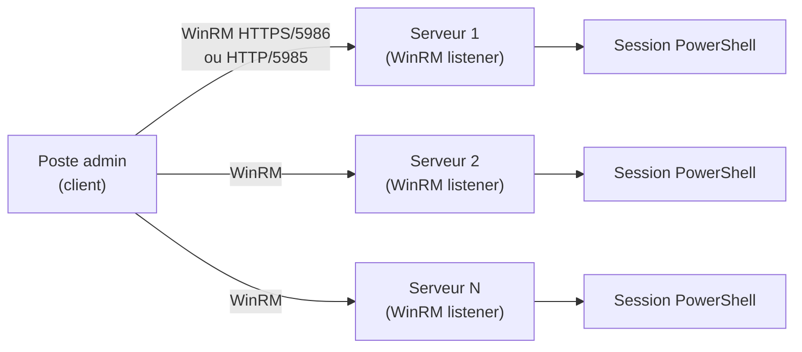

<!--
  Copyright 2026 Julien Bombled

  Licensed under the Apache License, Version 2.0 (the "License");
  you may not use this file except in compliance with the License.
  You may obtain a copy of the License at

      http://www.apache.org/licenses/LICENSE-2.0

  Unless required by applicable law or agreed to in writing, software
  distributed under the License is distributed on an "AS IS" BASIS,
  WITHOUT WARRANTIES OR CONDITIONS OF ANY KIND, either express or implied.
  See the License for the specific language governing permissions and
  limitations under the License.
-->
---
title: "PowerShell Remoting"
description: "Administrer des serveurs a distance avec PowerShell Remoting : Enable-PSRemoting, sessions interactives, Invoke-Command, sessions persistantes et double-hop."
tags:
  - automatisation
  - powershell
  - remoting
  - winrm
  - windows-server
---

# PowerShell Remoting

<span class="level-advanced">Avance</span> · Temps estime : 45 minutes

## Introduction

**PowerShell Remoting** permet d'executer des commandes sur un ou plusieurs serveurs distants a travers le protocole **WS-Management** (WinRM). C'est le mecanisme central pour l'administration a distance dans les environnements Windows Server.

!!! example "Analogie"

    PowerShell Remoting fonctionne comme un systeme de telephone interne dans une grande entreprise. Depuis votre bureau (poste admin), vous pouvez appeler n'importe quel bureau (serveur) pour demander qu'une action soit effectuee. `Enter-PSSession` est un appel telephonique classique (conversation en temps reel), tandis que `Invoke-Command` est comme envoyer un meme message vocal a 50 bureaux en meme temps -- chacun execute l'instruction et vous renvoie le resultat.

## Architecture



| Composant | Role |
|---|---|
| **WinRM** | Service Windows qui implemente WS-Management |
| **Listener** | Point d'ecoute HTTP (5985) ou HTTPS (5986) |
| **Session** | Environnement PowerShell isole sur le serveur distant |

## Activer le Remoting

### Sur le serveur cible

```powershell
# Enable PowerShell Remoting (creates WinRM listener, configures firewall)
Enable-PSRemoting -Force

# Verify WinRM service is running
Get-Service -Name WinRM

# Verify listener configuration
Get-WSManInstance -ResourceURI winrm/config/listener -Enumerate
```

Resultat (Get-Service) :

```text
Status   Name               DisplayName
------   ----               -----------
Running  WinRM              Windows Remote Management (WS-Manag...
```

Resultat (Get-WSManInstance) :

```text
cfg                   : http://schemas.microsoft.com/wbem/wsman/1/config/listener
xsi                   : http://www.w3.org/2001/XMLSchema-instance
Source                : GPO
lang                  : en-US
Address               : *
Transport             : HTTP
Port                  : 5985
Hostname              :
Enabled               : true
URLPrefix             : wsman
CertificateThumbprint :
ListeningOn           : {10.0.0.10, 127.0.0.1, ::1}
```

!!! tip "Windows Server et le Remoting"

    Sur Windows Server 2022, le Remoting est **active par defaut** pour les profils reseau de domaine et prives. Sur les postes de travail, il doit etre active manuellement.

### Configuration avancee

```powershell
# Configure WinRM via Group Policy or manually
Set-Item WSMan:\localhost\Client\TrustedHosts -Value "*.yourdomain.local" -Force

# Set maximum concurrent sessions
Set-Item WSMan:\localhost\Shell\MaxConcurrentUsers -Value 10

# Set session timeout (in milliseconds, default: 7200000 = 2h)
Set-Item WSMan:\localhost\Shell\IdleTimeout -Value 3600000

# Configure HTTPS listener (requires a certificate)
New-WSManInstance -ResourceURI winrm/config/Listener `
    -SelectorSet @{Address="*"; Transport="HTTPS"} `
    -ValueSet @{CertificateThumbprint="YOUR_CERT_THUMBPRINT"}
```

### Configuration du pare-feu

```powershell
# Verify firewall rules for WinRM
Get-NetFirewallRule -Name "WINRM*" | Format-Table Name, Enabled, Direction, Action

# Enable WinRM firewall rules
Enable-NetFirewallRule -Name "WINRM-HTTP-In-TCP"
```

Resultat :

```text
Name                  Enabled Direction Action
----                  ------- --------- ------
WINRM-HTTP-In-TCP        True   Inbound  Allow
WINRM-HTTP-In-TCP-Public True   Inbound  Allow
```

## Session interactive (Enter-PSSession)

`Enter-PSSession` ouvre une session PowerShell interactive sur un serveur distant, similaire a SSH.

```powershell
# Connect to a remote server
Enter-PSSession -ComputerName "SRV01"

# With explicit credentials
$cred = Get-Credential -UserName "YOURDOMAIN\admin"
Enter-PSSession -ComputerName "SRV01" -Credential $cred

# Via HTTPS
Enter-PSSession -ComputerName "SRV01" -UseSSL

# Disconnect from the session
Exit-PSSession
```

!!! info "Prompt modifie"

    Lorsque vous etes dans une session distante, le prompt PowerShell affiche le nom du serveur : `[SRV01]: PS C:\Users\admin>`. Toutes les commandes sont executees sur le serveur distant.

## Execution a distance (Invoke-Command)

`Invoke-Command` est la cmdlet principale pour executer des commandes sur un ou plusieurs serveurs distants.

### Sur un seul serveur

```powershell
# Execute a command on a remote server
Invoke-Command -ComputerName "SRV01" -ScriptBlock {
    Get-Service -Name W3SVC
}
```

### Sur plusieurs serveurs en parallele

```powershell
# Execute on multiple servers simultaneously (default: 32 in parallel)
$servers = @("SRV01", "SRV02", "SRV03", "SRV04")

Invoke-Command -ComputerName $servers -ScriptBlock {
    [PSCustomObject]@{
        Hostname  = $env:COMPUTERNAME
        OS        = (Get-CimInstance Win32_OperatingSystem).Caption
        Uptime    = (Get-Date) - (Get-CimInstance Win32_OperatingSystem).LastBootUpTime
        FreeMemGB = [math]::Round((Get-CimInstance Win32_OperatingSystem).FreePhysicalMemory / 1MB, 2)
    }
} | Format-Table -AutoSize
```

Resultat :

```text
Hostname  OS                                       Uptime             FreeMemGB
--------  --                                       ------             ---------
SRV-01    Microsoft Windows Server 2022 Datacenter 14.03:22:15.234    5.82
SRV-02    Microsoft Windows Server 2022 Datacenter  7.11:45:02.118    3.47
SRV-03    Microsoft Windows Server 2022 Datacenter 28.18:10:33.456    8.15
SRV-04    Microsoft Windows Server 2022 Datacenter  2.06:33:48.891    6.23
```

### Passer des variables locales

```powershell
# Using -ArgumentList
$serviceName = "W3SVC"
Invoke-Command -ComputerName "SRV01" -ScriptBlock {
    param($svc)
    Get-Service -Name $svc
} -ArgumentList $serviceName

# Using $using: scope modifier (simpler)
$serviceName = "W3SVC"
Invoke-Command -ComputerName "SRV01" -ScriptBlock {
    Get-Service -Name $using:serviceName
}
```

!!! tip "Preferer `$using:`"

    La syntaxe `$using:variable` est plus lisible que `-ArgumentList` et evite les problemes d'ordre des parametres. Elle est disponible depuis PowerShell 3.0.

### Copier des fichiers via des sessions

```powershell
# Copy a file to a remote server
$session = New-PSSession -ComputerName "SRV01"
Copy-Item -Path "C:\Local\script.ps1" -Destination "C:\Remote\" -ToSession $session

# Copy a file from a remote server
Copy-Item -Path "C:\Remote\logs.zip" -Destination "C:\Local\" -FromSession $session

Remove-PSSession $session
```

### Limiter le parallelisme

```powershell
# Limit to 5 concurrent connections (default is 32)
Invoke-Command -ComputerName $servers -ScriptBlock {
    # Heavy operation
} -ThrottleLimit 5
```

## Sessions persistantes (PSSessions)

Les sessions persistantes maintiennent une connexion ouverte, ce qui permet de reutiliser l'etat (variables, modules charges) entre plusieurs commandes.

```powershell
# Create persistent sessions
$sessions = New-PSSession -ComputerName "SRV01", "SRV02", "SRV03"

# Execute commands using existing sessions
Invoke-Command -Session $sessions -ScriptBlock {
    $data = Get-Process | Measure-Object WorkingSet64 -Sum
}

# Execute another command (variables from previous call are still available)
Invoke-Command -Session $sessions -ScriptBlock {
    Write-Output "Total memory: $([math]::Round($data.Sum / 1GB, 2)) GB"
}

# List active sessions
Get-PSSession

# Remove sessions when done
Remove-PSSession $sessions
```

Resultat (Get-PSSession) :

```text
 Id Name            ComputerName    ComputerType    State     ConfigurationName     Availability
 -- ----            ------------    ------------    -----     -----------------     ------------
  1 WinRM1          SRV-01          RemoteMachine   Opened    Microsoft.PowerShell     Available
  2 WinRM2          SRV-02          RemoteMachine   Opened    Microsoft.PowerShell     Available
  3 WinRM3          DC-01           RemoteMachine   Opened    Microsoft.PowerShell     Available
```

### Sessions deconnectees

```powershell
# Create a disconnectable session
$session = New-PSSession -ComputerName "SRV01" -Name "LongTask"

# Start a long-running job
Invoke-Command -Session $session -ScriptBlock {
    # Long operation
    Start-Sleep -Seconds 3600
} -InDisconnectedSession

# Later, reconnect to the session
$session = Get-PSSession -ComputerName "SRV01" -Name "LongTask"
Connect-PSSession -Session $session

# Receive results
Receive-PSSession -Session $session
```

## Le probleme du double-hop

### Description du probleme

Le **double-hop** se produit lorsque vous vous connectez a un serveur A, et que depuis A vous tentez d'acceder a un serveur B. Par defaut, vos identifiants ne sont pas transmis au-dela du premier hop.


### Solutions

#### CredSSP (simple mais moins securise)

```powershell
# On the client
Enable-WSManCredSSP -Role Client -DelegateComputer "SRV01.yourdomain.local" -Force

# On the intermediate server
Enable-WSManCredSSP -Role Server -Force

# Connect with CredSSP
$cred = Get-Credential
Invoke-Command -ComputerName "SRV01" -Credential $cred -Authentication CredSSP -ScriptBlock {
    Get-ChildItem "\\FILESERVER\Share"
}
```

!!! danger "Securite de CredSSP"

    CredSSP envoie les identifiants en clair au serveur intermediaire. Si ce serveur est compromis, les identifiants sont exposes. Privilegiez la delegation Kerberos contrainte.

#### Delegation Kerberos contrainte (Resource-Based)

```powershell
# Allow SRV01 to delegate credentials to FILESERVER on behalf of the user
$serverA = Get-ADComputer -Identity "SRV01"
$serverB = Get-ADComputer -Identity "FILESERVER"

Set-ADComputer -Identity $serverB `
    -PrincipalsAllowedToDelegateToAccount $serverA

# Verify
Get-ADComputer -Identity "FILESERVER" -Properties PrincipalsAllowedToDelegateToAccount
```

#### Session imbriquee avec identifiants explicites

```powershell
# Pass credentials explicitly inside the remote session
$cred = Get-Credential
Invoke-Command -ComputerName "SRV01" -ScriptBlock {
    # Use the passed credentials for the second hop
    Invoke-Command -ComputerName "FILESERVER" -Credential $using:cred -ScriptBlock {
        Get-ChildItem "\\FILESERVER\Share"
    }
}
```

## Securite et bonnes pratiques

| Pratique | Recommandation |
|---|---|
| Protocole | Utiliser HTTPS (port 5986) en production |
| Authentification | Kerberos (domaine) ou certificats |
| TrustedHosts | Limiter aux serveurs necessaires |
| Sessions | Fermer les sessions apres utilisation |
| Double-hop | Delegation Kerberos contrainte (pas CredSSP) |
| Journalisation | Activer la transcription PowerShell |

```powershell
# Enable PowerShell transcription via GPO or locally
Set-ItemProperty -Path "HKLM:\SOFTWARE\Policies\Microsoft\Windows\PowerShell\Transcription" `
    -Name "EnableTranscripting" -Value 1 -Type DWord
Set-ItemProperty -Path "HKLM:\SOFTWARE\Policies\Microsoft\Windows\PowerShell\Transcription" `
    -Name "OutputDirectory" -Value "C:\PSTranscripts" -Type String
```

## Points cles a retenir

- PowerShell Remoting utilise **WinRM** (ports 5985/5986) et est active par defaut sur Windows Server
- `Enter-PSSession` pour les sessions interactives, `Invoke-Command` pour l'execution a distance
- `$using:` permet de passer des variables locales dans le scriptblock distant
- Les **sessions persistantes** conservent l'etat entre les appels
- Le **double-hop** necessite une solution de delegation (Kerberos contrainte recommandee)
- Toujours fermer les sessions apres utilisation avec `Remove-PSSession`

!!! example "Scenario pratique"

    **Antoine**, ingenieur systeme, doit collecter la liste des mises a jour installees sur 30 serveurs du domaine `lab.local`. Il utilise `Enter-PSSession` sur chaque serveur un par un, ce qui lui prend plus d'une heure.

    **Diagnostic :**

    1. Utiliser `Invoke-Command` pour interroger tous les serveurs en parallele :
    ```powershell
    $servers = (Get-ADComputer -Filter 'OperatingSystem -like "*Server*"' -SearchBase "OU=Servers,DC=lab,DC=local").Name
    $servers.Count
    ```
    Resultat :
    ```text
    30
    ```

    2. Executer la collecte en parallele avec `Invoke-Command` :
    ```powershell
    $updates = Invoke-Command -ComputerName $servers -ScriptBlock {
        Get-HotFix | Sort-Object InstalledOn -Descending | Select-Object -First 5
    } -ThrottleLimit 10

    $updates | Sort-Object PSComputerName, InstalledOn -Descending |
        Format-Table PSComputerName, HotFixID, InstalledOn -AutoSize
    ```
    Resultat :
    ```text
    PSComputerName HotFixID   InstalledOn
    -------------- --------   -----------
    DC-01          KB5034439  2/10/2026 12:00:00 AM
    DC-01          KB5033914  1/15/2026 12:00:00 AM
    SRV-01         KB5034439  2/10/2026 12:00:00 AM
    SRV-01         KB5033914  1/15/2026 12:00:00 AM
    SRV-02         KB5034439  2/10/2026 12:00:00 AM
    ...
    ```

    3. Identifier les serveurs en retard de mises a jour :
    ```powershell
    $updates | Group-Object PSComputerName | ForEach-Object {
        $latest = ($_.Group | Sort-Object InstalledOn -Descending)[0]
        [PSCustomObject]@{
            Server     = $_.Name
            LatestKB   = $latest.HotFixID
            InstalledOn = $latest.InstalledOn
        }
    } | Where-Object { $_.InstalledOn -lt (Get-Date).AddDays(-30) } | Format-Table -AutoSize
    ```
    Resultat :
    ```text
    Server LatestKB  InstalledOn
    ------ --------  -----------
    SRV-08 KB5031358 12/12/2025 12:00:00 AM
    SRV-15 KB5031358 12/12/2025 12:00:00 AM
    ```

    **Resolution :** En utilisant `Invoke-Command` avec `-ThrottleLimit 10`, Antoine collecte les informations de 30 serveurs en moins de 2 minutes au lieu d'une heure. Il identifie immediatement les serveurs non conformes.

!!! danger "Erreurs courantes"

    - **Oublier de fermer les sessions (`Remove-PSSession`)** : chaque session ouverte consomme des ressources sur le serveur distant. Les sessions orphelines s'accumulent et peuvent atteindre la limite de connexions simultanees (25 par defaut).
    - **Utiliser `$variable` au lieu de `$using:variable`** : dans un scriptblock distant, les variables locales ne sont pas accessibles. Il faut utiliser `$using:variable` ou `-ArgumentList` pour les transmettre.
    - **Ne pas limiter le parallelisme** : par defaut, `Invoke-Command` ouvre 32 connexions simultanees. Sur un reseau sature ou avec des serveurs peu performants, utilisez `-ThrottleLimit 5` ou `-ThrottleLimit 10`.
    - **Ignorer le probleme du double-hop** : acceder a un partage reseau depuis un serveur distant echoue silencieusement. La delegation Kerberos contrainte est la solution recommandee (pas CredSSP).
    - **Utiliser HTTP au lieu de HTTPS en production** : le port 5985 (HTTP) ne chiffre pas les communications. Configurez toujours un listener HTTPS (port 5986) avec un certificat valide pour les environnements de production.

## Pour aller plus loin

- Just Enough Administration : [JEA](jea.md)
- Gestion des erreurs : [Gestion des erreurs](gestion-erreurs.md)
- Documentation Microsoft : About Remote

