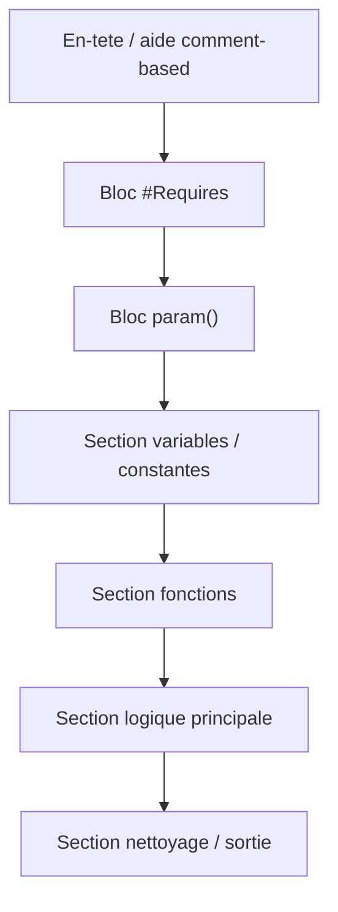

# Structure d'un script PowerShell

<span class="level-advanced">Avance</span> · Temps estime : 40 minutes

## Introduction

Un script PowerShell bien structure est plus facile a lire, a maintenir et a deboguer. Ce chapitre presente les bonnes pratiques pour organiser un script professionnel, depuis les en-tetes jusqu'aux codes de sortie.

## Anatomie d'un script

!!! example "Analogie"

    Pensez a un script PowerShell comme a une recette de cuisine professionnelle : il y a d'abord la liste des ingredients (parametres), puis les ustensiles necessaires (modules requis), les etapes preparatoires (variables), les instructions de cuisson (logique principale) et enfin le nettoyage du plan de travail (bloc finally). Sans cette structure, meme un bon cuisinier produit un resultat imprevisible.

Un script PowerShell bien organise suit une structure logique :



## En-tete et aide basee sur les commentaires

L'en-tete fournit une documentation integree accessible via `Get-Help`.

```powershell
<#
.SYNOPSIS
    Brief description of what the script does.

.DESCRIPTION
    Detailed description of the script functionality,
    including prerequisites and expected behavior.

.PARAMETER ServerName
    The target server name or FQDN.

.PARAMETER LogPath
    Path to the log file. Defaults to C:\Logs.

.EXAMPLE
    .\Deploy-Application.ps1 -ServerName "SRV01" -LogPath "D:\Logs"
    Deploys the application to SRV01 with custom log path.

.EXAMPLE
    .\Deploy-Application.ps1 -ServerName "SRV01","SRV02"
    Deploys the application to multiple servers.

.NOTES
    Version: 1.0.0
    Author:  Julien Bombled
#>
```

```powershell
# After saving the script, access help with:
Get-Help .\Deploy-Application.ps1 -Full
Get-Help .\Deploy-Application.ps1 -Examples
```

Resultat :

```text
NAME
    C:\Scripts\Deploy-Application.ps1

SYNOPSIS
    Brief description of what the script does.

SYNTAX
    C:\Scripts\Deploy-Application.ps1 [-ServerName] <String[]> [-LogPath <String>] [<CommonParameters>]

DESCRIPTION
    Detailed description of the script functionality,
    including prerequisites and expected behavior.

PARAMETERS
    -ServerName <String[]>
        The target server name or FQDN.

    -LogPath <String>
        Path to the log file. Defaults to C:\Logs.

EXAMPLES
    .\Deploy-Application.ps1 -ServerName "SRV01" -LogPath "D:\Logs"
    Deploys the application to SRV01 with custom log path.
```

## Directive #Requires

La directive `#Requires` garantit que le script ne s'execute que si les conditions sont remplies.

```powershell
#Requires -Version 5.1
#Requires -RunAsAdministrator
#Requires -Modules ActiveDirectory, DhcpServer
```

Resultat (si une condition n'est pas remplie) :

```text
The script 'Deploy-Application.ps1' cannot be run because the following modules that are specified by the
#Requires statements of the script are missing: DhcpServer.
    + CategoryInfo          : ResourceUnavailable: (Deploy-Application.ps1:String) [], ScriptRequiresException
    + FullyQualifiedErrorId : ScriptRequiresMissingModules
```

| Directive | Description |
|---|---|
| `-Version` | Version minimale de PowerShell requise |
| `-RunAsAdministrator` | Le script doit etre lance en tant qu'administrateur |
| `-Modules` | Modules PowerShell requis (installes) |
| `-PSEdition` | Edition requise (Desktop ou Core) |

!!! tip "Echec immediat"

    Si une condition `#Requires` n'est pas remplie, le script **ne se lance pas** du tout. C'est preferable a une erreur en pleine execution.

## Bloc param

Le bloc `param()` definit les parametres du script. Il doit etre la **premiere instruction executable** (apres les commentaires et `#Requires`).

```powershell
[CmdletBinding()]
param(
    [Parameter(Mandatory, Position = 0, HelpMessage = "Target server name or FQDN")]
    [ValidateNotNullOrEmpty()]
    [string[]]$ServerName,

    [Parameter()]
    [ValidateScript({ Test-Path -Path $_ -PathType Container })]
    [string]$LogPath = "C:\Logs",

    [Parameter()]
    [ValidateSet("Install", "Update", "Remove")]
    [string]$Action = "Install",

    [Parameter()]
    [switch]$WhatIf,

    [Parameter()]
    [switch]$Force
)
```

### Attributs de validation courants

| Attribut | Description | Exemple |
|---|---|---|
| `[ValidateNotNullOrEmpty()]` | Refuse les valeurs nulles ou vides | Parametres obligatoires |
| `[ValidateSet()]` | Limite aux valeurs specifiees | Choix d'action |
| `[ValidateRange()]` | Plage numerique autorisee | `[ValidateRange(1, 100)]` |
| `[ValidatePattern()]` | Regex de validation | `[ValidatePattern("^SRV")]` |
| `[ValidateScript()]` | Script de validation personnalise | Verifier qu'un chemin existe |
| `[ValidateLength()]` | Longueur de chaine | `[ValidateLength(1, 15)]` |

## Regions

Les regions permettent d'organiser visuellement le code et de plier/deplier des sections dans l'editeur.

```powershell
#region Variables
$timestamp = Get-Date -Format "yyyyMMdd-HHmmss"
$logFile = Join-Path -Path $LogPath -ChildPath "deploy-$timestamp.log"
$exitCode = 0
#endregion

#region Functions
function Write-Log {
    param(
        [string]$Message,
        [ValidateSet("INFO", "WARNING", "ERROR")]
        [string]$Level = "INFO"
    )
    $entry = "[{0}] [{1}] {2}" -f (Get-Date -Format "yyyy-MM-dd HH:mm:ss"), $Level, $Message
    Add-Content -Path $logFile -Value $entry
    switch ($Level) {
        "WARNING" { Write-Warning $Message }
        "ERROR"   { Write-Error $Message }
        default   { Write-Verbose $Message }
    }
}
#endregion

#region Main Logic
# Script body goes here
#endregion

#region Cleanup
# Cleanup operations go here
#endregion
```

## Codes de sortie

Les codes de sortie permettent aux scripts appelants (ou aux planificateurs de taches) de savoir si le script a reussi ou echoue.

```powershell
# Convention: 0 = success, non-zero = error
$exitCode = 0

try {
    # Main logic here
    Write-Log -Message "Operation completed successfully"
}
catch {
    Write-Log -Message "Critical error: $_" -Level "ERROR"
    $exitCode = 1
}
finally {
    # Cleanup operations
    Write-Log -Message "Script finished with exit code $exitCode"
    exit $exitCode
}
```

### Conventions de codes de sortie

| Code | Signification |
|---|---|
| `0` | Succes |
| `1` | Erreur generale |
| `2` | Erreur de parametres |
| `3` | Prerequis manquant |
| `10+` | Erreurs specifiques a l'application |

```powershell
# Check exit code from a called script
& .\Deploy-Application.ps1 -ServerName "SRV01"
if ($LASTEXITCODE -ne 0) {
    Write-Error "Deployment failed with exit code $LASTEXITCODE"
}
```

Resultat :

```text
Deployment failed with exit code 3
    + CategoryInfo          : NotSpecified: (:) [Write-Error], WriteErrorException
    + FullyQualifiedErrorId : Microsoft.PowerShell.Commands.WriteErrorException
```

## Template complet

Voici un template reutilisable pour les scripts d'administration :

```powershell
<#
.SYNOPSIS
    Brief description of the script.

.DESCRIPTION
    Detailed description of the script.

.PARAMETER TargetServer
    The target server name.

.EXAMPLE
    .\Script-Template.ps1 -TargetServer "SRV01"
    Runs the script against SRV01.

.NOTES
    Version: 1.0.0
    Author:  Julien Bombled
#>

#Requires -Version 5.1

[CmdletBinding(SupportsShouldProcess)]
param(
    [Parameter(Mandatory, Position = 0)]
    [ValidateNotNullOrEmpty()]
    [string[]]$TargetServer,

    [Parameter()]
    [string]$LogPath = "C:\Logs"
)

#region Variables
Set-StrictMode -Version Latest
$ErrorActionPreference = "Stop"
$timestamp = Get-Date -Format "yyyyMMdd-HHmmss"
$scriptName = [System.IO.Path]::GetFileNameWithoutExtension($MyInvocation.MyCommand.Name)
$logFile = Join-Path -Path $LogPath -ChildPath "$scriptName-$timestamp.log"
$exitCode = 0
#endregion

#region Functions
function Write-Log {
    param(
        [Parameter(Mandatory)]
        [string]$Message,

        [ValidateSet("INFO", "WARNING", "ERROR")]
        [string]$Level = "INFO"
    )
    $entry = "[{0}] [{1}] {2}" -f (Get-Date -Format "yyyy-MM-dd HH:mm:ss"), $Level, $Message
    Add-Content -Path $logFile -Value $entry
    switch ($Level) {
        "WARNING" { Write-Warning $Message }
        "ERROR"   { Write-Error $Message -ErrorAction Continue }
        default   { Write-Verbose $Message }
    }
}
#endregion

#region Initialization
if (-not (Test-Path -Path $LogPath)) {
    New-Item -Path $LogPath -ItemType Directory -Force | Out-Null
}
Write-Log -Message "Script started. Target: $($TargetServer -join ', ')"
#endregion

#region Main Logic
try {
    foreach ($server in $TargetServer) {
        Write-Log -Message "Processing $server"

        if ($PSCmdlet.ShouldProcess($server, "Perform operation")) {
            # Core logic here
            Write-Log -Message "Completed processing $server"
        }
    }
}
catch {
    Write-Log -Message "Critical error: $($_.Exception.Message)" -Level "ERROR"
    Write-Log -Message "Stack trace: $($_.ScriptStackTrace)" -Level "ERROR"
    $exitCode = 1
}
#endregion

#region Cleanup
finally {
    Write-Log -Message "Script completed with exit code $exitCode"
    exit $exitCode
}
#endregion
```

## Bonnes pratiques

### Nommage

| Element | Convention | Exemple |
|---|---|---|
| Script | Verbe-Nom (PascalCase) | `Deploy-Application.ps1` |
| Fonctions | Verbe-Nom approuve | `Get-ServerStatus` |
| Variables | camelCase ou PascalCase | `$serverName`, `$LogPath` |
| Parametres | PascalCase | `-ServerName`, `-LogPath` |
| Constantes | SCREAMING_SNAKE_CASE | Non conventionnel en PS, utiliser `$script:MaxRetries` |

```powershell
# List approved verbs
Get-Verb | Sort-Object Verb
```

Resultat :

```text
Verb        AliasPrefix Group          Description
----        ----------- -----          -----------
Add         a           Common         Adds a resource to a container
Approve     ap          Lifecycle      Confirms or agrees to the status of a resource
Clear       cl          Common         Removes all the resources from a container
Close       cs          Common         Changes the state of a resource to make it inaccessible
Compare     cr          Data           Evaluates the data from one resource against data from another
...
```

### Autres recommandations

- Utilisez `Set-StrictMode -Version Latest` pour detecter les variables non declarees
- Preferez `$ErrorActionPreference = "Stop"` pour transformer les erreurs non terminantes en terminantes
- Utilisez `[CmdletBinding()]` meme dans les scripts simples (active `-Verbose`, `-Debug`, etc.)
- Evitez les alias dans les scripts (utilisez `Where-Object` au lieu de `?`, `ForEach-Object` au lieu de `%`)

!!! warning "Alias et lisibilite"

    Les alias (`%`, `?`, `select`, `ft`) rendent les scripts moins lisibles et peuvent ne pas etre disponibles dans tous les environnements (PowerShell Core sur Linux). Ecrivez toujours les noms complets des cmdlets dans les scripts.

## Points cles a retenir

- L'aide comment-based (`.SYNOPSIS`, `.DESCRIPTION`, `.EXAMPLE`) rend le script auto-documente
- `#Requires` empeche l'execution si les conditions ne sont pas remplies
- Le bloc `param()` avec les attributs de validation garantit des entrees correctes
- Les **regions** organisent le code visuellement dans l'editeur
- Utilisez des **codes de sortie** conventionnels (0 = succes)
- Adoptez un template standard pour la coherence entre vos scripts

!!! example "Scenario pratique"

    **Sophie**, administratrice systeme, doit deployer un script de sauvegarde sur 15 serveurs Windows Server 2022. Le script fonctionne lorsqu'elle le lance manuellement, mais echoue systematiquement lorsqu'il est planifie via le Task Scheduler.

    **Diagnostic :**

    1. Verifier la structure du script -- pas de bloc `param()` ni de `#Requires` :
    ```powershell
    Get-Help C:\Scripts\Backup-Server.ps1 -Full
    ```
    Resultat :
    ```text
    NAME
        C:\Scripts\Backup-Server.ps1
    SYNOPSIS
    DESCRIPTION
    PARAMETERS
        <None>
    ```
    Le script n'a aucune aide ni parametrisation.

    2. Ajouter la structure professionnelle au script :
    ```powershell
    #Requires -Version 5.1
    #Requires -RunAsAdministrator
    #Requires -Modules ServerManager

    [CmdletBinding()]
    param(
        [Parameter(Mandatory)]
        [string[]]$ServerName,
        [string]$LogPath = "C:\Logs"
    )

    Set-StrictMode -Version Latest
    $ErrorActionPreference = "Stop"
    $exitCode = 0
    ```

    3. Tester le code de sortie pour le Task Scheduler :
    ```powershell
    & C:\Scripts\Backup-Server.ps1 -ServerName "SRV-01"
    Write-Output "Exit code: $LASTEXITCODE"
    ```
    Resultat :
    ```text
    Exit code: 0
    ```

    **Resolution :** Le script restructure avec `#Requires -RunAsAdministrator` et un code de sortie explicite permet au Task Scheduler de detecter les echecs et de relancer la tache automatiquement.

!!! danger "Erreurs courantes"

    - **Oublier `[CmdletBinding()]`** : sans cet attribut, le script ne supporte pas `-Verbose`, `-Debug` ni `-ErrorAction`. Ajoutez-le systematiquement, meme pour les scripts simples.
    - **Placer du code avant le bloc `param()`** : le bloc `param()` doit etre la premiere instruction executable du script (apres les commentaires et `#Requires`). Toute ligne de code avant `param()` provoque une erreur de syntaxe.
    - **Utiliser des alias dans les scripts** : `%`, `?`, `select`, `ft` peuvent ne pas exister sur PowerShell Core Linux. Ecrivez `ForEach-Object`, `Where-Object`, `Select-Object`, `Format-Table`.
    - **Ne pas definir de code de sortie** : sans `exit $exitCode`, le Task Scheduler recoit toujours 0, meme en cas d'echec. Le planificateur ne peut alors pas distinguer succes et echec.
    - **Ignorer `Set-StrictMode`** : sans ce reglage, les fautes de frappe dans les noms de variables passent inapercues et provoquent des comportements imprevisibles.

## Pour aller plus loin

- Fonctions avancees : [Fonctions avancees](fonctions-avancees.md)
- Gestion des erreurs : [Gestion des erreurs](gestion-erreurs.md)
- Documentation Microsoft : About Scripts
