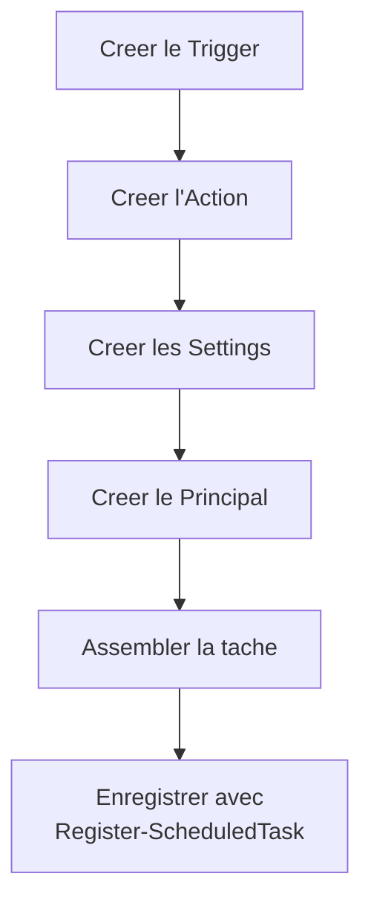

# Gestion des taches planifiees via PowerShell

<span class="level-advanced">Avance</span> · Temps estime : 45 minutes

## Introduction

La gestion des taches planifiees via PowerShell offre un controle complet et scriptable, indispensable pour les deployements automatises et la gestion a grande echelle. Le module `ScheduledTasks` fournit les cmdlets necessaires pour creer, configurer, surveiller et supprimer des taches.

## Cmdlets principales

```powershell
# List all ScheduledTasks cmdlets
Get-Command -Module ScheduledTasks | Format-Table Name, CommandType
```

| Cmdlet | Role |
|---|---|
| `New-ScheduledTaskTrigger` | Creer un declencheur |
| `New-ScheduledTaskAction` | Creer une action |
| `New-ScheduledTaskSettingsSet` | Creer un jeu de parametres |
| `New-ScheduledTaskPrincipal` | Creer un contexte d'execution |
| `New-ScheduledTask` | Assembler une tache (non enregistree) |
| `Register-ScheduledTask` | Enregistrer la tache dans le systeme |
| `Get-ScheduledTask` | Lister les taches |
| `Get-ScheduledTaskInfo` | Informations d'execution |
| `Set-ScheduledTask` | Modifier une tache existante |
| `Start-ScheduledTask` | Demarrer manuellement une tache |
| `Stop-ScheduledTask` | Arreter une tache en cours |
| `Enable-ScheduledTask` | Activer une tache desactivee |
| `Disable-ScheduledTask` | Desactiver une tache |
| `Unregister-ScheduledTask` | Supprimer une tache |

## Creer une tache planifiee

### Workflow de creation



### Exemple complet : sauvegarde quotidienne

```powershell
# Step 1: Create the trigger (daily at 10:00 PM)
$trigger = New-ScheduledTaskTrigger -Daily -At "22:00"

# Step 2: Create the action (run a PowerShell script)
$action = New-ScheduledTaskAction `
    -Execute "powershell.exe" `
    -Argument "-ExecutionPolicy Bypass -NoProfile -File `"C:\Scripts\Backup-Server.ps1`"" `
    -WorkingDirectory "C:\Scripts"

# Step 3: Create the settings
$settings = New-ScheduledTaskSettingsSet `
    -AllowStartIfOnBatteries `
    -DontStopIfGoingOnBatteries `
    -StartWhenAvailable `
    -RunOnlyIfNetworkAvailable `
    -RestartCount 3 `
    -RestartInterval (New-TimeSpan -Minutes 5) `
    -ExecutionTimeLimit (New-TimeSpan -Hours 2)

# Step 4: Create the principal (run as SYSTEM with highest privileges)
$principal = New-ScheduledTaskPrincipal `
    -UserId "SYSTEM" `
    -LogonType ServiceAccount `
    -RunLevel Highest

# Step 5: Register the task
Register-ScheduledTask `
    -TaskName "Daily-ServerBackup" `
    -TaskPath "\CustomTasks\" `
    -Trigger $trigger `
    -Action $action `
    -Settings $settings `
    -Principal $principal `
    -Description "Daily server backup executed at 10:00 PM"
```

### Exemple : tache hebdomadaire

```powershell
# Weekly trigger (every Sunday at 3:00 AM)
$trigger = New-ScheduledTaskTrigger `
    -Weekly `
    -DaysOfWeek Sunday `
    -At "03:00"

$action = New-ScheduledTaskAction `
    -Execute "powershell.exe" `
    -Argument "-ExecutionPolicy Bypass -NoProfile -File `"C:\Scripts\Weekly-Maintenance.ps1`""

Register-ScheduledTask `
    -TaskName "Weekly-Maintenance" `
    -TaskPath "\CustomTasks\" `
    -Trigger $trigger `
    -Action $action `
    -User "SYSTEM" `
    -RunLevel Highest
```

### Exemple : tache sur evenement

```powershell
# Trigger on a specific Windows event
# Event ID 4625 = failed logon attempt in Security log
$CIMTriggerClass = Get-CimClass -ClassName MSFT_TaskEventTrigger -Namespace Root/Microsoft/Windows/TaskScheduler
$trigger = New-CimInstance -CimClass $CIMTriggerClass -ClientOnly
$trigger.Subscription = @"
<QueryList>
  <Query Id="0" Path="Security">
    <Select Path="Security">*[System[EventID=4625]]</Select>
  </Query>
</QueryList>
"@
$trigger.Enabled = $true

$action = New-ScheduledTaskAction `
    -Execute "powershell.exe" `
    -Argument "-ExecutionPolicy Bypass -NoProfile -File `"C:\Scripts\Alert-FailedLogon.ps1`""

Register-ScheduledTask `
    -TaskName "Alert-FailedLogon" `
    -TaskPath "\SecurityTasks\" `
    -Trigger $trigger `
    -Action $action `
    -User "SYSTEM" `
    -RunLevel Highest
```

### Exemple : tache au demarrage avec delai

```powershell
# Trigger at system startup with a 5-minute delay
$trigger = New-ScheduledTaskTrigger -AtStartup
$trigger.Delay = "PT5M"  # ISO 8601 duration: 5 minutes

$action = New-ScheduledTaskAction `
    -Execute "powershell.exe" `
    -Argument "-ExecutionPolicy Bypass -NoProfile -File `"C:\Scripts\Startup-Check.ps1`""

Register-ScheduledTask `
    -TaskName "Startup-HealthCheck" `
    -TaskPath "\CustomTasks\" `
    -Trigger $trigger `
    -Action $action `
    -User "SYSTEM" `
    -RunLevel Highest
```

### Exemple : tache repetitive (toutes les 4 heures)

```powershell
# Trigger every 4 hours, starting from midnight
$trigger = New-ScheduledTaskTrigger `
    -Once `
    -At "00:00" `
    -RepetitionInterval (New-TimeSpan -Hours 4) `
    -RepetitionDuration (New-TimeSpan -Days 365)

$action = New-ScheduledTaskAction `
    -Execute "powershell.exe" `
    -Argument "-ExecutionPolicy Bypass -NoProfile -File `"C:\Scripts\Monitor-DiskSpace.ps1`""

Register-ScheduledTask `
    -TaskName "Monitor-DiskSpace" `
    -TaskPath "\Monitoring\" `
    -Trigger $trigger `
    -Action $action `
    -User "SYSTEM"
```

## Consulter les taches

```powershell
# List all scheduled tasks
Get-ScheduledTask | Format-Table TaskName, TaskPath, State

# List tasks in a specific folder
Get-ScheduledTask -TaskPath "\CustomTasks\" | Format-Table TaskName, State

# Get detailed task information
Get-ScheduledTask -TaskName "Daily-ServerBackup" | Format-List *

# Get execution history information
Get-ScheduledTaskInfo -TaskName "Daily-ServerBackup" | Format-List *
```

### Verifier l'etat de toutes les taches personnalisees

```powershell
# Overview of all custom tasks
Get-ScheduledTask -TaskPath "\CustomTasks\*" | ForEach-Object {
    $info = Get-ScheduledTaskInfo -TaskName $_.TaskName -TaskPath $_.TaskPath
    [PSCustomObject]@{
        Name       = $_.TaskName
        State      = $_.State
        LastRun    = $info.LastRunTime
        LastResult = switch ($info.LastTaskResult) {
            0          { "Success" }
            267009     { "Running" }
            267014     { "Terminated" }
            2147942401 { "Path not found" }
            default    { "Error: $($info.LastTaskResult)" }
        }
        NextRun    = $info.NextRunTime
    }
} | Format-Table -AutoSize
```

## Modifier une tache

```powershell
# Change the trigger time
$newTrigger = New-ScheduledTaskTrigger -Daily -At "23:00"
Set-ScheduledTask -TaskName "Daily-ServerBackup" -TaskPath "\CustomTasks\" -Trigger $newTrigger

# Disable a task
Disable-ScheduledTask -TaskName "Daily-ServerBackup" -TaskPath "\CustomTasks\"

# Enable a task
Enable-ScheduledTask -TaskName "Daily-ServerBackup" -TaskPath "\CustomTasks\"

# Change the execution account
Set-ScheduledTask -TaskName "Daily-ServerBackup" -TaskPath "\CustomTasks\" `
    -User "YOURDOMAIN\svc-backup" -Password "YOUR_PASSWORD"
```

## Demarrer et arreter

```powershell
# Start a task manually
Start-ScheduledTask -TaskName "Daily-ServerBackup" -TaskPath "\CustomTasks\"

# Stop a running task
Stop-ScheduledTask -TaskName "Daily-ServerBackup" -TaskPath "\CustomTasks\"
```

## Supprimer une tache

```powershell
# Remove a scheduled task (with confirmation)
Unregister-ScheduledTask -TaskName "Daily-ServerBackup" -TaskPath "\CustomTasks\" -Confirm

# Remove without confirmation
Unregister-ScheduledTask -TaskName "Daily-ServerBackup" -TaskPath "\CustomTasks\" -Confirm:$false
```

## Gestion a distance

```powershell
# Create a task on a remote server
$session = New-CimSession -ComputerName "SRV01"

Register-ScheduledTask `
    -CimSession $session `
    -TaskName "Remote-DiskCheck" `
    -TaskPath "\Monitoring\" `
    -Trigger (New-ScheduledTaskTrigger -Daily -At "08:00") `
    -Action (New-ScheduledTaskAction -Execute "powershell.exe" -Argument "-File C:\Scripts\Check.ps1") `
    -User "SYSTEM"

# List tasks on a remote server
Get-ScheduledTask -CimSession $session -TaskPath "\Monitoring\"

Remove-CimSession $session
```

## Exporter et importer des taches

```powershell
# Export a task to XML
$task = Get-ScheduledTask -TaskName "Daily-ServerBackup" -TaskPath "\CustomTasks\"
Export-ScheduledTask -TaskName $task.TaskName -TaskPath $task.TaskPath | Out-File "C:\Backup\Daily-ServerBackup.xml"

# Import a task from XML (register on another server)
$xml = Get-Content -Path "C:\Backup\Daily-ServerBackup.xml" -Raw
Register-ScheduledTask -TaskName "Daily-ServerBackup" -TaskPath "\CustomTasks\" -Xml $xml -User "SYSTEM"
```

!!! tip "Portabilite"

    L'export XML permet de versionner les taches planifiees dans un depot Git et de les deployer de maniere repetable sur plusieurs serveurs.

## Bonnes pratiques

| Pratique | Recommandation |
|---|---|
| Organisation | Utiliser des TaskPath personnalises (`\CustomTasks\`, `\Monitoring\`) |
| Compte d'execution | SYSTEM ou gMSA (eviter les comptes avec mot de passe) |
| Journalisation | Activer l'historique et ajouter du logging dans les scripts |
| Timeout | Definir `ExecutionTimeLimit` pour eviter les taches bloquees |
| Erreurs | Configurer `RestartCount` et `RestartInterval` |
| Documentation | Description detaillee dans chaque tache |

## Points cles a retenir

- PowerShell offre un controle complet sur les taches planifiees via le module `ScheduledTasks`
- Le workflow de creation suit l'ordre : Trigger > Action > Settings > Principal > Register
- `Start-ScheduledTask` permet de tester une tache manuellement
- `Get-ScheduledTaskInfo` fournit l'historique d'execution (derniere execution, resultat)
- L'export XML permet le versionnement et le deploiement a grande echelle
- Privilegiez **SYSTEM** ou un **gMSA** comme compte d'execution

## Pour aller plus loin

- Task Scheduler GUI : [Task Scheduler](task-scheduler.md)
- PowerShell Remoting : [Remoting](../powershell-avance/remoting.md)
- Documentation Microsoft : ScheduledTasks Module
