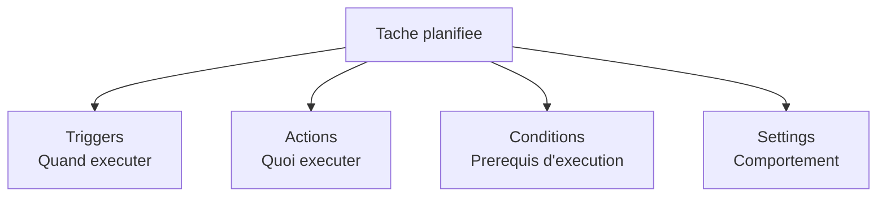
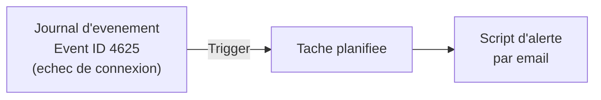

# Task Scheduler (Planificateur de taches)

!!! info "Niveau : avance | Temps estime : 40 minutes"

## Introduction

Le **Planificateur de taches** (Task Scheduler) est un composant natif de Windows qui permet d'executer automatiquement des programmes, des scripts ou des commandes selon un calendrier ou en reponse a un evenement. C'est un outil fondamental pour l'automatisation de l'administration Windows Server.

## Acceder au Planificateur de taches

```powershell
# Open Task Scheduler GUI
taskschd.msc

# Or via Server Manager > Tools > Task Scheduler
```

## Architecture d'une tache planifiee

Chaque tache planifiee se compose de quatre elements :



## Triggers (declencheurs)

Un trigger definit **quand** la tache doit s'executer. Une tache peut avoir plusieurs triggers.

### Types de triggers

| Trigger | Description | Cas d'usage |
|---|---|---|
| **On a schedule** | Heure fixe (once, daily, weekly, monthly) | Sauvegardes nocturnes |
| **At startup** | Au demarrage du systeme | Services personnalises |
| **At log on** | A la connexion d'un utilisateur | Scripts de profil |
| **On idle** | Lorsque le systeme est inactif | Maintenance legere |
| **On an event** | En reponse a un evenement Windows | Alertes, remediations |
| **At task creation/modification** | A la creation de la tache | Tests immediats |
| **On connection to user session** | Connexion RDP/console | Personnalisation session |
| **On disconnect from user session** | Deconnexion de session | Nettoyage |
| **On workstation lock/unlock** | Verrouillage/deverrouillage | Securite |

### Trigger base sur un evenement



Via l'interface graphique :

1. Onglet **Triggers** > **New**
2. Begin the task: **On an event**
3. Log: **Security**
4. Source: **Microsoft-Windows-Security-Auditing**
5. Event ID: **4625**

## Actions

Une action definit **ce que** la tache execute. Les types d'actions disponibles :

| Type | Description | Exemple |
|---|---|---|
| **Start a program** | Lancer un executable ou un script | `powershell.exe -File C:\Scripts\backup.ps1` |
| **Send an e-mail** | Envoyer un email (obsolete depuis Server 2012) | Remplace par script PowerShell |
| **Display a message** | Afficher un message (obsolete) | Remplace par notification |

!!! warning "Actions obsoletes"

    Les actions "Send an e-mail" et "Display a message" sont obsoletes depuis Windows Server 2012. Utilisez un script PowerShell avec `Send-MailMessage` ou une notification alternative.

### Configurer une action PowerShell

Pour executer un script PowerShell, configurez l'action ainsi :

| Champ | Valeur |
|---|---|
| Program/script | `powershell.exe` |
| Add arguments | `-ExecutionPolicy Bypass -NoProfile -File "C:\Scripts\backup.ps1"` |
| Start in | `C:\Scripts` |

!!! tip "ExecutionPolicy et NoProfile"

    Utilisez `-ExecutionPolicy Bypass` pour eviter les problemes de politique d'execution et `-NoProfile` pour un demarrage plus rapide (le profil utilisateur n'est pas charge).

## Conditions

Les conditions definissent des **prerequis** pour l'execution de la tache.

| Condition | Description |
|---|---|
| **Idle** | Executer uniquement si l'ordinateur est inactif |
| **Power** | Executer uniquement sur alimentation secteur (pas sur batterie) |
| **Network** | Executer uniquement si une connexion reseau specifique est disponible |
| **Wake** | Reveiller l'ordinateur pour executer la tache |

## Settings (parametres)

Les settings controlent le **comportement** de la tache.

| Parametre | Description | Valeur recommandee |
|---|---|---|
| **Allow demand start** | Autoriser le lancement manuel | Active |
| **Run task as soon as possible after missed start** | Executer si un horaire est manque | Active (pour les sauvegardes) |
| **Restart on failure** | Redemarre si la tache echoue | Active (1-3 tentatives) |
| **Stop task if runs longer than** | Timeout | 1-4 heures selon la tache |
| **Do not start a new instance** | Empeche les executions paralleles | Active |

### Politique d'instances

| Option | Comportement si la tache est deja en cours |
|---|---|
| **Do not start a new instance** | La nouvelle execution est ignoree |
| **Run a new instance in parallel** | Les deux executions s'executent en parallele |
| **Queue a new instance** | La nouvelle execution attend la fin de la precedente |
| **Stop the existing instance** | L'execution en cours est arretee, la nouvelle demarre |

## Historique des taches

### Activer l'historique

L'historique des taches est desactive par defaut sur Windows Server. Pour l'activer :

1. Dans Task Scheduler, cliquer sur **Task Scheduler Library** dans le volet gauche
2. Dans le volet Actions (droite), cliquer sur **Enable All Tasks History**

```powershell
# Enable task history via command line
wevtutil set-log Microsoft-Windows-TaskScheduler/Operational /enabled:true
```

### Consulter l'historique

```powershell
# View recent task scheduler events
Get-WinEvent -LogName "Microsoft-Windows-TaskScheduler/Operational" -MaxEvents 50 |
    Format-Table TimeCreated, Id, Message -Wrap
```

## Taches d'administration courantes

### Exemples de taches typiques

| Tache | Frequence | Script |
|---|---|---|
| Sauvegarde system state | Quotidien (22h) | `wbadmin start systemstatebackup` |
| Nettoyage des logs | Hebdomadaire | Script PowerShell de rotation |
| Verification espace disque | Toutes les 4h | Script de monitoring |
| Redemarrage de service | Sur evenement | `Restart-Service` |
| Rapport de conformite | Mensuel (1er du mois) | Script d'audit |
| Nettoyage des profils temporaires | Hebdomadaire | Script de cleanup |

### Creer une tache via l'interface graphique

1. Ouvrir **Task Scheduler** > **Create Task** (pas "Create Basic Task" qui est limite)
2. Onglet **General** :
    - Nom descriptif
    - Description detaillee
    - **Run whether user is logged on or not**
    - **Run with highest privileges** (si droits admin necessaires)
    - Configure for: **Windows Server 2022**
3. Onglet **Triggers** : definir le declencheur
4. Onglet **Actions** : definir l'action (script PowerShell)
5. Onglet **Conditions** : ajuster si necessaire
6. Onglet **Settings** : configurer le comportement

!!! warning "Run whether user is logged on or not"

    Cette option est indispensable pour les taches serveur. Sans elle, la tache ne s'execute que si l'utilisateur est connecte. L'activation de cette option demande le mot de passe du compte d'execution.

### Contexte d'execution

| Compte | Usage | Securite |
|---|---|---|
| **SYSTEM** | Taches systeme locales | Droits complets sur la machine locale |
| **Network Service** | Taches avec acces reseau | Droits limites, identite machine sur le reseau |
| **Compte de service dedie** | Taches applicatives | Moindre privilege recommande |
| **gMSA** | Taches automatisees sans mot de passe | Mot de passe gere par AD |

```powershell
# Create a gMSA for scheduled tasks
New-ADServiceAccount -Name "gMSA-Tasks" `
    -DNSHostName "gMSA-Tasks.yourdomain.local" `
    -PrincipalsAllowedToRetrieveManagedPassword "SRV01$"

# Install the gMSA on the server
Install-ADServiceAccount -Identity "gMSA-Tasks"
```

## Points cles a retenir

- Le Planificateur de taches est l'outil natif pour l'automatisation recurrente sur Windows Server
- Chaque tache se compose de **triggers**, **actions**, **conditions** et **settings**
- Utilisez **Run whether user is logged on or not** pour les taches serveur
- Activez l'**historique** (desactive par defaut) pour le suivi et le diagnostic
- Privilegiez les **gMSA** ou le compte **SYSTEM** plutot que des comptes utilisateur avec mot de passe
- Utilisez `-ExecutionPolicy Bypass -NoProfile` pour les actions PowerShell

## Pour aller plus loin

- Gestion via PowerShell : [Gestion PowerShell](gestion-powershell.md)
- Documentation Microsoft : Task Scheduler Overview
