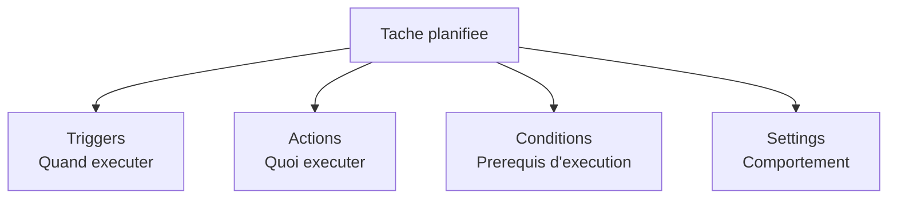
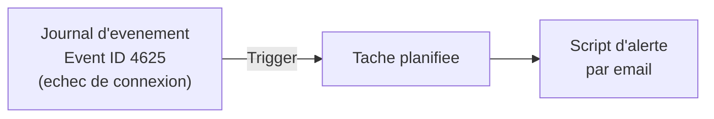

<!--
  Copyright 2026 Julien Bombled

  Licensed under the Apache License, Version 2.0 (the "License");
  you may not use this file except in compliance with the License.
  You may obtain a copy of the License at

      http://www.apache.org/licenses/LICENSE-2.0

  Unless required by applicable law or agreed to in writing, software
  distributed under the License is distributed on an "AS IS" BASIS,
  WITHOUT WARRANTIES OR CONDITIONS OF ANY KIND, either express or implied.
  See the License for the specific language governing permissions and
  limitations under the License.
-->

# Task Scheduler (Planificateur de taches)

<span class="level-advanced">Avance</span> · Temps estime : 40 minutes

## Introduction

Le **Planificateur de taches** (Task Scheduler) est un composant natif de Windows qui permet d'executer automatiquement des programmes, des scripts ou des commandes selon un calendrier ou en reponse a un evenement. C'est un outil fondamental pour l'automatisation de l'administration Windows Server.

## Acceder au Planificateur de taches

```powershell
# Open Task Scheduler GUI
taskschd.msc

# Or via Server Manager > Tools > Task Scheduler
```

## Architecture d'une tache planifiee

Chaque tache planifiee se compose de quatre elements :



!!! example "Analogie"

    Le Planificateur de taches, c'est comme un agenda electronique pour votre serveur. Vous y notez : "tous les jours a 22h, lance le script de sauvegarde" ou "chaque fois qu'une alarme specifique sonne dans les journaux, envoie une alerte". Le serveur execute ces instructions automatiquement, meme quand personne n'est connecte.

## Triggers (declencheurs)

Un trigger definit **quand** la tache doit s'executer. Une tache peut avoir plusieurs triggers.

### Types de triggers

| Trigger | Description | Cas d'usage |
|---|---|---|
| **On a schedule** | Heure fixe (once, daily, weekly, monthly) | Sauvegardes nocturnes |
| **At startup** | Au demarrage du systeme | Services personnalises |
| **At log on** | A la connexion d'un utilisateur | Scripts de profil |
| **On idle** | Lorsque le systeme est inactif | Maintenance legere |
| **On an event** | En reponse a un evenement Windows | Alertes, remediations |
| **At task creation/modification** | A la creation de la tache | Tests immediats |
| **On connection to user session** | Connexion RDP/console | Personnalisation session |
| **On disconnect from user session** | Deconnexion de session | Nettoyage |
| **On workstation lock/unlock** | Verrouillage/deverrouillage | Securite |

### Trigger base sur un evenement



Via l'interface graphique :

1. Onglet **Triggers** > **New**
2. Begin the task: **On an event**
3. Log: **Security**
4. Source: **Microsoft-Windows-Security-Auditing**
5. Event ID: **4625**

## Actions

Une action definit **ce que** la tache execute. Les types d'actions disponibles :

| Type | Description | Exemple |
|---|---|---|
| **Start a program** | Lancer un executable ou un script | `powershell.exe -File C:\Scripts\backup.ps1` |
| **Send an e-mail** | Envoyer un email (obsolete depuis Server 2012) | Remplace par script PowerShell |
| **Display a message** | Afficher un message (obsolete) | Remplace par notification |

!!! warning "Actions obsoletes"

    Les actions "Send an e-mail" et "Display a message" sont obsoletes depuis Windows Server 2012. Utilisez un script PowerShell avec `Send-MailMessage` ou une notification alternative.

### Configurer une action PowerShell

Pour executer un script PowerShell, configurez l'action ainsi :

| Champ | Valeur |
|---|---|
| Program/script | `powershell.exe` |
| Add arguments | `-ExecutionPolicy Bypass -NoProfile -File "C:\Scripts\backup.ps1"` |
| Start in | `C:\Scripts` |

!!! tip "ExecutionPolicy et NoProfile"

    Utilisez `-ExecutionPolicy Bypass` pour eviter les problemes de politique d'execution et `-NoProfile` pour un demarrage plus rapide (le profil utilisateur n'est pas charge).

## Conditions

Les conditions definissent des **prerequis** pour l'execution de la tache.

| Condition | Description |
|---|---|
| **Idle** | Executer uniquement si l'ordinateur est inactif |
| **Power** | Executer uniquement sur alimentation secteur (pas sur batterie) |
| **Network** | Executer uniquement si une connexion reseau specifique est disponible |
| **Wake** | Reveiller l'ordinateur pour executer la tache |

## Settings (parametres)

Les settings controlent le **comportement** de la tache.

| Parametre | Description | Valeur recommandee |
|---|---|---|
| **Allow demand start** | Autoriser le lancement manuel | Active |
| **Run task as soon as possible after missed start** | Executer si un horaire est manque | Active (pour les sauvegardes) |
| **Restart on failure** | Redemarre si la tache echoue | Active (1-3 tentatives) |
| **Stop task if runs longer than** | Timeout | 1-4 heures selon la tache |
| **Do not start a new instance** | Empeche les executions paralleles | Active |

### Politique d'instances

| Option | Comportement si la tache est deja en cours |
|---|---|
| **Do not start a new instance** | La nouvelle execution est ignoree |
| **Run a new instance in parallel** | Les deux executions s'executent en parallele |
| **Queue a new instance** | La nouvelle execution attend la fin de la precedente |
| **Stop the existing instance** | L'execution en cours est arretee, la nouvelle demarre |

## Historique des taches

### Activer l'historique

L'historique des taches est desactive par defaut sur Windows Server. Pour l'activer :

1. Dans Task Scheduler, cliquer sur **Task Scheduler Library** dans le volet gauche
2. Dans le volet Actions (droite), cliquer sur **Enable All Tasks History**

```powershell
# Enable task history via command line
wevtutil set-log Microsoft-Windows-TaskScheduler/Operational /enabled:true
```

Resultat :

```text
(La commande ne produit pas de sortie si elle reussit. Le journal est desormais actif.)
```

### Consulter l'historique

```powershell
# View recent task scheduler events
Get-WinEvent -LogName "Microsoft-Windows-TaskScheduler/Operational" -MaxEvents 50 |
    Format-Table TimeCreated, Id, Message -Wrap
```

Resultat :

```text
TimeCreated             Id  Message
-----------             --  -------
20/02/2026 22:00:01    102  Task Scheduler successfully finished "{CustomTasks}\Daily-ServerBackup" ...
20/02/2026 22:00:00    100  Task Scheduler launched action "powershell.exe" in instance ...
20/02/2026 21:00:01    102  Task Scheduler successfully finished "{CustomTasks}\Daily-ServerBackup" ...
19/02/2026 22:05:13    110  Task Scheduler failed to start instance of "\CustomTasks\Monitor-DiskSpace" task for user "SYSTEM". ...
19/02/2026 22:05:00    100  Task Scheduler launched action "powershell.exe" in instance ...
```

## Taches d'administration courantes

### Exemples de taches typiques

| Tache | Frequence | Script |
|---|---|---|
| Sauvegarde system state | Quotidien (22h) | `wbadmin start systemstatebackup` |
| Nettoyage des logs | Hebdomadaire | Script PowerShell de rotation |
| Verification espace disque | Toutes les 4h | Script de monitoring |
| Redemarrage de service | Sur evenement | `Restart-Service` |
| Rapport de conformite | Mensuel (1er du mois) | Script d'audit |
| Nettoyage des profils temporaires | Hebdomadaire | Script de cleanup |

### Creer une tache via l'interface graphique

1. Ouvrir **Task Scheduler** > **Create Task** (pas "Create Basic Task" qui est limite)
2. Onglet **General** :
    - Nom descriptif
    - Description detaillee
    - **Run whether user is logged on or not**
    - **Run with highest privileges** (si droits admin necessaires)
    - Configure for: **Windows Server 2022**
3. Onglet **Triggers** : definir le declencheur
4. Onglet **Actions** : definir l'action (script PowerShell)
5. Onglet **Conditions** : ajuster si necessaire
6. Onglet **Settings** : configurer le comportement

!!! warning "Run whether user is logged on or not"

    Cette option est indispensable pour les taches serveur. Sans elle, la tache ne s'execute que si l'utilisateur est connecte. L'activation de cette option demande le mot de passe du compte d'execution.

### Contexte d'execution

| Compte | Usage | Securite |
|---|---|---|
| **SYSTEM** | Taches systeme locales | Droits complets sur la machine locale |
| **Network Service** | Taches avec acces reseau | Droits limites, identite machine sur le reseau |
| **Compte de service dedie** | Taches applicatives | Moindre privilege recommande |
| **gMSA** | Taches automatisees sans mot de passe | Mot de passe gere par AD |

```powershell
# Create a gMSA for scheduled tasks
New-ADServiceAccount -Name "gMSA-Tasks" `
    -DNSHostName "gMSA-Tasks.yourdomain.local" `
    -PrincipalsAllowedToRetrieveManagedPassword "SRV01$"

# Install the gMSA on the server
Install-ADServiceAccount -Identity "gMSA-Tasks"
```

Resultat :

```text
(New-ADServiceAccount ne produit pas de sortie en cas de succes)

AccountName : gMSA-Tasks
ObjectClass : msDS-GroupManagedServiceAccount
(Install-ADServiceAccount retourne True si l'installation est reussie)
```

!!! example "Scenario pratique"

    **Contexte :** Marc administre SRV-01, un serveur de fichiers chez un cabinet comptable. Le lundi matin, les collaborateurs signalent regulierement que le lecteur reseau est lent ou indisponible. Apres investigation, Marc constate que le script de sauvegarde nocturne tourne encore le matin car il n'est pas limite dans le temps et que le disque est plein.

    **Probleme :** La tache de sauvegarde n'a pas de timeout et aucune protection contre les executions paralleles.

    **Solution :** Marc reconfigure la tache via l'interface graphique :

    1. Dans Task Scheduler, naviguer vers la tache `Daily-FileServerBackup`
    2. Onglet **Settings** :
        - Cocher **Stop the task if it runs longer than** : `3 hours`
        - Selectionner **Do not start a new instance** pour la politique d'instances
        - Cocher **Run task as soon as possible after a scheduled start is missed**
    3. Onglet **General** :
        - Verifier que **Run whether user is logged on or not** est coche
        - Remplacer le compte de service par `lab\svc-backup` (compte dedie avec droits minimaux)

    Il ajoute aussi une verification dans le script lui-meme :

    ```powershell
    # Check free disk space before starting backup
    $freePct = (Get-PSDrive C).Free / ((Get-PSDrive C).Used + (Get-PSDrive C).Free) * 100
    if ($freePct -lt 15) {
        Write-EventLog -LogName Application -Source "BackupScript" -EventId 1001 `
            -EntryType Warning -Message "Backup aborted: less than 15% free on C: ($([math]::Round($freePct,1))%)"
        exit 1
    }
    ```

    Apres ces modifications, la tache s'arrete automatiquement si elle depasse 3 heures, et une nouvelle instance ne demarre jamais tant que la precedente est en cours.

!!! danger "Erreurs courantes"

    **Tache qui ne s'execute pas quand personne n'est connecte** — L'option **Run whether user is logged on or not** n'est pas cochee. Sur un serveur, cette option est indispensable. Son activation demande la saisie du mot de passe du compte de service.

    **Script PowerShell bloque par la politique d'execution** — Sans `-ExecutionPolicy Bypass` dans les arguments de la tache, le script peut etre bloque si la politique systeme est `Restricted` ou `AllSigned`. Ajoutez toujours `-ExecutionPolicy Bypass -NoProfile`.

    **Executions paralleles non voulues** — Si la tache prend plus de temps que prevu (sauvegarde lente, reseau lent), une nouvelle instance peut demarrer avant la fin de la precedente. Configurez **Do not start a new instance** et definissez un timeout avec **Stop the task if it runs longer than**.

    **Historique desactive** — Par defaut, l'historique des taches est desactive sur Windows Server. Sans lui, il est impossible de savoir si une tache s'est bien executee ou a echoue. Activez-le des la mise en production (`wevtutil set-log ... /enabled:true`).

    **Compte SYSTEM sans acces reseau** — Le compte SYSTEM a des droits complets en local, mais il ne peut pas acceder aux partages reseau avec son identite. Pour les taches necessitant un acces reseau, utilisez le compte **Network Service** ou un compte de service dedie.

## Points cles a retenir

- Le Planificateur de taches est l'outil natif pour l'automatisation recurrente sur Windows Server
- Chaque tache se compose de **triggers**, **actions**, **conditions** et **settings**
- Utilisez **Run whether user is logged on or not** pour les taches serveur
- Activez l'**historique** (desactive par defaut) pour le suivi et le diagnostic
- Privilegiez les **gMSA** ou le compte **SYSTEM** plutot que des comptes utilisateur avec mot de passe
- Utilisez `-ExecutionPolicy Bypass -NoProfile` pour les actions PowerShell

## Pour aller plus loin

- Gestion via PowerShell : [Gestion PowerShell](gestion-powershell.md)
- Documentation Microsoft : Task Scheduler Overview

