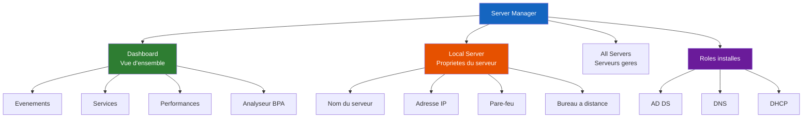

<!--
  Copyright 2026 Julien Bombled

  Licensed under the Apache License, Version 2.0 (the "License");
  you may not use this file except in compliance with the License.
  You may obtain a copy of the License at

      http://www.apache.org/licenses/LICENSE-2.0

  Unless required by applicable law or agreed to in writing, software
  distributed under the License is distributed on an "AS IS" BASIS,
  WITHOUT WARRANTIES OR CONDITIONS OF ANY KIND, either express or implied.
  See the License for the specific language governing permissions and
  limitations under the License.
-->
---
title: Server Manager
description: Utilisation de Server Manager pour administrer Windows Server 2022.
tags:
  - fondamentaux
  - console
  - debutant
---

# Server Manager

<span class="level-beginner">Debutant</span> · Temps estime : 15 minutes

## Presentation

!!! example "Analogie"

    Server Manager est le tableau de bord de votre voiture. D'un coup d'oeil, vous voyez la vitesse
    (performances), le niveau d'essence (espace disque), les voyants d'alerte (evenements) et vous
    pouvez acceder a tous les reglages du vehicule. Comme un tableau de bord, il centralise les
    informations essentielles en un seul endroit.

Server Manager est la console d'administration centrale de Windows Server Desktop Experience. Il se lance automatiquement a l'ouverture de session et permet de :

- Visualiser l'etat de sante du serveur
- Ajouter/supprimer des roles et fonctionnalites
- Gerer des serveurs distants depuis un seul point
- Lancer les consoles MMC specialisees

!!! note "Server Core"

    Server Manager n'est pas disponible sur Server Core. Utilisez PowerShell,
    RSAT depuis un poste client, ou Windows Admin Center.

## Vue d'ensemble du tableau de bord



## Interface principale

Le tableau de bord Server Manager se compose de plusieurs zones :

### Menu de navigation (gauche)

| Element | Description |
|---------|-------------|
| **Dashboard** | Vue d'ensemble de tous les roles et serveurs |
| **Local Server** | Proprietes et configuration du serveur local |
| **All Servers** | Liste de tous les serveurs geres |
| **Roles installes** | Un noeud par role (AD DS, DNS, DHCP, etc.) |

### Panneau Local Server

Le panneau **Local Server** affiche les proprietes essentielles en un coup d'oeil :

- Nom de l'ordinateur
- Domaine / Groupe de travail
- Adresse IP
- Etat de Windows Update
- Etat du pare-feu
- Bureau a distance
- Configuration NIC Teaming
- Fuseau horaire

!!! tip "Astuce"

    Chaque propriete est cliquable : cliquez dessus pour la modifier directement.

## Ajout de roles et fonctionnalites

### Via Server Manager

1. Cliquer sur **Manage** > **Add Roles and Features**
2. Choisir le type d'installation : **Role-based or feature-based**
3. Selectionner le serveur cible
4. Cocher les roles souhaites
5. Ajouter les fonctionnalites requises (dependances automatiques)
6. Confirmer et installer

### Via PowerShell (equivalent)

```powershell
# List all available roles and features
Get-WindowsFeature

# List only installed features
Get-WindowsFeature | Where-Object Installed

# Install a role (example: DNS Server)
Install-WindowsFeature -Name DNS -IncludeManagementTools

# Install multiple roles at once
Install-WindowsFeature -Name AD-Domain-Services, DNS, DHCP -IncludeManagementTools

# Remove a role
Uninstall-WindowsFeature -Name DHCP -Remove
```

Resultat de `Get-WindowsFeature | Where-Object Installed` (extrait) :

```text
Display Name                                    Name                Install State
------------                                    ----                -------------
[X] Active Directory Domain Services            AD-Domain-Services  Installed
[X] DNS Server                                  DNS                 Installed
[X] DHCP Server                                 DHCP                Installed
[X] File and Storage Services                   FileAndStorage-Se.. Installed
    [X] Storage Services                        Storage-Services    Installed
[X] Remote Server Administration Tools          RSAT                Installed
    [X] Role Administration Tools               RSAT-Role-Tools     Installed
```

Resultat de `Install-WindowsFeature -Name DNS -IncludeManagementTools` :

```text
Success Restart Needed Exit Code      Feature Result
------- -------------- ---------      --------------
True    No             Success        {DNS Server, DNS Server Tools}
```

!!! warning "Flag -IncludeManagementTools"

    N'oubliez pas `-IncludeManagementTools` pour installer les consoles de gestion
    associees au role. Sans ce flag, le role est installe mais sans outils d'administration.

## Gestion de serveurs distants

Server Manager peut gerer plusieurs serveurs depuis une seule console :

### Ajouter un serveur distant

1. Cliquer sur **Manage** > **Add Servers**
2. Rechercher par nom, IP ou dans Active Directory
3. Ajouter les serveurs souhaites

### Prerequis pour la gestion a distance

```powershell
# On the remote server, enable remote management
Enable-PSRemoting -Force
winrm quickconfig -q

# On the remote server, enable Server Manager remote management
Configure-SMRemoting.exe -Enable

# Verify WinRM connectivity from the management server
Test-WSMan -ComputerName SRV-REMOTE-01
```

Resultat de `Test-WSMan -ComputerName SRV-01` :

```text
wsmid           : http://schemas.dmtf.org/wbem/wsman/identity/1/wsmanidentity.xsd
ProtocolVersion : http://schemas.dmtf.org/wbem/wsman/1/wsman.xsd
ProductVendor   : Microsoft Corporation
ProductVersion  : OS: 10.0.20348 SP: 0.0 Stack: 3.0
```

### Groupes de serveurs

Creez des groupes logiques pour organiser vos serveurs :

1. Clic droit sur **All Servers** > **Create Server Group**
2. Nommer le groupe (ex: "Controleurs de domaine", "Serveurs Web")
3. Ajouter les serveurs concernes

## Notifications et alertes

Le drapeau de notification dans Server Manager signale :

| Icone | Signification |
|-------|---------------|
| :material-flag: Vert | Tout est normal |
| :material-flag: Jaune | Avertissement (mise a jour en attente, configuration requise) |
| :material-flag: Rouge | Erreur critique (service arrete, role en echec) |

!!! tip "Post-installation"

    Apres l'installation d'un role, verifiez toujours les notifications.
    Certains roles (comme AD DS) necessitent une configuration supplementaire
    post-installation, signalee par un drapeau jaune.

## Desactiver le lancement automatique

Si vous preferez que Server Manager ne se lance pas a l'ouverture de session :

=== "Via Server Manager"

    1. **Manage** > **Server Manager Properties**
    2. Cocher **Do not start Server Manager automatically at logon**

=== "Via PowerShell"

    ```powershell
    # Disable auto-start for current user
    Set-ItemProperty `
        -Path "HKCU:\Software\Microsoft\ServerManager" `
        -Name "DoNotOpenServerManagerAtLogon" `
        -Value 1

    # Verify the setting
    Get-ItemProperty -Path "HKCU:\Software\Microsoft\ServerManager" -Name "DoNotOpenServerManagerAtLogon"
    ```

    Resultat :

    ```text
    DoNotOpenServerManagerAtLogon : 1
    PSPath                       : Microsoft.PowerShell.Core\Registry::HKEY_CURRENT_USER\Software\Microsoft\ServerManager
    PSParentPath                 : Microsoft.PowerShell.Core\Registry::HKEY_CURRENT_USER\Software\Microsoft
    PSChildName                  : ServerManager
    PSProvider                   : Microsoft.PowerShell.Core\Registry
    ```

## Limites de Server Manager

- Ne peut pas tout faire (certaines configurations avancees necessitent MMC ou PowerShell)
- Interface parfois lente sur des serveurs charges
- Non disponible sur Server Core
- Progressivement remplace par **Windows Admin Center** pour la gestion moderne

## Scenario pratique

!!! example "Scenario pratique"

    **Contexte** : Lucas, administrateur reseau, vient d'installer le role DNS sur le serveur DC-01.
    Apres l'installation, il remarque un drapeau jaune dans Server Manager mais l'ignore. Le lendemain,
    les utilisateurs signalent des problemes de resolution de noms.

    **Probleme** : Le role DNS est installe mais la configuration post-installation n'a pas ete
    finalisee.

    **Diagnostic** :

    ```powershell
    # Check if the DNS service is running
    Get-Service -Name DNS -ComputerName DC-01

    # Check DNS Server configuration
    Get-DnsServer -ComputerName DC-01

    # Verify installed features and their configuration status
    Get-WindowsFeature -Name DNS
    ```

    ```text
    Status   Name    DisplayName
    ------   ----    -----------
    Running  DNS     DNS Server

    Display Name                Name    Install State
    ------------                ----    -------------
    [X] DNS Server              DNS     Installed
    ```

    **Solution** :

    1. Ouvrir Server Manager et cliquer sur le drapeau de notification jaune
    2. Suivre le lien **Post-deployment Configuration** pour le role DNS
    3. Creer les zones de recherche directe et inversee :

    ```powershell
    # Create a primary forward lookup zone
    Add-DnsServerPrimaryZone -Name "lab.local" -ZoneFile "lab.local.dns" -ComputerName DC-01

    # Create a reverse lookup zone
    Add-DnsServerPrimaryZone -NetworkId "10.0.0.0/24" -ZoneFile "0.0.10.in-addr.arpa.dns" -ComputerName DC-01
    ```

    ```text
    # Verification
    ZoneName      ZoneType   IsAutoCreated  IsDsIntegrated  IsReverseLookupZone
    --------      --------   -------------  --------------  -------------------
    lab.local     Primary    False          False           False
    0.0.10.in-addr.arpa  Primary  False    False           True
    ```

    **Resultat** : Le drapeau passe au vert et la resolution DNS fonctionne correctement.

## Erreurs courantes

!!! danger "Erreurs courantes"

    1. **Ignorer les notifications (drapeaux jaunes/rouges)** : Les drapeaux dans Server Manager
       signalent des actions requises. Un drapeau jaune apres l'installation d'un role indique
       souvent qu'une configuration post-installation est necessaire. Ne les ignorez jamais.

    2. **Oublier `-IncludeManagementTools` dans `Install-WindowsFeature`** : Sans ce flag, le role
       est installe mais les consoles de gestion (snap-ins MMC) ne le sont pas. Vous ne pourrez pas
       administrer le role localement.

    3. **Ne pas activer WinRM sur les serveurs distants** : Server Manager ne peut pas gerer un
       serveur distant si WinRM n'est pas active et configure. Pensez a executer `Enable-PSRemoting`
       et `Configure-SMRemoting.exe -Enable` sur chaque serveur cible.

    4. **Gerer trop de serveurs sans groupes logiques** : Avec 10+ serveurs, le tableau de bord
       devient illisible. Creez des groupes de serveurs (Controleurs de domaine, Serveurs Web, etc.)
       pour organiser la vue.

    5. **Utiliser Server Manager pour tout** : Certaines taches avancees (GPO complexes, configuration
       DNS fine, audit de securite) necessitent les consoles MMC dediees ou PowerShell. Server Manager
       est un point d'entree, pas un outil universel.

## Points cles a retenir

- Server Manager est le point d'entree principal sur Desktop Experience
- Il permet d'ajouter des roles, de surveiller l'etat et de gerer des serveurs distants
- Chaque action dans Server Manager a un equivalent PowerShell
- Pour Server Core, utilisez RSAT ou Windows Admin Center

## Pour aller plus loin

- [MMC et snap-ins](mmc-snap-ins.md) - consoles de gestion specialisees
- [RSAT](rsat.md) - outils d'administration a distance
- [Windows Admin Center](../../gestion-moderne/wac/index.md) - alternative web moderne

