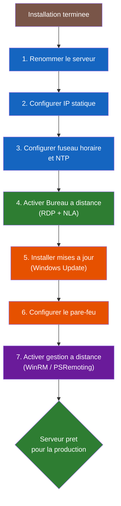

<!--
  Copyright 2026 Julien Bombled

  Licensed under the Apache License, Version 2.0 (the "License");
  you may not use this file except in compliance with the License.
  You may obtain a copy of the License at

      http://www.apache.org/licenses/LICENSE-2.0

  Unless required by applicable law or agreed to in writing, software
  distributed under the License is distributed on an "AS IS" BASIS,
  WITHOUT WARRANTIES OR CONDITIONS OF ANY KIND, either express or implied.
  See the License for the specific language governing permissions and
  limitations under the License.
-->

# Configuration initiale

<span class="level-beginner">Debutant</span> · Temps estime : 20 minutes

## Introduction

!!! example "Analogie"

    Vous venez de recevoir les cles de votre nouveau bureau. Avant d'y travailler, il faut poser une
    plaque avec votre nom sur la porte (renommer le serveur), brancher le telephone avec un numero fixe
    (IP statique), regler l'horloge murale (fuseau horaire), installer une serrure sur la porte d'entree
    (pare-feu) et donner un double de cle au gardien (acces a distance).

Apres l'installation de Windows Server 2022, plusieurs etapes de configuration sont necessaires avant de mettre le serveur en production.

## Processus de configuration post-installation



## Etape 1 : Renommer le serveur

Par defaut, Windows attribue un nom aleatoire (ex: `WIN-A1B2C3D4E5F6`). Il est essentiel de choisir un nom explicite.

!!! tip "Convention de nommage"

    Adoptez une convention claire, par exemple : `<ROLE>-<SITE>-<NUMERO>`

    - `DC-PARIS-01` : controleur de domaine a Paris
    - `FS-LYON-01` : serveur de fichiers a Lyon
    - `WEB-PARIS-01` : serveur web a Paris

=== "PowerShell"

    ```powershell
    # Display the current hostname
    hostname

    # Rename the server (requires restart)
    Rename-Computer -NewName "SRV-LAB-01" -Restart
    ```

    Resultat :

    ```text
    WIN-A1B2C3D4E5F6

    WARNING: The changes will take effect after you restart the computer SRV-LAB-01.
    ```

=== "Server Manager"

    1. Ouvrir **Server Manager**
    2. Cliquer sur le nom du serveur dans le tableau de bord
    3. Cliquer sur **Modifier** dans la fenetre des proprietes systeme
    4. Saisir le nouveau nom et redemarrer

## Etape 2 : Configurer une adresse IP statique

Un serveur doit toujours avoir une adresse IP statique pour etre fiable.

=== "PowerShell"

    ```powershell
    # List network adapters
    Get-NetAdapter

    # Remove DHCP configuration
    Set-NetIPInterface -InterfaceAlias "Ethernet" -Dhcp Disabled

    # Set static IP address
    New-NetIPAddress `
        -InterfaceAlias "Ethernet" `
        -IPAddress 192.168.10.10 `
        -PrefixLength 24 `
        -DefaultGateway 192.168.10.1

    # Set DNS servers
    Set-DnsClientServerAddress `
        -InterfaceAlias "Ethernet" `
        -ServerAddresses 192.168.10.10, 8.8.8.8

    # Verify the configuration
    Get-NetIPConfiguration
    ```

    Resultat de `Get-NetAdapter` :

    ```text
    Name         InterfaceDescription                 ifIndex  Status   LinkSpeed
    ----         --------------------                 -------  ------   ---------
    Ethernet     Microsoft Hyper-V Network Adapter          3  Up       10 Gbps
    ```

    Resultat de `Get-NetIPConfiguration` :

    ```text
    InterfaceAlias       : Ethernet
    InterfaceIndex       : 3
    InterfaceDescription : Microsoft Hyper-V Network Adapter
    NetProfile.Name      : lab.local
    IPv4Address          : 10.0.0.20
    IPv4DefaultGateway   : 10.0.0.1
    DNSServer            : 10.0.0.10, 8.8.8.8
    ```

=== "Interface graphique"

    1. Ouvrir **Parametres reseau** > **Modifier les options d'adaptateur**
    2. Clic droit sur la carte reseau > **Proprietes**
    3. Double-cliquer sur **Protocole Internet version 4 (TCP/IPv4)**
    4. Selectionner **Utiliser l'adresse IP suivante**
    5. Remplir adresse IP, masque, passerelle et DNS

!!! warning "Attention"

    Ne jamais laisser un serveur en DHCP en production, sauf cas tres specifiques (clusters avec reservation DHCP).

## Etape 3 : Configurer le fuseau horaire

Un horaire incorrect peut causer des problemes d'authentification Kerberos dans Active Directory.

```powershell
# Display current time zone
Get-TimeZone

# Set time zone (example: Paris)
Set-TimeZone -Id "Romance Standard Time"

# List all available time zones
Get-TimeZone -ListAvailable | Where-Object { $_.DisplayName -like "*Paris*" }

# Configure NTP server
w32tm /config /manualpeerlist:"time.windows.com" /syncfromflags:manual /reliable:yes /update
Restart-Service w32time
w32tm /resync
```

Resultat de `Get-TimeZone` :

```text
Id                         : Romance Standard Time
DisplayName                : (UTC+01:00) Brussels, Copenhagen, Madrid, Paris
StandardName               : Romance Standard Time
DaylightName               : Romance Daylight Time
BaseUtcOffset              : 01:00:00
SupportsDaylightSavingTime : True
```

Resultat de `w32tm /resync` :

```text
Sending resync command to local computer
The command completed successfully.
```

!!! danger "Kerberos et le temps"

    Active Directory utilise Kerberos pour l'authentification. Kerberos tolere un ecart maximum
    de **5 minutes** entre le client et le serveur. Un decalage superieur bloque les connexions.

## Etape 4 : Activer le Bureau a distance (RDP)

```powershell
# Enable Remote Desktop
Set-ItemProperty `
    -Path 'HKLM:\System\CurrentControlSet\Control\Terminal Server' `
    -Name "fDenyTSConnections" `
    -Value 0

# Enable the firewall rule for RDP
Enable-NetFirewallRule -DisplayGroup "Remote Desktop"

# Optional: allow only NLA (Network Level Authentication) - recommended
Set-ItemProperty `
    -Path 'HKLM:\System\CurrentControlSet\Control\Terminal Server\WinStations\RDP-Tcp' `
    -Name "UserAuthentication" `
    -Value 1
```

Verification de l'etat RDP :

```powershell
# Verify RDP is enabled
Get-ItemProperty -Path 'HKLM:\System\CurrentControlSet\Control\Terminal Server' -Name "fDenyTSConnections"
```

```text
fDenyTSConnections : 0
PSPath             : Microsoft.PowerShell.Core\Registry::HKEY_LOCAL_MACHINE\System\CurrentControlSet\Control\Terminal Server
PSParentPath       : Microsoft.PowerShell.Core\Registry::HKEY_LOCAL_MACHINE\System\CurrentControlSet\Control
PSChildName        : Terminal Server
PSProvider         : Microsoft.PowerShell.Core\Registry
```

!!! tip "Bonne pratique"

    Activez toujours **NLA (Network Level Authentication)** pour securiser les connexions RDP.
    NLA exige que l'utilisateur s'authentifie avant d'etablir la session graphique.

## Etape 5 : Configurer Windows Update

```powershell
# Check for available updates
Install-Module PSWindowsUpdate -Force -Scope CurrentUser
Import-Module PSWindowsUpdate
Get-WindowsUpdate

# Install all available updates
Install-WindowsUpdate -AcceptAll -AutoReboot

# Configure automatic updates via Group Policy (sconfig on Core)
# Or use sconfig option 6 on Server Core
```

Resultat de `Get-WindowsUpdate` :

```text
ComputerName Status KB          Size  Title
------------ ------ --          ----  -----
SRV-LAB-01   D-----  KB5034439  45MB  2024-01 Security Update for Windows Server 2022
SRV-LAB-01   D-----  KB5034129 312MB  2024-01 Cumulative Update for Windows Server 2022
SRV-LAB-01   D-----  KB5034286  18MB  2024-01 .NET Framework 4.8.1 Update
```

=== "Server Core"

    ```powershell
    # Use the sconfig menu
    sconfig
    # Select option 6: Download and Install Updates
    ```

=== "Desktop Experience"

    1. Ouvrir **Parametres** > **Windows Update**
    2. Cliquer sur **Rechercher les mises a jour**
    3. Installer toutes les mises a jour disponibles

## Etape 6 : Configurer le pare-feu

Par defaut, le pare-feu Windows est active. Verifiez sa configuration :

```powershell
# Display firewall status for all profiles
Get-NetFirewallProfile | Select-Object Name, Enabled

# List active inbound rules
Get-NetFirewallRule -Direction Inbound -Enabled True |
    Select-Object DisplayName, Profile, Action |
    Sort-Object DisplayName
```

Resultat de `Get-NetFirewallProfile` :

```text
Name    Enabled
----    -------
Domain     True
Private    True
Public     True
```

Resultat partiel des regles entrantes :

```text
DisplayName                          Profile  Action
-----------                          -------  ------
Core Networking - DNS (UDP-In)       Any      Allow
Core Networking - DHCP (DHCP-In)     Any      Allow
Remote Desktop - User Mode (TCP-In)  Any      Allow
Windows Remote Management (HTTP-In)  Domain   Allow
```

!!! danger "Ne jamais desactiver le pare-feu en production"

    En lab, il peut etre tentant de desactiver le pare-feu pour simplifier les tests.
    En production, creez plutot des regles specifiques pour les services necessaires.

## Etape 7 : Activer la gestion a distance

```powershell
# Enable PowerShell Remoting
Enable-PSRemoting -Force

# Enable WinRM for remote management
winrm quickconfig -q

# Verify WinRM is running
Get-Service WinRM

# Test remote connectivity from another machine
# Test-WSMan -ComputerName SRV-LAB-01
```

Resultat de `Get-Service WinRM` :

```text
Status   Name    DisplayName
------   ----    -----------
Running  WinRM   Windows Remote Management (WS-Manag...
```

## Scenario pratique

!!! example "Scenario pratique"

    **Contexte** : Ahmed, administrateur junior, vient d'installer Windows Server 2022 sur un nouveau
    serveur qui doit devenir controleur de domaine du lab. Il se connecte en RDP mais constate que le
    serveur s'appelle `WIN-R4ND0M123456` et n'a pas d'IP statique.

    **Probleme** : Le serveur est en DHCP avec un nom generique. Impossible de promouvoir un DC avec
    cette configuration.

    **Diagnostic pas a pas** :

    ```powershell
    # Step 1: Check the current hostname
    hostname

    # Step 2: Check the current IP configuration
    Get-NetIPConfiguration

    # Step 3: Check the time zone
    Get-TimeZone
    ```

    ```text
    WIN-R4ND0M123456

    InterfaceAlias       : Ethernet
    InterfaceIndex       : 3
    IPv4Address          : 10.0.0.105
    IPv4DefaultGateway   : 10.0.0.1
    DNSServer            : 10.0.0.1

    Id          : Pacific Standard Time
    DisplayName : (UTC-08:00) Pacific Time (US & Canada)
    ```

    **Problemes identifies** : nom generique, IP dynamique, fuseau horaire incorrect, DNS pointe vers le routeur.

    **Solution complete** :

    ```powershell
    # Fix the hostname
    Rename-Computer -NewName "DC-01" -Restart

    # After restart, fix the static IP
    New-NetIPAddress -InterfaceAlias "Ethernet" -IPAddress 10.0.0.10 -PrefixLength 24 -DefaultGateway 10.0.0.1
    Set-DnsClientServerAddress -InterfaceAlias "Ethernet" -ServerAddresses 127.0.0.1, 10.0.0.1

    # Fix time zone
    Set-TimeZone -Id "Romance Standard Time"

    # Enable remote management
    Enable-PSRemoting -Force
    ```

    **Resultat** : Le serveur DC-01 est pret pour la promotion en controleur de domaine avec une
    configuration reseau stable et un fuseau horaire correct.

## Erreurs courantes

!!! danger "Erreurs courantes"

    1. **Oublier de configurer le DNS avant de promouvoir un DC** : Lors de la configuration IP, le DNS
       doit pointer vers lui-meme (127.0.0.1) s'il sera le premier DC, ou vers un DC existant. Pointer
       vers le routeur (ex: 10.0.0.1) provoque des erreurs lors de `dcpromo`.

    2. **Ne pas redemarrer apres le renommage** : La commande `Rename-Computer` exige un redemarrage.
       Si vous enchainez d'autres configurations sans redemarrer, le nom ne sera pas pris en compte
       et certaines operations echoueront.

    3. **Laisser le fuseau horaire par defaut (Pacific Time)** : Un ecart de temps entre client et
       serveur provoque des echecs Kerberos. Configurez le fuseau horaire **avant** de joindre
       des machines au domaine.

    4. **Desactiver le pare-feu au lieu de creer des regles** : C'est une mauvaise habitude de lab
       qui se retrouve parfois en production. Creez des regles specifiques pour chaque service.

    5. **Ne pas activer NLA pour RDP** : Sans Network Level Authentication, un attaquant peut atteindre
       l'ecran de connexion RDP sans s'authentifier, ce qui expose le serveur aux attaques par force brute.

## Checklist de configuration initiale

- [ ] Serveur renomme selon la convention de nommage
- [ ] Adresse IP statique configuree
- [ ] DNS configure (pointe vers le futur DC ou DNS externe)
- [ ] Fuseau horaire correct
- [ ] Bureau a distance active avec NLA
- [ ] Mises a jour installees
- [ ] Pare-feu configure (regles adaptees)
- [ ] PowerShell Remoting active
- [ ] Licence activee ou periode d'evaluation verifiee

## Pour aller plus loin

- [Server Core vs GUI](server-core-vs-gui.md) - gestion sans interface graphique
- [Server Manager](../console/server-manager.md) - outil de gestion centralise
- [Lab 01 : Installation](../../labs/exercices/lab-01-installation.md) - mise en pratique

