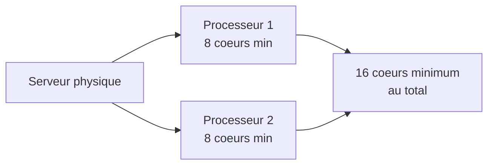

# Editions et licences

<span class="level-beginner">Debutant</span> · Temps estime : 15 minutes

## Les editions de Windows Server 2022

Microsoft propose trois editions principales, chacune adaptee a des besoins differents.

### Essentials

| Caracteristique | Valeur |
|-----------------|--------|
| Utilisateurs max | 25 |
| Coeurs CPU max | 10 |
| RAM max | 64 Go |
| Hyper-V | Non |
| Licence | Par serveur |

!!! tip "Usage type"

    Petites entreprises sans besoin de virtualisation. Inclut les roles AD DS, DNS, DHCP, fichiers.

### Standard

| Caracteristique | Valeur |
|-----------------|--------|
| Utilisateurs max | Illimite (CAL requises) |
| Coeurs CPU max | Illimite |
| RAM max | 48 To |
| Hyper-V | Oui (2 VMs incluses) |
| Licence | Par coeur + CAL |

!!! tip "Usage type"

    Environnements physiques ou faiblement virtualises. Convient a la majorite des PME.

### Datacenter

| Caracteristique | Valeur |
|-----------------|--------|
| Utilisateurs max | Illimite (CAL requises) |
| Coeurs CPU max | Illimite |
| RAM max | 48 To |
| Hyper-V | Oui (VMs illimitees) |
| Licence | Par coeur + CAL |

!!! tip "Usage type"

    Environnements fortement virtualises, cloud prive, Software Defined (Storage Spaces Direct, SDN).

### Tableau comparatif des fonctionnalites

| Fonctionnalite | Essentials | Standard | Datacenter |
|----------------|:----------:|:--------:|:----------:|
| AD DS, DNS, DHCP | :material-check: | :material-check: | :material-check: |
| Serveur de fichiers | :material-check: | :material-check: | :material-check: |
| Hyper-V | :material-close: | :material-check: (2 VMs) | :material-check: (illimite) |
| Storage Spaces Direct | :material-close: | :material-close: | :material-check: |
| Storage Replica | :material-close: | Limite | :material-check: |
| Conteneurs Windows | :material-close: | Illimite | Illimite |
| Shielded VMs | :material-close: | :material-close: | :material-check: |
| SDN (Software Defined Networking) | :material-close: | :material-close: | :material-check: |

## Modeles de licence

### Licence par coeur (Standard et Datacenter)

Le modele de licence par coeur s'applique aux editions Standard et Datacenter :

- Vendue par packs de **2 coeurs**
- Minimum **16 coeurs** par serveur physique (8 packs de 2 coeurs)
- Tous les coeurs physiques doivent etre licencies
- Un processeur necessite un minimum de **8 coeurs licencies**



### CAL (Client Access License)

En plus de la licence serveur, chaque utilisateur ou appareil qui accede au serveur a besoin d'une CAL :

- **CAL utilisateur** : attribuee a une personne, quel que soit le nombre d'appareils
- **CAL appareil** : attribuee a un appareil, quel que soit le nombre d'utilisateurs

!!! tip "Comment choisir ?"

    - **CAL utilisateur** : quand chaque employe a plusieurs appareils (PC, tablette, telephone)
    - **CAL appareil** : quand un appareil est partage entre plusieurs utilisateurs (kiosque, salle de reunion)

### Licence Essentials

L'edition Essentials est licenciee **par serveur** :

- Pas de CAL requise
- Limitee a 25 utilisateurs / 50 appareils
- Un seul serveur Essentials par organisation

## Windows Server 2022 vs versions precedentes

| Version | Support standard | Support etendu | Fin de vie |
|---------|-----------------|----------------|------------|
| Windows Server 2016 | Termine | Janvier 2027 | Janvier 2027 |
| Windows Server 2019 | Termine | Janvier 2029 | Janvier 2029 |
| Windows Server 2022 | Octobre 2025 | Octobre 2031 | Octobre 2031 |

!!! warning "Attention"

    Pour un nouvel environnement, privilegiez toujours Windows Server 2022 afin de beneficier
    du support le plus long et des fonctionnalites les plus recentes (TLS 1.3, Secured-core, etc.).

## Edition d'evaluation

Microsoft met a disposition une version d'evaluation gratuite de 180 jours :

- Telechargeable depuis le [Centre d'evaluation Microsoft](https://www.microsoft.com/fr-fr/evalcenter/evaluate-windows-server-2022)
- Disponible en ISO ou VHDX
- Toutes les fonctionnalites Datacenter activees
- Convertible en licence complete avec une cle produit

```powershell
# Check the current evaluation period remaining
slmgr /dlv

# Convert evaluation to retail (requires a valid product key)
DISM /Online /Set-Edition:ServerStandard /ProductKey:XXXXX-XXXXX-XXXXX-XXXXX-XXXXX /AcceptEula
```

## Points cles a retenir

- **Essentials** : petites structures, pas de virtualisation, pas de CAL
- **Standard** : usage general, virtualisation limitee a 2 VMs
- **Datacenter** : virtualisation intensive, fonctionnalites avancees (S2D, SDN)
- Le modele de licence par coeur exige un minimum de 16 coeurs par serveur
- Les CAL sont obligatoires pour Standard et Datacenter

## Pour aller plus loin

- [Installation de Windows Server](installation-server.md)
- [Server Core vs GUI](server-core-vs-gui.md)
